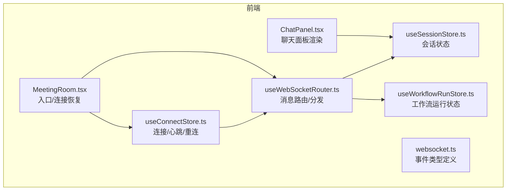
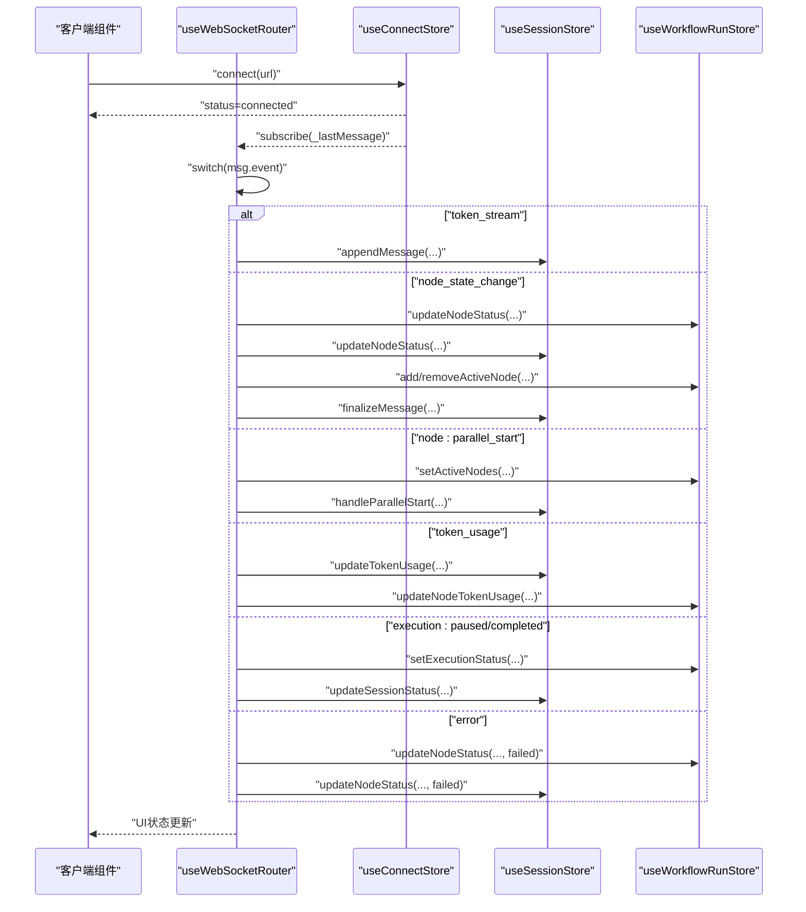
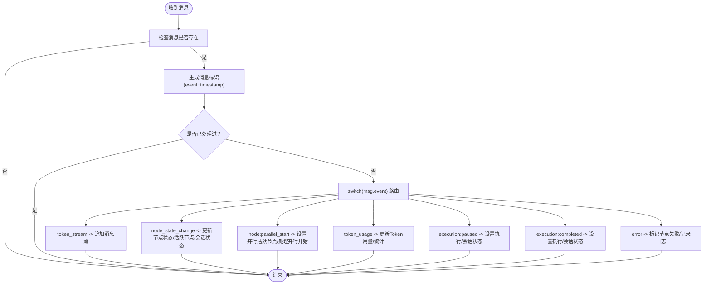
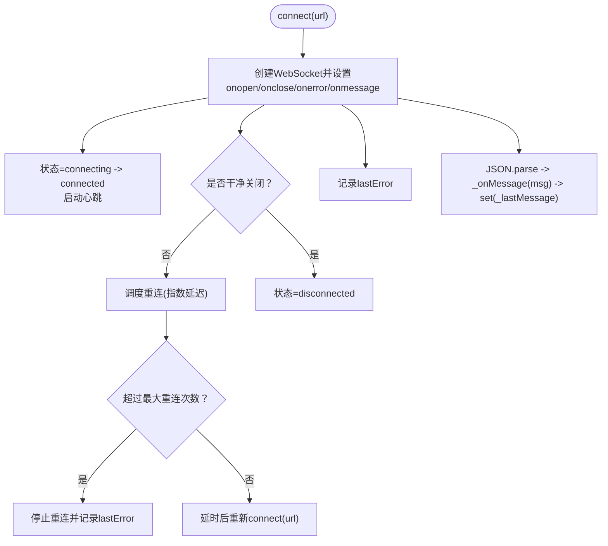
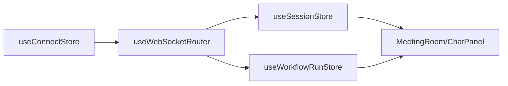

# useWebSocketRouter - WebSocket消息路由

<cite>
**本文引用的文件**
- [useWebSocketRouter.ts](file://frontend/src/hooks/useWebSocketRouter.ts)
- [websocket.ts](file://frontend/src/types/websocket.ts)
- [useConnectStore.ts](file://frontend/src/stores/useConnectStore.ts)
- [useSessionStore.ts](file://frontend/src/stores/useSessionStore.ts)
- [useWorkflowRunStore.ts](file://frontend/src/stores/useWorkflowRunStore.ts)
- [MeetingRoom.tsx](file://frontend/src/features/meeting/MeetingRoom.tsx)
- [ChatPanel.tsx](file://frontend/src/components/chat/ChatPanel.tsx)
- [SPEC-005-websocket-optimization.md](file://docs/specs/sprint1/SPEC-005-websocket-optimization.md)
- [SPEC-703-session-ws-connect-fix.md](file://docs/specs/sprint7/SPEC-703-session-ws-connect-fix.md)
- [2025-12-21-websocket-debugging-report.md](file://docs/reports/debugging/2025-12-21-websocket-debugging-report.md)
</cite>

## 目录
1. [简介](#简介)
2. [项目结构](#项目结构)
3. [核心组件](#核心组件)
4. [架构总览](#架构总览)
5. [详细组件分析](#详细组件分析)
6. [依赖关系分析](#依赖关系分析)
7. [性能与可靠性特性](#性能与可靠性特性)
8. [故障排查指南](#故障排查指南)
9. [结论](#结论)
10. [附录](#附录)

## 简介
本文件系统性阐述 useWebSocketRouter Hook 的设计与实现，重点说明其如何统一管理与后端的 WebSocket 连接、消息监听、事件分发与错误重连机制。文档详细解释内部如何通过事件类型（如 token_stream、node_state_change、node:parallel_start、token_usage、execution:paused、execution:completed、error、human_interaction_required、node_resumed）进行消息路由，将实时数据分发到对应的处理函数，并在会议执行场景中驱动 UI 状态更新，确保开发者理解其在实时协作中的核心作用。

## 项目结构
围绕 WebSocket 实时通信的关键文件组织如下：
- 连接与心跳：useConnectStore.ts
- 消息路由：useWebSocketRouter.ts
- 事件类型定义：websocket.ts
- 会话状态：useSessionStore.ts
- 工作流运行状态：useWorkflowRunStore.ts
- 会议房间入口与连接恢复：MeetingRoom.tsx
- 聊天面板渲染：ChatPanel.tsx
- 设计规范与修复记录：SPEC-005-websocket-optimization.md、SPEC-703-session-ws-connect-fix.md、2025-12-21-websocket-debugging-report.md

图表来源
- [useConnectStore.ts](file://frontend/src/stores/useConnectStore.ts#L1-L127)
- [useWebSocketRouter.ts](file://frontend/src/hooks/useWebSocketRouter.ts#L1-L126)
- [websocket.ts](file://frontend/src/types/websocket.ts#L1-L52)
- [useSessionStore.ts](file://frontend/src/stores/useSessionStore.ts#L1-L200)
- [useWorkflowRunStore.ts](file://frontend/src/stores/useWorkflowRunStore.ts#L1-L200)
- [MeetingRoom.tsx](file://frontend/src/features/meeting/MeetingRoom.tsx#L80-L160)
- [ChatPanel.tsx](file://frontend/src/components/chat/ChatPanel.tsx#L1-L77)

章节来源
- [useWebSocketRouter.ts](file://frontend/src/hooks/useWebSocketRouter.ts#L1-L126)
- [useConnectStore.ts](file://frontend/src/stores/useConnectStore.ts#L1-L127)
- [websocket.ts](file://frontend/src/types/websocket.ts#L1-L52)
- [useSessionStore.ts](file://frontend/src/stores/useSessionStore.ts#L1-L200)
- [useWorkflowRunStore.ts](file://frontend/src/stores/useWorkflowRunStore.ts#L1-L200)
- [MeetingRoom.tsx](file://frontend/src/features/meeting/MeetingRoom.tsx#L80-L160)
- [ChatPanel.tsx](file://frontend/src/components/chat/ChatPanel.tsx#L1-L77)

## 核心组件
- useConnectStore：负责 WebSocket 连接生命周期、心跳检测、异常重连与消息透传（通过 Zustand 订阅器将最后一条消息暴露给路由层）。
- useWebSocketRouter：在路由层对消息进行类型判断与分发，将实时事件映射到会话与工作流状态的更新。
- websocket.ts：定义事件类型枚举、消息结构与上行命令类型，保证前后端协议一致。
- useSessionStore/useWorkflowRunStore：承载会话与工作流运行时状态，被路由层更新以驱动 UI。
- MeetingRoom/ChatPanel：组件消费状态并渲染 UI，形成“实时协作”的闭环。

章节来源
- [useConnectStore.ts](file://frontend/src/stores/useConnectStore.ts#L1-L127)
- [useWebSocketRouter.ts](file://frontend/src/hooks/useWebSocketRouter.ts#L1-L126)
- [websocket.ts](file://frontend/src/types/websocket.ts#L1-L52)
- [useSessionStore.ts](file://frontend/src/stores/useSessionStore.ts#L1-L200)
- [useWorkflowRunStore.ts](file://frontend/src/stores/useWorkflowRunStore.ts#L1-L200)
- [MeetingRoom.tsx](file://frontend/src/features/meeting/MeetingRoom.tsx#L80-L160)
- [ChatPanel.tsx](file://frontend/src/components/chat/ChatPanel.tsx#L1-L77)

## 架构总览
useWebSocketRouter 位于连接层与业务层之间，承担“统一消息分发中心”的职责。其典型调用链路如下：

图表来源
- [useWebSocketRouter.ts](file://frontend/src/hooks/useWebSocketRouter.ts#L1-L126)
- [useConnectStore.ts](file://frontend/src/stores/useConnectStore.ts#L1-L127)
- [useSessionStore.ts](file://frontend/src/stores/useSessionStore.ts#L1-L200)
- [useWorkflowRunStore.ts](file://frontend/src/stores/useWorkflowRunStore.ts#L1-L200)

## 详细组件分析

### useWebSocketRouter：消息路由与事件分发
- 订阅机制：通过 useConnectStore 的订阅器监听 _lastMessage，避免组件各自过滤消息，降低耦合。
- 事件路由：根据 msg.event 分派到不同处理分支，分别更新会话与工作流状态。
- 重复消息去重：使用消息标识（event + timestamp）缓存集合，防止重复处理。
- 会话与工作流联动：节点状态变更同时影响 UI 与统计，确保画布高亮、消息流结束等行为一致。

图表来源
- [useWebSocketRouter.ts](file://frontend/src/hooks/useWebSocketRouter.ts#L1-L126)

章节来源
- [useWebSocketRouter.ts](file://frontend/src/hooks/useWebSocketRouter.ts#L1-L126)

### useConnectStore：连接、心跳与重连
- 连接管理：封装 WebSocket 创建、状态切换、关闭与错误处理。
- 心跳检测：定时发送 ping 命令，维持长连接活性。
- 异常重连：断开后按指数回退延迟重连，限制最大尝试次数。
- 消息透传：将解析后的消息写入 _lastMessage，供路由层订阅。

图表来源
- [useConnectStore.ts](file://frontend/src/stores/useConnectStore.ts#L1-L127)

章节来源
- [useConnectStore.ts](file://frontend/src/stores/useConnectStore.ts#L1-L127)

### websocket.ts：事件类型与命令定义
- 事件类型：token_stream、node_state_change、node:parallel_start、token_usage、execution:paused、execution:completed、error、human_interaction_required、node_resumed。
- 消息结构：包含 event、data、可选 timestamp、可选 node_id。
- 上行命令：start_session、pause_session、resume_session、user_input。

章节来源
- [websocket.ts](file://frontend/src/types/websocket.ts#L1-L52)

### useSessionStore/useWorkflowRunStore：状态驱动UI
- 会话状态：维护当前会话、消息分组、节点状态、并行节点、Token用量、连接状态等。
- 工作流运行状态：维护节点列表、边、活跃节点集合、执行状态、人工审核请求、累计统计等。
- 路由层通过这些状态的更新驱动 UI（画布高亮、消息流、并行面板、统计汇总）。

章节来源
- [useSessionStore.ts](file://frontend/src/stores/useSessionStore.ts#L1-L200)
- [useWorkflowRunStore.ts](file://frontend/src/stores/useWorkflowRunStore.ts#L1-L200)

### MeetingRoom/ChatPanel：会议执行场景下的订阅与渲染
- MeetingRoom：在组件挂载时调用 useWebSocketRouter，同时在存在会话且未连接时自动发起连接；动态构建 ws/wss URL 并调用 connect。
- ChatPanel：基于 useSessionStore 的 messageGroups 渲染消息流，滚动到底部，展示并行节点与节点状态。

章节来源
- [MeetingRoom.tsx](file://frontend/src/features/meeting/MeetingRoom.tsx#L80-L160)
- [ChatPanel.tsx](file://frontend/src/components/chat/ChatPanel.tsx#L1-L77)

## 依赖关系分析
- 路由层依赖连接层的状态与消息源，通过订阅器解耦。
- 路由层同时依赖会话与工作流状态，形成“事件 -> 状态 -> UI”的单向数据流。
- 组件层仅依赖状态层，不直接感知 WebSocket，降低复杂度。

图表来源
- [useConnectStore.ts](file://frontend/src/stores/useConnectStore.ts#L1-L127)
- [useWebSocketRouter.ts](file://frontend/src/hooks/useWebSocketRouter.ts#L1-L126)
- [useSessionStore.ts](file://frontend/src/stores/useSessionStore.ts#L1-L200)
- [useWorkflowRunStore.ts](file://frontend/src/stores/useWorkflowRunStore.ts#L1-L200)
- [MeetingRoom.tsx](file://frontend/src/features/meeting/MeetingRoom.tsx#L80-L160)
- [ChatPanel.tsx](file://frontend/src/components/chat/ChatPanel.tsx#L1-L77)

## 性能与可靠性特性
- 心跳检测：每固定周期发送 ping，降低网络空闲导致的连接中断风险。
- 异常重连：指数回退延迟，避免雪崩效应；达到上限后停止重连并记录错误。
- 消息去重：基于事件类型与时间戳的组合标识，避免重复处理。
- 类型安全：事件枚举与消息接口约束，减少协议不一致带来的解析失败。
- 解耦设计：连接、路由、状态、UI 分层清晰，便于扩展与维护。

章节来源
- [useConnectStore.ts](file://frontend/src/stores/useConnectStore.ts#L1-L127)
- [SPEC-005-websocket-optimization.md](file://docs/specs/sprint1/SPEC-005-websocket-optimization.md#L1-L319)

## 故障排查指南
- 消息静默丢失：曾出现后端 JSON 字段名与前端期望不一致导致的解析失败。修复后端字段名与前端一致，确保事件路由生效。
- 连接未建立：确认 MeetingRoom 在存在会话且未连接时自动发起连接；或在会话启动成功后立即调用 connect。
- 协议一致性：确保 event 字段与事件枚举一致；若后端调整字段名，需同步修改前端类型定义。
- 重复连接：useConnectStore 内部已检查 readyState，避免重复创建连接。
- 重连上限：当达到最大重连次数后，lastError 会被记录，可在 UI 展示并引导用户手动重试。

章节来源
- [2025-12-21-websocket-debugging-report.md](file://docs/reports/debugging/2025-12-21-websocket-debugging-report.md#L1-L40)
- [SPEC-703-session-ws-connect-fix.md](file://docs/specs/sprint7/SPEC-703-session-ws-connect-fix.md#L37-L196)
- [useConnectStore.ts](file://frontend/src/stores/useConnectStore.ts#L1-L127)

## 结论
useWebSocketRouter 通过“连接层-路由层-状态层-UI层”的清晰分层，实现了 WebSocket 消息的统一路由与可靠分发。它在会议执行场景中扮演关键角色：将后端推送的节点状态、消息流、并行执行、Token用量、执行暂停/完成、错误与人工审核等事件，准确映射到会话与工作流状态，从而驱动 UI 实时更新，保障实时协作体验。配合心跳与重连机制，系统在弱网与异常情况下仍具备良好的稳定性与可用性。

## 附录
- 事件类型与命令参考
  - 事件类型：token_stream、node_state_change、node:parallel_start、token_usage、execution:paused、execution:completed、error、human_interaction_required、node_resumed
  - 上行命令：start_session、pause_session、resume_session、user_input
- 关键实现路径
  - 路由实现：[useWebSocketRouter.ts](file://frontend/src/hooks/useWebSocketRouter.ts#L1-L126)
  - 连接与心跳：[useConnectStore.ts](file://frontend/src/stores/useConnectStore.ts#L1-L127)
  - 事件类型定义：[websocket.ts](file://frontend/src/types/websocket.ts#L1-L52)
  - 会话状态：[useSessionStore.ts](file://frontend/src/stores/useSessionStore.ts#L1-L200)
  - 工作流运行状态：[useWorkflowRunStore.ts](file://frontend/src/stores/useWorkflowRunStore.ts#L1-L200)
  - 会议入口与连接恢复：[MeetingRoom.tsx](file://frontend/src/features/meeting/MeetingRoom.tsx#L80-L160)
  - 聊天面板渲染：[ChatPanel.tsx](file://frontend/src/components/chat/ChatPanel.tsx#L1-L77)