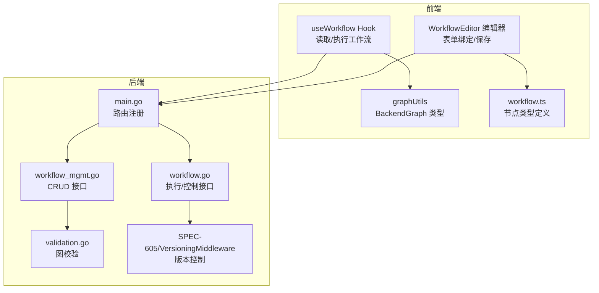
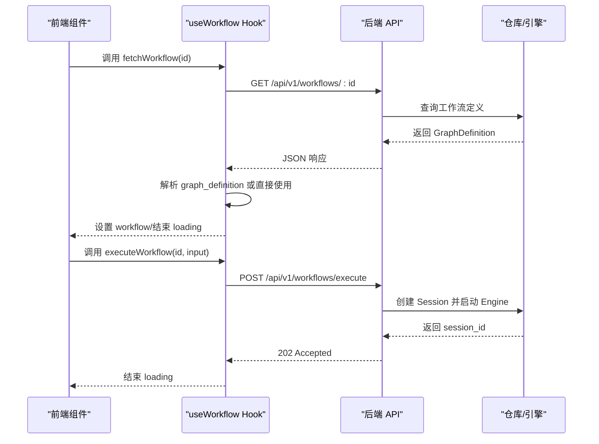
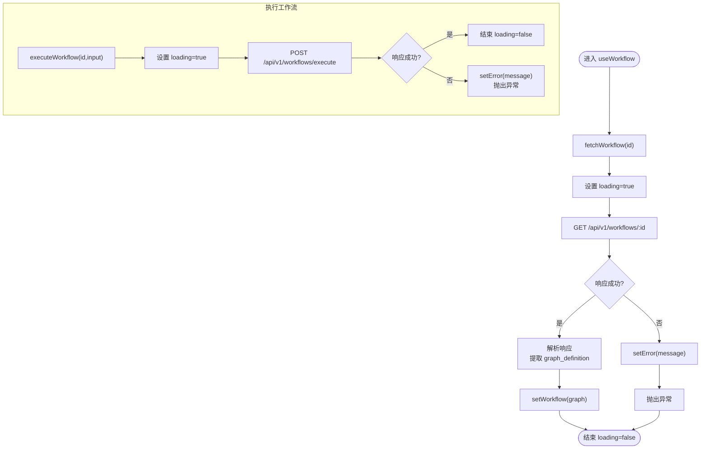
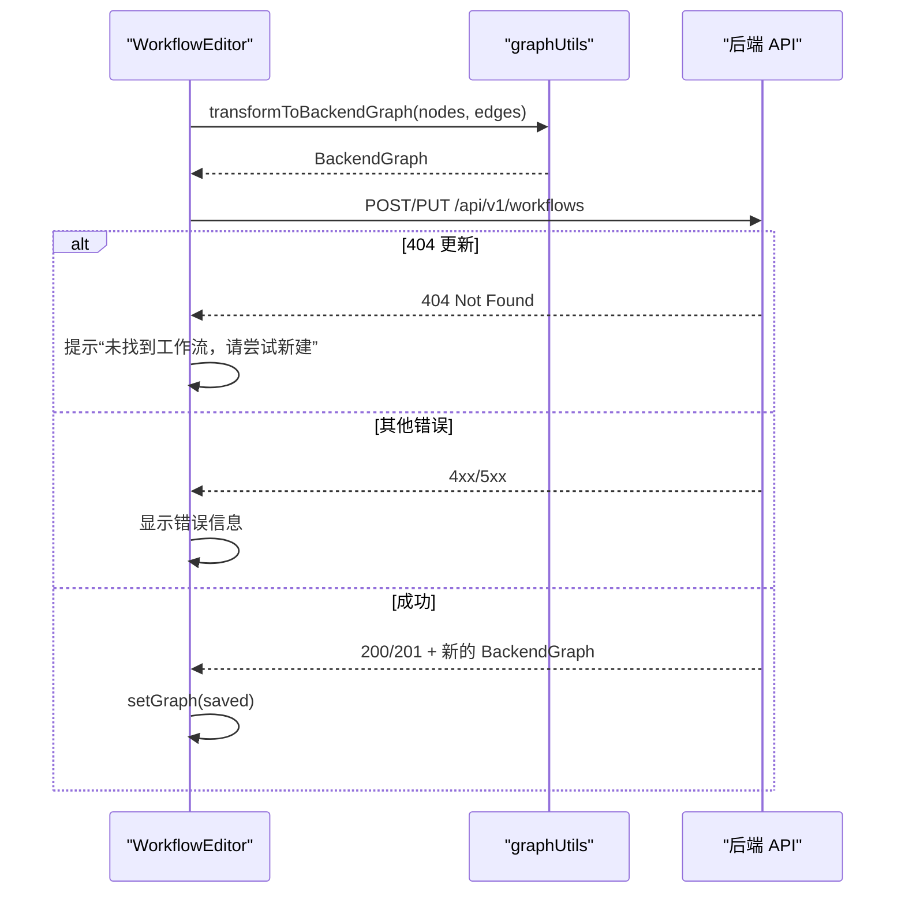
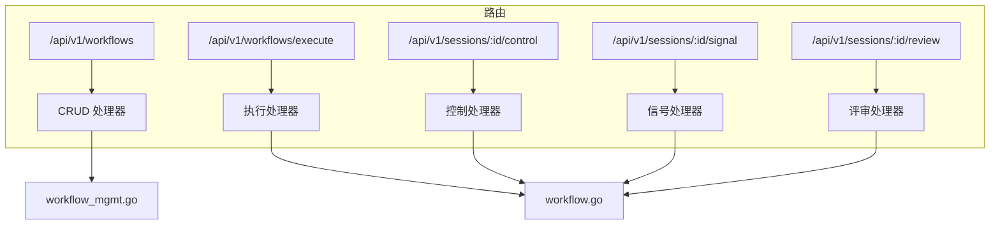
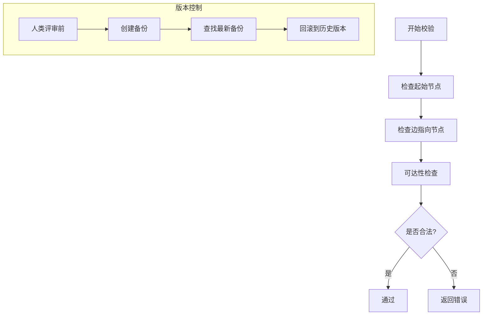
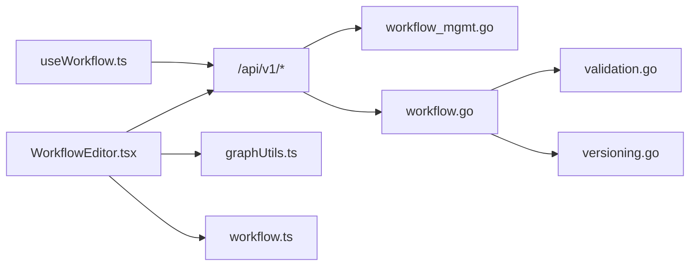

# useWorkflow - 工作流管理

<cite>
**本文引用的文件**
- [useWorkflow.ts](file://frontend/src/hooks/useWorkflow.ts)
- [WorkflowEditor.tsx](file://frontend/src/features/editor/WorkflowEditor.tsx)
- [graphUtils.ts](file://frontend/src/utils/graphUtils.ts)
- [workflow.ts](file://frontend/src/types/workflow.ts)
- [workflow_mgmt.go](file://internal/api/handler/workflow_mgmt.go)
- [workflow.go](file://internal/api/handler/workflow.go)
- [main.go](file://cmd/council/main.go)
- [validation.go](file://internal/core/workflow/validation.go)
- [SPEC-605-versioning-middleware.md](file://docs/specs/sprint6/SPEC-605-versioning-middleware.md)
- [versioning.go](file://internal/core/middleware/versioning.go)
- [SPEC-002-workflow-run-store.md](file://docs/specs/sprint1/SPEC-002-workflow-run-store.md)
- [useWorkflowRunStore.ts](file://frontend/src/stores/useWorkflowRunStore.ts)
- [ExecutionControlBar.tsx](file://frontend/src/components/meeting/ExecutionControlBar.tsx)
</cite>

## 目录
1. [简介](#简介)
2. [项目结构](#项目结构)
3. [核心组件](#核心组件)
4. [架构总览](#架构总览)
5. [详细组件分析](#详细组件分析)
6. [依赖关系分析](#依赖关系分析)
7. [性能考量](#性能考量)
8. [故障排查指南](#故障排查指南)
9. [结论](#结论)
10. [附录](#附录)

## 简介
本文件系统性阐述前端 useWorkflow Hook 的功能与实现，覆盖工作流的创建、读取、更新、删除（CRUD）与执行能力；说明其与后端 REST API 的交互方式、异步请求处理、加载状态与错误反馈机制；解释其在工作流编辑器中的核心作用，包括表单数据绑定、验证逻辑与提交流程；并提供实际调用示例，展示如何在组件中初始化、保存与更新工作流定义，以及如何处理版本冲突或校验失败等常见问题。

## 项目结构
围绕 useWorkflow 的前后端协作涉及以下关键模块：
- 前端 Hooks：useWorkflow 提供工作流读取与执行能力
- 前端编辑器：WorkflowEditor 负责表单数据绑定、保存与提交
- 类型与工具：graphUtils 定义 BackendGraph 结构，workflow.ts 定义节点类型
- 后端 API：workflow_mgmt.go 提供 CRUD 接口；workflow.go 提供执行与控制接口；main.go 绑定路由
- 核心校验：validation.go 对工作流图进行合法性校验
- 版本中间件：SPEC-605 与 versioning.go 描述版本控制与回滚能力

图表来源
- [useWorkflow.ts](file://frontend/src/hooks/useWorkflow.ts#L1-L88)
- [WorkflowEditor.tsx](file://frontend/src/features/editor/WorkflowEditor.tsx#L67-L164)
- [graphUtils.ts](file://frontend/src/utils/graphUtils.ts#L1-L131)
- [workflow.ts](file://frontend/src/types/workflow.ts#L1-L45)
- [main.go](file://cmd/council/main.go#L97-L139)
- [workflow_mgmt.go](file://internal/api/handler/workflow_mgmt.go#L36-L108)
- [workflow.go](file://internal/api/handler/workflow.go#L53-L123)
- [validation.go](file://internal/core/workflow/validation.go#L8-L71)
- [SPEC-605-versioning-middleware.md](file://docs/specs/sprint6/SPEC-605-versioning-middleware.md#L1-L328)
- [versioning.go](file://internal/core/middleware/versioning.go#L1-L104)

章节来源
- [useWorkflow.ts](file://frontend/src/hooks/useWorkflow.ts#L1-L88)
- [WorkflowEditor.tsx](file://frontend/src/features/editor/WorkflowEditor.tsx#L67-L164)
- [graphUtils.ts](file://frontend/src/utils/graphUtils.ts#L1-L131)
- [workflow.ts](file://frontend/src/types/workflow.ts#L1-L45)
- [main.go](file://cmd/council/main.go#L97-L139)
- [workflow_mgmt.go](file://internal/api/handler/workflow_mgmt.go#L36-L108)
- [workflow.go](file://internal/api/handler/workflow.go#L53-L123)
- [validation.go](file://internal/core/workflow/validation.go#L8-L71)
- [SPEC-605-versioning-middleware.md](file://docs/specs/sprint6/SPEC-605-versioning-middleware.md#L1-L328)
- [versioning.go](file://internal/core/middleware/versioning.go#L1-L104)

## 核心组件
- useWorkflow Hook
  - 提供 workflow、loading、error 状态与 fetchWorkflow、executeWorkflow 方法
  - 通过 /api/v1/workflows/:id 读取工作流定义
  - 通过 /api/v1/workflows/execute 触发工作流执行
- WorkflowEditor 编辑器
  - 将 React Flow 图转换为后端可接受的 BackendGraph 结构
  - 保存时根据是否存在 id 决定使用 POST 或 PUT
  - 处理 404 场景下的“未找到”提示与回退策略
- graphUtils 与 workflow 类型
  - BackendGraph 与 BackendNode 定义后端图结构
  - workflow.ts 定义节点类型枚举与节点数据结构
- 后端 API
  - workflow_mgmt.go：/api/v1/workflows 列表、创建、更新、估算成本
  - workflow.go：/api/v1/workflows/execute 执行；/api/v1/sessions/:id/control 控制；/api/v1/sessions/:id/signal 信号；/api/v1/sessions/:id/review 评审
  - main.go：路由挂载
- 校验与版本控制
  - validation.go：图合法性校验（起始节点、边存在性、可达性）
  - SPEC-605 与 versioning.go：人类评审前自动备份，支持回滚

章节来源
- [useWorkflow.ts](file://frontend/src/hooks/useWorkflow.ts#L1-L88)
- [WorkflowEditor.tsx](file://frontend/src/features/editor/WorkflowEditor.tsx#L67-L164)
- [graphUtils.ts](file://frontend/src/utils/graphUtils.ts#L1-L131)
- [workflow.ts](file://frontend/src/types/workflow.ts#L1-L45)
- [workflow_mgmt.go](file://internal/api/handler/workflow_mgmt.go#L36-L108)
- [workflow.go](file://internal/api/handler/workflow.go#L53-L123)
- [main.go](file://cmd/council/main.go#L97-L139)
- [validation.go](file://internal/core/workflow/validation.go#L8-L71)
- [SPEC-605-versioning-middleware.md](file://docs/specs/sprint6/SPEC-605-versioning-middleware.md#L1-L328)
- [versioning.go](file://internal/core/middleware/versioning.go#L1-L104)

## 架构总览
useWorkflow 与 WorkflowEditor 共同构成工作流管理的前端层，后端通过 Gin 路由暴露 REST API，核心业务逻辑位于 internal/core/workflow。

图表来源
- [useWorkflow.ts](file://frontend/src/hooks/useWorkflow.ts#L17-L78)
- [workflow_mgmt.go](file://internal/api/handler/workflow_mgmt.go#L56-L66)
- [workflow.go](file://internal/api/handler/workflow.go#L58-L123)

章节来源
- [useWorkflow.ts](file://frontend/src/hooks/useWorkflow.ts#L17-L78)
- [workflow_mgmt.go](file://internal/api/handler/workflow_mgmt.go#L56-L66)
- [workflow.go](file://internal/api/handler/workflow.go#L58-L123)

## 详细组件分析

### useWorkflow Hook 分析
- 状态管理
  - workflow：当前工作流定义（BackendGraph）
  - loading：请求进行中标志
  - error：错误信息
- 读取工作流
  - 使用 fetch 获取 /api/v1/workflows/:id
  - 成功时解析响应，提取 graph_definition 或直接使用根对象
  - 失败时设置 error，并抛出异常供调用方处理
- 执行工作流
  - 使用 fetch POST /api/v1/workflows/execute
  - 请求体包含 workflow_id 与 input（initial_prompt）
  - 失败时解析错误消息并抛出异常
- 加载与错误反馈
  - 所有异步操作均在 loading 开启/关闭包裹中
  - 错误统一设置到 error 字段，便于 UI 展示

图表来源
- [useWorkflow.ts](file://frontend/src/hooks/useWorkflow.ts#L17-L78)

章节来源
- [useWorkflow.ts](file://frontend/src/hooks/useWorkflow.ts#L1-L88)

### WorkflowEditor 表单绑定与保存流程
- 数据绑定
  - 从 React Flow 实例获取节点与边，映射为 BackendNode 与 BackendGraph
  - 自动推导 start_node_id（若无则取第一个节点）
- 保存策略
  - 若 payload.id 存在且非空，则 PUT /api/v1/workflows/:id
  - 否则 POST /api/v1/workflows
  - 成功后更新本地 graph（含服务端分配的 id）
- 错误处理
  - 404 更新场景下提示“服务器未找到工作流，请尝试新建”
  - 其他错误显示 error 字段或状态文本

图表来源
- [WorkflowEditor.tsx](file://frontend/src/features/editor/WorkflowEditor.tsx#L67-L164)
- [graphUtils.ts](file://frontend/src/utils/graphUtils.ts#L1-L131)

章节来源
- [WorkflowEditor.tsx](file://frontend/src/features/editor/WorkflowEditor.tsx#L67-L164)
- [graphUtils.ts](file://frontend/src/utils/graphUtils.ts#L1-L131)

### 后端 REST API 与路由
- 工作流管理（CRUD）
  - GET /api/v1/workflows：列出工作流
  - GET /api/v1/workflows/:id：获取工作流定义
  - POST /api/v1/workflows：创建工作流
  - PUT /api/v1/workflows/:id：更新工作流
  - POST /api/v1/workflows/estimate：估算成本（草稿或指定 id）
- 工作流执行与控制
  - POST /api/v1/workflows/execute：执行工作流（输入 graph 与 input）
  - POST /api/v1/sessions/:id/control：暂停/恢复/停止
  - POST /api/v1/sessions/:id/signal：向等待节点发送信号
  - POST /api/v1/sessions/:id/review：人类评审决策

图表来源
- [main.go](file://cmd/council/main.go#L97-L139)
- [workflow_mgmt.go](file://internal/api/handler/workflow_mgmt.go#L36-L108)
- [workflow.go](file://internal/api/handler/workflow.go#L53-L123)

章节来源
- [main.go](file://cmd/council/main.go#L97-L139)
- [workflow_mgmt.go](file://internal/api/handler/workflow_mgmt.go#L36-L108)
- [workflow.go](file://internal/api/handler/workflow.go#L53-L123)

### 校验与版本控制
- 图校验（validation.go）
  - 起始节点存在性
  - 边指向节点存在性
  - 可达性（所有节点必须可从起始节点到达）
- 版本控制（SPEC-605 与 versioning.go）
  - 在人类评审节点执行前自动备份目标文件
  - 支持查找最新备份与回滚到历史版本
  - 前端可通过专用按钮触发回滚（见 SPEC-605）

图表来源
- [validation.go](file://internal/core/workflow/validation.go#L8-L71)
- [SPEC-605-versioning-middleware.md](file://docs/specs/sprint6/SPEC-605-versioning-middleware.md#L1-L328)
- [versioning.go](file://internal/core/middleware/versioning.go#L1-L104)

章节来源
- [validation.go](file://internal/core/workflow/validation.go#L8-L71)
- [SPEC-605-versioning-middleware.md](file://docs/specs/sprint6/SPEC-605-versioning-middleware.md#L1-L328)
- [versioning.go](file://internal/core/middleware/versioning.go#L1-L104)

## 依赖关系分析
- 前端依赖
  - useWorkflow 依赖 fetch 与后端 REST API
  - WorkflowEditor 依赖 graphUtils 进行数据转换
  - 执行控制依赖 useWorkflowRunStore 与 ExecutionControlBar
- 后端依赖
  - workflow_mgmt.go 依赖仓库接口返回 GraphDefinition
  - workflow.go 依赖 Session/Engine 与中间件（电路保护、事实核查、内存持久化）
  - main.go 将路由与处理器绑定

图表来源
- [useWorkflow.ts](file://frontend/src/hooks/useWorkflow.ts#L1-L88)
- [WorkflowEditor.tsx](file://frontend/src/features/editor/WorkflowEditor.tsx#L67-L164)
- [graphUtils.ts](file://frontend/src/utils/graphUtils.ts#L1-L131)
- [workflow.ts](file://frontend/src/types/workflow.ts#L1-L45)
- [workflow_mgmt.go](file://internal/api/handler/workflow_mgmt.go#L36-L108)
- [workflow.go](file://internal/api/handler/workflow.go#L53-L123)
- [validation.go](file://internal/core/workflow/validation.go#L8-L71)
- [versioning.go](file://internal/core/middleware/versioning.go#L1-L104)

章节来源
- [useWorkflow.ts](file://frontend/src/hooks/useWorkflow.ts#L1-L88)
- [WorkflowEditor.tsx](file://frontend/src/features/editor/WorkflowEditor.tsx#L67-L164)
- [graphUtils.ts](file://frontend/src/utils/graphUtils.ts#L1-L131)
- [workflow.ts](file://frontend/src/types/workflow.ts#L1-L45)
- [workflow_mgmt.go](file://internal/api/handler/workflow_mgmt.go#L36-L108)
- [workflow.go](file://internal/api/handler/workflow.go#L53-L123)
- [validation.go](file://internal/core/workflow/validation.go#L8-L71)
- [versioning.go](file://internal/core/middleware/versioning.go#L1-L104)

## 性能考量
- 前端
  - useWorkflow 在每次请求前开启 loading，finally 关闭，避免 UI 卡顿
  - WorkflowEditor 仅在保存时进行一次转换，避免频繁重绘
- 后端
  - 执行工作流采用 goroutine 异步运行，避免阻塞请求线程
  - 中间件链路（电路保护、事实核查、内存持久化）在执行前注入，确保稳定性

[本节为通用建议，不直接分析具体文件]

## 故障排查指南
- 读取工作流失败
  - 检查网络与路由是否正确（/api/v1/workflows/:id）
  - 查看 useWorkflow 的 error 字段与控制台日志
- 保存工作流失败
  - 若返回 404 且为更新场景，提示“服务器未找到工作流，请尝试新建”
  - 校验 payload 是否包含 id、start_node_id、nodes 等必要字段
- 执行工作流失败
  - 检查输入 graph 与 input 是否符合预期
  - 查看后端返回的错误信息（如“Execution failed”）
- 版本冲突或回滚
  - 人类评审前自动备份，若需要回滚，参考 SPEC-605 的回滚流程
  - 前端可通过专用按钮触发回滚（见 SPEC-605）

章节来源
- [useWorkflow.ts](file://frontend/src/hooks/useWorkflow.ts#L17-L78)
- [WorkflowEditor.tsx](file://frontend/src/features/editor/WorkflowEditor.tsx#L102-L133)
- [SPEC-605-versioning-middleware.md](file://docs/specs/sprint6/SPEC-605-versioning-middleware.md#L1-L328)

## 结论
useWorkflow Hook 以简洁的 API 封装了工作流的读取与执行，结合 WorkflowEditor 的表单绑定与保存逻辑，形成了完整的前端工作流管理闭环。后端通过清晰的 REST 路由与严格的图校验、中间件保障，提供了稳定可靠的执行与控制能力。版本控制中间件进一步增强了工作流变更的安全性与可追溯性。

[本节为总结，不直接分析具体文件]

## 附录

### 实际调用示例（路径指引）
- 初始化并读取工作流
  - 调用路径：[useWorkflow.fetchWorkflow](file://frontend/src/hooks/useWorkflow.ts#L17-L48)
  - 路由对应：[GET /api/v1/workflows/:id](file://cmd/council/main.go#L118-L120)
- 保存工作流（新建/更新）
  - 调用路径：[WorkflowEditor.handleSave](file://frontend/src/features/editor/WorkflowEditor.tsx#L69-L133)
  - 路由对应：[POST /api/v1/workflows](file://cmd/council/main.go#L121-L123)、[PUT /api/v1/workflows/:id](file://cmd/council/main.go#L122-L123)
- 执行工作流
  - 调用路径：[useWorkflow.executeWorkflow](file://frontend/src/hooks/useWorkflow.ts#L50-L78)
  - 路由对应：[POST /api/v1/workflows/execute](file://cmd/council/main.go#L127-L129)
- 控制执行（暂停/恢复/停止）
  - 调用路径：[useWorkflowRunStore.sendControl](file://frontend/src/stores/useWorkflowRunStore.ts#L197-L225)
  - 路由对应：[POST /api/v1/sessions/:id/control](file://cmd/council/main.go#L127-L129)
- 人类评审与回滚
  - 路由对应：[POST /api/v1/sessions/:id/review](file://cmd/council/main.go#L130-L131)
  - 回滚实现：[SPEC-605 与 versioning.go](file://docs/specs/sprint6/SPEC-605-versioning-middleware.md#L1-L328)

章节来源
- [useWorkflow.ts](file://frontend/src/hooks/useWorkflow.ts#L17-L78)
- [WorkflowEditor.tsx](file://frontend/src/features/editor/WorkflowEditor.tsx#L69-L133)
- [useWorkflowRunStore.ts](file://frontend/src/stores/useWorkflowRunStore.ts#L197-L225)
- [SPEC-605-versioning-middleware.md](file://docs/specs/sprint6/SPEC-605-versioning-middleware.md#L1-L328)
- [main.go](file://cmd/council/main.go#L118-L131)