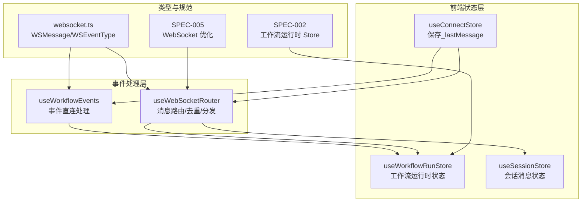
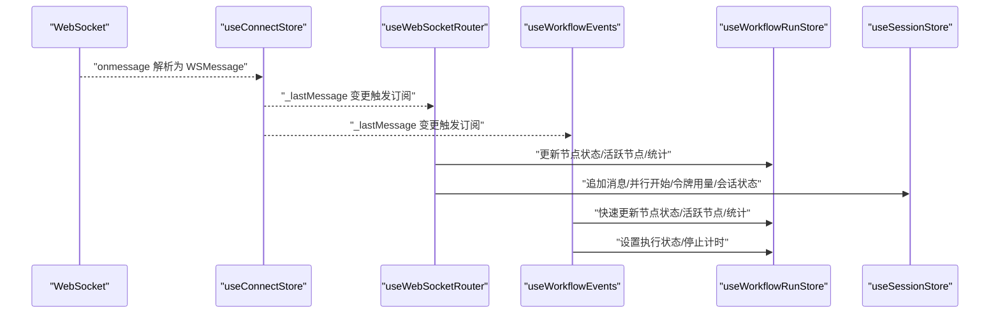
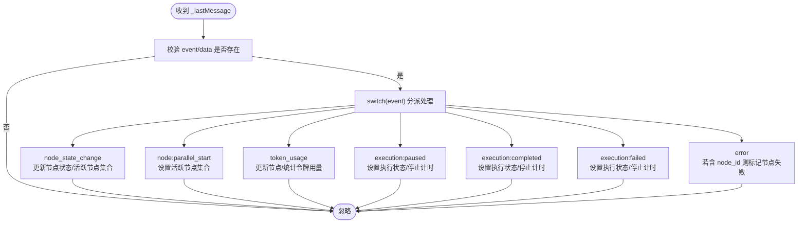
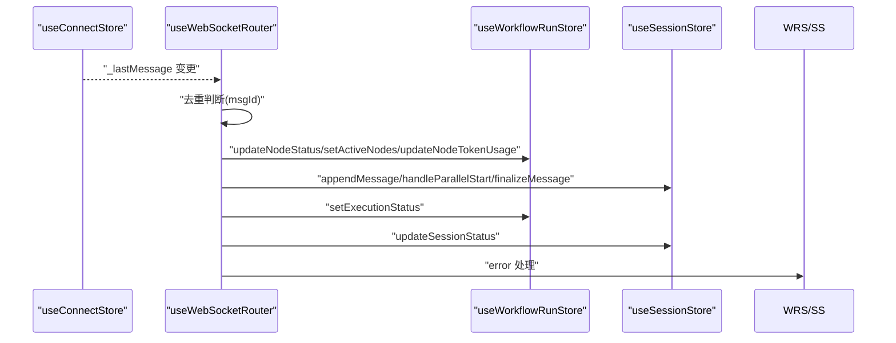
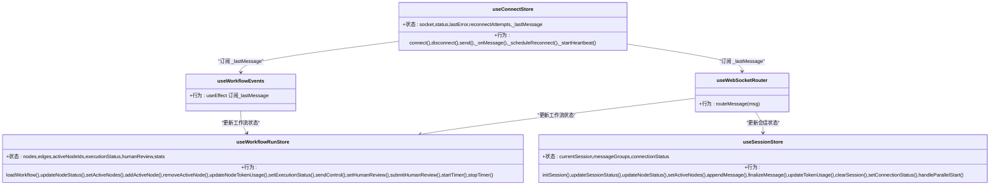
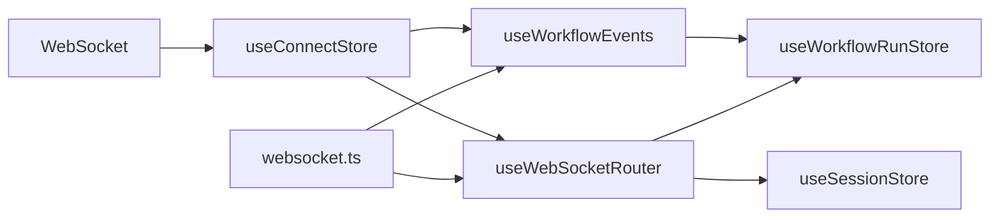

# useWorkflowEvents - 工作流执行事件监听

<cite>
**本文引用的文件**
- [useWorkflowEvents.ts](file://frontend/src/hooks/useWorkflowEvents.ts)
- [useWebSocketRouter.ts](file://frontend/src/hooks/useWebSocketRouter.ts)
- [useConnectStore.ts](file://frontend/src/stores/useConnectStore.ts)
- [useWorkflowRunStore.ts](file://frontend/src/stores/useWorkflowRunStore.ts)
- [useSessionStore.ts](file://frontend/src/stores/useSessionStore.ts)
- [websocket.ts](file://frontend/src/types/websocket.ts)
- [ExecutionControlBar.tsx](file://frontend/src/components/meeting/ExecutionControlBar.tsx)
- [ChatPanel.tsx](file://frontend/src/components/chat/ChatPanel.tsx)
- [SPEC-005-websocket-optimization.md](file://docs/specs/sprint1/SPEC-005-websocket-optimization.md)
- [SPEC-002-workflow-run-store.md](file://docs/specs/sprint1/SPEC-002-workflow-run-store.md)
- [2025-12-21-websocket-debugging-report.md](file://docs/reports/debugging/2025-12-21-websocket-debugging-report.md)
</cite>

## 目录
1. [简介](#简介)
2. [项目结构](#项目结构)
3. [核心组件](#核心组件)
4. [架构总览](#架构总览)
5. [详细组件分析](#详细组件分析)
6. [依赖分析](#依赖分析)
7. [性能考量](#性能考量)
8. [故障排查指南](#故障排查指南)
9. [结论](#结论)
10. [附录](#附录)

## 简介
本文件系统性阐述 useWorkflowEvents Hook 的职责、工作机制及其与 useWebSocketRouter 的协作关系，说明它如何监听工作流执行过程中的关键事件（节点状态变更、并行开始、令牌用量、执行暂停/完成/失败、错误等），并通过回调函数驱动前端 Store 更新，从而实现执行控制条与日志面板的实时响应式展示。同时给出在执行控制条与日志面板中的使用示例路径，帮助开发者快速构建响应式的执行监控界面。

## 项目结构
- 前端采用 Zustand 状态管理，通过 useConnectStore 接收 WebSocket 最后一条消息，useWebSocketRouter 负责统一路由与去重处理，useWorkflowRunStore 与 useSessionStore 分别承载工作流运行时状态与会话消息状态。
- useWorkflowEvents 作为“事件直连”钩子，直接订阅 useConnectStore 的_lastMessage，对部分事件进行快速处理，补充覆盖部分事件类型，形成“轻量直连 + 路由中心”的双通道事件处理模型。

图表来源
- [useConnectStore.ts](file://frontend/src/stores/useConnectStore.ts#L1-L77)
- [useWorkflowEvents.ts](file://frontend/src/hooks/useWorkflowEvents.ts#L1-L83)
- [useWebSocketRouter.ts](file://frontend/src/hooks/useWebSocketRouter.ts#L1-L126)
- [useWorkflowRunStore.ts](file://frontend/src/stores/useWorkflowRunStore.ts#L1-L301)
- [useSessionStore.ts](file://frontend/src/stores/useSessionStore.ts#L1-L332)
- [websocket.ts](file://frontend/src/types/websocket.ts#L1-L52)
- [SPEC-005-websocket-optimization.md](file://docs/specs/sprint1/SPEC-005-websocket-optimization.md#L107-L355)
- [SPEC-002-workflow-run-store.md](file://docs/specs/sprint1/SPEC-002-workflow-run-store.md#L297-L479)

章节来源
- [useConnectStore.ts](file://frontend/src/stores/useConnectStore.ts#L1-L77)
- [useWorkflowEvents.ts](file://frontend/src/hooks/useWorkflowEvents.ts#L1-L83)
- [useWebSocketRouter.ts](file://frontend/src/hooks/useWebSocketRouter.ts#L1-L126)
- [useWorkflowRunStore.ts](file://frontend/src/stores/useWorkflowRunStore.ts#L1-L301)
- [useSessionStore.ts](file://frontend/src/stores/useSessionStore.ts#L1-L332)
- [websocket.ts](file://frontend/src/types/websocket.ts#L1-L52)
- [SPEC-005-websocket-optimization.md](file://docs/specs/sprint1/SPEC-005-websocket-optimization.md#L107-L355)
- [SPEC-002-workflow-run-store.md](file://docs/specs/sprint1/SPEC-002-workflow-run-store.md#L297-L479)

## 核心组件
- useConnectStore：负责 WebSocket 连接、心跳、重连策略以及将最终解析后的消息写入 _lastMessage，供其他 Hook 订阅。
- useWebSocketRouter：统一路由与去重处理，将不同类型事件分派给会话与工作流 Store，实现“消息路由中心”。
- useWorkflowEvents：事件直连处理，对部分事件进行快速处理，补充覆盖部分事件类型，减少重复路由。
- useWorkflowRunStore：承载工作流运行时状态（节点状态、活跃节点集合、执行状态、统计信息等）。
- useSessionStore：承载会话消息状态（消息分组、节点状态、并行开始、令牌用量等）。
- websocket.ts：定义 WSMessage 与 WSEventType，统一前后端事件协议。

章节来源
- [useConnectStore.ts](file://frontend/src/stores/useConnectStore.ts#L1-L77)
- [useWebSocketRouter.ts](file://frontend/src/hooks/useWebSocketRouter.ts#L1-L126)
- [useWorkflowEvents.ts](file://frontend/src/hooks/useWorkflowEvents.ts#L1-L83)
- [useWorkflowRunStore.ts](file://frontend/src/stores/useWorkflowRunStore.ts#L1-L301)
- [useSessionStore.ts](file://frontend/src/stores/useSessionStore.ts#L1-L332)
- [websocket.ts](file://frontend/src/types/websocket.ts#L1-L52)

## 架构总览
useWorkflowEvents 与 useWebSocketRouter 共同构成“事件处理双通道”：
- 路由中心（useWebSocketRouter）：负责消息去重、类型校验、事件路由与跨 Store 同步，覆盖 token_stream、node_state_change、node:parallel_start、token_usage、execution:*、error 等事件。
- 事件直连（useWorkflowEvents）：直接订阅 _lastMessage，对 node_state_change、node:parallel_start、token_usage、execution:*、error 等事件进行快速处理，补充覆盖部分事件类型，避免重复路由。

图表来源
- [useConnectStore.ts](file://frontend/src/stores/useConnectStore.ts#L1-L77)
- [useWebSocketRouter.ts](file://frontend/src/hooks/useWebSocketRouter.ts#L1-L126)
- [useWorkflowEvents.ts](file://frontend/src/hooks/useWorkflowEvents.ts#L1-L83)
- [useWorkflowRunStore.ts](file://frontend/src/stores/useWorkflowRunStore.ts#L1-L301)
- [useSessionStore.ts](file://frontend/src/stores/useSessionStore.ts#L1-L332)

## 详细组件分析

### useWorkflowEvents 组件分析
- 订阅来源：从 useConnectStore 中读取 _lastMessage。
- 事件处理：
  - node_state_change：更新节点状态，维护活跃节点集合。
  - node:parallel_start：设置活跃节点集合。
  - token_usage：更新节点与全局统计的令牌用量。
  - execution:paused/completed/failed：设置执行状态并停止计时。
  - error：若包含节点 ID，更新节点状态为失败。
- 类型与协议：基于 websocket.ts 中的 WSEventType 与 WSMessage 结构，确保事件名与数据结构一致。

图表来源
- [useWorkflowEvents.ts](file://frontend/src/hooks/useWorkflowEvents.ts#L1-L83)
- [websocket.ts](file://frontend/src/types/websocket.ts#L1-L52)

章节来源
- [useWorkflowEvents.ts](file://frontend/src/hooks/useWorkflowEvents.ts#L1-L83)
- [websocket.ts](file://frontend/src/types/websocket.ts#L1-L52)

### useWebSocketRouter 组件分析
- 订阅来源：useConnectStore.subscribe(_lastMessage)。
- 去重策略：使用消息事件名与时间戳组合生成唯一标识，避免重复处理。
- 事件路由：
  - token_stream：向会话 Store 追加流式消息。
  - node_state_change：同步更新工作流与会话节点状态，并维护活跃节点集合与消息终结。
  - node:parallel_start：设置活跃节点集合并通知会话处理并行开始。
  - token_usage：同步更新会话与工作流的令牌用量统计。
  - execution:paused/completed：同步更新执行状态。
  - error：若含节点 ID，标记节点失败并记录错误。
  - human_interaction_required/node_resumed：处理人工介入请求与恢复。
- 与 Store 的协作：通过 useWorkflowRunStore 与 useSessionStore 的动作方法，实现跨 Store 的状态同步。

图表来源
- [useWebSocketRouter.ts](file://frontend/src/hooks/useWebSocketRouter.ts#L1-L126)
- [useWorkflowRunStore.ts](file://frontend/src/stores/useWorkflowRunStore.ts#L1-L301)
- [useSessionStore.ts](file://frontend/src/stores/useSessionStore.ts#L1-L332)

章节来源
- [useWebSocketRouter.ts](file://frontend/src/hooks/useWebSocketRouter.ts#L1-L126)
- [SPEC-005-websocket-optimization.md](file://docs/specs/sprint1/SPEC-005-websocket-optimization.md#L107-L355)

### 与 Store 的协作关系
- useWorkflowRunStore：维护节点状态、活跃节点集合、执行状态、统计信息（节点完成数、失败数、总令牌数、总成本、耗时）。
- useSessionStore：维护会话状态、消息分组、节点状态映射、并行开始处理、令牌用量汇总。
- useConnectStore：负责连接生命周期、心跳与重连、消息解析与 _lastMessage 写入。

图表来源
- [useConnectStore.ts](file://frontend/src/stores/useConnectStore.ts#L1-L77)
- [useWorkflowRunStore.ts](file://frontend/src/stores/useWorkflowRunStore.ts#L1-L301)
- [useSessionStore.ts](file://frontend/src/stores/useSessionStore.ts#L1-L332)
- [useWebSocketRouter.ts](file://frontend/src/hooks/useWebSocketRouter.ts#L1-L126)
- [useWorkflowEvents.ts](file://frontend/src/hooks/useWorkflowEvents.ts#L1-L83)

章节来源
- [useConnectStore.ts](file://frontend/src/stores/useConnectStore.ts#L1-L77)
- [useWorkflowRunStore.ts](file://frontend/src/stores/useWorkflowRunStore.ts#L1-L301)
- [useSessionStore.ts](file://frontend/src/stores/useSessionStore.ts#L1-L332)
- [useWebSocketRouter.ts](file://frontend/src/hooks/useWebSocketRouter.ts#L1-L126)
- [useWorkflowEvents.ts](file://frontend/src/hooks/useWorkflowEvents.ts#L1-L83)

### 在执行控制条中的使用示例
- 执行控制条组件通过 useWorkflowRunStore 的 executionStatus、stats 与 sendControl 动作渲染控制按钮与统计信息。
- 该组件不直接订阅 WebSocket，而是依赖 useWebSocketRouter 与 useWorkflowEvents 的事件处理结果，从而实现 UI 的自动更新。

参考路径
- [ExecutionControlBar.tsx](file://frontend/src/components/meeting/ExecutionControlBar.tsx#L1-L72)
- [useWorkflowRunStore.ts](file://frontend/src/stores/useWorkflowRunStore.ts#L1-L301)
- [SPEC-002-workflow-run-store.md](file://docs/specs/sprint1/SPEC-002-workflow-run-store.md#L297-L407)

章节来源
- [ExecutionControlBar.tsx](file://frontend/src/components/meeting/ExecutionControlBar.tsx#L1-L72)
- [useWorkflowRunStore.ts](file://frontend/src/stores/useWorkflowRunStore.ts#L1-L301)
- [SPEC-002-workflow-run-store.md](file://docs/specs/sprint1/SPEC-002-workflow-run-store.md#L297-L407)

### 在日志/聊天面板中的使用示例
- 日志面板通过 useSessionStore 的 messageGroups 与 currentSession.activeNodeIds 渲染消息分组与高亮活跃节点。
- token_stream 事件由 useWebSocketRouter 路由至 useSessionStore，实现消息流式追加与自动滚动。
- 节点状态变更与并行开始事件由 useWebSocketRouter 同步至会话 Store，从而影响日志面板的节点状态与分组呈现。

参考路径
- [ChatPanel.tsx](file://frontend/src/components/chat/ChatPanel.tsx#L1-L76)
- [useSessionStore.ts](file://frontend/src/stores/useSessionStore.ts#L1-L332)
- [SPEC-005-websocket-optimization.md](file://docs/specs/sprint1/SPEC-005-websocket-optimization.md#L297-L488)

章节来源
- [ChatPanel.tsx](file://frontend/src/components/chat/ChatPanel.tsx#L1-L76)
- [useSessionStore.ts](file://frontend/src/stores/useSessionStore.ts#L1-L332)
- [SPEC-005-websocket-optimization.md](file://docs/specs/sprint1/SPEC-005-websocket-optimization.md#L297-L488)

## 依赖分析
- 低耦合高内聚：useWorkflowEvents 与 useWebSocketRouter 分别承担“事件直连处理”与“消息路由中心”，职责清晰，互不干扰。
- 数据流向：WebSocket -> useConnectStore -> useWorkflowEvents/useWebSocketRouter -> useWorkflowRunStore/useSessionStore。
- 去重与一致性：useWebSocketRouter 通过消息 ID 去重，保证事件只被处理一次；websocket.ts 定义统一事件协议，避免命名不一致导致的处理遗漏。
- 事件覆盖：useWorkflowEvents 补充覆盖部分事件类型，减少重复路由，提升性能与可维护性。

图表来源
- [useConnectStore.ts](file://frontend/src/stores/useConnectStore.ts#L1-L77)
- [useWorkflowEvents.ts](file://frontend/src/hooks/useWorkflowEvents.ts#L1-L83)
- [useWebSocketRouter.ts](file://frontend/src/hooks/useWebSocketRouter.ts#L1-L126)
- [useWorkflowRunStore.ts](file://frontend/src/stores/useWorkflowRunStore.ts#L1-L301)
- [useSessionStore.ts](file://frontend/src/stores/useSessionStore.ts#L1-L332)
- [websocket.ts](file://frontend/src/types/websocket.ts#L1-L52)

章节来源
- [useConnectStore.ts](file://frontend/src/stores/useConnectStore.ts#L1-L77)
- [useWorkflowEvents.ts](file://frontend/src/hooks/useWorkflowEvents.ts#L1-L83)
- [useWebSocketRouter.ts](file://frontend/src/hooks/useWebSocketRouter.ts#L1-L126)
- [useWorkflowRunStore.ts](file://frontend/src/stores/useWorkflowRunStore.ts#L1-L301)
- [useSessionStore.ts](file://frontend/src/stores/useSessionStore.ts#L1-L332)
- [websocket.ts](file://frontend/src/types/websocket.ts#L1-L52)

## 性能考量
- 去重处理：useWebSocketRouter 使用消息 ID 去重，避免重复渲染与状态更新，降低 UI 与 Store 的压力。
- 订阅粒度：useWorkflowEvents 仅订阅 _lastMessage，处理逻辑轻量，适合快速直连处理。
- 事件覆盖：useWorkflowEvents 补充覆盖部分事件类型，减少重复路由，提高整体吞吐。
- 心跳与重连：useConnectStore 提供心跳与指数退避重连，保障连接稳定性，间接提升事件到达率与 UI 体验。

章节来源
- [useWebSocketRouter.ts](file://frontend/src/hooks/useWebSocketRouter.ts#L1-L126)
- [useConnectStore.ts](file://frontend/src/stores/useConnectStore.ts#L1-L77)
- [SPEC-005-websocket-optimization.md](file://docs/specs/sprint1/SPEC-005-websocket-optimization.md#L107-L206)

## 故障排查指南
- 事件名不匹配导致“消息静默丢失”：曾出现后端 JSON 字段名为 type，前端期望 event 的情况，导致前端无法识别事件。修复后端 JSON tag 与前端协议保持一致。
- 事件重复处理：启用去重策略后，仍可能出现重复事件，需检查消息 ID 生成规则与时间戳字段是否正确传入。
- WebSocket 连接不稳定：检查心跳与重连配置，确认连接状态与错误信息是否被正确上报。
- UI 不更新：确认组件是否依赖 useWorkflowRunStore/useSessionStore 的状态选择器，而非直接订阅 _lastMessage；确保 useWebSocketRouter 已初始化。

参考路径
- [2025-12-21-websocket-debugging-report.md](file://docs/reports/debugging/2025-12-21-websocket-debugging-report.md#L1-L40)
- [SPEC-005-websocket-optimization.md](file://docs/specs/sprint1/SPEC-005-websocket-optimization.md#L107-L206)

章节来源
- [2025-12-21-websocket-debugging-report.md](file://docs/reports/debugging/2025-12-21-websocket-debugging-report.md#L1-L40)
- [SPEC-005-websocket-optimization.md](file://docs/specs/sprint1/SPEC-005-websocket-optimization.md#L107-L206)

## 结论
useWorkflowEvents 与 useWebSocketRouter 形成“事件直连 + 路由中心”的互补架构：前者以轻量直连处理常见事件，后者以统一路由与去重保障事件处理的一致性与稳定性。二者协同工作，使执行控制条与日志面板能够实时反映工作流执行状态，构建响应式、可靠的执行监控界面。

## 附录
- 事件类型与数据结构参考 websocket.ts，确保前后端协议一致。
- 组件集成参考 SPEC-002 与 SPEC-005，明确 Store 与 Hook 的职责边界与协作方式。
- 执行控制条与日志面板的使用示例路径见“详细组件分析”相关章节。