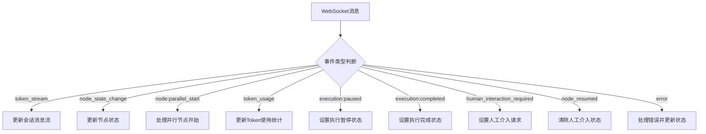
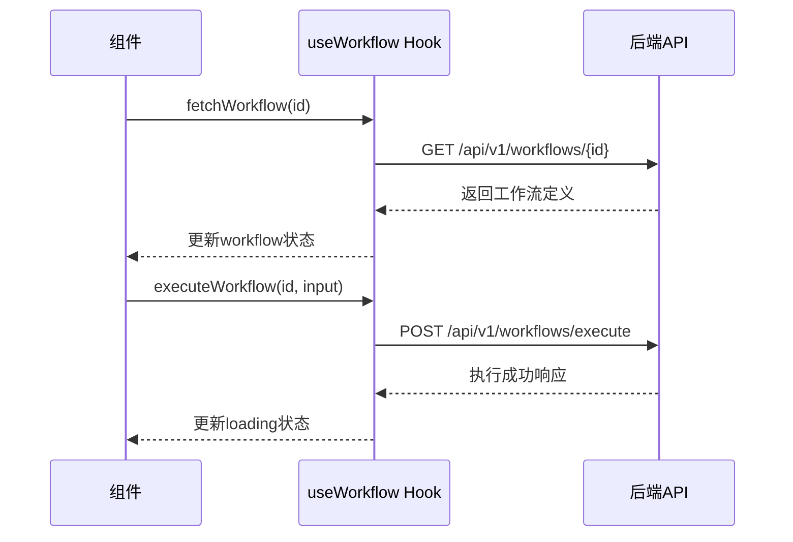
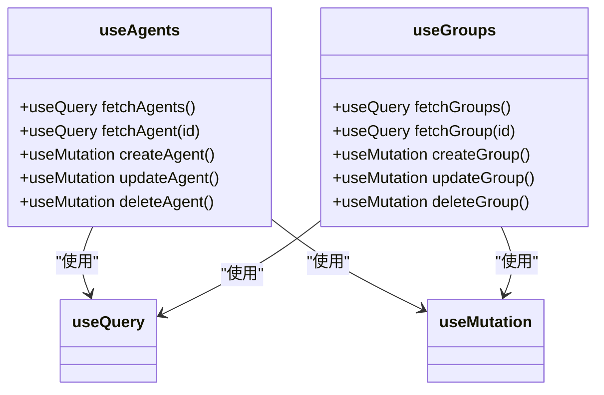
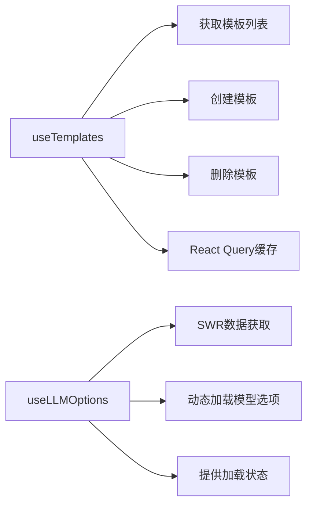
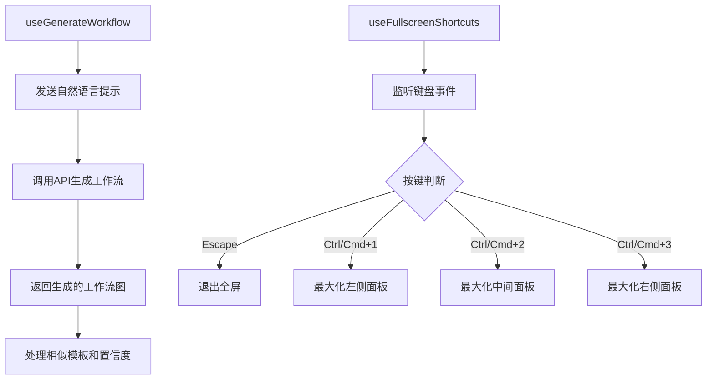
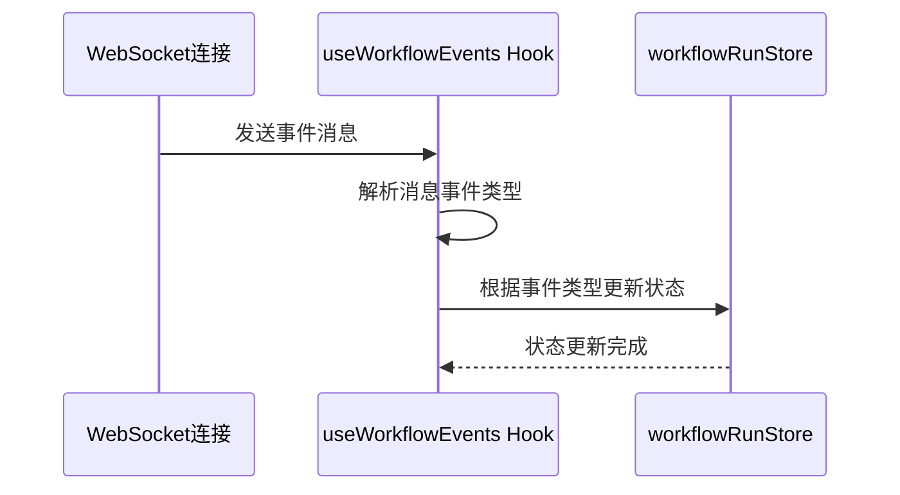

# 自定义Hook

<cite>
**本文档引用的文件**
- [useWebSocketRouter.ts](file://frontend/src/hooks/useWebSocketRouter.ts)
- [useWorkflow.ts](file://frontend/src/hooks/useWorkflow.ts)
- [useAgents.ts](file://frontend/src/hooks/useAgents.ts)
- [useGroups.ts](file://frontend/src/hooks/useGroups.ts)
- [useTemplates.ts](file://frontend/src/hooks/useTemplates.ts)
- [useLLMOptions.ts](file://frontend/src/hooks/useLLMOptions.ts)
- [useGenerateWorkflow.ts](file://frontend/src/hooks/useGenerateWorkflow.ts)
- [useFullscreenShortcuts.ts](file://frontend/src/hooks/useFullscreenShortcuts.ts)
- [useWorkflowEvents.ts](file://frontend/src/hooks/useWorkflowEvents.ts)
- [websocket.ts](file://frontend/src/types/websocket.ts)
- [useConnectStore.ts](file://frontend/src/stores/useConnectStore.ts)
- [useWorkflowRunStore.ts](file://frontend/src/stores/useWorkflowRunStore.ts)
- [useSessionStore.ts](file://frontend/src/stores/useSessionStore.ts)
- [agent.ts](file://frontend/src/types/agent.ts)
- [group.ts](file://frontend/src/types/group.ts)
- [template.ts](file://frontend/src/types/template.ts)
</cite>

## 目录
1. [介绍](#介绍)
2. [核心自定义Hook](#核心自定义hook)
3. [WebSocket消息路由](#websocket消息路由)
4. [工作流管理](#工作流管理)
5. [智能体与群组资源管理](#智能体与群组资源管理)
6. [模板与模型选项](#模板与模型选项)
7. [工作流生成与快捷键](#工作流生成与快捷键)
8. [工作流事件监听](#工作流事件监听)

## 介绍
本文档系统化介绍了项目中封装的可复用逻辑钩子（Hook），重点阐述了`useWebSocketRouter`如何统一处理来自后端的实时消息路由与事件分发，`useWorkflow`对工作流定义的CRUD操作封装，`useAgents`和`useGroups`对智能体与群组资源的获取与管理，`useTemplates`的模板加载与缓存机制，`useLLMOptions`的模型选项动态加载，`useGenerateWorkflow`的自然语言生成工作流能力，`useFullscreenShortcuts`的快捷键绑定，以及`useWorkflowEvents`的工作流执行事件监听。为每个Hook提供了使用场景、参数说明与错误处理策略。

## 核心自定义Hook
项目中的自定义Hook封装了前端应用的核心逻辑，通过React的Hooks API实现了状态管理、数据获取、事件处理等功能的复用。这些Hook基于Zustand状态管理库和React Query数据获取库，为组件提供了简洁的接口来操作复杂的业务逻辑。

**Section sources**
- [useWebSocketRouter.ts](file://frontend/src/hooks/useWebSocketRouter.ts)
- [useWorkflow.ts](file://frontend/src/hooks/useWorkflow.ts)
- [useAgents.ts](file://frontend/src/hooks/useAgents.ts)

## WebSocket消息路由

`useWebSocketRouter` Hook负责统一处理来自后端的WebSocket实时消息，根据不同的事件类型进行路由分发，更新相应的应用状态。

**Diagram sources**
- [useWebSocketRouter.ts](file://frontend/src/hooks/useWebSocketRouter.ts#L17-L111)
- [websocket.ts](file://frontend/src/types/websocket.ts#L1-L52)

**Section sources**
- [useWebSocketRouter.ts](file://frontend/src/hooks/useWebSocketRouter.ts#L13-L126)
- [useConnectStore.ts](file://frontend/src/stores/useConnectStore.ts#L5-L21)
- [useSessionStore.ts](file://frontend/src/stores/useSessionStore.ts#L15-L89)
- [useWorkflowRunStore.ts](file://frontend/src/stores/useWorkflowRunStore.ts#L14-L78)

## 工作流管理

`useWorkflow` Hook封装了对工作流定义的获取和执行操作，提供了简洁的接口来与后端API交互。

**Diagram sources**
- [useWorkflow.ts](file://frontend/src/hooks/useWorkflow.ts#L12-L87)
- [useSessionStore.ts](file://frontend/src/stores/useSessionStore.ts#L38-L83)

**Section sources**
- [useWorkflow.ts](file://frontend/src/hooks/useWorkflow.ts#L12-L87)
- [useSessionStore.ts](file://frontend/src/stores/useSessionStore.ts#L15-L89)

## 智能体与群组资源管理

`useAgents`和`useGroups` Hook提供了对智能体和群组资源的完整CRUD操作封装，基于React Query实现了数据获取、缓存和状态更新。

**Diagram sources**
- [useAgents.ts](file://frontend/src/hooks/useAgents.ts#L58-L103)
- [useGroups.ts](file://frontend/src/hooks/useGroups.ts#L62-L107)
- [agent.ts](file://frontend/src/types/agent.ts#L15-L35)
- [group.ts](file://frontend/src/types/group.ts#L1-L17)

**Section sources**
- [useAgents.ts](file://frontend/src/hooks/useAgents.ts#L1-L103)
- [useGroups.ts](file://frontend/src/hooks/useGroups.ts#L1-L107)
- [agent.ts](file://frontend/src/types/agent.ts#L1-L35)
- [group.ts](file://frontend/src/types/group.ts#L1-L17)

## 模板与模型选项

`useTemplates`和`useLLMOptions` Hook分别处理模板资源的管理和模型选项的动态加载，为用户提供灵活的配置能力。

**Diagram sources**
- [useTemplates.ts](file://frontend/src/hooks/useTemplates.ts#L37-L63)
- [useLLMOptions.ts](file://frontend/src/hooks/useLLMOptions.ts#L16-L27)

**Section sources**
- [useTemplates.ts](file://frontend/src/hooks/useTemplates.ts#L1-L63)
- [useLLMOptions.ts](file://frontend/src/hooks/useLLMOptions.ts#L1-L28)
- [template.ts](file://frontend/src/types/template.ts#L5-L22)

## 工作流生成与快捷键

`useGenerateWorkflow`和`useFullscreenShortcuts` Hook提供了高级功能，包括自然语言生成工作流和全局快捷键绑定。

**Diagram sources**
- [useGenerateWorkflow.ts](file://frontend/src/hooks/useGenerateWorkflow.ts#L11-L47)
- [useFullscreenShortcuts.ts](file://frontend/src/hooks/useFullscreenShortcuts.ts#L19-L57)

**Section sources**
- [useGenerateWorkflow.ts](file://frontend/src/hooks/useGenerateWorkflow.ts#L1-L48)
- [useFullscreenShortcuts.ts](file://frontend/src/hooks/useFullscreenShortcuts.ts#L1-L58)

## 工作流事件监听

`useWorkflowEvents` Hook专门用于监听工作流执行过程中的各种事件，实时更新工作流运行时的状态。

**Diagram sources**
- [useWorkflowEvents.ts](file://frontend/src/hooks/useWorkflowEvents.ts#L11-L82)
- [useWorkflowRunStore.ts](file://frontend/src/stores/useWorkflowRunStore.ts#L14-L78)

**Section sources**
- [useWorkflowEvents.ts](file://frontend/src/hooks/useWorkflowEvents.ts#L1-L83)
- [useWorkflowRunStore.ts](file://frontend/src/stores/useWorkflowRunStore.ts#L14-L78)
- [useConnectStore.ts](file://frontend/src/stores/useConnectStore.ts#L5-L21)