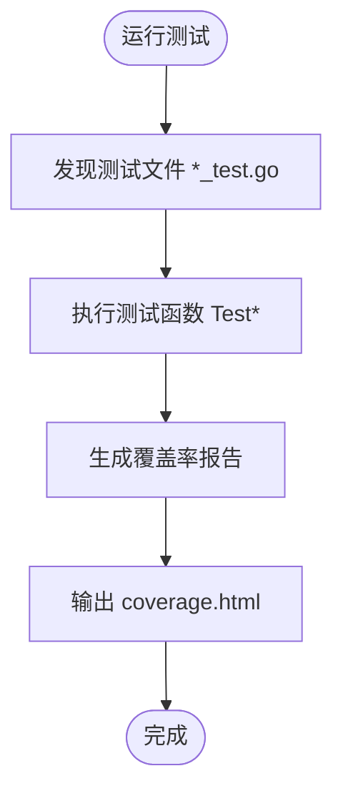
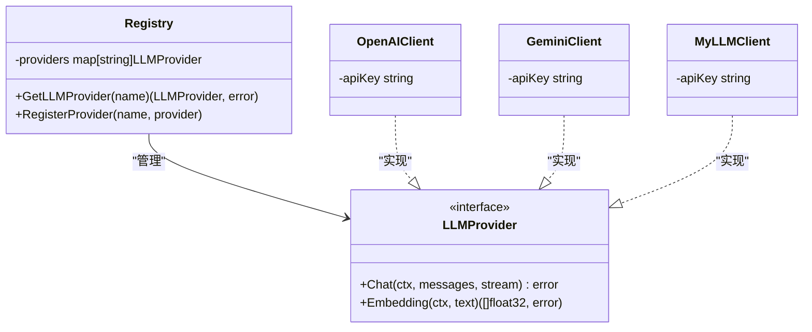

# 开发者指南

<cite>
**本文档中引用的文件**  
- [README.md](file://README.md)
- [Makefile](file://Makefile)
- [go.mod](file://go.mod)
- [frontend/eslint.config.js](file://frontend/eslint.config.js)
- [frontend/package.json](file://frontend/package.json)
- [e2e/package.json](file://e2e/package.json)
- [e2e/playwright.config.ts](file://e2e/playwright.config.ts)
- [cmd/council/main.go](file://cmd/council/main.go)
- [internal/pkg/config/config.go](file://internal/pkg/config/config.go)
- [internal/infrastructure/llm/router.go](file://internal/infrastructure/llm/router.go)
- [internal/core/workflow/nodes/factory.go](file://internal/core/workflow/nodes/factory.go)
- [internal/core/workflow/engine.go](file://internal/core/workflow/engine.go)
- [docs/tdd/00_traceability.md](file://docs/tdd/00_traceability.md)
- [docs/tdd/02_core/06_node_processors.md](file://docs/tdd/02_core/06_node_processors.md)
- [frontend/src/test-setup.ts](file://frontend/src/test-setup.ts)
</cite>

## 目录
1. [开发环境搭建](#开发环境搭建)
2. [代码风格规范](#代码风格规范)
3. [分支管理与提交信息](#分支管理与提交信息)
4. [测试指南](#测试指南)
5. [TDD开发流程与需求追溯](#tdd开发流程与需求追溯)
6. [扩展开发指南](#扩展开发指南)

## 开发环境搭建

本项目采用 Docker + Go + React 技术栈，提供一键启动和手动启动两种方式。

### 依赖要求

| 依赖项 | 版本 |
| :--- | :--- |
| Docker | ≥ 20.10 |
| Docker Compose | v2.x |
| Go | ≥ 1.21 |
| Node.js | ≥ 20 |

### 一键启动

```bash
# 克隆仓库
git clone https://github.com/hrygo/council.git
cd council

# 启动所有服务（Docker + 后端 + 前端）
make start
```

**访问地址：**
- 🌐 前端：http://localhost:5173
- 🔌 后端 API：http://localhost:8080
- 📊 WebSocket：ws://localhost:8080/ws

### 手动启动

```bash
# 1. 启动基础设施（PostgreSQL + Redis）
make start-db

# 2. 启动后端
make start-backend

# 3. 启动前端
make start-frontend
```

### 停止服务

```bash
make stop
```

### 环境配置

项目使用 `.env` 文件管理环境变量。首次运行时会自动从 `.env.example` 创建：

```bash
cp .env.example .env
```

主要配置项包括数据库连接、LLM 提供商密钥等，详细配置见 `internal/pkg/config/config.go`。

**Section sources**
- [README.md](file://README.md#L46-L90)
- [Makefile](file://Makefile#L71-L85)
- [.env.example](file://.env.example)

## 代码风格规范

项目遵循 Go 和 React 的标准代码风格，并通过自动化工具强制执行。

### Go 代码规范

Go 代码使用 `gofmt` 进行格式化，通过 Makefile 提供格式化命令：

```bash
# 格式化所有 Go 代码
make fmt
```

该命令会执行 `gofmt -w -s .`，确保代码格式统一。

### 前端代码规范

前端使用 ESLint 进行代码检查，配置文件位于 `frontend/eslint.config.js`。项目采用 TypeScript、React Hooks 和现代 JavaScript 特性。

```javascript
import js from '@eslint/js'
import globals from 'globals'
import reactHooks from 'eslint-plugin-react-hooks'
import reactRefresh from 'eslint-plugin-react-refresh'
import tseslint from 'typescript-eslint'

export default defineConfig([
  globalIgnores(['dist']),
  {
    files: ['**/*.{ts,tsx}'],
    extends: [
      js.configs.recommended,
      tseslint.configs.recommended,
      reactHooks.configs.flat.recommended,
      reactRefresh.configs.vite,
    ],
    languageOptions: {
      ecmaVersion: 2020,
      globals: globals.browser,
    },
  },
])
```

运行 ESLint 检查：

```bash
# 在项目根目录运行
make lint

# 或在 frontend 目录运行
cd frontend && npm run lint
```

### 质量检查

项目提供综合质量检查命令，包含格式化、静态检查和测试：

```bash
# 安装依赖
make install

# 运行所有检查
make check
```

**Section sources**
- [Makefile](file://Makefile#L260-L262)
- [frontend/eslint.config.js](file://frontend/eslint.config.js#L1-L24)
- [frontend/package.json](file://frontend/package.json#L9)
- [go.mod](file://go.mod#L1-L66)

## 分支管理与提交信息

项目采用标准的 Git 分支管理策略，确保代码质量和协作效率。

### 分支策略

- `main`：主分支，保护分支，仅通过 PR 合并
- `develop`：开发分支，集成所有功能开发
- `feature/*`：功能分支，每个新功能独立分支
- `bugfix/*`：修复分支，针对特定问题
- `release/*`：发布分支，版本发布准备

### 提交信息格式

提交信息应遵循 [Conventional Commits](https://www.conventionalcommits.org/) 规范，格式为：

```
<type>(<scope>): <subject>
<BLANK LINE>
<body>
<BLANK LINE>
<footer>
```

**类型（type）**：
- `feat`：新功能
- `fix`：bug 修复
- `docs`：文档更新
- `style`：代码格式调整
- `refactor`：代码重构
- `test`：测试相关
- `chore`：构建或辅助工具变动

**示例**：
```
feat(workflow): add human review node support

Implement human review node that pauses execution for user approval.
This enables human-in-the-loop workflows for critical decisions.

Closes #123
```

### 提交验证

通过 `make check` 命令可验证提交质量，包括：
- 代码格式化
- 静态代码分析
- 单元测试
- 覆盖率检查

**Section sources**
- [Makefile](file://Makefile#L325-L374)
- [README.md](file://README.md#L314-L320)

## 测试指南

项目提供完整的测试体系，包括单元测试、组件测试和端到端测试。

### 单元测试（Go）

后端使用 Go 内置测试框架，测试文件以 `_test.go` 结尾。运行测试：

```bash
# 运行所有测试
make test-backend

# 或直接使用 go test
go test -v -race -coverprofile=coverage.out ./...
```

测试覆盖了核心组件：
- 工作流引擎
- 节点处理器
- API 处理器
- 中间件



**Diagram sources**
- [internal/core/workflow/engine.go](file://internal/core/workflow/engine.go#L1-L246)
- [internal/core/workflow/nodes/factory.go](file://internal/core/workflow/nodes/factory.go#L1-L106)

**Section sources**
- [Makefile](file://Makefile#L177-L179)
- [internal/core/workflow/engine_test.go](file://internal/core/workflow/engine_test.go)

### 组件测试（React）

前端使用 Vitest 进行组件测试，配置文件为 `vite.config.ts`。测试设置文件 `test-setup.ts` 包含必要的环境模拟：

```typescript
import '@testing-library/jest-dom';

// 为持久化存储模拟 localStorage
const localStorageMock = (() => {
    let store: Record<string, string> = {};
    return {
        getItem: (key: string) => store[key] ?? null,
        setItem: (key: string, value: string) => { store[key] = value; },
        removeItem: (key: string) => { delete store[key]; },
        clear: () => { store = {}; },
        length: 0,
        key: () => null,
    };
})();

Object.defineProperty(globalThis, 'localStorage', {
    value: localStorageMock,
});
```

运行前端测试：

```bash
# 运行测试
cd frontend && npm run test

# 运行并生成覆盖率报告
npm run test:coverage
```

### 端到端测试（Playwright）

端到端测试使用 Playwright，位于 `e2e/` 目录。测试套件包括：

- `navigation.spec.ts`：导航功能
- `workflow-builder.spec.ts`：工作流构建
- `groups.spec.ts`：群组管理
- `agents.spec.ts`：代理管理
- `meeting-room.spec.ts`：会议房间

Playwright 配置文件 `playwright.config.ts` 设置了严格的超时和断言策略：

```typescript
export default defineConfig({
    testDir: './tests',
    timeout: 10 * 1000,
    expect: {
        timeout: 3000,
    },
    fullyParallel: true,
    retries: process.env.CI ? 1 : 0,
    workers: process.env.CI ? 2 : 4,
    use: {
        baseURL: 'http://localhost:5173',
        trace: 'retain-on-failure',
        screenshot: 'only-on-failure',
        video: 'retain-on-failure',
        actionTimeout: 5000,
        navigationTimeout: 8000,
    },
    projects: [
        {
            name: 'chromium',
            use: { ...devices['Desktop Chrome'] },
        },
    ],
});
```

运行 e2e 测试套件：

```bash
# 运行所有 e2e 测试
make e2e

# 使用 UI 模式运行
make e2e-ui

# 有头模式运行（可见浏览器）
make e2e-headed

# 查看测试报告
make e2e-report
```

**Section sources**
- [e2e/playwright.config.ts](file://e2e/playwright.config.ts#L1-L58)
- [e2e/package.json](file://e2e/package.json#L1-L14)
- [frontend/src/test-setup.ts](file://frontend/src/test-setup.ts#L1-L19)

## TDD开发流程与需求追溯

项目采用测试驱动开发（TDD）方法，确保需求可追溯和代码质量。

### TDD流程

1. **需求分析**：从 PRD 文档分析功能需求
2. **编写测试**：根据需求编写失败的测试用例
3. **实现代码**：编写最简代码使测试通过
4. **重构优化**：优化代码结构，确保测试仍通过
5. **验证追溯**：确认需求与实现的映射关系

### 需求追溯性

项目通过 `docs/tdd/00_traceability.md` 维护需求追溯矩阵，确保每个 PRD 需求都有对应的 TDD 实现。

```markdown
| PRD 编号  | 需求描述                    | TDD 章节                                                                                                             | 状态 |
| --------- | --------------------------- | -------------------------------------------------------------------------------------------------------------------- | ---- |
| **F.1.1** | 创建/管理群组               | [2.4 群组管理模块](../tdd/02_core/04_group_management.md)                                                            | ✅    |
| **F.1.2** | 群记忆隔离                  | [2.3 三层记忆协议](../tdd/02_core/03_rag.md)                                                                         | ✅    |
| **F.2.1** | 角色定义                    | [2.5 Agent 工厂模块](../tdd/02_core/05_agent_factory.md)                                                             | ✅    |
```

### 测试覆盖率

项目提供综合覆盖率报告，通过 `make coverage` 命令生成：

```bash
# 生成覆盖率报告
make coverage

# 查看详细报告
# 后端 -> coverage.html
# 前端 -> frontend/coverage/index.html
```

覆盖率报告包含：
- 后端 Go 代码覆盖率
- 前端 React 代码覆盖率
- 整体平均覆盖率

**Section sources**
- [docs/tdd/00_traceability.md](file://docs/tdd/00_traceability.md#L1-L27)
- [Makefile](file://Makefile#L187-L204)

## 扩展开发指南

本节说明如何扩展系统功能，包括添加新的工作流节点、LLM 提供商和前端模块。

### 添加新的工作流节点处理器

工作流节点处理器位于 `internal/core/workflow/nodes/` 目录，遵循节点工厂模式。

1. **定义处理器结构**：
```go
type CustomProcessor struct {
    Config map[string]interface{}
}
```

2. **实现 NodeProcessor 接口**：
```go
func (p *CustomProcessor) Process(ctx context.Context, input map[string]interface{}, stream chan<- StreamEvent) (map[string]interface{}, error) {
    // 处理逻辑
    return output, nil
}
```

3. **在工厂中注册**：
```go
func NewNodeFactory(deps NodeDependencies) func(node *workflow.Node) (workflow.NodeProcessor, error) {
    return func(node *workflow.Node) (workflow.NodeProcessor, error) {
        switch node.Type {
        case workflow.NodeTypeCustom:
            return &CustomProcessor{
                Config: node.Properties,
            }, nil
        // ... 其他节点
        }
    }
}
```

4. **更新工作流类型定义**：
在 `workflow/types.go` 中添加新的节点类型常量。

**Section sources**
- [internal/core/workflow/nodes/factory.go](file://internal/core/workflow/nodes/factory.go#L1-L106)
- [docs/tdd/02_core/06_node_processors.md](file://docs/tdd/02_core/06_node_processors.md#L1-L135)

### 集成新的LLM提供商

LLM 提供商通过注册中心模式管理，位于 `internal/infrastructure/llm/` 目录。

1. **实现 LLMProvider 接口**：
```go
type MyLLMProvider struct {
    apiKey string
}

func (p *MyLLMProvider) Chat(ctx context.Context, messages []Message, stream chan<- string) error {
    // 实现聊天逻辑
    return nil
}
```

2. **创建客户端工厂**：
```go
func NewMyLLMClient(apiKey string) LLMProvider {
    return &MyLLMProvider{apiKey: apiKey}
}
```

3. **在注册中心注册**：
```go
func (r *Registry) createProvider(config LLMConfig) (LLMProvider, error) {
    switch config.Type {
    case "myllm":
        return NewMyLLMClient(config.APIKey), nil
    // ... 其他提供商
    }
}
```

4. **更新配置**：
在 `config.go` 中添加新的 API 密钥环境变量。



**Diagram sources**
- [internal/infrastructure/llm/router.go](file://internal/infrastructure/llm/router.go#L1-L177)
- [internal/pkg/config/config.go](file://internal/pkg/config/config.go#L1-L133)

**Section sources**
- [internal/infrastructure/llm/router.go](file://internal/infrastructure/llm/router.go#L1-L177)

### 扩展前端功能模块

前端采用模块化架构，位于 `frontend/src/features/` 目录。

1. **创建新功能目录**：
```
features/
└── new-feature/
    ├── components/
    ├── pages/
    └── hooks/
```

2. **定义页面组件**：
```tsx
// features/new-feature/pages/NewFeaturePage.tsx
export default function NewFeaturePage() {
    return (
        <div>New Feature Content</div>
    );
}
```

3. **添加路由**：
在 `App.tsx` 中添加新路由。

4. **创建自定义 Hook**：
```tsx
// features/new-feature/hooks/useNewFeature.ts
export function useNewFeature() {
    // 逻辑
    return data;
}
```

5. **集成状态管理**：
使用 Zustand 创建状态存储。

**Section sources**
- [frontend/src/App.tsx](file://frontend/src/App.tsx)
- [frontend/src/features](file://frontend/src/features)