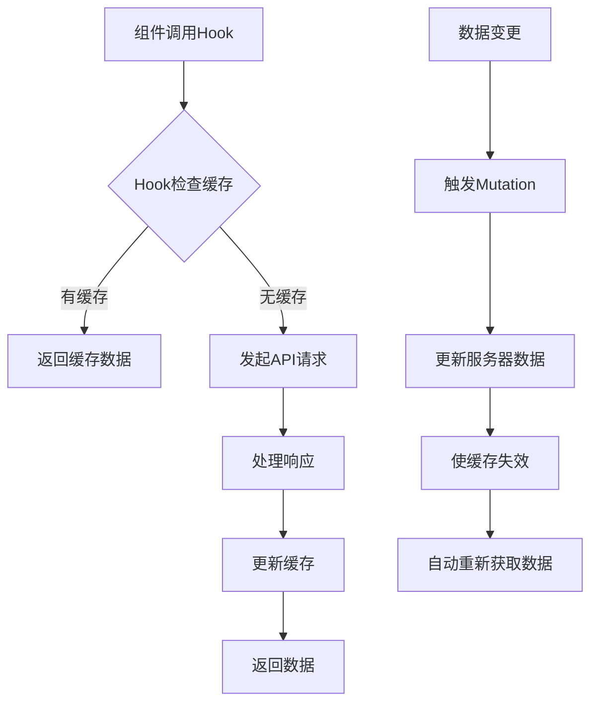
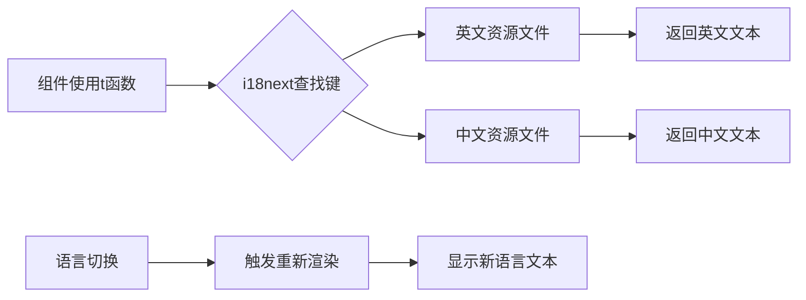

# 前端模块扩展

<cite>
**本文档引用文件**  
- [AgentsPage.tsx](file://frontend/src/features/agents/pages/AgentsPage.tsx)
- [useAgents.ts](file://frontend/src/hooks/useAgents.ts)
- [translation.json](file://frontend/src/i18n/locales/en/translation.json)
- [translation.json](file://frontend/src/i18n/locales/zh-CN/translation.json)
- [App.tsx](file://frontend/src/App.tsx)
- [useConfigStore.ts](file://frontend/src/stores/useConfigStore.ts)
- [LanguageSwitcher.tsx](file://frontend/src/components/LanguageSwitcher.tsx)
- [AgentList.tsx](file://frontend/src/features/agents/components/AgentList.tsx)
- [AgentCard.tsx](file://frontend/src/features/agents/components/AgentCard.tsx)
- [AgentEditDrawer.tsx](file://frontend/src/features/agents/components/AgentEditDrawer.tsx)
- [ModelSelector.tsx](file://frontend/src/features/agents/components/ModelSelector.tsx)
- [useLLMOptions.ts](file://frontend/src/hooks/useLLMOptions.ts)
- [agent.ts](file://frontend/src/types/agent.ts)
</cite>

## 目录
1. [介绍](#介绍)
2. [页面目录结构](#页面目录结构)
3. [状态管理](#状态管理)
4. [多语言支持](#多语言支持)
5. [路由与导航](#路由与导航)
6. [权限控制与菜单注册](#权限控制与菜单注册)
7. [最佳实践](#最佳实践)
8. [总结](#总结)

## 介绍

本文档详细说明如何在前端扩展新功能模块，以agents模块为例，阐述创建新页面的标准模式、状态管理、多语言支持、路由配置等关键步骤。通过分析现有代码结构，提供可复用的开发范式，帮助开发者快速构建符合项目规范的新功能模块。

## 页面目录结构

在前端项目中，每个功能模块都遵循统一的目录结构规范。以agents模块为例，其目录结构位于`frontend/src/features/agents/`下，包含两个主要子目录：`pages`和`components`。

`pages`目录存放模块的顶级页面组件，如`AgentsPage.tsx`，负责页面的整体布局和主要功能入口。该组件通常会导入并组合多个`components`目录中的子组件来构建完整的用户界面。

`components`目录存放可复用的UI组件，这些组件具有单一职责，如`AgentList.tsx`用于展示智能体列表，`AgentCard.tsx`用于显示单个智能体的信息卡片，`AgentEditDrawer.tsx`用于提供智能体的创建和编辑功能。

这种分离关注点的设计模式提高了代码的可维护性和可复用性，使得组件可以在不同场景下灵活组合使用。

**Section sources**
- [AgentsPage.tsx](file://frontend/src/features/agents/pages/AgentsPage.tsx)
- [AgentList.tsx](file://frontend/src/features/agents/components/AgentList.tsx)
- [AgentCard.tsx](file://frontend/src/features/agents/components/AgentCard.tsx)
- [AgentEditDrawer.tsx](file://frontend/src/features/agents/components/AgentEditDrawer.tsx)

## 状态管理

前端模块的状态管理采用Zustand库来实现，为每个功能模块创建独立的store。以agents模块为例，通过`useAgents.ts`文件定义了与智能体相关的状态和操作。

该store利用React Query库提供的`useQuery`和`useMutation`钩子，封装了对后端API的调用逻辑。`useAgents`函数用于获取智能体列表，`useCreateAgent`、`useUpdateAgent`和`useDeleteAgent`分别用于创建、更新和删除智能体操作。

状态管理的关键优势在于将数据获取、缓存、更新和错误处理等复杂逻辑封装在自定义hook中，使得组件可以专注于UI渲染。当数据发生变化时，React Query会自动更新相关组件，并通过`queryClient.invalidateQueries`方法确保数据的一致性。



**Diagram sources**
- [useAgents.ts](file://frontend/src/hooks/useAgents.ts)

**Section sources**
- [useAgents.ts](file://frontend/src/hooks/useAgents.ts)
- [useLLMOptions.ts](file://frontend/src/hooks/useLLMOptions.ts)

## 多语言支持

多语言支持通过i18next库实现，项目在`frontend/src/i18n/`目录下维护了完整的国际化配置。该目录包含`locales`子目录，其中分别存放不同语言的翻译文件，如`en/translation.json`和`zh-CN/translation.json`。

实现多语言支持的流程如下：首先在`index.ts`文件中初始化i18next实例，配置支持的语言、资源文件和检测机制。然后在组件中使用`useTranslation`钩子获取翻译函数`t`，通过键值引用对应的翻译文本。

添加新的语言键值对时，需要在所有支持的语言文件中同步添加相同的键。例如，要在agents模块中添加新的翻译项，需要同时在英文和中文的`translation.json`文件中添加对应的键值对，确保语言切换时内容的完整性和一致性。



**Diagram sources**
- [index.ts](file://frontend/src/i18n/index.ts)
- [translation.json](file://frontend/src/i18n/locales/en/translation.json)
- [translation.json](file://frontend/src/i18n/locales/zh-CN/translation.json)

**Section sources**
- [index.ts](file://frontend/src/i18n/index.ts)
- [translation.json](file://frontend/src/i18n/locales/en/translation.json)
- [translation.json](file://frontend/src/i18n/locales/zh-CN/translation.json)
- [LanguageSwitcher.tsx](file://frontend/src/components/LanguageSwitcher.tsx)

## 路由与导航

路由配置在`App.tsx`文件中定义，使用React Router的`Routes`和`Route`组件来设置应用的导航结构。每个功能模块都有对应的路由路径，如agents模块的路径为`/agents`，映射到`AgentsPage`组件。

导航栏位于页面左侧，通过`NavButton`组件实现。每个导航按钮对应一个功能模块，点击按钮会触发路由跳转。导航按钮的标签通过i18next的`t`函数获取，支持多语言显示。

路由配置还支持动态参数，如`/meeting/:sessionId`，允许在不同会话间切换。这种基于路径的导航模式使得URL具有语义化特征，便于书签和直接访问。

```mermaid
graph TB
A[App组件] --> B[路由配置]
B --> C[/ 路径]
B --> D[/meeting 路径]
B --> E[/groups 路径]
B --> F[/agents 路径]
C --> G[HomePage]
D --> H[MeetingRoom]
E --> I[GroupsPage]
F --> J[AgentsPage]
K[用户点击导航] --> L[路由跳转]
L --> M[组件渲染]
```

**Diagram sources**
- [App.tsx](file://frontend/src/App.tsx)

**Section sources**
- [App.tsx](file://frontend/src/App.tsx)

## 权限控制与菜单注册

权限控制和菜单注册通过配置化的方式实现。虽然当前代码中未显式展示权限控制逻辑，但可以通过`useConfigStore.ts`中的状态来实现基于用户角色的功能访问控制。

菜单注册与路由配置紧密相关，每个在路由中定义的模块都会自动出现在左侧导航栏中。导航项的显示文本通过多语言系统获取，确保在不同语言环境下正确显示。

未来的扩展可以在此基础上添加更精细的权限控制，例如根据用户角色动态显示或隐藏特定的菜单项，或者对某些功能模块的访问进行权限验证。

**Section sources**
- [useConfigStore.ts](file://frontend/src/stores/useConfigStore.ts)
- [App.tsx](file://frontend/src/App.tsx)

## 最佳实践

在扩展新功能模块时，应遵循以下最佳实践：

1. **避免状态污染**：为每个模块创建独立的store，避免全局状态的混乱。使用Zustand的slice模式或React Query的queryKey来隔离不同模块的状态。

2. **确保类型安全**：充分利用TypeScript的类型系统，为API响应、组件props和状态定义明确的接口。如`agent.ts`文件中定义的`Agent`和`CreateAgentInput`接口，确保数据结构的一致性和类型检查。

3. **保持UI一致性**：遵循项目现有的UI设计规范，复用已有的组件和样式。如使用相同的按钮样式、卡片布局和表单元素，确保整个应用的视觉统一性。

4. **模块化设计**：将功能分解为小的、可复用的组件，遵循单一职责原则。每个组件只负责一个特定的功能，便于测试和维护。

5. **错误处理**：在API调用中妥善处理错误情况，向用户提供清晰的错误信息。使用Toast组件显示操作结果，提升用户体验。

6. **性能优化**：利用React Query的缓存机制减少不必要的网络请求，对大型列表使用虚拟滚动等技术优化渲染性能。

**Section sources**
- [agent.ts](file://frontend/src/types/agent.ts)
- [useAgents.ts](file://frontend/src/hooks/useAgents.ts)
- [AgentCard.tsx](file://frontend/src/features/agents/components/AgentCard.tsx)

## 总结

通过分析agents模块的实现，我们总结出了一套完整的前端模块扩展方法论。从目录结构的组织、状态管理的设计、多语言支持的实现到路由配置和最佳实践，每个环节都有明确的规范和模式可循。

这套方法论不仅适用于当前项目，也可以作为其他前端项目的参考。通过遵循这些规范，可以确保新功能模块的质量和一致性，提高开发效率，降低维护成本。