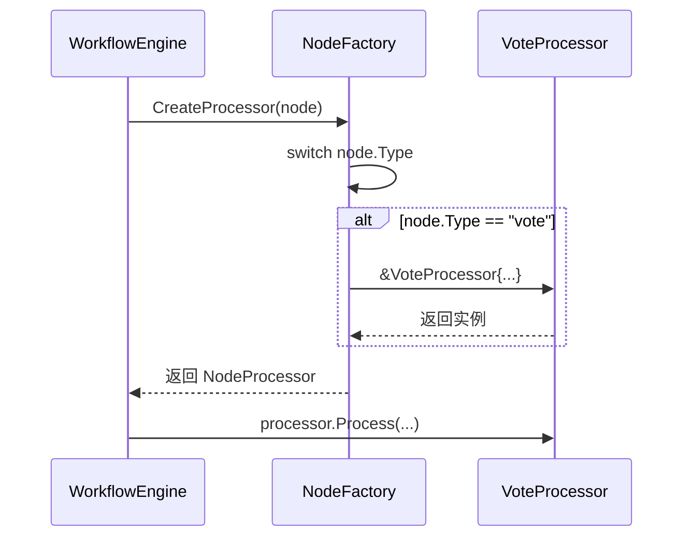
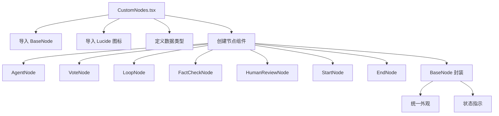
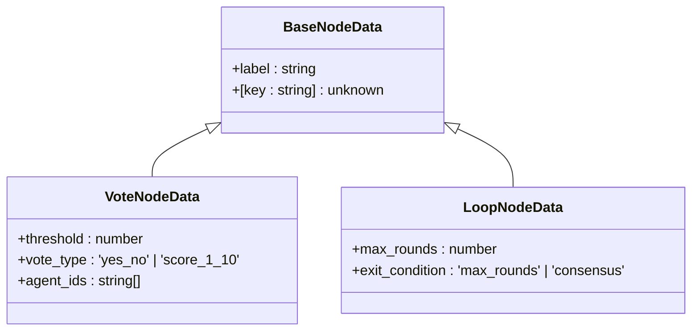
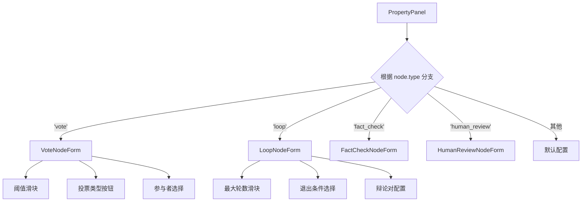
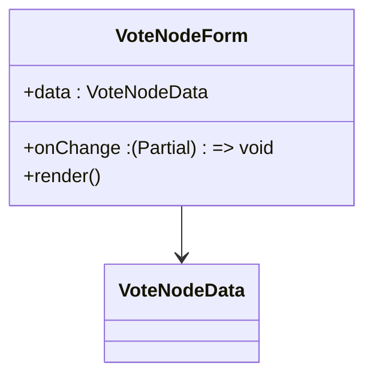

# 工作流节点扩展

<cite>
**本文档引用文件**  
- [processor.go](file://internal/core/workflow/processor.go)
- [factory.go](file://internal/core/workflow/nodes/factory.go)
- [vote.go](file://internal/core/workflow/nodes/vote.go)
- [types.go](file://internal/core/workflow/types.go)
- [validation.go](file://internal/core/workflow/validation.go)
- [engine.go](file://internal/core/workflow/engine.go)
- [CustomNodes.tsx](file://frontend/src/components/workflow/nodes/CustomNodes.tsx)
- [VoteNodeForm.tsx](file://frontend/src/features/editor/components/PropertyPanel/NodeForms/VoteNodeForm.tsx)
- [LoopNodeForm.tsx](file://frontend/src/features/editor/components/PropertyPanel/NodeForms/LoopNodeForm.tsx)
- [PropertyPanel.tsx](file://frontend/src/features/editor/components/PropertyPanel/PropertyPanel.tsx)
- [workflow.ts](file://frontend/src/types/workflow.ts)
- [custom-workflow.md](file://docs/guide/custom-workflow.md)
</cite>

## 目录
1. [引言](#引言)
2. [后端处理器扩展](#后端处理器扩展)
3. [前端节点可视化扩展](#前端节点可视化扩展)
4. [属性面板表单开发](#属性面板表单开发)
5. [完整集成示例](#完整集成示例)
6. [常见问题排查](#常见问题排查)
7. [结论](#结论)

## 引言
本文档详细说明如何在 The Council 系统中扩展新的工作流节点处理器。涵盖从后端 `Processor` 接口实现、`NodeFactory` 注册，到前端 `CustomNodes.tsx` 可视化注册、`PropertyPanel` 表单开发的完整流程。通过投票节点（Vote Node）作为示例，展示从逻辑到界面的端到端集成方法。

## 后端处理器扩展

### 实现 Processor 接口
所有工作流节点处理器必须实现 `NodeProcessor` 接口。该接口定义了核心的 `Process` 方法，用于执行节点逻辑。

```mermaid
classDiagram
class NodeProcessor {
<<interface>>
+Process(ctx Context, input Map[string]interface{}, stream chan<- StreamEvent) (output Map[string]interface{}, err error)
}
class VoteProcessor {
+Threshold float64
+VoteType string
+Process(ctx Context, input Map[string]interface{}, stream chan<- StreamEvent) (Map[string]interface{}, error)
}
NodeProcessor <|-- VoteProcessor
```

**Diagram sources**
- [processor.go](file://internal/core/workflow/processor.go#L7-L14)
- [vote.go](file://internal/core/workflow/nodes/vote.go#L10-L13)

#### Process 方法实现逻辑
`Process` 方法是节点执行的核心，其逻辑包括：
1.  **状态通知**：通过 `stream` 通道发送节点状态变更事件（如 "running"）。
2.  **输入处理**：解析来自上游节点的 `input` 数据。
3.  **核心逻辑**：执行节点特定的业务逻辑（如投票计数）。
4.  **输出生成**：构建包含结果的 `output` 映射，供下游节点使用。
5.  **最终通知**：再次通过 `stream` 发送完成状态和结果。

以 `VoteProcessor` 为例，其 `Process` 方法会扫描输入数据中的 "YES"/"NO" 值，计算通过率，并与配置的 `Threshold` 比较。

**Section sources**
- [vote.go](file://internal/core/workflow/nodes/vote.go#L15-L69)

### 注册到 NodeFactory 工厂
新节点必须在 `NodeFactory` 中注册，才能在运行时被动态创建。`NodeFactory` 是一个函数工厂，根据节点类型返回对应的处理器实例。



**Diagram sources**
- [factory.go](file://internal/core/workflow/nodes/factory.go#L20-L106)
- [engine.go](file://internal/core/workflow/engine.go#L86-L90)

在 `factory.go` 文件中，需要在 `switch` 语句中为新节点类型（如 `workflow.NodeTypeVote`）添加 `case` 分支，并返回该处理器的实例。

**Section sources**
- [factory.go](file://internal/core/workflow/nodes/factory.go#L20-L106)

### 定义节点类型常量
在 `types.go` 中，必须为新节点定义一个唯一的 `NodeType` 常量，以便 `NodeFactory` 能够识别。

```go
const (
    NodeTypeStart           NodeType = "start"
    NodeTypeEnd             NodeType = "end"
    NodeTypeAgent           NodeType = "agent"
    NodeTypeVote            NodeType = "vote" // 新增
    // ... 其他类型
)
```

**Section sources**
- [types.go](file://internal/core/workflow/types.go#L28-L41)

## 前端节点可视化扩展

### CustomNodes.tsx 扩展机制
前端使用 React Flow 库来渲染工作流画布。`CustomNodes.tsx` 文件负责注册所有自定义节点组件。



**Diagram sources**
- [CustomNodes.tsx](file://frontend/src/components/workflow/nodes/CustomNodes.tsx#L1-L140)

每个节点组件（如 `VoteNode`）都是一个 React 函数组件，它接收 `NodeProps`，并使用 `BaseNode` 组件进行封装，以保证视觉风格统一。组件内部根据节点数据（`props.data`）渲染具体的可视化信息。

**Section sources**
- [CustomNodes.tsx](file://frontend/src/components/workflow/nodes/CustomNodes.tsx#L25-L139)

### 节点数据类型定义
在 `workflow.ts` 类型文件中，必须为新节点定义相应的数据接口（如 `VoteNodeData`），并将其合并到 `WorkflowNodeData` 联合类型中。



**Diagram sources**
- [workflow.ts](file://frontend/src/types/workflow.ts#L5-L39)

**Section sources**
- [workflow.ts](file://frontend/src/types/workflow.ts#L5-L39)

## 属性面板表单开发

### PropertyPanel 中表单组件开发
`PropertyPanel` 是用于配置节点属性的侧边栏。当用户选中一个节点时，`PropertyPanel` 会根据节点类型动态渲染对应的表单组件。



**Diagram sources**
- [PropertyPanel.tsx](file://frontend/src/features/editor/components/PropertyPanel/PropertyPanel.tsx#L18-L42)

#### 表单开发要点
1.  **状态绑定**：表单组件通过 `onChange` 回调将用户输入的变更通知给 `PropertyPanel`，`PropertyPanel` 再通过 `onUpdate` 回调更新工作流状态。
2.  **表单验证**：虽然当前示例中验证逻辑较简单，但应在 `onChange` 回调中加入验证，确保数据有效性。
3.  **属性映射**：表单字段必须与后端 `Node.Properties` 中的键名精确匹配（如 `threshold` 对应 `data.threshold`）。

以 `VoteNodeForm` 为例，它包含一个用于设置 `threshold` 的滑块和一个用于选择 `vote_type` 的按钮组。



**Diagram sources**
- [VoteNodeForm.tsx](file://frontend/src/features/editor/components/PropertyPanel/NodeForms/VoteNodeForm.tsx#L1-L62)
- [LoopNodeForm.tsx](file://frontend/src/features/editor/components/PropertyPanel/NodeForms/LoopNodeForm.tsx#L1-L50)

**Section sources**
- [VoteNodeForm.tsx](file://frontend/src/features/editor/components/PropertyPanel/NodeForms/VoteNodeForm.tsx#L1-L62)
- [LoopNodeForm.tsx](file://frontend/src/features/editor/components/PropertyPanel/NodeForms/LoopNodeForm.tsx#L1-L50)
- [PropertyPanel.tsx](file://frontend/src/features/editor/components/PropertyPanel/PropertyPanel.tsx#L1-L86)

## 完整集成示例
要成功扩展一个新节点，必须完成以下步骤：
1.  **后端**：
    *   在 `types.go` 中定义 `NodeType` 常量。
    *   实现 `NodeProcessor` 接口（如 `MyNodeProcessor`）。
    *   在 `factory.go` 的 `NewNodeFactory` 函数中添加 `case` 分支。
2.  **前端**：
    *   在 `workflow.ts` 中定义 `MyNodeData` 接口。
    *   在 `CustomNodes.tsx` 中创建 `MyNode` 组件并导出。
    *   在 `NodeForms` 目录下创建 `MyNodeForm.tsx`。
    *   在 `PropertyPanel.tsx` 的 `renderForm` 函数中添加对该表单的引用。

此流程确保了新节点能在工作流引擎中执行，并在前端画布和属性面板中正确显示和配置。

## 常见问题排查

### 类型不匹配
*   **问题**：后端 `Node.Properties` 中的键名与前端表单组件中的状态键名不一致。
*   **排查**：检查 `factory.go` 中读取 `Properties` 的代码和前端 `xxxForm.tsx` 中 `onChange` 回调使用的键名是否完全相同（注意大小写和下划线）。

### 注册遗漏
*   **问题**：节点在画布上显示为默认节点或无法执行。
*   **排查**：
    1.  检查 `factory.go` 是否有对应的 `case` 分支。
    2.  检查 `types.go` 是否定义了 `NodeType` 常量。
    3.  检查 `CustomNodes.tsx` 是否正确导出了新节点组件。
    4.  检查 `PropertyPanel.tsx` 的 `switch` 语句是否包含了新节点类型。

### 数据流中断
*   **问题**：下游节点无法接收到上游节点的输出。
*   **排查**：检查 `Process` 方法返回的 `output` 映射是否包含了下游节点期望的键名。可以利用 `StreamEvent` 通道发送调试信息。

## 结论
扩展工作流节点是一个涉及前后端协同的系统性工程。开发者需要遵循 `Processor` 接口规范实现业务逻辑，并通过 `NodeFactory` 进行注册。前端则需在 `CustomNodes.tsx` 和 `PropertyPanel` 中提供相应的可视化和配置能力。严格遵循类型定义和命名约定是避免集成问题的关键。通过本文档提供的方法和示例，可以高效地为 The Council 系统添加新的工作流节点功能。