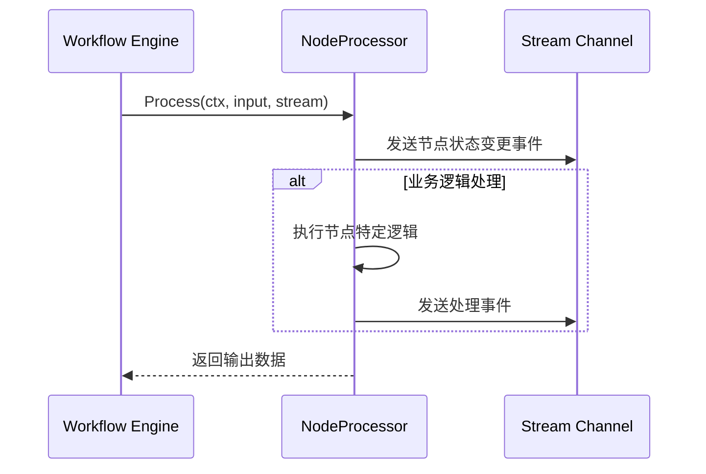
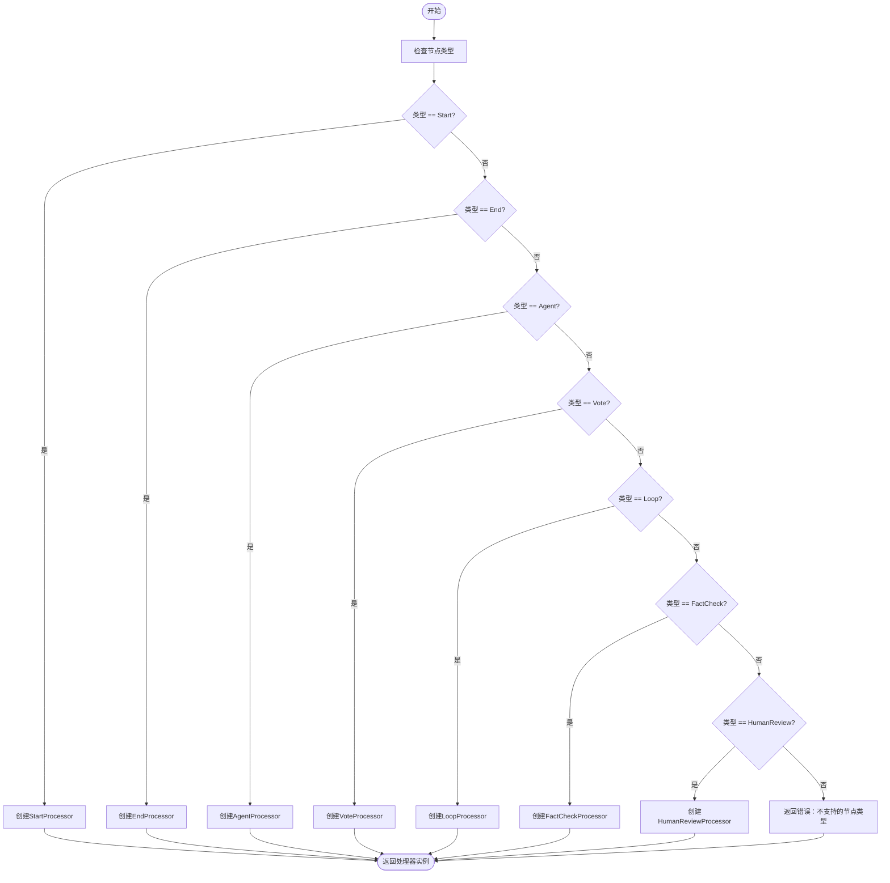
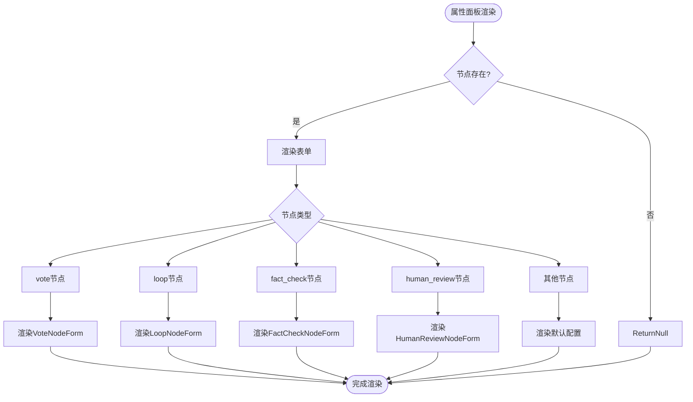
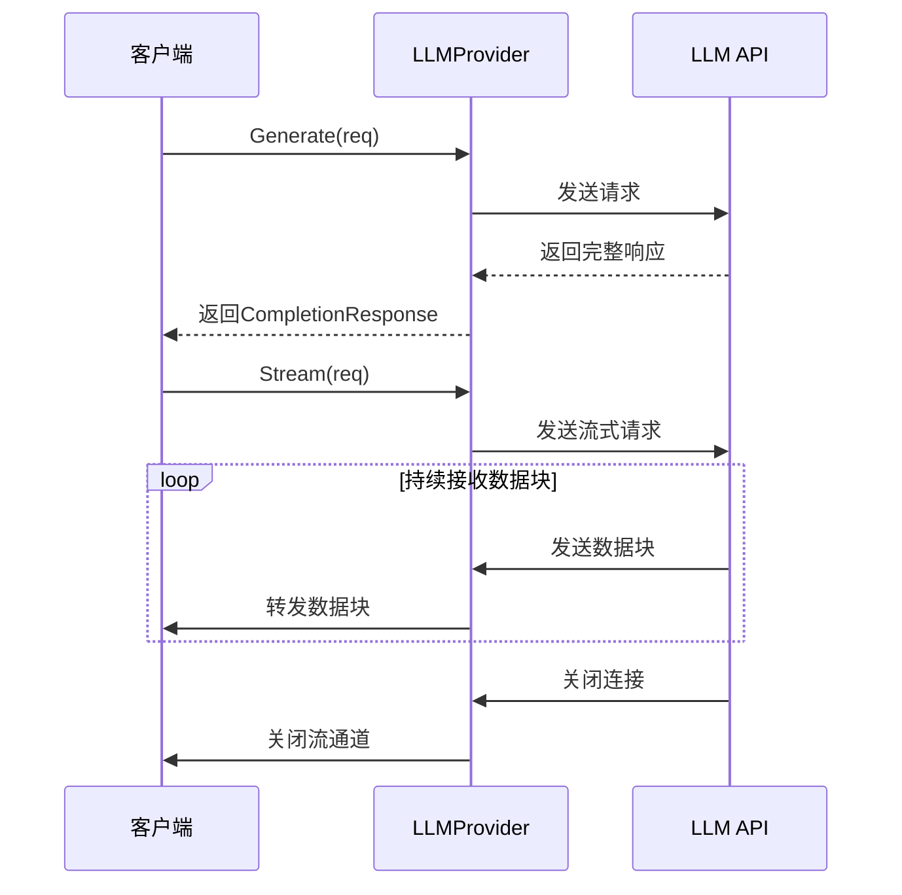
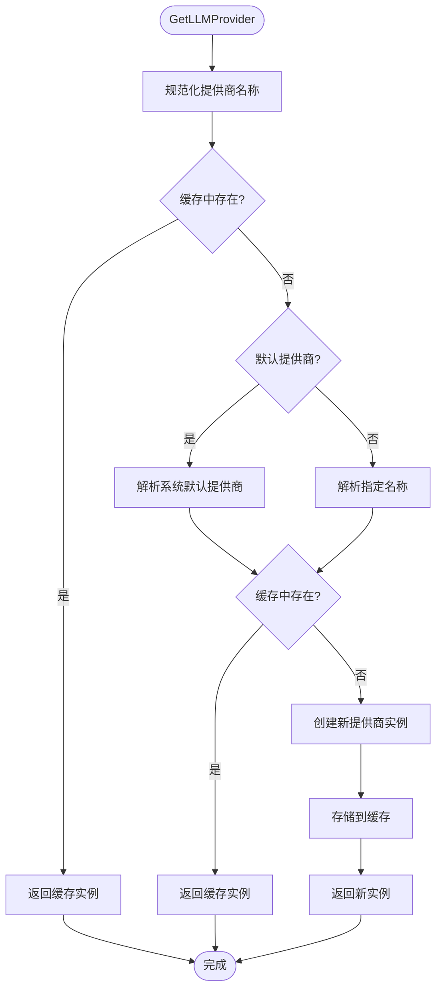
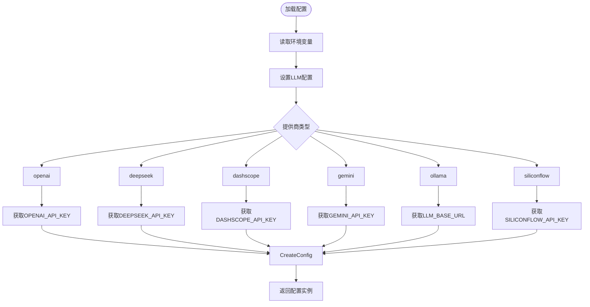
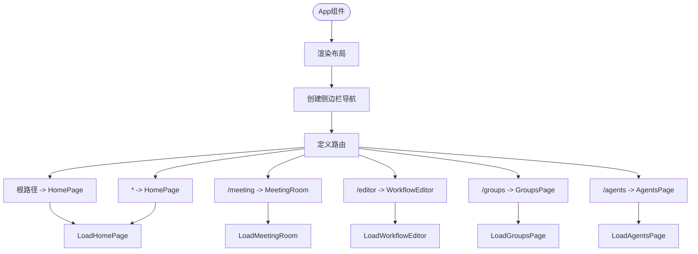
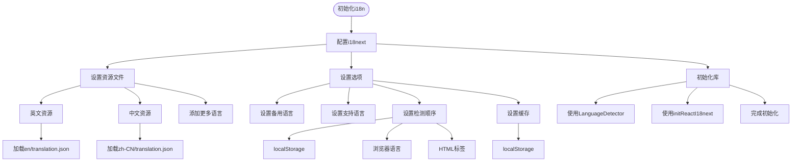

# 扩展开发

<cite>
**本文档中引用的文件**  
- [processor.go](file://internal/core/workflow/processor.go)
- [factory.go](file://internal/core/workflow/nodes/factory.go)
- [llm.go](file://internal/infrastructure/llm/llm.go)
- [router.go](file://internal/infrastructure/llm/router.go)
- [PropertyPanel.tsx](file://frontend/src/features/editor/components/PropertyPanel/PropertyPanel.tsx)
- [useWorkflowRunStore.ts](file://frontend/src/stores/useWorkflowRunStore.ts)
- [workflow.ts](file://frontend/src/types/workflow.ts)
- [App.tsx](file://frontend/src/App.tsx)
- [config.go](file://internal/pkg/config/config.go)
- [agent.go](file://internal/core/workflow/nodes/agent.go)
- [fact_check.go](file://internal/core/workflow/nodes/fact_check.go)
- [VoteNodeForm.tsx](file://frontend/src/features/editor/components/PropertyPanel/NodeForms/VoteNodeForm.tsx)
- [LoopNodeForm.tsx](file://frontend/src/features/editor/components/PropertyPanel/NodeForms/LoopNodeForm.tsx)
- [i18n/index.ts](file://frontend/src/i18n/index.ts)
</cite>

## 目录
1. [简介](#简介)
2. [工作流节点处理器扩展](#工作流节点处理器扩展)
3. [LLM提供商集成](#llm提供商集成)
4. [前端功能模块扩展](#前端功能模块扩展)
5. [扩展点设计原则](#扩展点设计原则)

## 简介
本指南详细说明了如何在系统中扩展功能，包括添加新的工作流节点处理器、集成新的LLM提供商以及扩展前端功能模块。文档涵盖了实现接口、注册工厂模式、定义前端组件和属性面板的具体步骤，并介绍了扩展点的设计原则。

## 工作流节点处理器扩展

系统通过`NodeProcessor`接口和工厂模式支持工作流节点的扩展。开发者可以通过实现处理器接口并将其注册到节点工厂来添加新的节点类型。

```mermaid
classDiagram
class NodeProcessor {
<<interface>>
+Process(ctx context.Context, input map[string]interface{}, stream chan<- StreamEvent) (output map[string]interface{}, err error)
}
class AgentProcessor {
+NodeID string
+AgentID string
+AgentRepo agent.Repository
+Registry *llm.Registry
+Process(ctx context.Context, input map[string]interface{}, stream chan<- StreamEvent) (map[string]interface{}, error)
}
class FactCheckProcessor {
+LLM llm.LLMProvider
+SearchClient search.SearchClient
+VerifyThreshold float64
+Process(ctx context.Context, input map[string]interface{}, stream chan<- StreamEvent) (map[string]interface{}, error)
}
class VoteProcessor {
+Threshold float64
+VoteType string
+Process(ctx context.Context, input map[string]interface{}, stream chan<- StreamEvent) (map[string]interface{}, error)
}
class LoopProcessor {
+MaxRounds int
+ExitOnScore int
+Process(ctx context.Context, input map[string]interface{}, stream chan<- StreamEvent) (map[string]interface{}, error)
}
class HumanReviewProcessor {
+TimeoutMinutes int
+AllowSkip bool
+Process(ctx context.Context, input map[string]interface{}, stream chan<- StreamEvent) (map[string]interface{}, error)
}
NodeProcessor <|-- AgentProcessor
NodeProcessor <|-- FactCheckProcessor
NodeProcessor <|-- VoteProcessor
NodeProcessor <|-- LoopProcessor
NodeProcessor <|-- HumanReviewProcessor
```

**图源**
- [processor.go](file://internal/core/workflow/processor.go#L7-L14)
- [agent.go](file://internal/core/workflow/nodes/agent.go#L16-L130)
- [fact_check.go](file://internal/core/workflow/nodes/fact_check.go#L14-L114)

**节源**
- [processor.go](file://internal/core/workflow/processor.go#L7-L14)
- [agent.go](file://internal/core/workflow/nodes/agent.go#L16-L130)
- [fact_check.go](file://internal/core/workflow/nodes/fact_check.go#L14-L114)

### 实现Processor接口
要添加新的工作流节点处理器，首先需要实现`NodeProcessor`接口。该接口定义了`Process`方法，接收上下文、输入数据和事件流通道，返回输出数据和可能的错误。



**图源**
- [processor.go](file://internal/core/workflow/processor.go#L7-L14)
- [agent.go](file://internal/core/workflow/nodes/agent.go#L23-L124)

### 注册到工厂模式
新实现的处理器需要在`NewNodeFactory`函数中注册，通过节点类型进行分发。工厂函数根据节点类型创建相应的处理器实例。



**图源**
- [factory.go](file://internal/core/workflow/nodes/factory.go#L20-L106)

### 定义前端组件和属性面板
前端需要为新节点类型定义相应的属性面板组件，允许用户配置节点参数。属性面板通过条件渲染支持不同节点类型的配置表单。



**图源**
- [PropertyPanel.tsx](file://frontend/src/features/editor/components/PropertyPanel/PropertyPanel.tsx#L21-L42)

## LLM提供商集成

系统通过`LLMProvider`接口和注册中心模式支持LLM提供商的动态集成。新的LLM提供商可以通过实现接口并注册到路由系统来集成。

```mermaid
classDiagram
class LLMProvider {
<<interface>>
+Generate(ctx context.Context, req *CompletionRequest) (*CompletionResponse, error)
+Stream(ctx context.Context, req *CompletionRequest) (<-chan string, <-chan error)
}
class Embedder {
<<interface>>
+Embed(ctx context.Context, model string, text string) ([]float32, error)
}
class Registry {
-cfg *config.Config
-providers map[string]LLMProvider
-mu sync.RWMutex
+RegisterProvider(name string, provider LLMProvider)
+GetLLMProvider(providerName string) (LLMProvider, error)
+GetDefaultModel() string
+NewEmbedder(config EmbeddingConfig) (Embedder, error)
}
class OpenAIClient {
+Generate(ctx context.Context, req *CompletionRequest) (*CompletionResponse, error)
+Stream(ctx context.Context, req *CompletionRequest) (<-chan string, <-chan error)
+Embed(ctx context.Context, model string, text string) ([]float32, error)
}
class GeminiClient {
+Generate(ctx context.Context, req *CompletionRequest) (*CompletionResponse, error)
+Stream(ctx context.Context, req *CompletionRequest) (<-chan string, <-chan error)
+Embed(ctx context.Context, model string, text string) ([]float32, error)
}
class DeepSeekClient {
+Generate(ctx context.Context, req *CompletionRequest) (*CompletionResponse, error)
+Stream(ctx context.Context, req *CompletionRequest) (<-chan string, <-chan error)
+Embed(ctx context.Context, model string, text string) ([]float32, error)
}
class OllamaClient {
+Generate(ctx context.Context, req *CompletionRequest) (*CompletionResponse, error)
+Stream(ctx context.Context, req *CompletionRequest) (<-chan string, <-chan error)
+Embed(ctx context.Context, model string, text string) ([]float32, error)
}
class DashScopeClient {
+Generate(ctx context.Context, req *CompletionRequest) (*CompletionResponse, error)
+Stream(ctx context.Context, req *CompletionRequest) (<-chan string, <-chan error)
+Embed(ctx context.Context, model string, text string) ([]float32, error)
}
class SiliconFlowClient {
+Generate(ctx context.Context, req *CompletionRequest) (*CompletionResponse, error)
+Stream(ctx context.Context, req *CompletionRequest) (<-chan string, <-chan error)
+Embed(ctx context.Context, model string, text string) ([]float32, error)
}
LLMProvider <|-- OpenAIClient
LLMProvider <|-- GeminiClient
LLMProvider <|-- DeepSeekClient
LLMProvider <|-- OllamaClient
LLMProvider <|-- DashScopeClient
LLMProvider <|-- SiliconFlowClient
Embedder <|-- OpenAIClient
Embedder <|-- GeminiClient
Embedder <|-- DeepSeekClient
Embedder <|-- OllamaClient
Embedder <|-- DashScopeClient
Embedder <|-- SiliconFlowClient
```



**图源**
- [llm.go](file://internal/infrastructure/llm/llm.go#L35-L47)
- [router.go](file://internal/infrastructure/llm/router.go#L13-L177)

**节源**
- [llm.go](file://internal/infrastructure/llm/llm.go#L35-L47)
- [router.go](file://internal/infrastructure/llm/router.go#L13-L177)

### 实现LLM接口
新的LLM提供商需要实现`LLMProvider`接口，提供`Generate`和`Stream`两个核心方法。`Generate`方法用于同步生成完整响应，`Stream`方法用于流式传输响应片段。



**图源**
- [llm.go](file://internal/infrastructure/llm/llm.go#L38-L40)

### 配置路由规则
LLM提供商的路由规则在`Registry`结构体中管理，通过`GetLLMProvider`方法根据提供商名称获取相应的实例。系统支持默认提供商和按名称查找。



**图源**
- [router.go](file://internal/infrastructure/llm/router.go#L37-L108)

### 处理认证与限流
系统通过配置文件管理不同LLM提供商的认证密钥，并在注册中心中根据提供商类型选择相应的API密钥。限流处理通常在提供商客户端实现中完成。



**图源**
- [config.go](file://internal/pkg/config/config.go#L8-L133)

## 前端功能模块扩展

前端采用模块化架构，支持通过添加新页面、状态管理store和i18n翻译来扩展功能。

### 新增页面
新页面可以通过在`features`目录下创建相应模块并添加路由来实现。系统使用React Router进行路由管理。



**图源**
- [App.tsx](file://frontend/src/App.tsx#L28-L84)

### 状态管理store
状态管理使用Zustand库实现，通过创建store来管理应用状态。每个功能模块可以有自己的store来管理特定状态。

```mermaid
classDiagram
class useWorkflowRunStore {
+nodes : Node<RuntimeNode>[]
+edges : Edge[]
+activeNodeIds : Set<string>
+executionStatus : 'idle' | 'running' | 'paused' | 'completed' | 'failed'
+humanReview : HumanReviewRequest | null
+graphDefinition : BackendGraph | null
+stats : {totalNodes, completedNodes, failedNodes, totalTokens, totalCostUsd, elapsedTimeMs}
+loadWorkflow(nodes, edges)
+setGraphFromTemplate(template)
+clearWorkflow()
+updateNodeStatus(nodeId, status, error)
+setActiveNodes(nodeIds)
+addActiveNode(nodeId)
+removeActiveNode(nodeId)
+updateNodeTokenUsage(nodeId, usage)
+setExecutionStatus(status)
+sendControl(sessionId, action)
+setHumanReview(request)
+submitHumanReview(req, action, data)
+startTimer()
+stopTimer()
}
class useConfigStore {
+theme : 'light' | 'dark' | 'system'
+language : 'en' | 'zh-CN'
+setTheme(theme)
+setLanguage(language)
}
class useAuthStore {
+user : User | null
+isLoggedIn : boolean
+login(credentials)
+logout()
+checkAuth()
}
class useSessionStore {
+sessions : Session[]
+currentSession : Session | null
+createSession(config)
+loadSession(id)
+saveSession(session)
+deleteSession(id)
}
class useWorkflowRunStore
class useConfigStore
class useAuthStore
class useSessionStore
```

**图源**
- [useWorkflowRunStore.ts](file://frontend/src/stores/useWorkflowRunStore.ts#L14-L301)

### i18n翻译
国际化支持通过i18next实现，支持多语言翻译。新的翻译内容可以通过添加语言文件来扩展。



**图源**
- [i18n/index.ts](file://frontend/src/i18n/index.ts#L1-L35)

## 扩展点设计原则

### 保持无状态
工作流节点处理器应保持无状态设计，所有状态信息通过输入参数和输出结果传递，避免在处理器实例中存储可变状态。

### 支持配置化
系统应支持通过配置文件和运行时参数进行配置，避免硬编码。LLM提供商、模型选择、API密钥等都应通过配置管理。

### 遵循现有架构模式
新功能的扩展应遵循现有的架构模式，如使用工厂模式创建处理器、通过注册中心管理提供商、采用模块化前端结构等，确保代码的一致性和可维护性。