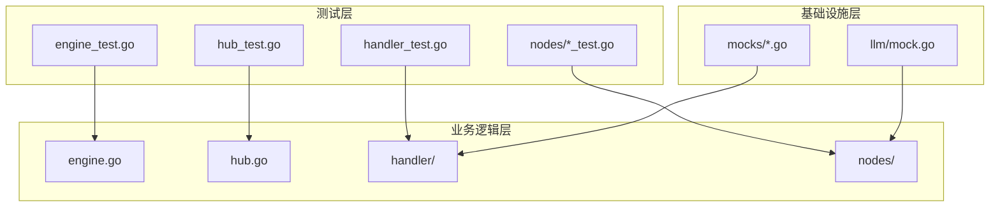
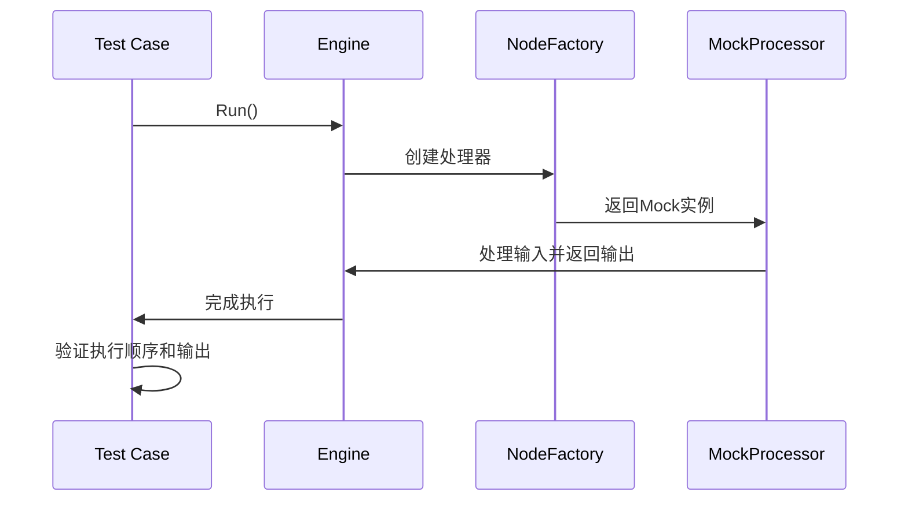
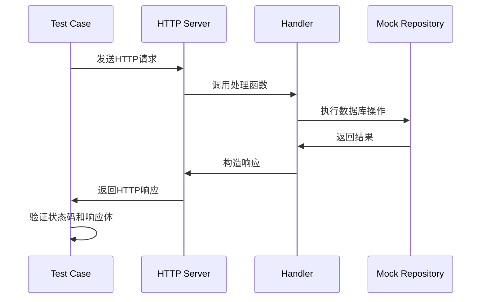
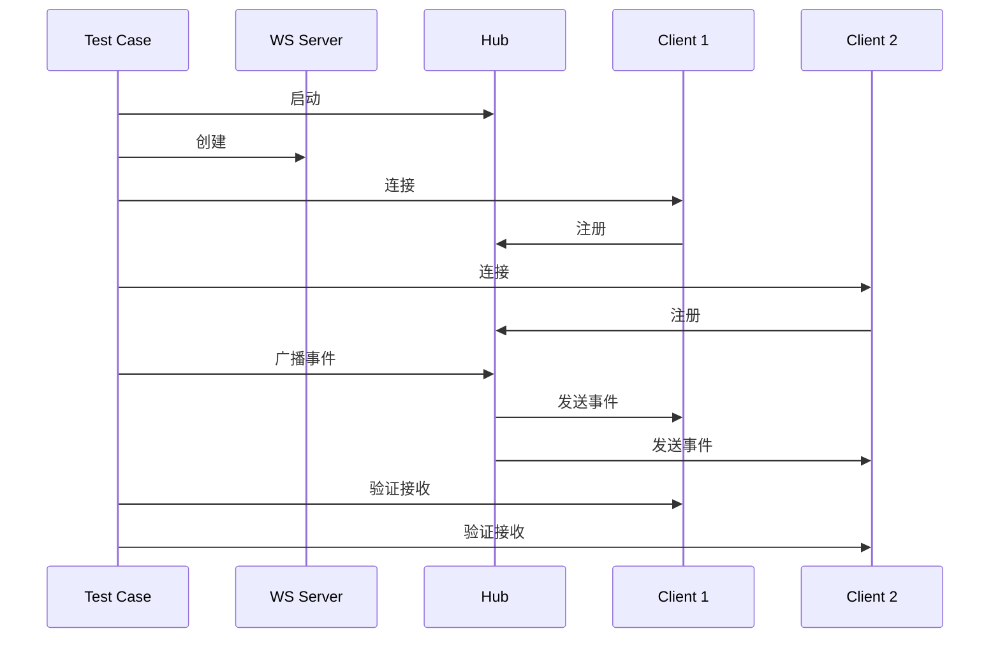
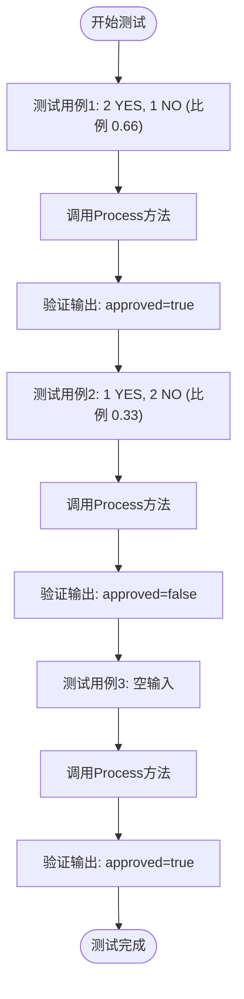
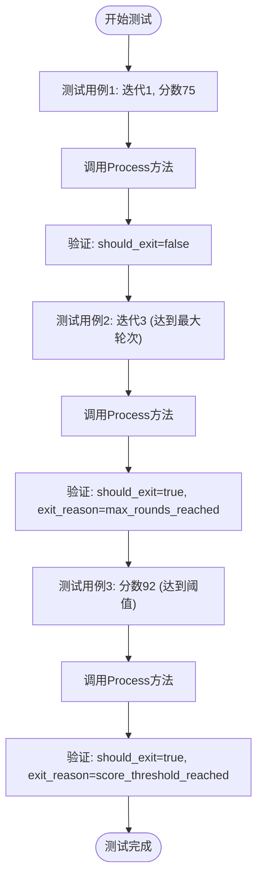
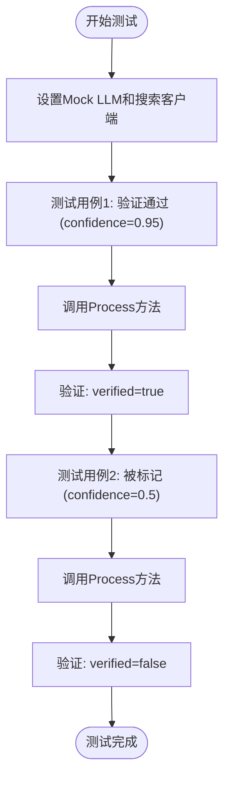
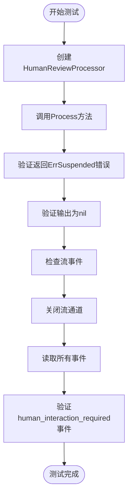
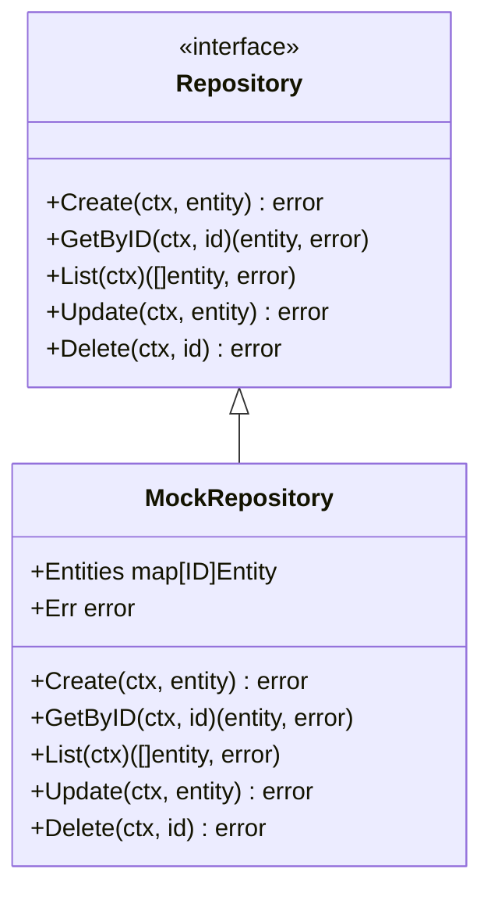
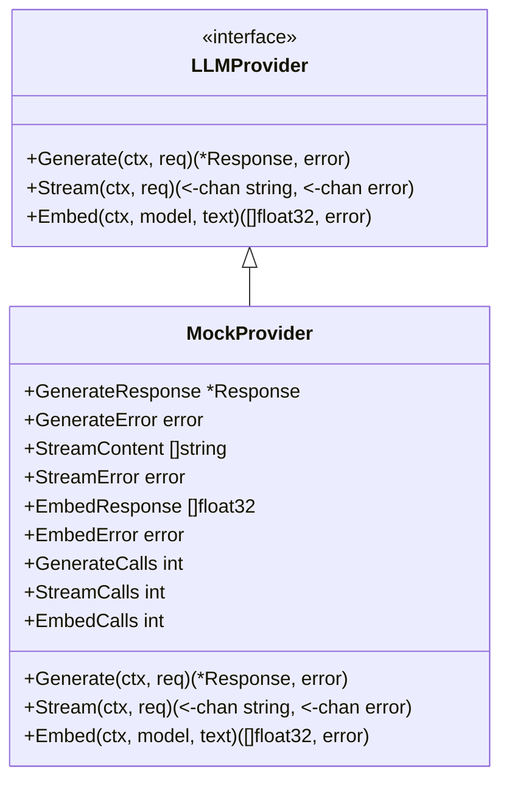

# 单元测试

<cite>
**本文档引用的文件**  
- [engine_test.go](file://internal/core/workflow/engine_test.go)
- [hub_test.go](file://internal/api/ws/hub_test.go)
- [agent_test.go](file://internal/api/handler/agent_test.go)
- [group_test.go](file://internal/api/handler/group_test.go)
- [vote_test.go](file://internal/core/workflow/nodes/vote_test.go)
- [loop_test.go](file://internal/core/workflow/nodes/loop_test.go)
- [fact_check_test.go](file://internal/core/workflow/nodes/fact_check_test.go)
- [human_review_test.go](file://internal/core/workflow/nodes/human_review_test.go)
- [start_test.go](file://internal/core/workflow/nodes/start_test.go)
- [end_test.go](file://internal/core/workflow/nodes/end_test.go)
- [mock.go](file://internal/infrastructure/llm/mock.go)
- [agent_mock.go](file://internal/infrastructure/mocks/agent_mock.go)
</cite>

## 目录
1. [项目结构](#项目结构)
2. [核心测试组件](#核心测试组件)
3. [工作流引擎测试](#工作流引擎测试)
4. [API处理器测试](#api处理器测试)
5. [WebSocket中心测试](#websocket中心测试)
6. [工作流节点处理器测试](#工作流节点处理器测试)
7. [测试工具与模拟](#测试工具与模拟)
8. [最佳实践](#最佳实践)

## 项目结构

本项目采用分层架构，单元测试主要集中在`internal`目录下的核心业务逻辑。测试文件遵循Go语言惯例，与被测试文件同名并以`_test.go`结尾。

**图示来源**
- [engine_test.go](file://internal/core/workflow/engine_test.go)
- [hub_test.go](file://internal/api/ws/hub_test.go)
- [agent_test.go](file://internal/api/handler/agent_test.go)
- [mock.go](file://internal/infrastructure/llm/mock.go)
- [agent_mock.go](file://internal/infrastructure/mocks/agent_mock.go)

## 核心测试组件

项目单元测试覆盖了三大核心组件：工作流引擎、API处理器和WebSocket中心。这些组件的测试设计体现了高覆盖率和良好的隔离性。

**本节来源**
- [engine_test.go](file://internal/core/workflow/engine_test.go)
- [hub_test.go](file://internal/api/ws/hub_test.go)
- [agent_test.go](file://internal/api/handler/agent_test.go)

## 工作流引擎测试

工作流引擎的测试主要验证了线性执行、并行执行和节点恢复功能。测试通过创建`MockProcessor`来模拟节点行为，并验证执行顺序和状态。

**图示来源**
- [engine_test.go](file://internal/core/workflow/engine_test.go#L23-L154)

**本节来源**
- [engine_test.go](file://internal/core/workflow/engine_test.go)

## API处理器测试

API处理器测试使用Gin框架的测试模式，通过`httptest`创建HTTP服务器来测试API端点。测试覆盖了CRUD操作的各种场景，包括成功、验证错误和存储错误。

**图示来源**
- [agent_test.go](file://internal/api/handler/agent_test.go#L17-L265)

**本节来源**
- [agent_test.go](file://internal/api/handler/agent_test.go)
- [group_test.go](file://internal/api/handler/group_test.go)

## WebSocket中心测试

WebSocket中心测试验证了广播功能和客户端断开连接的处理。测试使用`gorilla/websocket`客户端连接到测试服务器，并验证消息是否正确广播。

**图示来源**
- [hub_test.go](file://internal/api/ws/hub_test.go#L14-L112)

**本节来源**
- [hub_test.go](file://internal/api/ws/hub_test.go)

## 工作流节点处理器测试

工作流节点处理器的测试针对不同类型的节点实现了具体的测试用例，确保每个核心节点都有相应的测试覆盖。

### 投票节点测试

投票节点测试验证了基于阈值的决策逻辑，测试了通过、拒绝和边界情况。

**图示来源**
- [vote_test.go](file://internal/core/workflow/nodes/vote_test.go#L10-L45)

### 循环节点测试

循环节点测试验证了基于轮次和分数阈值的退出条件。

**图示来源**
- [loop_test.go](file://internal/core/workflow/nodes/loop_test.go#L10-L44)

### 事实核查节点测试

事实核查节点测试使用模拟的LLM和搜索客户端来验证事实核查逻辑。

**图示来源**
- [fact_check_test.go](file://internal/core/workflow/nodes/fact_check_test.go#L13-L61)

### 人工审核节点测试

人工审核节点测试验证了暂停机制和流事件的正确性。

**图示来源**
- [human_review_test.go](file://internal/core/workflow/nodes/human_review_test.go#L10-L42)

**本节来源**
- [vote_test.go](file://internal/core/workflow/nodes/vote_test.go)
- [loop_test.go](file://internal/core/workflow/nodes/loop_test.go)
- [fact_check_test.go](file://internal/core/workflow/nodes/fact_check_test.go)
- [human_review_test.go](file://internal/core/workflow/nodes/human_review_test.go)
- [start_test.go](file://internal/core/workflow/nodes/start_test.go)
- [end_test.go](file://internal/core/workflow/nodes/end_test.go)

## 测试工具与模拟

项目使用了多种模拟技术来隔离测试，包括模拟仓库、模拟LLM提供者和模拟搜索客户端。

### 模拟仓库

模拟仓库实现了核心业务实体的存储接口，允许在不依赖真实数据库的情况下测试业务逻辑。

**图示来源**
- [agent_mock.go](file://internal/infrastructure/mocks/agent_mock.go#L10-L72)

### 模拟LLM

模拟LLM提供者允许测试LLM集成而无需实际调用外部API，支持配置响应内容和错误。

**图示来源**
- [mock.go](file://internal/infrastructure/llm/mock.go#L8-L79)

**本节来源**
- [mock.go](file://internal/infrastructure/llm/mock.go)
- [agent_mock.go](file://internal/infrastructure/mocks/agent_mock.go)

## 最佳实践

项目单元测试实践体现了以下最佳实践：

### 测试隔离

每个测试用例都独立设置所需的模拟依赖，确保测试之间的隔离性。测试不依赖外部服务或共享状态。

### 边界条件覆盖

测试用例覆盖了各种边界条件，包括：
- 空输入和无效输入
- 错误处理路径
- 边界值和极端情况
- 并发和竞争条件

### 性能测试

虽然当前代码库中没有显式的性能测试，但Makefile中包含了性能分析的目标，表明项目对性能的关注。

### 断言使用

项目主要使用Go标准库的`testing`包进行断言，通过`t.Errorf`和`t.Fatalf`报告测试失败，确保测试结果的清晰性。

### 测试组织

测试文件组织良好，每个被测试的包都有对应的测试文件，测试函数命名清晰，使用`Test<Struct>_<Method>`的命名约定。

**本节来源**
- [engine_test.go](file://internal/core/workflow/engine_test.go)
- [hub_test.go](file://internal/api/ws/hub_test.go)
- [agent_test.go](file://internal/api/handler/agent_test.go)
- [vote_test.go](file://internal/core/workflow/nodes/vote_test.go)
- [mock.go](file://internal/infrastructure/llm/mock.go)
- [agent_mock.go](file://internal/infrastructure/mocks/agent_mock.go)