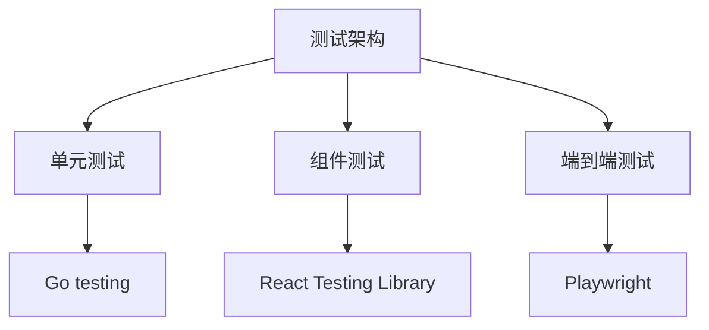
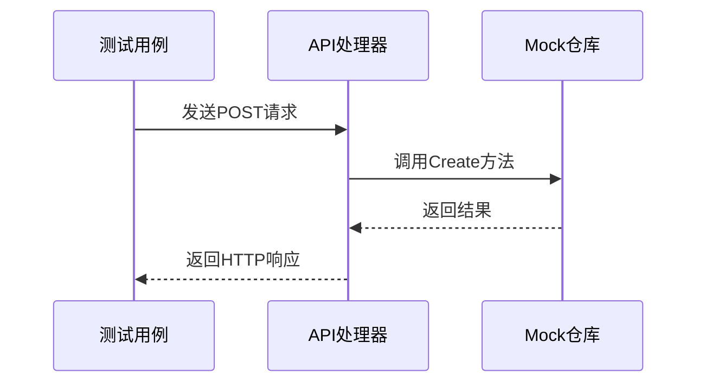
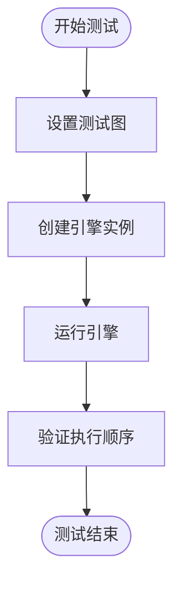
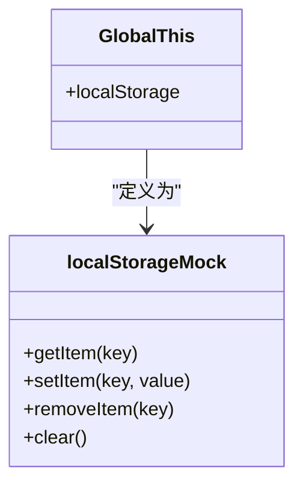
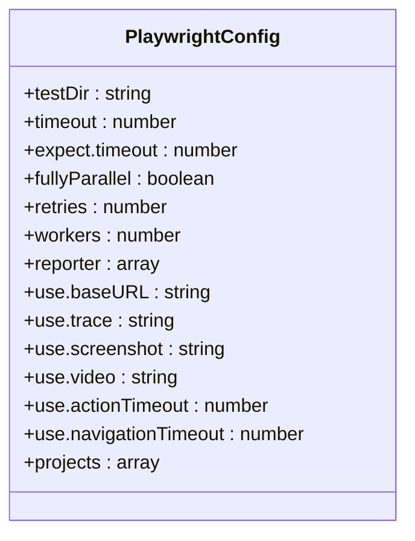
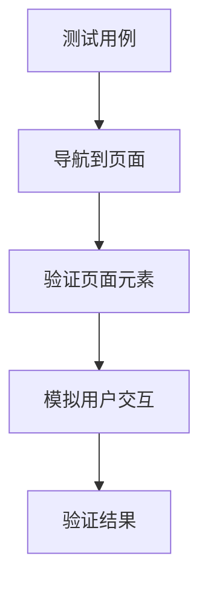
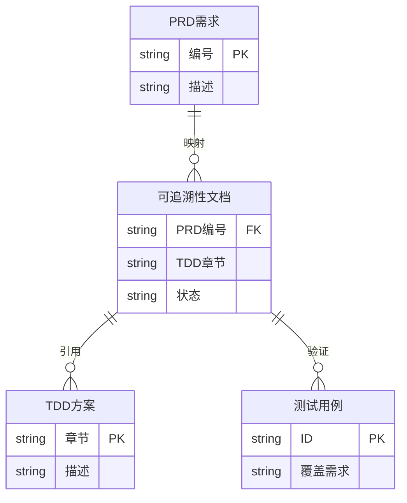
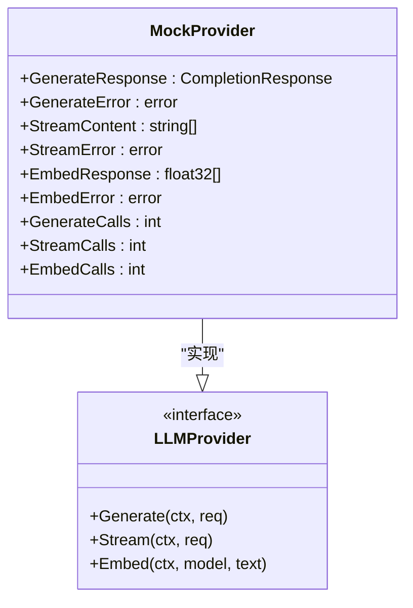
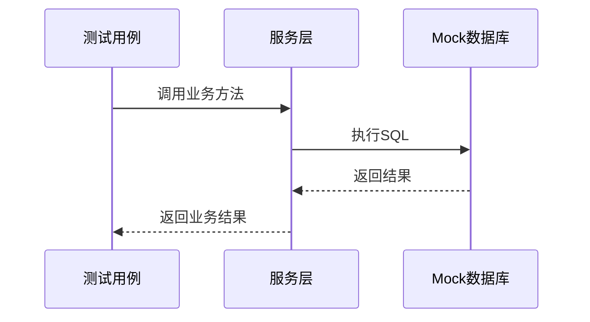
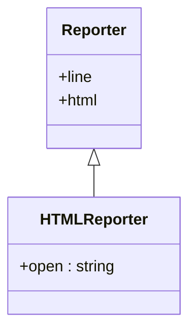

# 测试策略

<cite>
**本文档中引用的文件**  
- [agent_test.go](file://internal/api/handler/agent_test.go)
- [group_test.go](file://internal/api/handler/group_test.go)
- [engine_test.go](file://internal/core/workflow/engine_test.go)
- [hub_test.go](file://internal/api/ws/hub_test.go)
- [postgres_test.go](file://internal/infrastructure/db/postgres_test.go)
- [redis_test.go](file://internal/infrastructure/cache/redis_test.go)
- [service_test.go](file://internal/core/memory/service_test.go)
- [migrator_test.go](file://internal/infrastructure/db/migrator_test.go)
- [config_test.go](file://internal/pkg/config/config_test.go)
- [mock.go](file://internal/infrastructure/llm/mock.go)
- [agent_mock.go](file://internal/infrastructure/mocks/agent_mock.go)
- [test-setup.ts](file://frontend/src/test-setup.ts)
- [00_traceability.md](file://docs/tdd/00_traceability.md)
- [playwright.config.ts](file://e2e/playwright.config.ts)
- [package.json](file://e2e/package.json)
- [meeting-room.spec.ts](file://e2e/tests/meeting-room.spec.ts)
- [navigation.spec.ts](file://e2e/tests/navigation.spec.ts)
</cite>

## 目录
1. [引言](#引言)
2. [测试架构概览](#测试架构概览)
3. [单元测试实践](#单元测试实践)
4. [组件测试实践](#组件测试实践)
5. [端到端测试实践](#端到端测试实践)
6. [TDD与需求可追溯性](#tdd与需求可追溯性)
7. [模拟最佳实践](#模拟最佳实践)
8. [测试报告与执行](#测试报告与执行)
9. [结论](#结论)

## 引言
本项目采用分层测试策略，涵盖单元测试、组件测试和端到端测试，确保从底层逻辑到用户界面的全面质量保障。测试体系遵循TDD（测试驱动开发）原则，通过可追溯性文档确保每个功能需求都有对应的测试覆盖。后端使用Go的内置testing框架，前端使用React Testing Library，端到端测试使用Playwright，形成完整的测试闭环。

## 测试架构概览
项目测试架构分为三层：后端单元测试验证核心业务逻辑，前端组件测试确保UI组件的正确性，端到端测试模拟真实用户场景。所有测试均通过CI/CD流程自动化执行，确保代码质量的持续集成。



**Diagram sources**
- [agent_test.go](file://internal/api/handler/agent_test.go)
- [test-setup.ts](file://frontend/src/test-setup.ts)
- [playwright.config.ts](file://e2e/playwright.config.ts)

## 单元测试实践
后端单元测试使用Go的内置testing包，针对API处理器、核心工作流引擎、WebSocket中心等关键组件进行测试。测试用例覆盖正常流程、错误处理和边界条件。通过mock仓库和依赖注入，实现对数据库、缓存和LLM服务的隔离测试。

**Section sources**
- [agent_test.go](file://internal/api/handler/agent_test.go)
- [group_test.go](file://internal/api/handler/group_test.go)
- [engine_test.go](file://internal/core/workflow/engine_test.go)
- [hub_test.go](file://internal/api/ws/hub_test.go)

### API处理器测试
API处理器测试验证HTTP请求的正确处理，包括状态码、响应体和错误处理。例如，AgentHandler的Create方法测试成功创建、无效JSON和存储错误等场景。



**Diagram sources**
- [agent_test.go](file://internal/api/handler/agent_test.go)

### 核心引擎测试
工作流引擎测试验证节点执行顺序、并行处理和状态管理。通过MockProcessor模拟节点行为，验证引擎的调度逻辑。



**Diagram sources**
- [engine_test.go](file://internal/core/workflow/engine_test.go)

## 组件测试实践
前端组件测试使用React Testing Library，结合Vitest运行。测试用例验证组件渲染、用户交互和状态管理。通过mock localStorage和API调用，确保测试的独立性和可重复性。

**Section sources**
- [test-setup.ts](file://frontend/src/test-setup.ts)

### 测试环境设置
在test-setup.ts中，mock了localStorage，确保状态管理测试的隔离性。



**Diagram sources**
- [test-setup.ts](file://frontend/src/test-setup.ts)

## 端到端测试实践
端到端测试使用Playwright，模拟真实用户在浏览器中的操作。测试覆盖应用启动、页面导航、核心功能交互等场景。测试配置强调快速失败、严格断言和可观测性。

**Section sources**
- [playwright.config.ts](file://e2e/playwright.config.ts)
- [meeting-room.spec.ts](file://e2e/tests/meeting-room.spec.ts)
- [navigation.spec.ts](file://e2e/tests/navigation.spec.ts)

### Playwright配置
playwright.config.ts定义了测试目录、超时配置、执行模式和报告生成。配置平衡了速度与稳定性，确保测试的可靠执行。



**Diagram sources**
- [playwright.config.ts](file://e2e/playwright.config.ts)

### 测试用例结构
端到端测试用例按功能模块组织，每个spec文件测试一个核心功能。例如，meeting-room.spec.ts测试会议室页面的渲染和基本交互。



**Diagram sources**
- [meeting-room.spec.ts](file://e2e/tests/meeting-room.spec.ts)

## TDD与需求可追溯性
项目采用TDD开发流程，通过00_traceability.md文档建立PRD需求与技术方案的映射关系。该文档确保每个功能需求都有对应的测试覆盖，实现需求的可追溯性。

**Section sources**
- [00_traceability.md](file://docs/tdd/00_traceability.md)

### 可追溯性矩阵
00_traceability.md使用表格形式列出PRD编号、需求描述、TDD章节和实现状态，确保需求覆盖的透明性和可追踪性。



**Diagram sources**
- [00_traceability.md](file://docs/tdd/00_traceability.md)

## 模拟最佳实践
项目使用多种模拟技术隔离外部依赖，确保测试的稳定性和速度。

**Section sources**
- [mock.go](file://internal/infrastructure/llm/mock.go)
- [agent_mock.go](file://internal/infrastructure/mocks/agent_mock.go)

### LLM响应模拟
通过MockProvider模拟LLM服务的响应，可以预设生成内容、流式输出和嵌入向量，用于测试不同场景下的应用行为。



**Diagram sources**
- [mock.go](file://internal/infrastructure/llm/mock.go)

### 数据库和缓存模拟
使用pgxmock和redis mock测试数据库和缓存操作，通过期望设置验证SQL执行和缓存调用。



**Diagram sources**
- [postgres_test.go](file://internal/infrastructure/db/postgres_test.go)
- [redis_test.go](file://internal/infrastructure/cache/redis_test.go)

## 测试报告与执行
测试通过npm scripts统一管理，支持全量或单个测试用例的执行。

**Section sources**
- [package.json](file://e2e/package.json)

### 执行命令
```bash
# 运行全量E2E测试
npx playwright test

# 运行单个测试文件
npx playwright test meeting-room.spec.ts

# 查看HTML测试报告
npx playwright show-report
```

### 报告配置
Playwright生成HTML报告，包含测试结果、截图和追踪信息，便于问题定位和分析。



**Diagram sources**
- [playwright.config.ts](file://e2e/playwright.config.ts)

## 结论
本项目的测试策略全面覆盖了从单元到端到端的各个层面，通过TDD流程和可追溯性文档确保了需求的完整覆盖。模拟技术的应用保证了测试的独立性和可靠性。统一的测试执行和报告系统为持续集成提供了有力支持，确保了软件质量的持续提升。