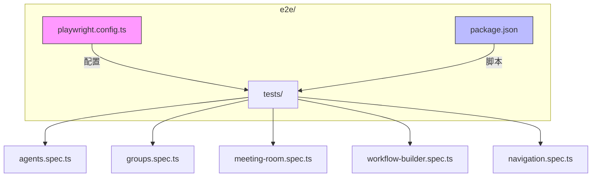
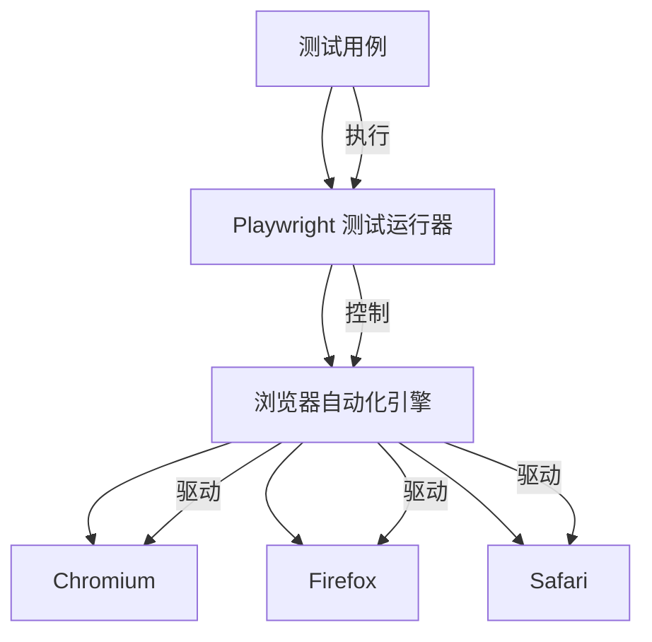
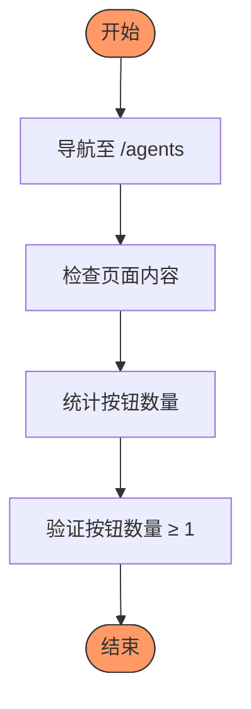
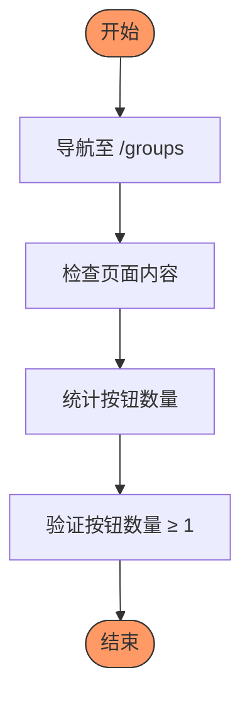
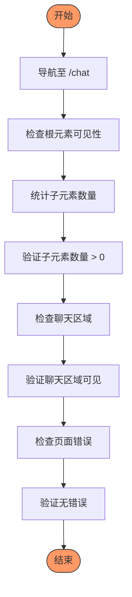
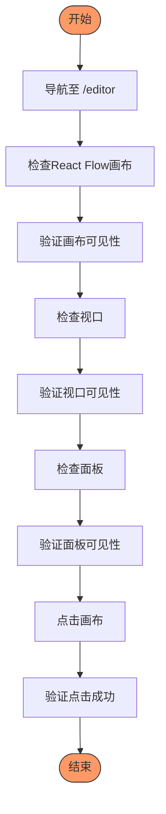
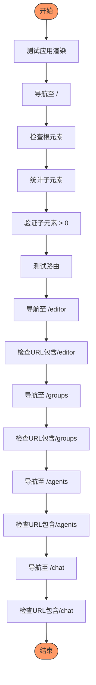
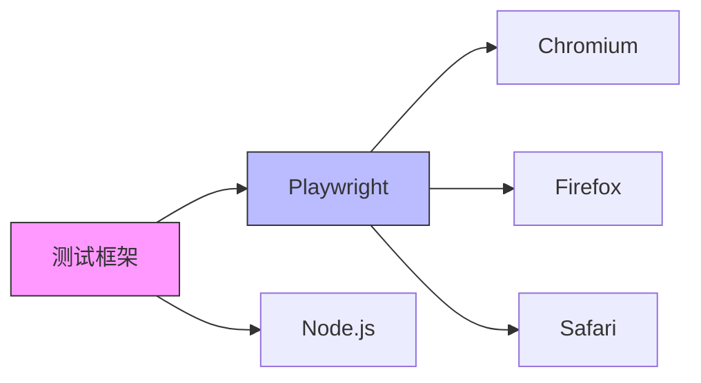

# 端到端测试

<cite>
**本文档引用文件**  
- [playwright.config.ts](file://e2e/playwright.config.ts)
- [meeting-room.spec.ts](file://e2e/tests/meeting-room.spec.ts)
- [agents.spec.ts](file://e2e/tests/agents.spec.ts)
- [groups.spec.ts](file://e2e/tests/groups.spec.ts)
- [workflow-builder.spec.ts](file://e2e/tests/workflow-builder.spec.ts)
- [navigation.spec.ts](file://e2e/tests/navigation.spec.ts)
- [package.json](file://e2e/package.json)
- [00_traceability.md](file://docs/tdd/00_traceability.md)
- [SPEC-502-e2e-testing.md](file://docs/specs/sprint5/SPEC-502-e2e-testing.md)
- [session.ts](file://frontend/src/types/session.ts)
- [workflow.ts](file://frontend/src/types/workflow.ts)
- [useSessionStore.ts](file://frontend/src/stores/useSessionStore.ts)
- [useWorkflowRunStore.ts](file://frontend/src/stores/useWorkflowRunStore.ts)
</cite>

## 目录
1. [简介](#简介)
2. [项目结构](#项目结构)
3. [核心组件](#核心组件)
4. [架构概述](#架构概述)
5. [详细组件分析](#详细组件分析)
6. [依赖分析](#依赖分析)
7. [性能考虑](#性能考虑)
8. [故障排除指南](#故障排除指南)
9. [结论](#结论)

## 简介
本文档全面介绍基于Playwright的端到端测试框架，覆盖用户界面交互的全流程验证。详细说明如何编写和运行测试用例（npx playwright test），包括智能体管理、群组配置、工作流构建和会议执行等核心用户场景。解释Playwright配置文件（playwright.config.ts）的作用，以及如何生成和查看HTML测试报告。结合具体测试文件（如meeting-room.spec.ts），展示如何模拟用户点击、表单填写和实时消息流验证。强调TDD追溯矩阵（00_traceability.md）如何确保每个PRD功能需求都有对应的E2E测试覆盖，并指导如何维护测试的稳定性和可维护性。

## 项目结构
端到端测试框架位于`e2e/`目录下，采用模块化结构组织测试代码，确保可维护性和可扩展性。测试文件按功能模块划分，每个模块对应特定的用户场景。

**图示来源**
- [playwright.config.ts](file://e2e/playwright.config.ts#L1-L58)
- [package.json](file://e2e/package.json#L1-L14)

**本节来源**
- [playwright.config.ts](file://e2e/playwright.config.ts#L1-L58)
- [package.json](file://e2e/package.json#L1-L14)

## 核心组件
端到端测试框架的核心组件包括Playwright配置、测试用例文件和测试执行脚本。这些组件协同工作，确保测试的可靠性和可重复性。

**本节来源**
- [playwright.config.ts](file://e2e/playwright.config.ts#L1-L58)
- [package.json](file://e2e/package.json#L1-L14)

## 架构概述
该测试框架采用分层架构，上层为测试用例，中层为Playwright测试运行器，底层为浏览器自动化引擎。这种架构确保了测试的稳定性和可维护性。

**图示来源**
- [playwright.config.ts](file://e2e/playwright.config.ts#L51-L57)
- [package.json](file://e2e/package.json#L6-L9)

## 详细组件分析
### 智能体管理测试分析
智能体管理测试验证智能体页面的渲染和交互功能，确保用户能够成功创建、编辑和删除智能体。

**图示来源**
- [agents.spec.ts](file://e2e/tests/agents.spec.ts#L9-L27)

**本节来源**
- [agents.spec.ts](file://e2e/tests/agents.spec.ts#L1-L28)

### 群组管理测试分析
群组管理测试验证群组页面的渲染和交互功能，确保用户能够成功创建、编辑和删除群组。

**图示来源**
- [groups.spec.ts](file://e2e/tests/groups.spec.ts#L9-L27)

**本节来源**
- [groups.spec.ts](file://e2e/tests/groups.spec.ts#L1-L28)

### 会议房间测试分析
会议房间测试验证会议页面的核心交互组件，包括面板布局、聊天区域和页面加载错误。

**图示来源**
- [meeting-room.spec.ts](file://e2e/tests/meeting-room.spec.ts#L10-L66)

**本节来源**
- [meeting-room.spec.ts](file://e2e/tests/meeting-room.spec.ts#L1-L67)

### 工作流构建器测试分析
工作流构建器测试验证React Flow画布的渲染和交互功能，确保用户能够成功创建和编辑工作流。

**图示来源**
- [workflow-builder.spec.ts](file://e2e/tests/workflow-builder.spec.ts#L9-L44)

**本节来源**
- [workflow-builder.spec.ts](file://e2e/tests/workflow-builder.spec.ts#L1-L45)

### 导航测试分析
导航测试验证应用的路由功能，确保用户能够成功导航到各个主要页面。

**图示来源**
- [navigation.spec.ts](file://e2e/tests/navigation.spec.ts#L9-L65)

**本节来源**
- [navigation.spec.ts](file://e2e/tests/navigation.spec.ts#L1-L66)

## 依赖分析
测试框架依赖于Playwright测试运行器和Node.js环境。这些依赖关系在package.json文件中明确定义。

**图示来源**
- [package.json](file://e2e/package.json#L1-L14)

**本节来源**
- [package.json](file://e2e/package.json#L1-L14)

## 性能考虑
测试框架在设计时考虑了性能因素，包括超时配置、并行执行和资源优化。这些配置确保测试快速而稳定地运行。

**本节来源**
- [playwright.config.ts](file://e2e/playwright.config.ts#L15-L24)

## 故障排除指南
当测试失败时，可以使用以下步骤进行故障排除：
1. 检查HTML测试报告以获取详细信息
2. 查看失败测试的截图和视频
3. 使用Playwright Trace Viewer分析测试执行过程
4. 检查控制台输出和错误日志

**本节来源**
- [playwright.config.ts](file://e2e/playwright.config.ts#L37-L39)

## 结论
基于Playwright的端到端测试框架为The Council应用提供了全面的用户界面验证。通过覆盖智能体管理、群组配置、工作流构建和会议执行等核心场景，该框架确保了系统的稳定性和可靠性。TDD追溯矩阵（00_traceability.md）确保每个PRD功能需求都有对应的E2E测试覆盖，从而提高了测试的完整性和可维护性。