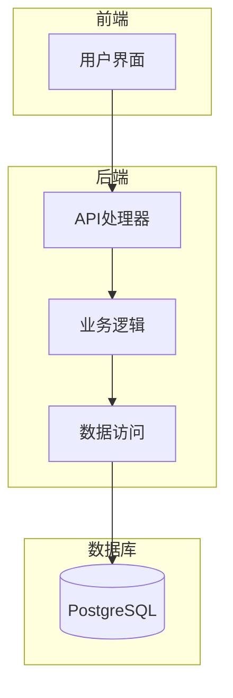
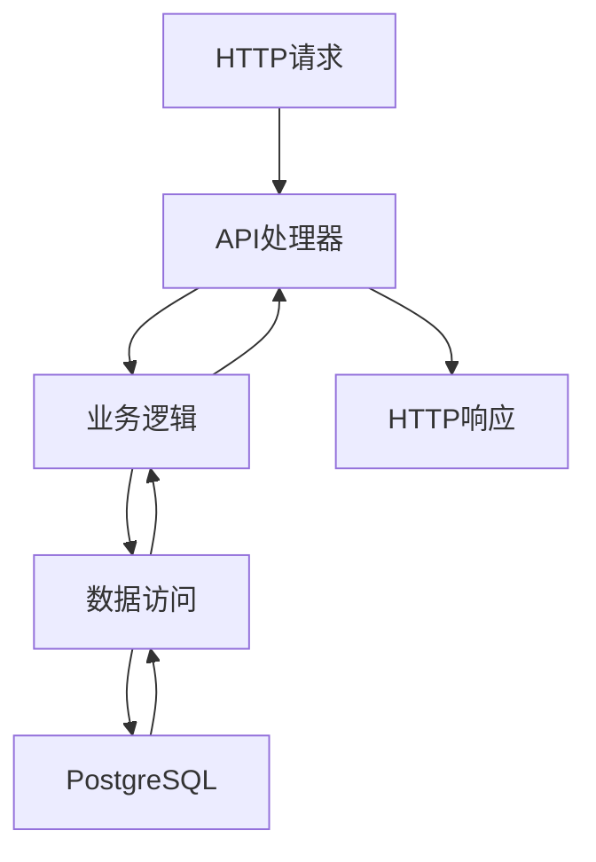
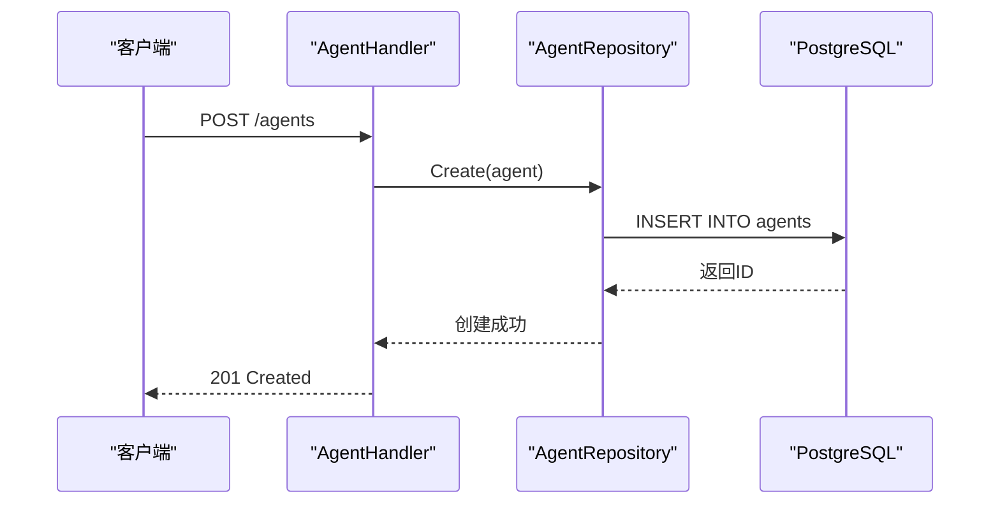
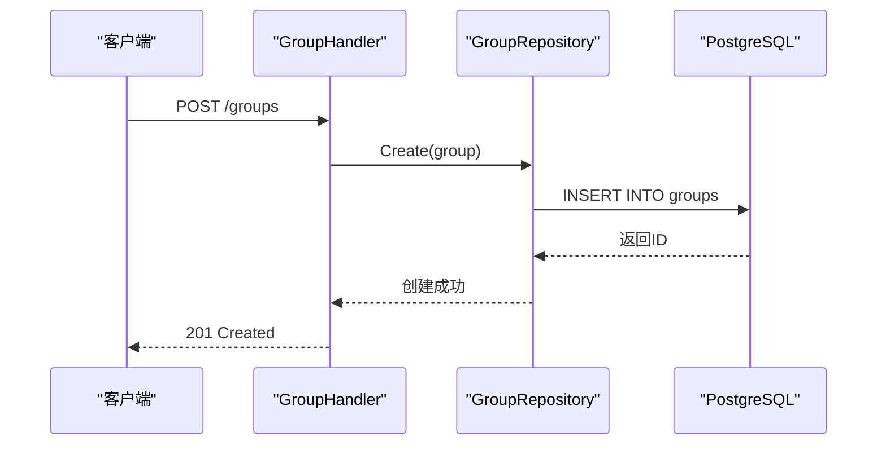
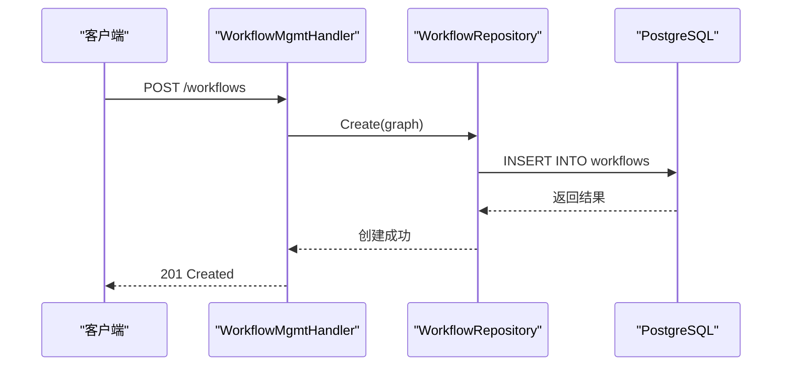
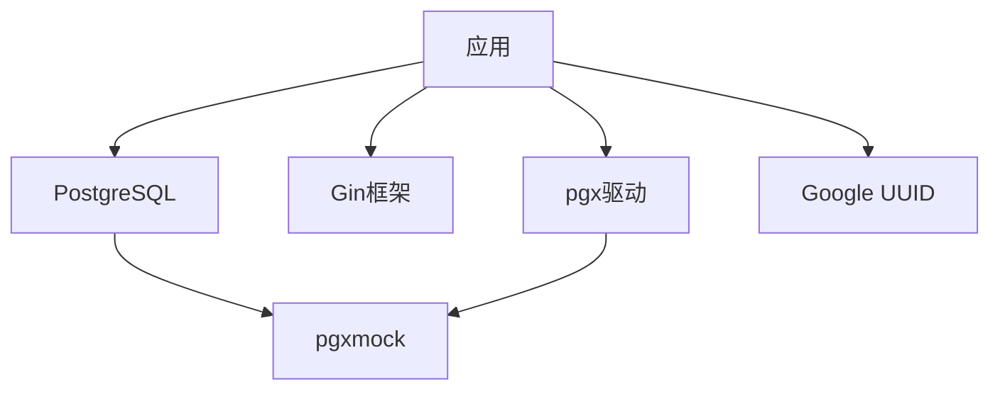

# 集成测试

<cite>
**本文档中引用的文件**  
- [agent_test.go](file://internal/api/handler/agent_test.go)
- [group_test.go](file://internal/api/handler/group_test.go)
- [workflow_mgmt_test.go](file://internal/api/handler/workflow_mgmt_test.go)
- [template_test.go](file://internal/api/handler/template_test.go)
- [memory_test.go](file://internal/api/handler/memory_test.go)
- [agent_repository_test.go](file://internal/infrastructure/persistence/agent_repository_test.go)
- [group_repository_test.go](file://internal/infrastructure/persistence/group_repository_test.go)
- [workflow_repository_test.go](file://internal/infrastructure/persistence/workflow_repository_test.go)
- [template_repository_test.go](file://internal/infrastructure/persistence/template_repository_test.go)
- [postgres_test.go](file://internal/infrastructure/db/postgres_test.go)
- [migrator_test.go](file://internal/infrastructure/db/migrator_test.go)
- [agent.go](file://internal/core/agent/entity.go)
- [group.go](file://internal/core/group/entity.go)
- [workflow.go](file://internal/core/workflow/types.go)
</cite>

## 目录
1. [引言](#引言)
2. [项目结构](#项目结构)
3. [核心组件](#核心组件)
4. [架构概述](#架构概述)
5. [详细组件分析](#详细组件分析)
6. [依赖分析](#依赖分析)
7. [性能考虑](#性能考虑)
8. [故障排除指南](#故障排除指南)
9. [结论](#结论)

## 引言
本文档深入阐述了项目的集成测试策略，重点描述了API端点与底层数据存储的协同测试。通过HTTP请求测试REST API（如创建智能体、群组、工作流）并验证数据库状态变更。解释了如何使用真实的PostgreSQL数据库实例或内存数据库进行端到端的数据流测试，确保API层、业务逻辑层和数据访问层的正确集成。提供了测试事务一致性、外键约束和复杂查询逻辑的实践指导。结合具体代码路径，展示了如何测试工作流管理接口与持久化层的交互，并验证数据完整性。

## 项目结构
该项目采用分层架构设计，主要分为前端、后端和基础设施层。后端服务使用Go语言编写，基于Gin框架提供RESTful API接口。数据持久化层使用PostgreSQL数据库，并通过pgx驱动进行连接。测试代码位于`internal/api/handler`和`internal/infrastructure/persistence`目录下，分别对应API处理器和数据访问层的单元测试与集成测试。

**图示来源**  
- [agent_test.go](file://internal/api/handler/agent_test.go#L1-L266)
- [agent_repository_test.go](file://internal/infrastructure/persistence/agent_repository_test.go#L1-L135)

**本节来源**  
- [agent_test.go](file://internal/api/handler/agent_test.go#L1-L266)
- [group_test.go](file://internal/api/handler/group_test.go#L1-L266)
- [workflow_mgmt_test.go](file://internal/api/handler/workflow_mgmt_test.go#L1-L177)

## 核心组件
系统的核心组件包括智能体管理、群组管理、工作流管理和模板管理。每个组件都有对应的API处理器和数据访问仓库。API处理器负责处理HTTP请求，调用业务逻辑，而数据访问仓库负责与数据库交互。测试策略确保这些组件之间的协同工作正确无误。

**本节来源**  
- [agent.go](file://internal/core/agent/entity.go#L1-L50)
- [group.go](file://internal/core/group/entity.go#L1-L50)
- [workflow.go](file://internal/core/workflow/types.go#L1-L100)

## 架构概述
系统采用典型的三层架构：表示层（API处理器）、业务逻辑层和数据访问层。API处理器接收HTTP请求，解析参数，调用相应的业务逻辑。业务逻辑层处理核心业务规则，调用数据访问层进行数据持久化。数据访问层使用PostgreSQL数据库存储数据，并通过事务保证数据一致性。

**图示来源**  
- [workflow_mgmt.go](file://internal/api/handler/workflow_mgmt.go#L1-L219)
- [workflow_repository.go](file://internal/infrastructure/persistence/workflow_repository.go#L1-L113)

## 详细组件分析
### 智能体管理组件分析
智能体管理组件负责智能体的创建、读取、更新和删除操作。API处理器`AgentHandler`处理HTTP请求，调用`AgentRepository`进行数据持久化。测试用例验证了创建智能体时，数据库中是否正确插入了记录。

**图示来源**  
- [agent_test.go](file://internal/api/handler/agent_test.go#L17-L72)
- [agent_repository_test.go](file://internal/infrastructure/persistence/agent_repository_test.go#L47-L71)

**本节来源**  
- [agent_test.go](file://internal/api/handler/agent_test.go#L1-L266)
- [agent_repository_test.go](file://internal/infrastructure/persistence/agent_repository_test.go#L1-L135)

### 群组管理组件分析
群组管理组件处理群组的CRUD操作。测试用例验证了创建群组时，数据库中是否正确插入了记录，并且返回的群组ID是否正确。

**图示来源**  
- [group_test.go](file://internal/api/handler/group_test.go#L17-L72)
- [group_repository_test.go](file://internal/infrastructure/persistence/group_repository_test.go#L43-L69)

**本节来源**  
- [group_test.go](file://internal/api/handler/group_test.go#L1-L266)
- [group_repository_test.go](file://internal/infrastructure/persistence/group_repository_test.go#L1-L138)

### 工作流管理组件分析
工作流管理组件负责工作流的创建、读取、更新和删除操作。测试用例验证了创建工作流时，数据库中是否正确插入了记录，并且工作流定义是否正确序列化存储。

**图示来源**  
- [workflow_mgmt_test.go](file://internal/api/handler/workflow_mgmt_test.go#L74-L91)
- [workflow_repository_test.go](file://internal/infrastructure/persistence/workflow_repository_test.go#L43-L66)

**本节来源**  
- [workflow_mgmt_test.go](file://internal/api/handler/workflow_mgmt_test.go#L1-L177)
- [workflow_repository_test.go](file://internal/infrastructure/persistence/workflow_repository_test.go#L1-L110)

## 依赖分析
系统依赖于PostgreSQL数据库进行数据持久化，使用pgx驱动进行连接。测试中使用pgxmock库模拟数据库连接，以便在不依赖真实数据库的情况下进行集成测试。此外，系统还依赖于Gin框架处理HTTP请求，以及Google UUID库生成唯一标识符。

**图示来源**  
- [postgres_test.go](file://internal/infrastructure/db/postgres_test.go#L1-L28)
- [migrator_test.go](file://internal/infrastructure/db/migrator_test.go#L1-L83)

**本节来源**  
- [postgres_test.go](file://internal/infrastructure/db/postgres_test.go#L1-L28)
- [migrator_test.go](file://internal/infrastructure/db/migrator_test.go#L1-L83)

## 性能考虑
在集成测试中，使用内存数据库或数据库连接池可以显著提高测试执行速度。通过并行执行测试用例，可以进一步缩短测试时间。此外，合理设计数据库索引可以提高查询性能，特别是在处理大量数据时。

## 故障排除指南
当集成测试失败时，首先检查数据库连接是否正常。其次，验证SQL语句是否正确，特别是INSERT和UPDATE语句的参数绑定。最后，检查数据序列化和反序列化是否正确，确保JSON格式的数据能够正确转换为Go结构体。

**本节来源**  
- [agent_test.go](file://internal/api/handler/agent_test.go#L49-L61)
- [group_test.go](file://internal/api/handler/group_test.go#L49-L61)
- [workflow_mgmt_test.go](file://internal/api/handler/workflow_mgmt_test.go#L116-L149)

## 结论
本文档详细描述了项目的集成测试策略，重点阐述了API端点与底层数据存储的协同测试。通过使用真实的PostgreSQL数据库实例或内存数据库进行端到端的数据流测试，确保了API层、业务逻辑层和数据访问层的正确集成。测试策略涵盖了事务一致性、外键约束和复杂查询逻辑的验证，为系统的稳定性和可靠性提供了保障。