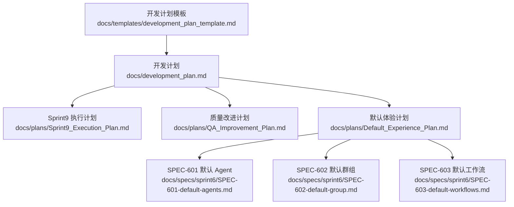
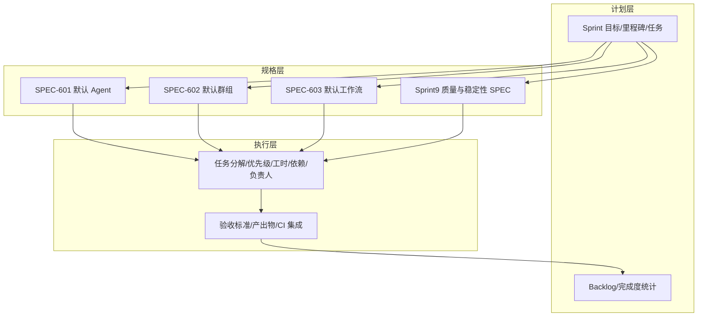
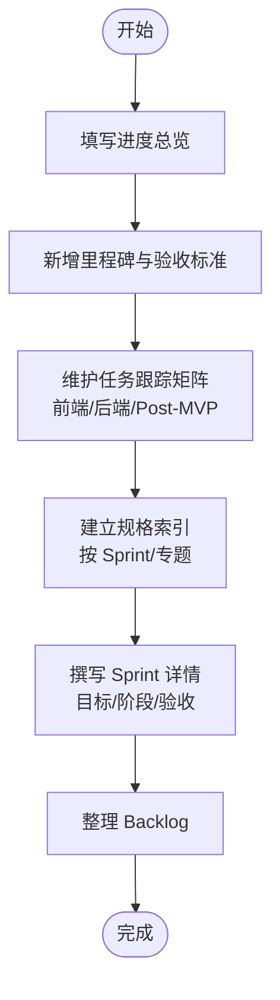
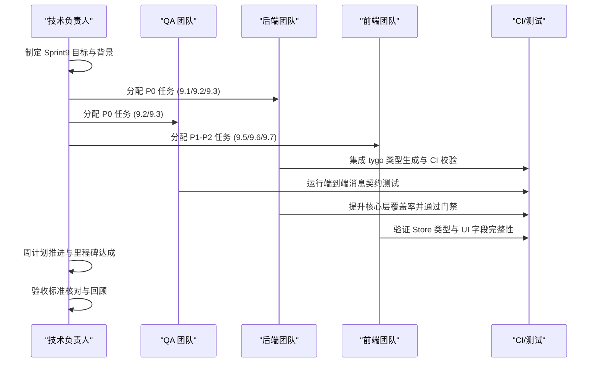
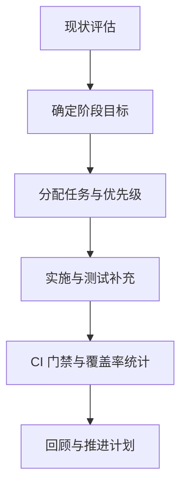
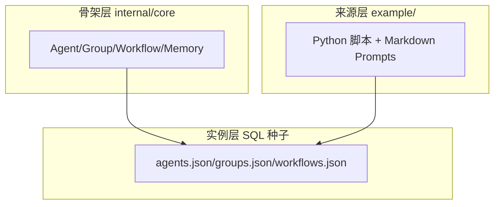
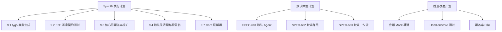

# 开发计划模板

<cite>
**本文引用的文件**
- [开发计划模板](file://docs/templates/development_plan_template.md)
- [开发计划](file://docs/development_plan.md)
- [Sprint9 执行计划](file://docs/plans/Sprint9_Execution_Plan.md)
- [质量改进计划](file://docs/plans/QA_Improvement_Plan.md)
- [默认体验计划](file://docs/plans/Default_Experience_Plan.md)
- [设计蓝图](file://docs/plans/design_draft.md)
- [概念流程图](file://docs/plans/prompt-of-concept.md)
- [SPEC-601 默认 Agent](file://docs/specs/sprint6/SPEC-601-default-agents.md)
- [SPEC-602 默认群组](file://docs/specs/sprint6/SPEC-602-default-group.md)
- [SPEC-603 默认工作流](file://docs/specs/sprint6/SPEC-603-default-workflows.md)
</cite>

## 目录
1. [简介](#简介)
2. [项目结构](#项目结构)
3. [核心组件](#核心组件)
4. [架构总览](#架构总览)
5. [详细组件分析](#详细组件分析)
6. [依赖分析](#依赖分析)
7. [性能考虑](#性能考虑)
8. [故障排查指南](#故障排查指南)
9. [结论](#结论)
10. [附录](#附录)

## 简介
本文件旨在提供一套可复用的“开发计划模板”，帮助团队在不同阶段（如冲刺、里程碑、质量与稳定性）高效制定与落地计划。模板覆盖进度总览、里程碑、任务跟踪矩阵、规格索引、Sprint 详情、Backlog、完成度统计与总结等维度，并结合仓库内的实际开发计划与规格文档，形成可操作、可追溯、可审计的计划体系。

## 项目结构
该仓库围绕“开发计划”与“规格文档”两条主线组织内容：
- 模板与计划：位于 docs/templates 与 docs/plans
- 规格文档：位于 docs/specs，按 Sprint 与后端专题划分
- 默认体验与架构：位于 docs/plans/Default_Experience_Plan.md 与相关 SPEC

图表来源
- [开发计划模板](file://docs/templates/development_plan_template.md#L1-L75)
- [开发计划](file://docs/development_plan.md#L1-L120)
- [Sprint9 执行计划](file://docs/plans/Sprint9_Execution_Plan.md#L1-L120)
- [质量改进计划](file://docs/plans/QA_Improvement_Plan.md#L1-L65)
- [默认体验计划](file://docs/plans/Default_Experience_Plan.md#L1-L60)
- [SPEC-601 默认 Agent](file://docs/specs/sprint6/SPEC-601-default-agents.md#L1-L40)
- [SPEC-602 默认群组](file://docs/specs/sprint6/SPEC-602-default-group.md#L1-L40)
- [SPEC-603 默认工作流](file://docs/specs/sprint6/SPEC-603-default-workflows.md#L1-L40)

章节来源
- [开发计划模板](file://docs/templates/development_plan_template.md#L1-L75)
- [开发计划](file://docs/development_plan.md#L1-L120)

## 核心组件
- 计划模板：提供统一的表格与结构化字段，便于快速填充进度、里程碑、任务与规格索引。
- 执行计划：以 Sprint 为单位，细化任务、优先级、工时、依赖与负责人，配套验收标准与产出物。
- 规格索引：将计划与具体技术规格（SPEC）关联，确保“做多少、看什么、如何验证”一致。
- Backlog 与完成度统计：沉淀待办与回顾，形成持续改进闭环。

章节来源
- [开发计划模板](file://docs/templates/development_plan_template.md#L1-L75)
- [开发计划](file://docs/development_plan.md#L1-L120)
- [Sprint9 执行计划](file://docs/plans/Sprint9_Execution_Plan.md#L40-L120)

## 架构总览
开发计划与规格文档之间的映射关系如下：
- 计划层：Sprint 目标、里程碑、任务、验收标准
- 规格层：SPEC 文档（后端处理器、前端组件、API、中间件等）
- 执行层：任务分解、依赖关系、产出物、CI/测试

图表来源
- [开发计划](file://docs/development_plan.md#L110-L210)
- [SPEC-601 默认 Agent](file://docs/specs/sprint6/SPEC-601-default-agents.md#L1-L60)
- [SPEC-602 默认群组](file://docs/specs/sprint6/SPEC-602-default-group.md#L1-L80)
- [SPEC-603 默认工作流](file://docs/specs/sprint6/SPEC-603-default-workflows.md#L1-L80)
- [Sprint9 执行计划](file://docs/plans/Sprint9_Execution_Plan.md#L60-L140)

## 详细组件分析

### 组件A：开发计划模板（结构化字段与表格）
- 进度总览：Sprint 阶段、状态、完成度
- 里程碑：时间、里程碑名称、验收标准、状态
- 任务跟踪矩阵：前端/后端/Post-MVP 任务，含 ID、任务、Spec、Sprint、优先级、状态
- 规格索引：按 Sprint 与后端专题索引
- Sprint 详情：目标、执行阶段、验收标准
- Backlog：待办任务、优先级、备注

图表来源
- [开发计划模板](file://docs/templates/development_plan_template.md#L1-L75)

章节来源
- [开发计划模板](file://docs/templates/development_plan_template.md#L1-L75)

### 组件B：Sprint9 执行计划（质量与稳定性）
- 目标与背景：技术债与质量防线建设
- 任务分解与优先级：P0/P1/P2，工时与依赖
- 详细任务规格：9.1 WebSocket 类型自动生成、9.2 端到端消息格式测试、9.3 核心层测试覆盖率提升、9.4 默认值清理与配置化、9.5 ID 命名规范、9.6 Store 类型 UI 字段完整性、9.7 Core 层解耦
- 执行计划：周计划与里程碑
- 验收标准：功能与质量双维度

图表来源
- [Sprint9 执行计划](file://docs/plans/Sprint9_Execution_Plan.md#L1-L120)
- [Sprint9 执行计划](file://docs/plans/Sprint9_Execution_Plan.md#L120-L260)
- [Sprint9 执行计划](file://docs/plans/Sprint9_Execution_Plan.md#L260-L520)
- [Sprint9 执行计划](file://docs/plans/Sprint9_Execution_Plan.md#L520-L800)

章节来源
- [Sprint9 执行计划](file://docs/plans/Sprint9_Execution_Plan.md#L1-L200)
- [Sprint9 执行计划](file://docs/plans/Sprint9_Execution_Plan.md#L200-L520)

### 组件C：质量改进计划（单元测试覆盖率提升）
- 现状：后端/前端覆盖率差距与薄弱环节
- 阶段目标：基建与核心、API 与交互
- 具体任务：后端 Mock 基建、Core 覆盖率、Handler 强化、前端 Store 与 Hook 覆盖

图表来源
- [质量改进计划](file://docs/plans/QA_Improvement_Plan.md#L1-L65)

章节来源
- [质量改进计划](file://docs/plans/QA_Improvement_Plan.md#L1-L65)

### 组件D：默认体验计划（The Council 架构与实例映射）
- 开闭原则：骨架对修改关闭，对扩展开放
- 架构分层：骨架层（internal/core）、实例层（SQL 种子）、来源层（example/）
- 实例映射：Agent/Group/Workflow 从数据种子注入，100% 覆盖 skill.md
- 验收与解耦验证：骨架无特定引用、删除 example 后系统仍可运行

图表来源
- [默认体验计划](file://docs/plans/Default_Experience_Plan.md#L1-L60)
- [默认体验计划](file://docs/plans/Default_Experience_Plan.md#L100-L160)
- [默认体验计划](file://docs/plans/Default_Experience_Plan.md#L160-L200)

章节来源
- [默认体验计划](file://docs/plans/Default_Experience_Plan.md#L1-L120)
- [SPEC-601 默认 Agent](file://docs/specs/sprint6/SPEC-601-default-agents.md#L1-L60)
- [SPEC-602 默认群组](file://docs/specs/sprint6/SPEC-602-default-group.md#L1-L80)
- [SPEC-603 默认工作流](file://docs/specs/sprint6/SPEC-603-default-workflows.md#L1-L80)

### 组件E：设计蓝图与概念流程（UI/UX 与方法论）
- 设计蓝图：模式分离架构、设计语言系统、防御机制
- 概念流程：人机共创五阶段（创意孵化、Dialecta 审查、技术设计、研发规划与审计、冲刺执行）

图表来源
- [设计蓝图](file://docs/plans/design_draft.md#L1-L140)
- [概念流程图](file://docs/plans/prompt-of-concept.md#L1-L65)

章节来源
- [设计蓝图](file://docs/plans/design_draft.md#L1-L140)
- [概念流程图](file://docs/plans/prompt-of-concept.md#L1-L65)

## 依赖分析
- 计划与规格的依赖：Sprint9 的 9.1/9.2/9.3/9.4/9.7 任务依赖 tygo 类型生成、E2E 契约测试、核心层覆盖率门禁与配置化
- 默认体验的依赖：SPEC-601/602/603 的执行顺序与依赖关系，确保骨架层与实例层解耦
- 质量改进的依赖：Mock 基建、Handler 与 Store 测试、覆盖率门禁

图表来源
- [Sprint9 执行计划](file://docs/plans/Sprint9_Execution_Plan.md#L40-L120)
- [默认体验计划](file://docs/plans/Default_Experience_Plan.md#L100-L160)
- [质量改进计划](file://docs/plans/QA_Improvement_Plan.md#L1-L65)

章节来源
- [Sprint9 执行计划](file://docs/plans/Sprint9_Execution_Plan.md#L40-L120)
- [默认体验计划](file://docs/plans/Default_Experience_Plan.md#L100-L160)
- [质量改进计划](file://docs/plans/QA_Improvement_Plan.md#L1-L65)

## 性能考虑
- 类型一致性与契约测试：通过 tygo 自动生成前后端类型，配合 E2E 契约测试，减少运行时类型错误带来的性能与稳定性风险
- 覆盖率门禁：核心层覆盖率不低于 80%，降低重构风险，提升系统稳定性
- 配置化默认值：统一默认值来源，便于在不同环境优化性能参数
- 解耦与可维护性：Core 层不依赖具体 Agent 实现，便于后续扩展与优化

## 故障排查指南
- 类型不一致：运行“生成类型”命令并执行“类型一致性验证”，确保前后端消息类型一致
- 测试失败：检查覆盖率门禁与 E2E 契约测试是否通过，必要时补充单元/集成测试
- 配置问题：核对环境变量与默认值注册表，确保无硬编码值残留
- 架构耦合：检查 Core 层是否仍依赖具体 Agent 实现，必要时引入接口抽象与注入

章节来源
- [Sprint9 执行计划](file://docs/plans/Sprint9_Execution_Plan.md#L120-L260)
- [Sprint9 执行计划](file://docs/plans/Sprint9_Execution_Plan.md#L260-L520)
- [Sprint9 执行计划](file://docs/plans/Sprint9_Execution_Plan.md#L520-L800)

## 结论
通过“开发计划模板 + 执行计划 + 规格索引 + Backlog/完成度统计”的闭环，团队可以：
- 明确阶段性目标与验收标准
- 将任务与 SPEC 对齐，确保“做什么、看什么、如何验证”
- 建立自动化质量防线（类型生成、契约测试、覆盖率门禁、配置化、解耦）
- 形成可追溯、可审计、可持续改进的开发流程

## 附录
- 计划模板字段建议：进度总览、里程碑、任务跟踪矩阵、规格索引、Sprint 详情、Backlog、完成度统计与总结
- 执行计划最佳实践：明确优先级与依赖、设定周里程碑、产出物与 CI 集成、验收标准与回顾
- 规格文档索引：按 Sprint/专题建立链接，便于回溯与审计