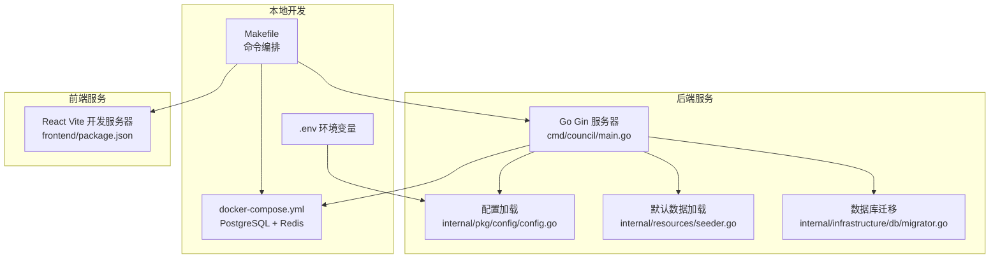
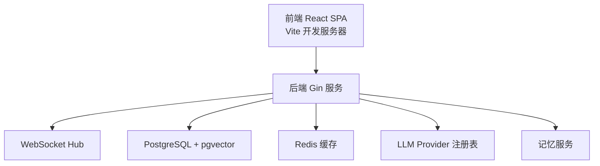
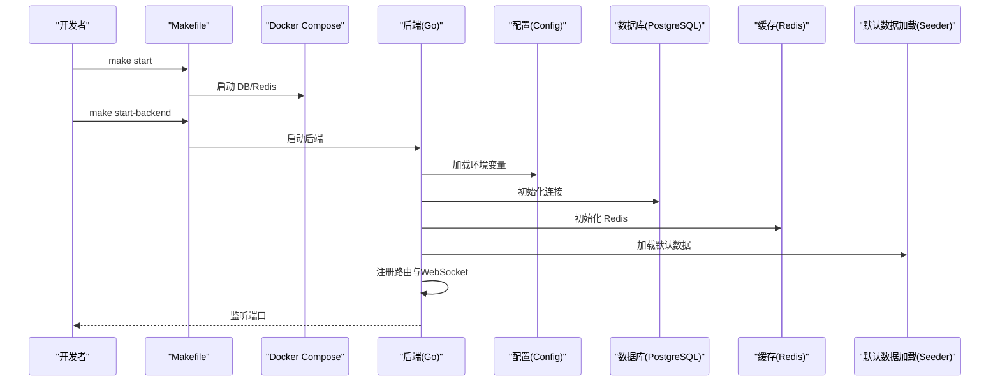

# 快速入门

<cite>
**本文引用的文件列表**
- [README.md](file://README.md)
- [Makefile](file://Makefile)
- [.env.example](file://.env.example)
- [docker-compose.yml](file://docker-compose.yml)
- [cmd/council/main.go](file://cmd/council/main.go)
- [internal/resources/seeder.go](file://internal/resources/seeder.go)
- [internal/pkg/config/config.go](file://internal/pkg/config/config.go)
- [internal/infrastructure/db/migrator.go](file://internal/infrastructure/db/migrator.go)
- [internal/infrastructure/db/migrations/001_init_schema.up.sql](file://internal/infrastructure/db/migrations/001_init_schema.up.sql)
- [frontend/package.json](file://frontend/package.json)
</cite>

## 目录
1. [简介](#简介)
2. [项目结构](#项目结构)
3. [核心组件](#核心组件)
4. [架构总览](#架构总览)
5. [详细组件分析](#详细组件分析)
6. [依赖关系分析](#依赖关系分析)
7. [性能注意事项](#性能注意事项)
8. [故障排查指南](#故障排查指南)
9. [结论](#结论)
10. [附录](#附录)

## 简介
本指南面向首次使用 The Council 的用户与开发者，帮助你在本地完成环境搭建、启动服务、加载默认班底与工作流，并成功运行一次示例辩论会话。你将学会：
- 克隆仓库与准备环境
- 配置环境变量（基于 .env.example）
- 启动 Docker 容器（PostgreSQL、Redis）
- 构建并启动后端与前端
- 通过 Makefile 执行初始化与健康检查
- 访问前端界面与查看后端 API/WebSocket
- 加载默认班底（Agents/Groups/Workflows）
- 启动一次示例辩论会话
- 常见问题排查（端口冲突、数据库迁移失败、LLM API 密钥缺失等）

## 项目结构
仓库采用“后端 Go + 前端 React”的双栈结构，配合 Docker 编排数据库与缓存，支持一键启动与开发调试。

图表来源
- [Makefile](file://Makefile#L1-L120)
- [docker-compose.yml](file://docker-compose.yml#L1-L24)
- [cmd/council/main.go](file://cmd/council/main.go#L1-L150)
- [internal/pkg/config/config.go](file://internal/pkg/config/config.go#L1-L133)
- [internal/resources/seeder.go](file://internal/resources/seeder.go#L1-L120)
- [internal/infrastructure/db/migrator.go](file://internal/infrastructure/db/migrator.go#L1-L109)
- [frontend/package.json](file://frontend/package.json#L1-L60)

章节来源
- [README.md](file://README.md#L46-L124)
- [Makefile](file://Makefile#L1-L120)
- [docker-compose.yml](file://docker-compose.yml#L1-L24)

## 核心组件
- 后端入口与路由：后端通过 Gin 提供 REST API 与 WebSocket，启动时加载 .env 并初始化数据库、Redis、内存服务、WebSocket Hub，随后注册路由并监听端口。
- 默认数据加载：启动时自动加载默认智能体、组与工作流模板，便于新手直接体验。
- 数据库迁移：内置嵌入式迁移工具，按顺序执行 SQL 迁移文件，记录已应用版本。
- 前端开发：Vite 提供热更新开发服务器，默认监听本地端口。
- Docker 编排：PostgreSQL（含向量扩展）与 Redis 作为基础设施。

章节来源
- [cmd/council/main.go](file://cmd/council/main.go#L1-L150)
- [internal/resources/seeder.go](file://internal/resources/seeder.go#L303-L319)
- [internal/infrastructure/db/migrator.go](file://internal/infrastructure/db/migrator.go#L1-L109)
- [frontend/package.json](file://frontend/package.json#L1-L60)

## 架构总览
后端采用分层设计：API 层负责路由与处理器；核心层包含工作流引擎、记忆服务与中间件；基础设施层对接数据库、缓存与外部 LLM 服务。前端通过 REST 与 WebSocket 与后端交互。

图表来源
- [cmd/council/main.go](file://cmd/council/main.go#L90-L149)
- [internal/pkg/config/config.go](file://internal/pkg/config/config.go#L1-L133)

## 详细组件分析

### 本地环境准备与安装
- 克隆仓库并进入目录
- 安装依赖（后端 Go 模块、前端 Node 依赖），若无 .env 则复制示例文件
- 准备 Docker 与 Docker Compose（版本要求见 README）

章节来源
- [README.md](file://README.md#L48-L56)
- [Makefile](file://Makefile#L308-L321)

### 配置环境变量（基于 .env.example）
- 数据库连接：DATABASE_URL
- LLM 提供商与模型：LLM_PROVIDER、LLM_MODEL
- API 密钥：按提供商设置对应密钥（例如 GEMINI_API_KEY）
- Redis 可选：REDIS_URL
- 服务器端口：PORT（默认 8080）

章节来源
- [.env.example](file://.env.example#L1-L21)
- [internal/pkg/config/config.go](file://internal/pkg/config/config.go#L45-L133)

### 启动 Docker 容器（PostgreSQL、Redis）
- 使用 Makefile 启动数据库服务或一键启动所有服务
- docker-compose 将映射数据库与缓存端口，持久化数据卷

章节来源
- [Makefile](file://Makefile#L71-L94)
- [docker-compose.yml](file://docker-compose.yml#L1-L24)

### 构建与启动后端服务
- 后端通过 Gin 提供 REST API 与 WebSocket
- 启动时加载 .env，初始化数据库与 Redis，执行默认数据加载，注册路由并监听端口
- 若端口被占用，Makefile 会尝试停止旧进程再启动

章节来源
- [cmd/council/main.go](file://cmd/council/main.go#L21-L149)
- [Makefile](file://Makefile#L99-L116)

### 构建与启动前端服务
- 前端使用 Vite 开发服务器，默认端口 5173/5174
- Makefile 提供启动与停止命令

章节来源
- [frontend/package.json](file://frontend/package.json#L1-L60)
- [Makefile](file://Makefile#L124-L136)

### 通过 Makefile 执行初始化脚本与健康检查
- 一键启动：make start（DB + Backend + Frontend）
- 查看服务状态：make status（Docker、后端、前端端口）
- 日志查看：make logs-db、make logs-backend
- 重置数据库：make reset-db（删除数据卷并重建）

章节来源
- [Makefile](file://Makefile#L46-L66)
- [Makefile](file://Makefile#L84-L94)
- [Makefile](file://Makefile#L117-L129)

### 验证服务健康状态
- 前端：浏览器访问 http://localhost:5173
- 后端 API：访问 http://localhost:8080/api/v1（需先启动后端）
- WebSocket：ws://localhost:8080/ws（用于实时事件）
- 端口占用检测：make status 会显示 8080、5173/5174 占用情况

章节来源
- [README.md](file://README.md#L68-L72)
- [Makefile](file://Makefile#L52-L66)

### 加载默认班底（Agents/Groups/Workflows）
- 后端启动时自动执行默认数据加载，包括：
  - 默认智能体（Affirmative、Negative、Adjudicator）
  - 组织“Council”
  - 工作流模板（Council Debate、Council Optimize）
  - LLM 提供商与模型选项
- 默认数据加载逻辑在资源种子器中实现，按依赖顺序执行

章节来源
- [cmd/council/main.go](file://cmd/council/main.go#L38-L44)
- [internal/resources/seeder.go](file://internal/resources/seeder.go#L303-L319)

### 启动一次示例辩论会话
- 启动所有服务
- 在浏览器打开前端 http://localhost:5173
- 在侧边栏选择“Council”组织
- 新建会议，选择“Council Debate”工作流
- 上传文档，开始执行，观察三智能体并行辩论与最终裁决

章节来源
- [README.md](file://README.md#L94-L124)

## 依赖关系分析
后端启动流程的关键依赖链如下：

图表来源
- [Makefile](file://Makefile#L142-L163)
- [cmd/council/main.go](file://cmd/council/main.go#L21-L149)
- [internal/pkg/config/config.go](file://internal/pkg/config/config.go#L45-L133)
- [internal/resources/seeder.go](file://internal/resources/seeder.go#L303-L319)

## 性能注意事项
- 数据库向量索引：迁移脚本创建了向量索引，建议在生产环境中根据数据规模调整索引策略与参数。
- 缓存命中率：Redis 用于会话与临时数据，合理设置过期策略与容量。
- LLM 调用成本：启用成本估算接口，避免不必要的重复调用。
- 前端开发模式：Vite 热更新仅用于开发，生产请使用构建产物。

[本节为通用建议，不直接分析具体文件]

## 故障排查指南

### 端口冲突
- 现象：后端无法启动或前端无法启动
- 排查：使用 make status 检查 8080、5173/5174 是否被占用
- 处理：停止占用进程或修改 PORT/前端端口

章节来源
- [Makefile](file://Makefile#L52-L66)
- [Makefile](file://Makefile#L99-L116)
- [Makefile](file://Makefile#L124-L136)

### 数据库迁移失败
- 现象：启动后端报错或缺少表
- 排查：确认 Docker 已启动且数据库可用；查看迁移日志
- 处理：重置数据库（make reset-db）或手动执行迁移脚本

章节来源
- [internal/infrastructure/db/migrator.go](file://internal/infrastructure/db/migrator.go#L1-L109)
- [internal/infrastructure/db/migrations/001_init_schema.up.sql](file://internal/infrastructure/db/migrations/001_init_schema.up.sql#L1-L96)
- [Makefile](file://Makefile#L87-L94)

### LLM API 密钥缺失
- 现象：LLM 调用失败或报错
- 排查：确认 .env 中对应提供商的 API Key 已设置（如 GEMINI_API_KEY）
- 处理：在 .env 中填写密钥，重启后端

章节来源
- [.env.example](file://.env.example#L1-L21)
- [internal/pkg/config/config.go](file://internal/pkg/config/config.go#L113-L133)

### 默认数据未加载
- 现象：侧边栏无“Council”组织或工作流不可见
- 排查：确认后端启动日志中默认数据加载成功
- 处理：重启后端或检查数据库连接与权限

章节来源
- [cmd/council/main.go](file://cmd/council/main.go#L38-L44)
- [internal/resources/seeder.go](file://internal/resources/seeder.go#L303-L319)

### WebSocket 连接失败
- 现象：前端无法接收实时事件
- 排查：确认后端已启动并监听端口；浏览器控制台网络面板查看 ws 连接
- 处理：刷新页面或检查代理/防火墙设置

章节来源
- [README.md](file://README.md#L270-L285)
- [cmd/council/main.go](file://cmd/council/main.go#L98-L101)

## 结论
通过本指南，你可以快速完成本地环境搭建与首次运行，体验默认班底与工作流，并在遇到常见问题时进行有效排查。建议在开发过程中结合 Makefile 的生命周期命令与健康检查，确保各组件稳定运行。

[本节为总结，不直接分析具体文件]

## 附录

### 常用命令清单
- 一键启动：make start
- 查看状态：make status
- 停止服务：make stop
- 重启服务：make restart
- 启动数据库：make start-db
- 启动后端：make start-backend
- 启动前端：make start-frontend
- 重置数据库：make reset-db
- 日志查看：make logs-db、make logs-backend

章节来源
- [README.md](file://README.md#L314-L331)
- [Makefile](file://Makefile#L46-L66)
- [Makefile](file://Makefile#L71-L94)
- [Makefile](file://Makefile#L99-L116)
- [Makefile](file://Makefile#L124-L136)