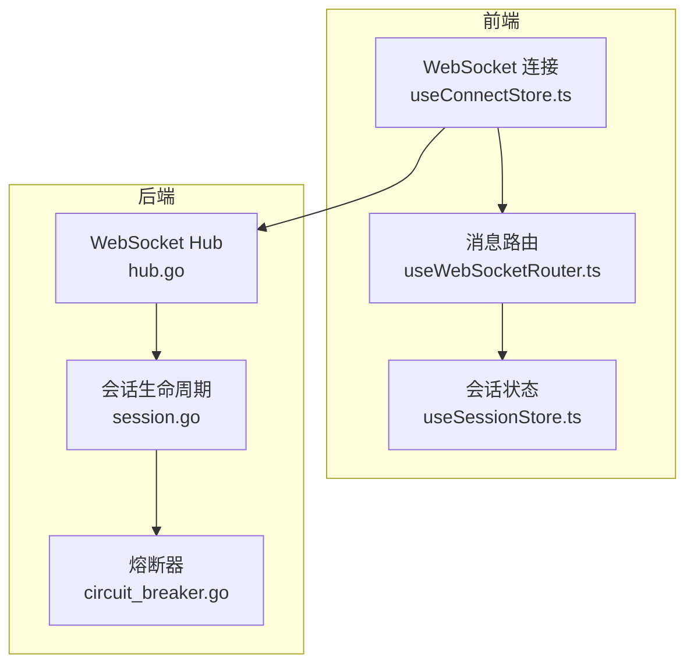
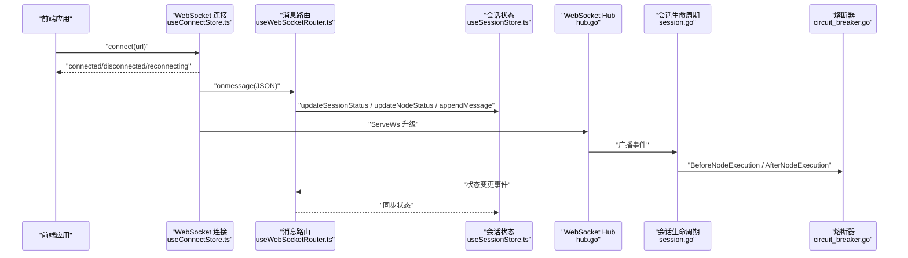
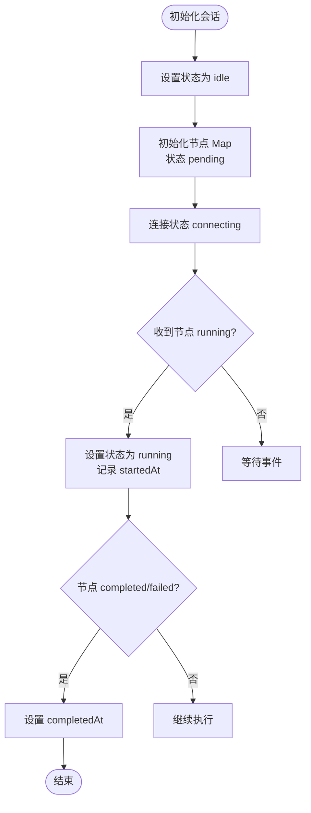
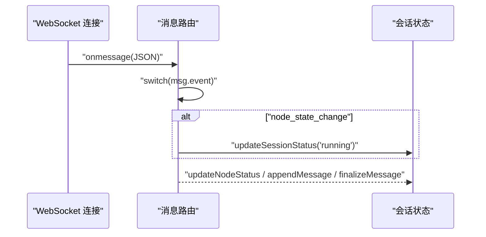
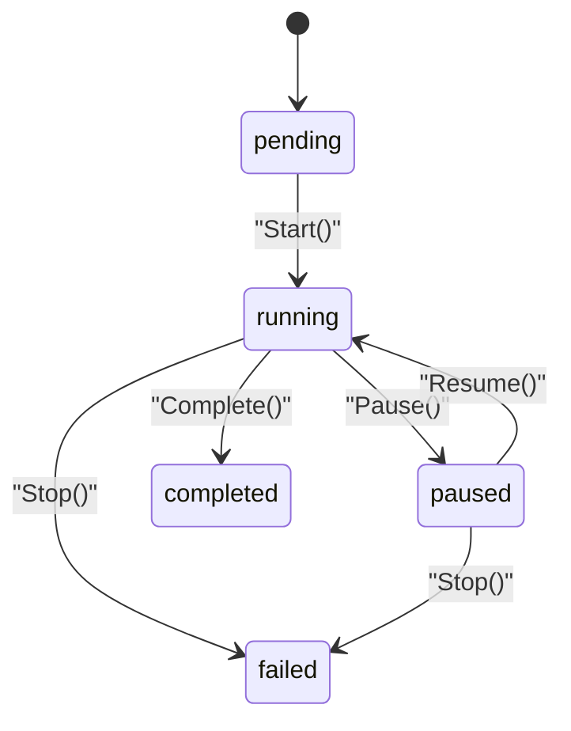
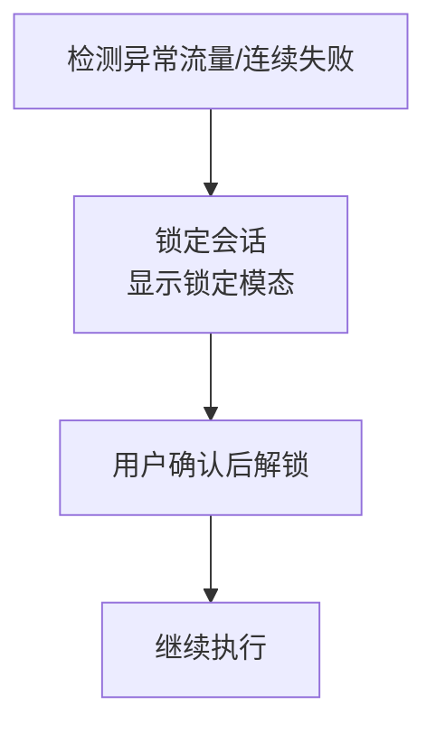
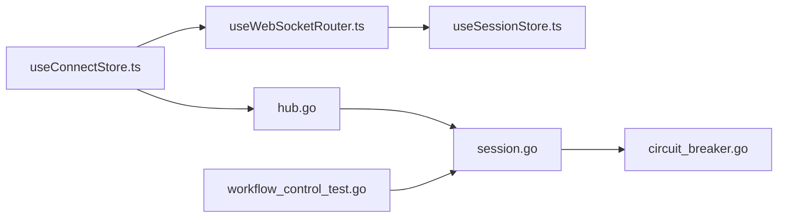

# 安全与状态问题

<cite>
**本文引用的文件**
- [useSessionStore.ts](file://frontend/src/stores/useSessionStore.ts)
- [useWebSocketRouter.ts](file://frontend/src/hooks/useWebSocketRouter.ts)
- [useConnectStore.ts](file://frontend/src/stores/useConnectStore.ts)
- [session.go](file://internal/core/workflow/session.go)
- [circuit_breaker.go](file://internal/core/middleware/circuit_breaker.go)
- [SPEC-001-session-store.md](file://docs/specs/sprint1/SPEC-001-session-store.md)
- [SPEC-504-security-hardening.md](file://docs/specs/sprint5/SPEC-504-security-hardening.md)
- [SPEC-409-circuit-breaker.md](file://docs/specs/backend/SPEC-409-circuit-breaker.md)
- [SPEC-703-session-ws-connect-fix.md](file://docs/specs/sprint7/SPEC-703-session-ws-connect-fix.md)
- [SPEC-005-websocket-optimization.md](file://docs/specs/sprint1/SPEC-005-websocket-optimization.md)
- [2025-12-21-websocket-debugging-report.md](file://docs/reports/debugging/2025-12-21-websocket-debugging-report.md)
- [hub.go](file://internal/api/ws/hub.go)
- [ui_support_v1.5.md](file://docs/api/ui_support_v1.5.md)
- [workflow_control_test.go](file://internal/api/handler/workflow_control_test.go)
</cite>

## 目录
1. [引言](#引言)
2. [项目结构](#项目结构)
3. [核心组件](#核心组件)
4. [架构总览](#架构总览)
5. [详细组件分析](#详细组件分析)
6. [依赖关系分析](#依赖关系分析)
7. [性能考量](#性能考量)
8. [故障排除指南](#故障排除指南)
9. [结论](#结论)
10. [附录](#附录)

## 引言
本指南聚焦于“安全相关故障排除”，围绕以下关键问题展开：
- 状态异常（如“SUSPENDED (LOCKED)”）的成因与处置
- 权限越界与会话劫持风险的识别与缓解
- 熔断器在检测异常流量或连续失败时对会话的锁定机制与手动解锁流程
- useSessionStore 中会话状态管理逻辑，确保 idle 到 running 的正确转换
- 结合审计报告的安全扫描结果，指导 CORS 策略、WebSocket 连接校验（CheckOrigin）与敏感数据过滤，防止信息泄露

## 项目结构
本项目采用前后端分离架构，前端通过 WebSocket 与后端实时交互，后端以会话为中心驱动工作流执行。安全与状态问题主要涉及：
- 前端会话状态管理与 WebSocket 路由
- 后端会话生命周期与暂停/恢复控制
- 中间件与熔断器的执行约束
- WebSocket 连接校验与 CORS 配置
- 安全加固（RBAC、速率限制、敏感数据脱敏、审计日志）

图表来源
- [useConnectStore.ts](file://frontend/src/stores/useConnectStore.ts#L40-L77)
- [useWebSocketRouter.ts](file://frontend/src/hooks/useWebSocketRouter.ts#L1-L126)
- [useSessionStore.ts](file://frontend/src/stores/useSessionStore.ts#L1-L332)
- [hub.go](file://internal/api/ws/hub.go#L14-L19)
- [session.go](file://internal/core/workflow/session.go#L1-L165)
- [circuit_breaker.go](file://internal/core/middleware/circuit_breaker.go#L1-L40)

章节来源
- [useConnectStore.ts](file://frontend/src/stores/useConnectStore.ts#L40-L77)
- [useWebSocketRouter.ts](file://frontend/src/hooks/useWebSocketRouter.ts#L1-L126)
- [useSessionStore.ts](file://frontend/src/stores/useSessionStore.ts#L1-L332)
- [hub.go](file://internal/api/ws/hub.go#L14-L19)
- [session.go](file://internal/core/workflow/session.go#L1-L165)
- [circuit_breaker.go](file://internal/core/middleware/circuit_breaker.go#L1-L40)

## 核心组件
- 前端会话状态管理：负责会话初始化、节点状态更新、消息流处理、令牌用量统计、并行执行标记与清理。
- WebSocket 连接与路由：负责连接建立、心跳、消息解析与分发、错误处理与重连。
- 后端会话生命周期：负责会话状态机（pending/running/paused/completed/failed/cancelled），暂停/恢复/停止控制。
- 熔断器：提供节点执行前后的安全钩子，用于深度限制与输出校验。
- WebSocket Hub 与 CORS：提供升级器与跨域策略，默认开发环境允许所有来源。
- 安全加固：RBAC、速率限制、敏感数据脱敏、审计日志。

章节来源
- [useSessionStore.ts](file://frontend/src/stores/useSessionStore.ts#L1-L332)
- [useWebSocketRouter.ts](file://frontend/src/hooks/useWebSocketRouter.ts#L1-L126)
- [useConnectStore.ts](file://frontend/src/stores/useConnectStore.ts#L40-L77)
- [session.go](file://internal/core/workflow/session.go#L1-L165)
- [circuit_breaker.go](file://internal/core/middleware/circuit_breaker.go#L1-L40)
- [hub.go](file://internal/api/ws/hub.go#L14-L19)
- [SPEC-504-security-hardening.md](file://docs/specs/sprint5/SPEC-504-security-hardening.md#L1-L292)

## 架构总览
下图展示从前端 WebSocket 到后端会话控制与熔断器的整体交互路径，以及安全加固的接入点。

图表来源
- [useConnectStore.ts](file://frontend/src/stores/useConnectStore.ts#L40-L77)
- [useWebSocketRouter.ts](file://frontend/src/hooks/useWebSocketRouter.ts#L1-L126)
- [useSessionStore.ts](file://frontend/src/stores/useSessionStore.ts#L1-L332)
- [hub.go](file://internal/api/ws/hub.go#L110-L125)
- [session.go](file://internal/core/workflow/session.go#L51-L121)
- [circuit_breaker.go](file://internal/core/middleware/circuit_breaker.go#L22-L39)

## 详细组件分析

### 前端会话状态管理（useSessionStore）
- 初始化会话：设置初始状态为 idle，节点集合为空 Map，连接状态为 connecting。
- 状态更新：支持会话状态与节点状态更新；首次进入 running 时记录 startedAt，结束状态时记录 completedAt。
- 消息流处理：支持流式消息追加与合并，按节点分组维护消息组；并行开始时创建并行组并标记活跃节点。
- 令牌用量：累计会话总 token 与成本，并更新节点与消息的 token usage。
- 清理：清空当前会话与消息组，连接状态回到 disconnected。

图表来源
- [useSessionStore.ts](file://frontend/src/stores/useSessionStore.ts#L104-L143)
- [useSessionStore.ts](file://frontend/src/stores/useSessionStore.ts#L145-L162)
- [useSessionStore.ts](file://frontend/src/stores/useSessionStore.ts#L172-L223)
- [useSessionStore.ts](file://frontend/src/stores/useSessionStore.ts#L268-L274)

章节来源
- [useSessionStore.ts](file://frontend/src/stores/useSessionStore.ts#L104-L143)
- [useSessionStore.ts](file://frontend/src/stores/useSessionStore.ts#L145-L162)
- [useSessionStore.ts](file://frontend/src/stores/useSessionStore.ts#L172-L223)
- [useSessionStore.ts](file://frontend/src/stores/useSessionStore.ts#L236-L266)
- [useSessionStore.ts](file://frontend/src/stores/useSessionStore.ts#L268-L274)
- [SPEC-001-session-store.md](file://docs/specs/sprint1/SPEC-001-session-store.md#L1-L486)

### WebSocket 连接与路由（useConnectStore / useWebSocketRouter）
- 连接与心跳：连接成功后切换状态为 connected，启动心跳；关闭时清理心跳并触发重连；错误时记录 lastError。
- 消息路由：根据事件类型分发到会话状态更新、节点状态更新、并行执行、令牌用量、暂停/完成、人类介入、错误处理。
- 会话状态自动转换：当收到第一个节点 running 事件时，自动将会话状态更新为 running，避免 UI 一直显示 idle 的问题。

图表来源
- [useConnectStore.ts](file://frontend/src/stores/useConnectStore.ts#L40-L77)
- [useWebSocketRouter.ts](file://frontend/src/hooks/useWebSocketRouter.ts#L1-L126)
- [2025-12-21-websocket-debugging-report.md](file://docs/reports/debugging/2025-12-21-websocket-debugging-report.md#L150-L161)

章节来源
- [useConnectStore.ts](file://frontend/src/stores/useConnectStore.ts#L40-L77)
- [useWebSocketRouter.ts](file://frontend/src/hooks/useWebSocketRouter.ts#L1-L126)
- [SPEC-005-websocket-optimization.md](file://docs/specs/sprint1/SPEC-005-websocket-optimization.md#L107-L204)
- [SPEC-703-session-ws-connect-fix.md](file://docs/specs/sprint7/SPEC-703-session-ws-connect-fix.md#L189-L196)
- [2025-12-21-websocket-debugging-report.md](file://docs/reports/debugging/2025-12-21-websocket-debugging-report.md#L1-L40)
- [2025-12-21-websocket-debugging-report.md](file://docs/reports/debugging/2025-12-21-websocket-debugging-report.md#L150-L161)

### 后端会话生命周期（session.go）
- 状态枚举：pending/running/paused/completed/failed/cancelled。
- 生命周期方法：Start 将状态置为 running 并初始化上下文；Pause/Resume 控制暂停与恢复；Complete/Stop 结束会话。
- 等待暂停：WaitIfPaused 在会话处于 paused 时阻塞直到收到 resume 信号。

图表来源
- [session.go](file://internal/core/workflow/session.go#L12-L21)
- [session.go](file://internal/core/workflow/session.go#L51-L121)
- [session.go](file://internal/core/workflow/session.go#L144-L165)

章节来源
- [session.go](file://internal/core/workflow/session.go#L12-L21)
- [session.go](file://internal/core/workflow/session.go#L51-L121)
- [session.go](file://internal/core/workflow/session.go#L144-L165)

### 熔断器与会话锁定（circuit_breaker.go / SPEC-409）
- 熔断器钩子：BeforeNodeExecution 与 AfterNodeExecution 提供节点执行前后检查点，可用于深度限制与输出校验。
- 锁定与解锁 UI：前端提供“系统已锁定”模态与解锁按钮，要求输入风险陈述或完成安全自查后方可解锁并继续。

图表来源
- [circuit_breaker.go](file://internal/core/middleware/circuit_breaker.go#L1-L40)
- [SPEC-409-circuit-breaker.md](file://docs/specs/backend/SPEC-409-circuit-breaker.md#L135-L198)

章节来源
- [circuit_breaker.go](file://internal/core/middleware/circuit_breaker.go#L1-L40)
- [SPEC-409-circuit-breaker.md](file://docs/specs/backend/SPEC-409-circuit-breaker.md#L135-L198)

### WebSocket Hub 与 CORS（hub.go）
- 升级器：默认 CheckOrigin 返回 true，允许所有来源，适用于开发环境；生产环境应收紧策略。
- 广播：向所有注册客户端广播事件，内部使用 goroutine 与通道进行异步写入。

章节来源
- [hub.go](file://internal/api/ws/hub.go#L14-L19)
- [hub.go](file://internal/api/ws/hub.go#L110-L125)

### 安全加固（RBAC、速率限制、敏感数据脱敏、审计日志）
- RBAC：定义角色与权限，中间件统一校验用户权限，拒绝无权限请求。
- 速率限制：基于 Redis 滑动窗口实现，超限返回 429 并设置 Retry-After。
- 敏感数据脱敏：存储时加密、返回时脱敏、日志自动过滤敏感字段。
- 审计日志：记录关键操作的审计事件，支持查询与导出。

章节来源
- [SPEC-504-security-hardening.md](file://docs/specs/sprint5/SPEC-504-security-hardening.md#L1-L292)

## 依赖关系分析
- 前端依赖：useConnectStore 负责连接与心跳；useWebSocketRouter 负责消息路由；useSessionStore 负责状态与消息。
- 后端依赖：hub.go 作为 WebSocket Hub，session.go 管理会话状态，circuit_breaker.go 提供安全钩子。
- API 控制：/sessions/:id/control 支持 pause/resume/stop，测试覆盖了暂停/恢复/停止的行为。

图表来源
- [useConnectStore.ts](file://frontend/src/stores/useConnectStore.ts#L40-L77)
- [useWebSocketRouter.ts](file://frontend/src/hooks/useWebSocketRouter.ts#L1-L126)
- [useSessionStore.ts](file://frontend/src/stores/useSessionStore.ts#L1-L332)
- [hub.go](file://internal/api/ws/hub.go#L110-L125)
- [session.go](file://internal/core/workflow/session.go#L51-L121)
- [circuit_breaker.go](file://internal/core/middleware/circuit_breaker.go#L1-L40)
- [workflow_control_test.go](file://internal/api/handler/workflow_control_test.go#L52-L88)

章节来源
- [workflow_control_test.go](file://internal/api/handler/workflow_control_test.go#L52-L88)

## 性能考量
- WebSocket 连接与心跳：合理设置心跳间隔与重连退避，避免频繁重连造成资源浪费。
- 会话状态更新：批量更新与去抖动，减少不必要的渲染与状态同步。
- 熔断器钩子：在 Before/After 阶段尽量轻量，避免阻塞节点执行。
- 速率限制：针对高频端点设置合理的阈值与键函数（如按 IP 或用户 ID），避免误伤正常用户。

## 故障排除指南

### 1. 状态异常：SUSPENDED (LOCKED)
- 现象：界面提示系统已锁定，无法继续执行。
- 成因：熔断器检测到异常流量或连续失败，触发会话锁定。
- 处置：
  - 前端：打开“系统已锁定”模态，按要求填写风险陈述或完成安全自查后点击“解锁并继续”。
  - 后端：熔断器钩子在 BeforeNodeExecution/AfterNodeExecution 中进行检查，必要时阻止继续执行。
- 验证：解锁后，会话状态回到 running，节点状态按事件流转。

章节来源
- [SPEC-409-circuit-breaker.md](file://docs/specs/backend/SPEC-409-circuit-breaker.md#L135-L198)
- [circuit_breaker.go](file://internal/core/middleware/circuit_breaker.go#L22-L39)

### 2. 权限越界与会话劫持
- 风险识别：
  - 未授权访问：缺少 RBAC 校验导致越权操作。
  - 会话劫持：WebSocket 连接未做 Origin 校验，易被跨站劫持。
- 处置：
  - RBAC：在所有受保护端点启用 RequirePermission 中间件，严格校验用户角色与权限。
  - CORS：生产环境将 CheckOrigin 收紧为白名单域名，禁止通配符。
  - 传输安全：强制 HTTPS，Cookie 使用 HttpOnly/Secure/SameSite。
  - 速率限制：对 /sessions/:id/control 等关键端点设置速率限制，防止暴力尝试。
- 验证：401/403/429 状态码正确返回，敏感字段在日志中脱敏。

章节来源
- [SPEC-504-security-hardening.md](file://docs/specs/sprint5/SPEC-504-security-hardening.md#L1-L292)
- [hub.go](file://internal/api/ws/hub.go#L14-L19)

### 3. 会话状态不一致（idle → running）
- 现象：工作流运行中，UI 仍显示 idle。
- 成因：前端未在收到第一个 running 节点时自动更新会话状态。
- 处置：在 useWebSocketRouter 中，当收到 node_state_change 且 status 为 running 时，调用 updateSessionStatus('running')。
- 验证：调试报告明确指出修复位置与修复内容。

章节来源
- [useWebSocketRouter.ts](file://frontend/src/hooks/useWebSocketRouter.ts#L32-L45)
- [2025-12-21-websocket-debugging-report.md](file://docs/reports/debugging/2025-12-21-websocket-debugging-report.md#L150-L161)

### 4. 手动解除锁定的 API 调用方法
- 前端解锁：在“系统已锁定”模态中完成风险陈述或安全自查后，调用前端解锁逻辑（具体实现见 SPEC-409）。
- 后端控制：通过 /sessions/:id/control 端点发送 action=resume，使会话从 paused 状态恢复为 running。
- 验证：测试覆盖了 pause/resume/stop 的行为，状态转换正确。

章节来源
- [SPEC-409-circuit-breaker.md](file://docs/specs/backend/SPEC-409-circuit-breaker.md#L135-L198)
- [ui_support_v1.5.md](file://docs/api/ui_support_v1.5.md#L67-L80)
- [workflow_control_test.go](file://internal/api/handler/workflow_control_test.go#L52-L88)

### 5. WebSocket 连接验证（CheckOrigin）与 CORS 策略
- 现状：默认 CheckOrigin 返回 true，允许所有来源，适合开发环境。
- 生产建议：
  - 限定 Origin 白名单，拒绝未知来源。
  - 设置合适的 CORS 头，避免暴露敏感信息。
  - 对 /ws 端点单独设置速率限制，防止滥用。
- 验证：通过单元测试与调试报告确认消息序列化字段匹配（event/type）。

章节来源
- [hub.go](file://internal/api/ws/hub.go#L14-L19)
- [SPEC-005-websocket-optimization.md](file://docs/specs/sprint1/SPEC-005-websocket-optimization.md#L107-L204)
- [2025-12-21-websocket-debugging-report.md](file://docs/reports/debugging/2025-12-21-websocket-debugging-report.md#L1-L40)

### 6. 敏感数据过滤与审计
- 敏感数据处理：存储时加密、返回时脱敏、日志自动过滤敏感字段。
- 审计日志：记录关键操作（如删除工作流、执行控制等），支持查询与导出。
- 验证：SPEC-504 提供了完整的实现与验收标准。

章节来源
- [SPEC-504-security-hardening.md](file://docs/specs/sprint5/SPEC-504-security-hardening.md#L142-L222)

## 结论
- 状态异常（如 SUSPENDED/LOCKED）可通过熔断器与前端解锁流程快速恢复。
- 权限越界与会话劫持需通过 RBAC、严格的 CORS/Origin 校验、速率限制与传输安全共同治理。
- useSessionStore 的状态机与 useWebSocketRouter 的事件路由保证了从 idle 到 running 的正确转换。
- 安全加固方案已在 SPEC-504 中给出，建议尽快在生产环境落地。

## 附录
- 关键端点参考：/sessions/:id/control（pause/resume/stop）
- 会话状态枚举：pending/running/paused/completed/failed/cancelled
- 熔断器钩子：BeforeNodeExecution/AfterNodeExecution