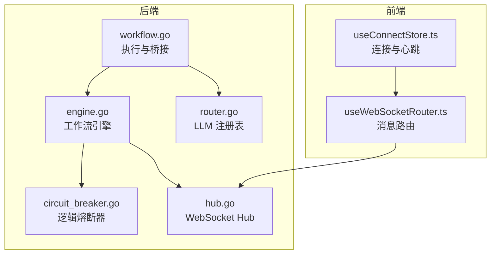
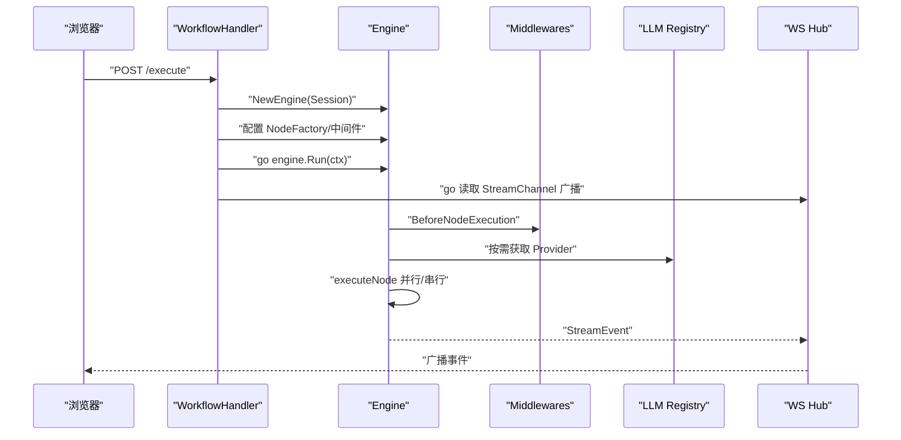
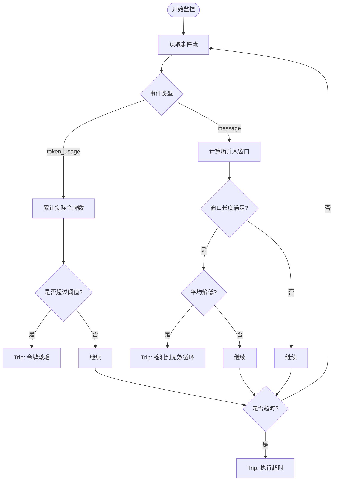
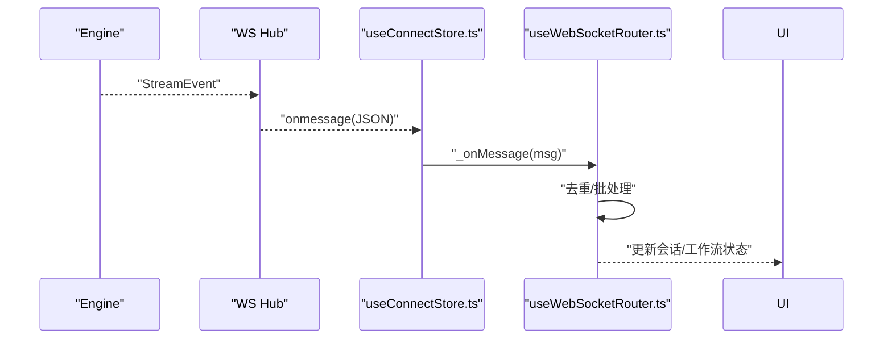
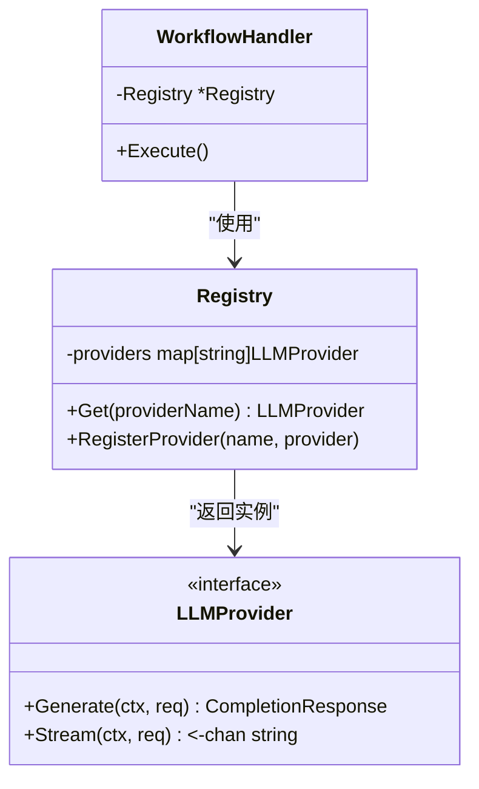
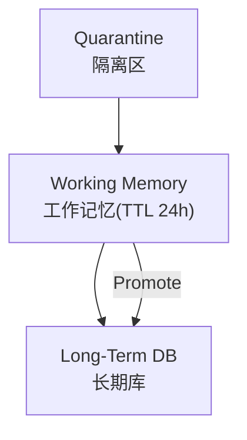
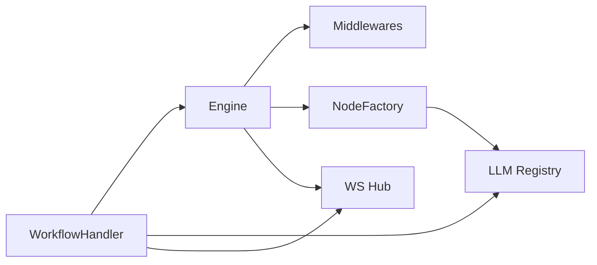

# 性能问题

<cite>
**本文引用的文件列表**
- [circuit_breaker.go](file://internal/core/middleware/circuit_breaker.go)
- [SPEC-409-circuit-breaker.md](file://docs/specs/backend/SPEC-409-circuit-breaker.md)
- [engine.go](file://internal/core/workflow/engine.go)
- [context.go](file://internal/core/workflow/context.go)
- [hub.go](file://internal/api/ws/hub.go)
- [hub_test.go](file://internal/api/ws/hub_test.go)
- [SPEC-005-websocket-optimization.md](file://docs/specs/sprint1/SPEC-005-websocket-optimization.md)
- [useConnectStore.ts](file://frontend/src/stores/useConnectStore.ts)
- [2025-12-21-websocket-debugging-report.md](file://docs/reports/debugging/2025-12-21-websocket-debugging-report.md)
- [workflow.go](file://internal/api/handler/workflow.go)
- [router.go](file://internal/infrastructure/llm/router.go)
- [SPEC-702-llm-registry.md](file://docs/specs/sprint7/SPEC-702-llm-registry.md)
- [loop.go](file://internal/core/workflow/nodes/loop.go)
- [SPEC-607-memory-retrieval-node.md](file://docs/specs/sprint6/SPEC-607-memory-retrieval-node.md)
- [memory.go](file://internal/core/memory/service.go)
- [SPEC-408-memory-protocol.md](file://docs/specs/backend/SPEC-408-memory-protocol.md)
- [sprint6_audit_report_v5_architecture.md](file://docs/reports/audits/sprint6_audit_report_v5_architecture.md)
- [SPEC-503-performance-optimization.md](file://docs/specs/sprint5/SPEC-503-performance-optimization.md)
</cite>

## 目录
1. [引言](#引言)
2. [项目结构](#项目结构)
3. [核心组件](#核心组件)
4. [架构总览](#架构总览)
5. [详细组件分析](#详细组件分析)
6. [依赖关系分析](#依赖关系分析)
7. [性能考量](#性能考量)
8. [故障排查指南](#故障排查指南)
9. [结论](#结论)
10. [附录](#附录)

## 引言
本指南聚焦于高并发场景下的性能瓶颈诊断与优化，围绕以下关键主题展开：
- WebSocket 消息积压与流控：结合前端消息路由规范与后端 Hub 的广播实现，提出消息频率控制与批量处理建议。
- LLM 调用延迟累积：通过 LLM Registry 动态选择与缓存、节点侧限速与背压策略，降低延迟放大。
- 熔断器触发与雪崩防护：解析逻辑熔断器与审计报告中的状态监控，避免系统级雪崩。
- 审计报告解读：指导如何从架构审计报告中识别资源争用点与潜在性能陷阱。
- 内存使用优化：基于三层记忆协议与工作记忆 TTL/容量控制，给出大规模运行稳定性策略。

## 项目结构
系统采用前后端分离与模块化分层：
- 后端核心：工作流引擎、中间件、LLM 注册表、WebSocket Hub、处理器。
- 前端：连接管理、消息路由、事件分发与 UI 状态。
- 文档与规范：性能优化、WebSocket 规范、熔断器设计、记忆协议等。

图表来源
- [workflow.go](file://internal/api/handler/workflow.go#L58-L123)
- [engine.go](file://internal/core/workflow/engine.go#L40-L147)
- [circuit_breaker.go](file://internal/core/middleware/circuit_breaker.go#L9-L39)
- [router.go](file://internal/infrastructure/llm/router.go#L1-L150)
- [hub.go](file://internal/api/ws/hub.go#L70-L124)
- [useConnectStore.ts](file://frontend/src/stores/useConnectStore.ts#L40-L127)

章节来源
- [SPEC-005-websocket-optimization.md](file://docs/specs/sprint1/SPEC-005-websocket-optimization.md#L1-L120)
- [SPEC-409-circuit-breaker.md](file://docs/specs/backend/SPEC-409-circuit-breaker.md#L36-L106)
- [SPEC-702-llm-registry.md](file://docs/specs/sprint7/SPEC-702-llm-registry.md#L1-L34)

## 核心组件
- 工作流引擎：负责图遍历、节点执行、中间件钩子、并行分支与事件流。
- 逻辑熔断器：在节点执行前后拦截，进行深度/令牌速率等检查。
- LLM 注册表：按需懒加载与缓存不同提供商实例，支持动态选择。
- WebSocket Hub：客户端连接管理与广播通道，承载实时事件。
- 前端连接与路由：统一消息分发、心跳与自动重连，避免重复处理。

章节来源
- [engine.go](file://internal/core/workflow/engine.go#L1-L147)
- [circuit_breaker.go](file://internal/core/middleware/circuit_breaker.go#L9-L39)
- [router.go](file://internal/infrastructure/llm/router.go#L1-L150)
- [hub.go](file://internal/api/ws/hub.go#L70-L124)
- [SPEC-005-websocket-optimization.md](file://docs/specs/sprint1/SPEC-005-websocket-optimization.md#L1-L120)

## 架构总览
后端执行流程：请求进入处理器，创建会话与引擎，配置工厂与中间件，后台协程运行引擎并将事件广播至 WebSocket Hub；前端通过连接管理与路由订阅事件并渲染。

图表来源
- [workflow.go](file://internal/api/handler/workflow.go#L58-L123)
- [engine.go](file://internal/core/workflow/engine.go#L40-L147)
- [router.go](file://internal/infrastructure/llm/router.go#L1-L150)
- [hub.go](file://internal/api/ws/hub.go#L70-L124)

## 详细组件分析

### 熔断机制与状态监控（逻辑熔断器）
- 当前实现（逻辑熔断器）：提供 Before/After 钩子，预留深度与令牌速率检查点，当前为占位实现。
- 规范文档（状态机）：定义了 Closed/Open/Recovery 状态与触发条件（令牌激增、死循环、超时），并发出前端通知事件。
- 雪崩防护要点：
  - 令牌激增阈值与窗口滑动平均结合，避免瞬时峰值导致误判。
  - 死循环检测基于熵与窗口长度，防止无意义重复输出。
  - 超时保护与前端提示，便于人工干预。

图表来源
- [SPEC-409-circuit-breaker.md](file://docs/specs/backend/SPEC-409-circuit-breaker.md#L36-L106)

章节来源
- [circuit_breaker.go](file://internal/core/middleware/circuit_breaker.go#L9-L39)
- [SPEC-409-circuit-breaker.md](file://docs/specs/backend/SPEC-409-circuit-breaker.md#L36-L106)

### WebSocket 消息频率控制与批量处理
- 消息类型与路由：后端事件类型包括 token_stream、node_state_change、token_usage、execution:paused/completed、error；前端路由按事件分派到会话与工作流状态。
- 连接与心跳：前端连接管理包含心跳与自动重连，避免网络抖动导致的断连。
- 频率控制建议：
  - 后端：对高频事件（如 token_stream）进行合并/节流，减少广播压力。
  - 前端：路由层增加去重与批处理队列，避免 UI 抖动与重复渲染。
  - 通道缓冲：合理设置 Hub.Client.send 缓冲大小，避免阻塞主写泵。

图表来源
- [hub.go](file://internal/api/ws/hub.go#L70-L124)
- [SPEC-005-websocket-optimization.md](file://docs/specs/sprint1/SPEC-005-websocket-optimization.md#L208-L319)
- [useConnectStore.ts](file://frontend/src/stores/useConnectStore.ts#L40-L127)

章节来源
- [SPEC-005-websocket-optimization.md](file://docs/specs/sprint1/SPEC-005-websocket-optimization.md#L1-L120)
- [2025-12-21-websocket-debugging-report.md](file://docs/reports/debugging/2025-12-21-websocket-debugging-report.md#L1-L70)
- [hub_test.go](file://internal/api/ws/hub_test.go#L1-L112)

### LLM 调用延迟累积与限速
- 动态注册表：按需初始化并缓存不同提供商实例，支持运行时选择，避免硬编码单一 Provider 导致的延迟放大。
- 限速与背压：
  - 在节点侧引入令牌桶/滑动窗口限速，限制并发调用速率。
  - 对流式响应进行背压，合并小块输出，减少事件风暴。
  - 为慢 Provider 设置超时与降级策略（如切换备用 Provider）。

图表来源
- [router.go](file://internal/infrastructure/llm/router.go#L1-L150)
- [SPEC-702-llm-registry.md](file://docs/specs/sprint7/SPEC-702-llm-registry.md#L1-L34)
- [workflow.go](file://internal/api/handler/workflow.go#L37-L51)

章节来源
- [router.go](file://internal/infrastructure/llm/router.go#L1-L150)
- [SPEC-702-llm-registry.md](file://docs/specs/sprint7/SPEC-702-llm-registry.md#L1-L34)

### 循环与并行：资源争用与 Join 逻辑
- 并行节点：当前实现并发执行分支，但缺少“等待所有分支完成再继续”的 Join 逻辑，可能导致下游节点提前触发。
- 循环节点：支持最大轮次与分数阈值退出，但需要在 Session 中维护迭代计数与退出原因，避免无限循环。
- 建议：
  - 在并行节点完成后统一汇总状态，再推进下一阶段。
  - 在循环节点中记录当前轮次与退出原因，便于审计与熔断。

章节来源
- [engine.go](file://internal/core/workflow/engine.go#L141-L159)
- [loop.go](file://internal/core/workflow/nodes/loop.go#L1-L66)

### 记忆协议与内存使用优化
- 三层记忆协议：隔离区（Quarantine）、工作记忆（Working Memory，TTL 24h）、长期库（Long-Term）。
- 工作记忆容量控制：通过列表截断与 TTL 管理，避免无限增长。
- 建议：
  - 对检索结果进行分页/采样，避免一次性注入过多上下文。
  - 对热点查询进行缓存，减少重复检索开销。

图表来源
- [SPEC-408-memory-protocol.md](file://docs/specs/backend/SPEC-408-memory-protocol.md#L10-L58)
- [memory.go](file://internal/core/memory/service.go#L90-L134)

章节来源
- [SPEC-408-memory-protocol.md](file://docs/specs/backend/SPEC-408-memory-protocol.md#L10-L58)
- [SPEC-607-memory-retrieval-node.md](file://docs/specs/sprint6/SPEC-607-memory-retrieval-node.md#L184-L212)
- [memory.go](file://internal/core/memory/service.go#L90-L134)

## 依赖关系分析
- 处理器依赖引擎与注册表，引擎依赖中间件与节点工厂，节点工厂依赖 LLM 注册表与记忆服务。
- WebSocket Hub 作为事件出口，被处理器桥接。

图表来源
- [workflow.go](file://internal/api/handler/workflow.go#L37-L51)
- [engine.go](file://internal/core/workflow/engine.go#L1-L38)
- [router.go](file://internal/infrastructure/llm/router.go#L1-L150)
- [hub.go](file://internal/api/ws/hub.go#L70-L124)

章节来源
- [workflow.go](file://internal/api/handler/workflow.go#L37-L51)
- [engine.go](file://internal/core/workflow/engine.go#L1-L38)

## 性能考量
- WebSocket 事件风暴：高频 token_stream 会导致 UI 抖动与网络拥塞。建议后端合并输出、前端批处理与去重。
- LLM 调用抖动：多 Provider 并存可能造成延迟波动。建议注册表缓存与限速，必要时降级。
- 并行分支 Join：缺少 Join 逻辑可能导致下游提前触发，引发资源争用。建议在并行结束后统一推进。
- 记忆增长：工作记忆未清理会导致内存膨胀。建议 TTL 与容量上限配合使用。
- 日志与可观测性：在 Handler 中记录会话生命周期日志，便于定位瓶颈。

[本节为通用性能讨论，无需列出具体文件来源]

## 故障排查指南
- WebSocket 消息静默丢失：前后端字段命名不一致导致解析失败。修复后端 StreamEvent 的 JSON 标签与前端接口保持一致。
- 并行节点提前触发：检查并行节点完成后是否统一推进，避免下游节点在部分分支完成时被触发。
- 循环节点无退出：确认 Session 中迭代计数与退出条件是否正确传递到循环节点。
- 记忆检索性能：对检索结果进行分页与采样，避免一次性注入大量上下文。

章节来源
- [2025-12-21-websocket-debugging-report.md](file://docs/reports/debugging/2025-12-21-websocket-debugging-report.md#L1-L70)
- [engine.go](file://internal/core/workflow/engine.go#L141-L159)
- [loop.go](file://internal/core/workflow/nodes/loop.go#L1-L66)
- [SPEC-607-memory-retrieval-node.md](file://docs/specs/sprint6/SPEC-607-memory-retrieval-node.md#L184-L212)

## 结论
- 逻辑熔断器与状态监控是防止雪崩的关键，应尽快完善令牌激增、死循环与超时的判定逻辑，并在前端展示熔断原因。
- WebSocket 与 LLM 的性能优化需要前后端协同：后端合并事件、前端批处理与去重，LLM 注册表按需懒加载与缓存。
- 并行与循环节点的状态一致性至关重要，需补齐 Join 与退出条件。
- 记忆协议的 TTL 与容量控制是内存稳定性的保障，应配合检索分页与缓存策略。

[本节为总结性内容，无需列出具体文件来源]

## 附录
- 审计报告中的致命缺陷与修复清单：重点关注节点类型缺失、Schema 与 Seeder 不一致、并行 Join 逻辑缺失等问题，这些缺陷直接影响系统稳定性与性能。
- 性能优化规范：前端构建分析与 Lighthouse 审计可作为前端性能基线。

章节来源
- [sprint6_audit_report_v5_architecture.md](file://docs/reports/audits/sprint6_audit_report_v5_architecture.md#L1-L206)
- [SPEC-503-performance-optimization.md](file://docs/specs/sprint5/SPEC-503-performance-optimization.md#L165-L175)