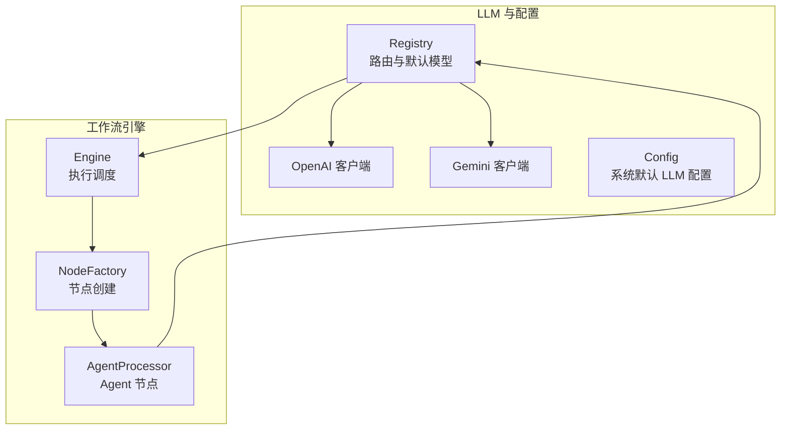
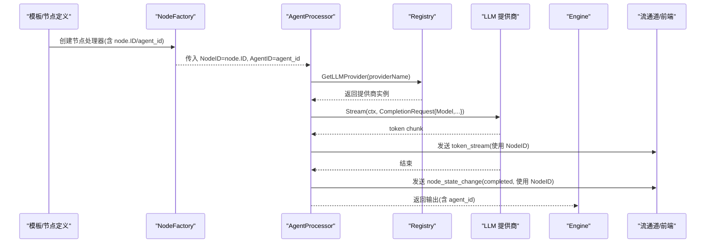
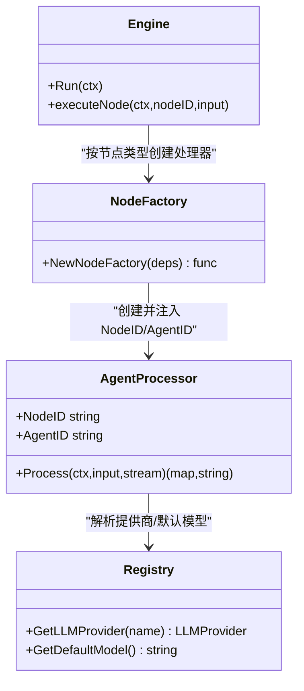
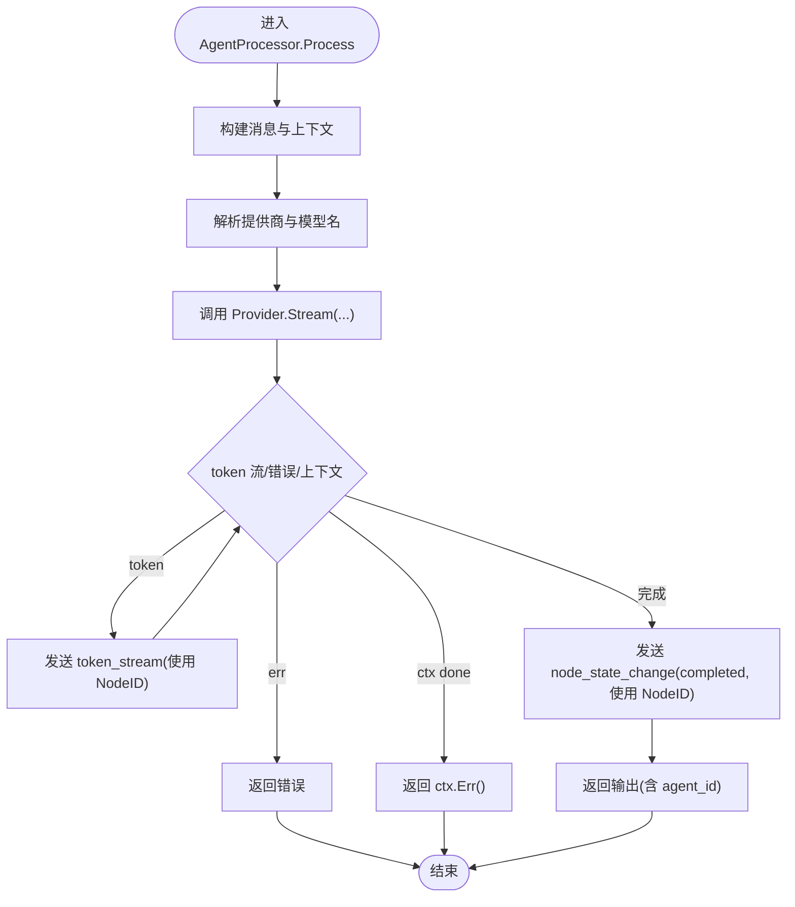
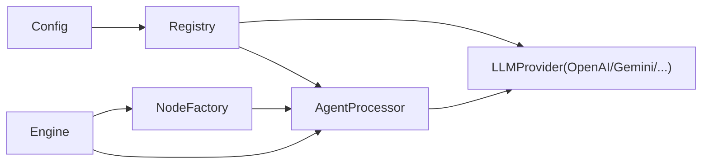

# 执行问题

<cite>
**本文引用的文件**
- [router.go](file://internal/infrastructure/llm/router.go)
- [config.go](file://internal/pkg/config/config.go)
- [agent.go](file://internal/core/workflow/nodes/agent.go)
- [factory.go](file://internal/core/workflow/nodes/factory.go)
- [engine.go](file://internal/core/workflow/engine.go)
- [2025-12-21-websocket-debugging-report.md](file://docs/reports/debugging/2025-12-21-websocket-debugging-report.md)
- [openai.go](file://internal/infrastructure/llm/openai.go)
- [gemini.go](file://internal/infrastructure/llm/gemini.go)
- [cost.go](file://internal/core/workflow/cost.go)
- [SPEC-609-architecture-fixes.md](file://docs/specs/sprint6/SPEC-609-architecture-fixes.md)
- [SPEC-105-model-selector.md](file://docs/specs/sprint2/SPEC-105-model-selector.md)
- [seeder.go](file://internal/resources/seeder.go)
</cite>

## 目录
1. [简介](#简介)
2. [项目结构](#项目结构)
3. [核心组件](#核心组件)
4. [架构总览](#架构总览)
5. [详细组件分析](#详细组件分析)
6. [依赖关系分析](#依赖关系分析)
7. [性能与稳定性考量](#性能与稳定性考量)
8. [故障排查指南](#故障排查指南)
9. [结论](#结论)

## 简介
本指南聚焦于工作流执行过程中的常见问题排查，围绕以下主题展开：
- LLM 调用超时与模型降级失败
- 节点执行卡死与并发控制
- 硬编码模型名称导致非 OpenAI 提供商无法正常工作
- Agent 节点执行时 AgentID 与 NodeID 混淆引发的标识错误
- 请求构造与响应处理的正确模式，确保多提供商兼容性

目标是帮助开发者快速定位问题根因，并给出可操作的修复与最佳实践路径。

## 项目结构
与“执行问题”直接相关的核心模块与文件如下：
- LLM 注册表与提供商适配：internal/infrastructure/llm/router.go、internal/pkg/config/config.go
- 工作流引擎与节点工厂：internal/core/workflow/engine.go、internal/core/workflow/nodes/factory.go
- Agent 节点处理器：internal/core/workflow/nodes/agent.go
- 多提供商实现示例：internal/infrastructure/llm/openai.go、internal/infrastructure/llm/gemini.go
- 成本估算与模型定价：internal/core/workflow/cost.go
- 历史调试报告与架构修复：docs/reports/debugging/2025-12-21-websocket-debugging-report.md、docs/specs/sprint6/SPEC-609-architecture-fixes.md
- 前端模型选择器与系统默认模型：docs/specs/sprint2/SPEC-105-model-selector.md、internal/resources/seeder.go

图表来源
- [router.go](file://internal/infrastructure/llm/router.go#L1-L177)
- [config.go](file://internal/pkg/config/config.go#L1-L133)
- [engine.go](file://internal/core/workflow/engine.go#L1-L246)
- [factory.go](file://internal/core/workflow/nodes/factory.go#L1-L106)
- [agent.go](file://internal/core/workflow/nodes/agent.go#L1-L130)

章节来源
- [router.go](file://internal/infrastructure/llm/router.go#L1-L177)
- [config.go](file://internal/pkg/config/config.go#L1-L133)
- [engine.go](file://internal/core/workflow/engine.go#L1-L246)
- [factory.go](file://internal/core/workflow/nodes/factory.go#L1-L106)
- [agent.go](file://internal/core/workflow/nodes/agent.go#L1-L130)

## 核心组件
- LLM 注册表 Registry：负责按名称解析提供商、缓存实例、按系统默认配置回退模型名。
- 工作流引擎 Engine：负责图遍历、节点执行、中间件钩子、并发控制与错误传播。
- 节点工厂 NodeFactory：根据节点类型与属性创建具体处理器，Agent 节点通过 node.ID 传入 NodeID。
- Agent 节点处理器 AgentProcessor：负责拉取 Agent 人设、构造请求、调用 LLM、流式输出与状态上报。
- 多提供商客户端：OpenAI、Gemini 等，统一实现 LLMProvider 接口，支持模型名回退策略。

章节来源
- [router.go](file://internal/infrastructure/llm/router.go#L1-L177)
- [engine.go](file://internal/core/workflow/engine.go#L1-L246)
- [factory.go](file://internal/core/workflow/nodes/factory.go#L1-L106)
- [agent.go](file://internal/core/workflow/nodes/agent.go#L1-L130)
- [openai.go](file://internal/infrastructure/llm/openai.go#L1-L64)
- [gemini.go](file://internal/infrastructure/llm/gemini.go#L1-L81)

## 架构总览
下图展示从模板到执行、再到流式事件的端到端链路，以及关键的 ID 传递与模型解析路径。

图表来源
- [factory.go](file://internal/core/workflow/nodes/factory.go#L50-L60)
- [agent.go](file://internal/core/workflow/nodes/agent.go#L23-L124)
- [router.go](file://internal/infrastructure/llm/router.go#L34-L108)

章节来源
- [factory.go](file://internal/core/workflow/nodes/factory.go#L1-L106)
- [agent.go](file://internal/core/workflow/nodes/agent.go#L1-L130)
- [router.go](file://internal/infrastructure/llm/router.go#L1-L177)

## 详细组件分析

### Agent 节点处理器与 ID 传递链路
- NodeFactory 将 node.ID 作为 NodeID 传给 AgentProcessor，同时从 node.Properties 读取 agent_id 作为 AgentID。
- AgentProcessor 在流事件中使用 NodeID 上报状态与 token，避免使用 AgentID 导致前端显示异常。
- 调用链：NodeFactory → AgentProcessor → Registry → Provider → 流式返回。

图表来源
- [factory.go](file://internal/core/workflow/nodes/factory.go#L50-L60)
- [agent.go](file://internal/core/workflow/nodes/agent.go#L16-L21)
- [router.go](file://internal/infrastructure/llm/router.go#L132-L150)
- [engine.go](file://internal/core/workflow/engine.go#L40-L119)

章节来源
- [factory.go](file://internal/core/workflow/nodes/factory.go#L1-L106)
- [agent.go](file://internal/core/workflow/nodes/agent.go#L1-L130)
- [2025-12-21-websocket-debugging-report.md](file://docs/reports/debugging/2025-12-21-websocket-debugging-report.md#L55-L90)

### 请求构造与响应处理模式
- 请求构造：AgentProcessor 从 Agent 人设与输入上下文构建消息列表，读取 Agent 的模型配置，必要时回退到 Registry.GetDefaultModel()。
- 响应处理：Provider 返回 token 流，AgentProcessor 将每个 token 以 token_stream 事件发送；完成后发送 node_state_change(completed)。
- 错误处理：上下文取消、Provider 错误、节点找不到等均通过 Engine.emitError 统一上报。

图表来源
- [agent.go](file://internal/core/workflow/nodes/agent.go#L23-L124)
- [router.go](file://internal/infrastructure/llm/router.go#L132-L150)
- [engine.go](file://internal/core/workflow/engine.go#L173-L182)

章节来源
- [agent.go](file://internal/core/workflow/nodes/agent.go#L1-L130)
- [engine.go](file://internal/core/workflow/engine.go#L1-L246)

### 多提供商兼容性与默认模型
- Registry.GetLLMProvider 支持空/默认解析，按系统默认 provider 解析 API Key/BaseURL。
- Registry.GetDefaultModel 优先使用系统默认模型，否则按 provider 回退到已知模型名。
- OpenAI/Gemini 客户端在请求模型为空时各自设置默认模型，确保兜底可用。

章节来源
- [router.go](file://internal/infrastructure/llm/router.go#L34-L150)
- [openai.go](file://internal/infrastructure/llm/openai.go#L34-L64)
- [gemini.go](file://internal/infrastructure/llm/gemini.go#L35-L81)
- [config.go](file://internal/pkg/config/config.go#L23-L43)

## 依赖关系分析
- Registry 依赖全局配置 Config，用于系统默认 provider/API Key/BaseURL/Model。
- NodeFactory 依赖 Registry 与 Agent 仓储，创建 AgentProcessor 并注入 NodeID/AgentID。
- Engine 依赖 NodeFactory，负责并发执行、中间件钩子与错误传播。
- AgentProcessor 依赖 Registry 与 Agent 仓储，负责模型解析与流式输出。

图表来源
- [config.go](file://internal/pkg/config/config.go#L1-L133)
- [router.go](file://internal/infrastructure/llm/router.go#L1-L177)
- [factory.go](file://internal/core/workflow/nodes/factory.go#L1-L106)
- [agent.go](file://internal/core/workflow/nodes/agent.go#L1-L130)
- [engine.go](file://internal/core/workflow/engine.go#L1-L246)

章节来源
- [config.go](file://internal/pkg/config/config.go#L1-L133)
- [router.go](file://internal/infrastructure/llm/router.go#L1-L177)
- [factory.go](file://internal/core/workflow/nodes/factory.go#L1-L106)
- [agent.go](file://internal/core/workflow/nodes/agent.go#L1-L130)
- [engine.go](file://internal/core/workflow/engine.go#L1-L246)

## 性能与稳定性考量
- 并发执行：Engine 对分支节点采用 goroutine 并行执行，注意资源竞争与上下文生命周期管理。
- 流式输出：AgentProcessor 使用 channel 接收 token 流，需确保上游 Provider 的流式接口稳定。
- 成本估算：成本映射表包含常见模型价格，便于估算与告警阈值设置。
- 降级策略：当 Agent 自身模型配置缺失时，使用 Registry.GetDefaultModel() 进行回退，避免执行中断。

章节来源
- [engine.go](file://internal/core/workflow/engine.go#L141-L159)
- [cost.go](file://internal/core/workflow/cost.go#L1-L40)
- [agent.go](file://internal/core/workflow/nodes/agent.go#L73-L78)
- [router.go](file://internal/infrastructure/llm/router.go#L132-L150)

## 故障排查指南

### 场景一：LLM 调用超时
- 现象
  - Agent 节点长时间无响应，token_stream 不断，最终 ctx 超时返回。
- 根因定位
  - 上游 Provider 的网络/鉴权/限流异常。
  - 请求模型名为空导致兜底模型不可用或不匹配。
- 快速检查
  - 确认 Agent 的模型配置是否为空，若为空，是否能正确回退到 Registry.GetDefaultModel()。
  - 检查 Provider 初始化是否成功（API Key/BaseURL 是否正确）。
  - 检查上下文是否提前取消（如前端关闭连接）。
- 修复建议
  - 在 AgentProcessor.Process 中确认模型名解析与兜底逻辑。
  - 为 Provider 调用设置合理超时与重试策略（在上层封装或中间件中）。
  - 若为 Ollama/自建代理，确认 BaseURL 配置与可达性。

章节来源
- [agent.go](file://internal/core/workflow/nodes/agent.go#L63-L78)
- [router.go](file://internal/infrastructure/llm/router.go#L34-L108)
- [engine.go](file://internal/core/workflow/engine.go#L99-L110)

### 场景二：模型降级失败
- 现象
  - Agent 节点报错“未知提供商类型”或“未实现提供商”，导致执行中断。
- 根因定位
  - Registry.GetLLMProvider 无法识别 provider 名称或未配置对应 API Key。
  - Config 中 LLM.Provider 与 LLM.APIKey/BaseURL 不匹配。
- 快速检查
  - 检查 Config.LLM.Provider 与各提供商 API Key 环境变量是否正确加载。
  - 检查 Registry.createProvider 的分支是否覆盖目标提供商。
- 修复建议
  - 补充环境变量或在 Config 中显式设置 LLM.Provider/Llm.APIKey/BaseURL。
  - 在 Registry.createProvider 中补充缺失的提供商分支或修正大小写。

章节来源
- [router.go](file://internal/infrastructure/llm/router.go#L110-L129)
- [config.go](file://internal/pkg/config/config.go#L113-L132)

### 场景三：节点执行卡死
- 现象
  - 并行分支未完成，或下游节点未触发，整体停滞。
- 根因定位
  - 并发等待未释放（wg.Wait 未触发）或下游节点未创建。
  - 中间件阻断或节点返回 ErrSuspended 导致暂停。
- 快速检查
  - 检查 Engine.executeNode 对并行分支的处理逻辑。
  - 检查中间件 BeforeNodeExecution/AfterNodeExecution 是否返回错误。
  - 检查节点是否返回 ErrSuspended 导致状态停留在 Suspended。
- 修复建议
  - 确保并行分支均正确创建 goroutine 并等待。
  - 为中间件增加日志与超时保护，避免阻塞。
  - 对 Suspended 节点提供 ResumeNode 的正确调用与状态恢复。

章节来源
- [engine.go](file://internal/core/workflow/engine.go#L141-L159)
- [engine.go](file://internal/core/workflow/engine.go#L92-L120)
- [engine.go](file://internal/core/workflow/engine.go#L183-L245)

### 场景四：硬编码模型名称导致非 OpenAI 提供商无法正常工作
- 现象
  - 使用固定模型名（如 gpt-4）在非 OpenAI 提供商上不可用，导致调用失败。
- 根因定位
  - 代码中存在硬编码模型名，未通过 Registry.GetDefaultModel() 动态获取。
- 快速检查
  - 搜索代码库是否存在硬编码模型名（如 gpt-4、gemini-* 等）。
  - 确认 AgentProcessor 在模型为空时调用 Registry.GetDefaultModel()。
- 修复建议
  - 统一通过 Registry.GetDefaultModel() 获取系统默认模型，避免硬编码。
  - 在前端模型选择器中提供多提供商模型列表，确保与后端 Registry 支持的模型一致。

章节来源
- [SPEC-105-model-selector.md](file://docs/specs/sprint2/SPEC-105-model-selector.md#L50-L139)
- [seeder.go](file://internal/resources/seeder.go#L349-L383)
- [router.go](file://internal/infrastructure/llm/router.go#L132-L150)
- [agent.go](file://internal/core/workflow/nodes/agent.go#L73-L78)

### 场景五：AgentID 与 NodeID 混淆引发的标识错误
- 现象
  - 前端显示的节点标识为 Agent UUID，而非节点逻辑 ID。
- 根因定位
  - 事件中 node_id 使用了 AgentID，而非 NodeID。
- 快速检查
  - 检查 AgentProcessor 在发送 node_state_change/token_stream 时使用的 node_id。
  - 检查 NodeFactory 是否正确传入 node.ID 作为 NodeID。
- 修复建议
  - 在 AgentProcessor 中使用 NodeID 上报事件，确保前端显示与交互一致。
  - 明确 AgentProcessor 的 AgentID 语义：仅用于数据库查询，不参与事件标识。

章节来源
- [agent.go](file://internal/core/workflow/nodes/agent.go#L23-L29)
- [agent.go](file://internal/core/workflow/nodes/agent.go#L92-L97)
- [2025-12-21-websocket-debugging-report.md](file://docs/reports/debugging/2025-12-21-websocket-debugging-report.md#L55-L90)
- [factory.go](file://internal/core/workflow/nodes/factory.go#L50-L60)

### 场景六：节点执行卡死（并发与上下文）
- 现象
  - 并行节点执行后，主线程未等待或下游节点未触发。
- 根因定位
  - 并发执行未正确等待，或上下文过早结束。
- 快速检查
  - 检查 Engine.executeNode 对并行分支的 wg.Add/Wait。
  - 检查 ResumeNode 是否在后台 goroutine 中继续推进后续节点。
- 修复建议
  - 确保并行分支均加入 WaitGroup 并等待完成。
  - 对 ResumeNode 的后续推进使用持久化上下文或 Session 上下文。

章节来源
- [engine.go](file://internal/core/workflow/engine.go#L141-L159)
- [engine.go](file://internal/core/workflow/engine.go#L200-L245)

## 结论
- 通过 Registry.GetDefaultModel() 与多提供商适配，可有效避免硬编码模型名带来的兼容性问题。
- 明确区分 AgentID 与 NodeID 的语义，确保事件标识与前端显示一致。
- 在 Engine 层面加强并发与上下文管理，配合中间件与错误传播机制，提升整体稳定性。
- 建议在上层引入超时与重试策略，完善 Provider 层的错误诊断与日志记录，以便快速定位问题。