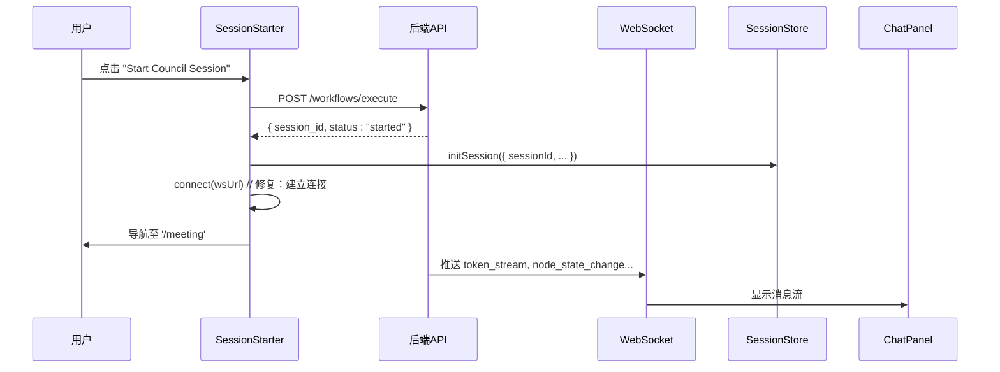
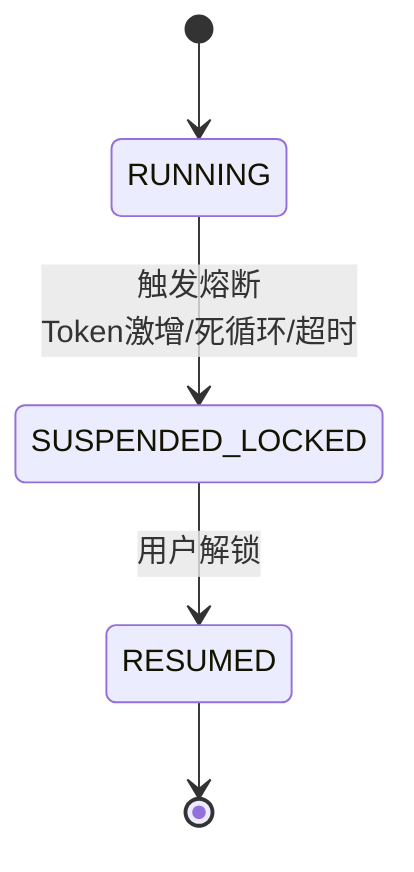

# 故障排除

<cite>
**本文档引用的文件**
- [2025-12-21-websocket-debugging-report.md](file://docs/reports/debugging/2025-12-21-websocket-debugging-report.md)
- [SPEC-703-session-ws-connect-fix.md](file://docs/specs/sprint7/SPEC-703-session-ws-connect-fix.md)
- [SPEC-409-circuit-breaker.md](file://docs/specs/backend/SPEC-409-circuit-breaker.md)
- [hub.go](file://internal/api/ws/hub.go)
- [engine.go](file://internal/core/workflow/engine.go)
- [session.go](file://internal/core/workflow/session.go)
- [circuit_breaker.go](file://internal/core/middleware/circuit_breaker.go)
- [cost.go](file://internal/core/workflow/cost.go)
- [useWebSocketRouter.ts](file://frontend/src/hooks/useWebSocketRouter.ts)
- [useSessionStore.ts](file://frontend/src/stores/useSessionStore.ts)
- [SessionStarter.tsx](file://frontend/src/features/meeting/SessionStarter.tsx)
- [MeetingRoom.tsx](file://frontend/src/features/meeting/MeetingRoom.tsx)
- [audit_report.md](file://docs/reports/audits/audit_report.md)
- [history_summary.md](file://docs/reports/debates/history_summary.md)
</cite>

## 目录
1. [引言](#引言)
2. [常见问题诊断与解决](#常见问题诊断与解决)
   1. [WebSocket连接失败](#websocket连接失败)
   2. [LLM调用超时](#llm调用超时)
   3. [工作流执行卡死](#工作流执行卡死)
   4. [成本估算偏差](#成本估算偏差)
3. [系统内置调试工具使用方法](#系统内置调试工具使用方法)
   1. [查看审计报告](#查看审计报告)
   2. [分析辩论日志](#分析辩论日志)
   3. [监控熔断器状态](#监控熔断器状态)
4. [解读系统警示信号](#解读系统警示信号)
   1. [‘Verify Pending’标记](#verify-pending标记)
   2. [‘SUSPENDED (LOCKED)’状态](#suspended-locked状态)
5. [日志分析技巧与性能瓶颈定位](#日志分析技巧与性能瓶颈定位)
6. [结论](#结论)

## 引言

本故障排除指南旨在帮助用户诊断和解决在使用“Council”系统时可能遇到的常见问题。该系统是一个基于工作流的AI决策平台，通过协调多个AI代理（Agents）进行辩论和决策。在使用过程中，用户可能会遇到如WebSocket连接失败、LLM调用超时、工作流执行卡死或成本估算偏差等问题。本指南将深入分析这些问题的根本原因，并提供详细的解决步骤。同时，我们将介绍系统内置的调试工具，如审计报告和辩论日志，以及如何解读系统发出的关键警示信号，如“Verify Pending”和“SUSPENDED (LOCKED)”，以帮助用户更好地理解和控制系统行为。

**本文档引用的文件**
- [2025-12-21-websocket-debugging-report.md](file://docs/reports/debugging/2025-12-21-websocket-debugging-report.md)
- [SPEC-703-session-ws-connect-fix.md](file://docs/specs/sprint7/SPEC-703-session-ws-connect-fix.md)
- [hub.go](file://internal/api/ws/hub.go)
- [useWebSocketRouter.ts](file://frontend/src/hooks/useWebSocketRouter.ts)
- [useSessionStore.ts](file://frontend/src/stores/useSessionStore.ts)
- [SessionStarter.tsx](file://frontend/src/features/meeting/SessionStarter.tsx)
- [MeetingRoom.tsx](file://frontend/src/features/meeting/MeetingRoom.tsx)

## 常见问题诊断与解决

### WebSocket连接失败

**问题描述**：用户在启动会议会话后，前端无法接收和显示来自后端的实时消息，UI状态停留在“IDLE”，导致会议无法正常进行。

**根本原因分析**：
根据`2025-12-21-websocket-debugging-report.md`的复盘报告，WebSocket连接失败的根本原因是一个多层问题，涉及连接建立、消息格式和状态同步：
1.  **连接未建立**：前端组件`SessionStarter.tsx`在成功调用后端API启动会话后，仅初始化了本地状态，但**未调用`useConnectStore.connect()`来建立WebSocket连接**。这导致后端虽然在推送消息，但前端没有通道接收。
2.  **消息格式不匹配**：前后端对WebSocket消息的JSON字段命名约定不一致。后端Go代码使用`json:"type"`，而前端TypeScript代码期望`event`字段，导致消息被静默丢弃。
3.  **状态同步缺失**：后端未发送显式的`execution:started`事件，前端`useWebSocketRouter.ts`仅通过`node_state_change`事件来更新节点状态，未能自动将会话（Session）状态从`idle`更新为`running`。

**解决方案**：
1.  **修复连接建立逻辑**：在`SessionStarter.tsx`中，于`initSession()`之后，立即调用`useConnectStore.getState().connect(wsUrl)`来建立WebSocket连接。
2.  **优化连接生命周期**：在`MeetingRoom.tsx`中添加`useEffect`钩子，当检测到会话存在但WebSocket连接断开时，自动尝试重连，以应对页面刷新等场景。
3.  **统一消息格式**：将后端`StreamEvent`结构体的JSON标签从`type`改为`event`，确保与前端定义的`WSMessage`接口完全匹配。
4.  **同步会话状态**：在前端`useWebSocketRouter.ts`中，当接收到第一个`running`状态的`node_state_change`事件时，主动调用`sessionStore.updateSessionStatus('running')`来更新会话状态。

**Diagram sources**
- [SPEC-703-session-ws-connect-fix.md](file://docs/specs/sprint7/SPEC-703-session-ws-connect-fix.md#L16-L35)
- [SessionStarter.tsx](file://frontend/src/features/meeting/SessionStarter.tsx#L109-L132)
- [MeetingRoom.tsx](file://frontend/src/features/meeting/MeetingRoom.tsx#L136-L158)

**本文档引用的文件**
- [2025-12-21-websocket-debugging-report.md](file://docs/reports/debugging/2025-12-21-websocket-debugging-report.md#L18-L52)
- [SPEC-703-session-ws-connect-fix.md](file://docs/specs/sprint7/SPEC-703-session-ws-connect-fix.md)
- [hub.go](file://internal/api/ws/hub.go)
- [useWebSocketRouter.ts](file://frontend/src/hooks/useWebSocketRouter.ts)
- [useSessionStore.ts](file://frontend/src/stores/useSessionStore.ts)
- [SessionStarter.tsx](file://frontend/src/features/meeting/SessionStarter.tsx)

### LLM调用超时

**问题描述**：在工作流执行过程中，某个LLM节点长时间无响应，最终导致整个工作流超时或进入“卡死”状态。

**根本原因分析**：
LLM调用超时通常由以下原因引起：
1.  **外部服务延迟**：所使用的LLM提供商（如OpenAI, Gemini）的API服务出现暂时性延迟或拥塞。
2.  **输入内容过长**：发送给LLM的提示词（Prompt）过长，导致模型处理时间超出预期。
3.  **网络问题**：客户端与LLM提供商之间的网络连接不稳定。
4.  **系统熔断器触发**：系统内置的熔断器（Circuit Breaker）检测到执行时间过长，主动中断了任务。

**解决方案**：
1.  **检查熔断器配置**：查阅`SPEC-409-circuit-breaker.md`，确认熔断器的超时阈值（默认为10分钟）。如果您的任务是合理的长任务，可以考虑在工作流配置中调整此阈值。
2.  **优化提示词**：检查超时节点的提示词，尝试缩短长度或简化逻辑，以减少LLM的处理负担。
3.  **切换LLM提供商**：在`llm-providers.md`中查看其他可用的提供商。如果当前提供商持续不稳定，可以在Agent配置中切换到另一个更可靠的提供商。
4.  **重试机制**：系统通常具备自动重试机制。如果超时是偶发的，可以等待系统自动重试或手动重启工作流。
5.  **监控日志**：查看后端日志，确认超时是发生在与LLM提供商的通信阶段，还是在本地处理阶段。

**本文档引用的文件**
- [SPEC-409-circuit-breaker.md](file://docs/specs/backend/SPEC-409-circuit-breaker.md#L14)
- [engine.go](file://internal/core/workflow/engine.go)
- [circuit_breaker.go](file://internal/core/middleware/circuit_breaker.go)

### 工作流执行卡死

**问题描述**：工作流在执行到某个节点后停止响应，既不前进也不报错，处于“卡死”状态。

**根本原因分析**：
工作流“卡死”通常不是真正的死锁，而是由以下几种情况导致：
1.  **无限循环**：工作流图中存在循环（如`Loop`节点），且退出条件（如最大轮数、分数阈值）未被正确配置或触发。尽管`validation.go`允许图中存在循环，但运行时保护机制（如`LoopProcessor`）必须正确实现。
2.  **依赖节点未完成**：当前节点依赖于一个或多个并行分支的完成，但其中一个分支因错误或超时而停滞。
3.  **人为暂停**：工作流被手动暂停（`SessionPaused`），但未收到恢复指令。
4.  **熔断器锁定**：熔断器因检测到异常（如Token消耗激增、死循环）而将工作流状态锁定为`SUSPENDED_LOCKED`。

**解决方案**：
1.  **检查循环配置**：审查工作流中`Loop`节点的`properties`，确认`max_rounds`和`exit_on_score`等退出条件已正确设置。
2.  **查看节点状态**：通过前端UI或直接查询`useSessionStore`中的`currentSession.nodes`状态，检查所有并行分支的节点是否都处于`completed`或`failed`状态。
3.  **检查暂停状态**：确认会话状态是否为`paused`。如果是，使用控制栏上的“Resume”按钮恢复执行。
4.  **检查熔断器状态**：这是最常见的原因。如果状态为`SUSPENDED (LOCKED)`，请参考“监控熔断器状态”章节进行解锁。

**本文档引用的文件**
- [engine.go](file://internal/core/workflow/engine.go#L130-L138)
- [session.go](file://internal/core/workflow/session.go#L74-L89)
- [validation.go](file://internal/core/workflow/validation.go#L54-L70)
- [SPEC-409-circuit-breaker.md](file://docs/specs/backend/SPEC-409-circuit-breaker.md)

### 成本估算偏差

**问题描述**：系统预估的执行成本与实际产生的成本存在显著偏差。

**根本原因分析**：
成本估算偏差主要源于估算模型的简化假设：
1.  **静态Token假设**：成本估算函数`EstimateWorkflowCost`在`cost.go`中使用了固定的平均值（1000输入Token，500输出Token）来估算每个LLM节点的成本，而实际的Token消耗量会根据输入内容和模型输出动态变化。
2.  **模型价格未更新**：`ModelPricing`映射表中的价格可能未及时更新，与LLM提供商的最新定价存在出入。
3.  **未计入非LLM节点开销**：估算仅针对LLM节点，忽略了其他可能产生费用的组件（如搜索服务、向量数据库等）。

**解决方案**：
1.  **理解估算性质**：认识到成本估算是一种**启发式估算**，而非精确计费。它主要用于在执行前提供一个成本量级的参考。
2.  **查看实际消耗**：工作流执行过程中，系统会通过`token_usage`事件实时报告每个节点的实际Token消耗和成本。这些数据会累积到`useSessionStore`的`totalTokens`和`totalCostUsd`中，这是最准确的成本来源。
3.  **优化估算模型**：未来版本可改进估算逻辑，例如通过分析提示词模板来更精确地预测输入Token数。

**本文档引用的文件**
- [cost.go](file://internal/core/workflow/cost.go#L43-L49)
- [useSessionStore.ts](file://frontend/src/stores/useSessionStore.ts#L239-L242)
- [useWebSocketRouter.ts](file://frontend/src/hooks/useWebSocketRouter.ts#L55-L67)

## 系统内置调试工具使用方法

### 查看审计报告

**工具说明**：审计报告（Audit Report）是对系统实现与设计规范（PRD/TDD）之间符合度的全面检查。它帮助开发者和高级用户了解系统当前的功能覆盖情况和存在的技术债务。

**使用方法**：
1.  **定位文件**：审计报告位于`docs/reports/audits/`目录下，例如`audit_report.md`。
2.  **解读内容**：
    *   **后端审计**：检查工作流引擎、记忆系统、API层等模块的实现状态。例如，报告会指出`VoteProcessor`和`LoopProcessor`等关键节点处理器尚未实现。
    *   **前端审计**：评估状态管理、UI组件的完成度。例如，报告曾指出`useSessionStore`状态严重缺失，无法支撑运行模式。
    *   **总结评估**：关注“关键阻断项”和“技术债务”列表，这些是影响系统稳定性和功能完整性的核心问题。

**本文档引用的文件**
- [audit_report.md](file://docs/reports/audits/audit_report.md)

### 分析辩论日志

**工具说明**：辩论日志（Debate Reports）记录了系统内部AI代理之间进行决策讨论的完整过程。这些日志对于理解系统决策逻辑、调试复杂行为和验证AI输出的合理性至关重要。

**使用方法**：
1.  **定位文件**：辩论日志存储在`docs/reports/debates/`目录下，文件名格式为`debate_YYYYMMDD_HHMMSS.md`。
2.  **分析内容**：
    *   **决策结果**：查看`Verdict`（裁决）分数，判断本次讨论是否通过。
    *   **关键结论**：阅读`Key Outcomes`部分，了解代理们达成的主要共识和采取的行动。例如，日志`history_summary.md`显示，系统通过辩论识别出安全风险并实施了“入口过滤器”。
    *   **讨论过程**：深入日志内容，分析正反方代理的论点，理解系统是如何权衡利弊并做出最终决定的。

**本文档引用的文件**
- [history_summary.md](file://docs/reports/debates/history_summary.md)

### 监控熔断器状态

**工具说明**：熔断器（Circuit Breaker）是系统的安全防护机制，用于防止失控的执行（如无限循环、成本爆炸）。当触发条件时，它会将工作流状态锁定为`SUSPENDED_LOCKED`。

**使用方法**：
1.  **识别触发条件**：根据`SPEC-409-circuit-breaker.md`，熔断器会在以下情况触发：
    *   **Token消耗激增**：实际Token消耗超过预估的3倍。
    *   **死循环检测**：连续3轮对话的熵值低于0.1，表明内容高度重复。
    *   **执行超时**：总执行时间超过10分钟。
2.  **前端交互**：当熔断器触发时，前端会弹出一个模态框（Modal），显示触发原因和风险陈述。用户必须填写风险说明或完成三项安全自查才能解锁并继续执行。
3.  **后端监控**：开发者可以通过日志或调试接口监控`CircuitBreaker`的`Monitor`协程，观察其对`StreamEvent`的监控和判断逻辑。

**Diagram sources**
- [SPEC-409-circuit-breaker.md](file://docs/specs/backend/SPEC-409-circuit-breaker.md#L20-L30)
- [circuit_breaker.go](file://internal/core/middleware/circuit_breaker.go)

**本文档引用的文件**
- [SPEC-409-circuit-breaker.md](file://docs/specs/backend/SPEC-409-circuit-breaker.md)
- [circuit_breaker.go](file://internal/core/middleware/circuit_breaker.go)

## 解读系统警示信号

### ‘Verify Pending’标记

**信号说明**：`Verify Pending`标记通常出现在系统处理需要验证的数据时，例如新生成的内容或从外部来源获取的信息。它表示该数据已被创建，但尚未经过事实核查（Fact-Check）或人类审查（Human Review）流程。

**应对策略**：
1.  **等待自动处理**：如果工作流中配置了`FactCheckProcessor`，系统会自动对该内容进行验证，标记会随之消失。
2.  **手动介入**：如果工作流需要人工干预，该标记会提示用户需要进行审查。用户应检查相关内容，并通过`HumanReviewModal`提供反馈或批准。
3.  **检查工作流设计**：如果`Verify Pending`状态长时间不消失，检查工作流中是否缺少必要的`FactCheck`或`HumanReview`节点。

**本文档引用的文件**
- [SPEC-404-factcheck-processor.md](file://docs/specs/backend/SPEC-404-factcheck-processor.md)
- [SPEC-405-human-review-processor.md](file://docs/specs/backend/SPEC-405-human-review-processor.md)

### ‘SUSPENDED (LOCKED)’状态

**信号说明**：`SUSPENDED (LOCKED)`是熔断器触发后的状态，表示工作流因检测到高风险行为而被强制暂停。这是一种保护机制，防止系统资源被滥用或产生意外的高额费用。

**应对策略**：
1.  **查看原因**：首先在前端模态框或后端日志中查看`LockReason`，明确是`TOKEN_SURGE`、`LOOP_DETECTED`还是`TIMEOUT`。
2.  **评估风险**：仔细阅读`LockMessage`，理解系统判断的依据。
3.  **解锁决策**：
    *   如果确认是误报或风险可控，可以通过填写风险陈述或完成安全自查来解锁。
    *   如果同意系统判断，应终止该工作流并检查工作流设计，优化提示词或调整参数以避免再次触发。
4.  **预防措施**：在设计工作流时，合理设置循环次数、成本预算和超时时间，从根本上降低触发熔断器的概率。

**本文档引用的文件**
- [SPEC-409-circuit-breaker.md](file://docs/specs/backend/SPEC-409-circuit-breaker.md#L47-L48)
- [engine.go](file://internal/core/workflow/engine.go#L103-L105)

## 日志分析技巧与性能瓶颈定位

**日志分析技巧**：
1.  **分层分析**：从应用层日志（如`hub.go`中的WebSocket连接日志）开始，逐步深入到业务逻辑层（如`engine.go`中的节点执行日志）和外部调用层（如LLM客户端的日志）。
2.  **关联事件**：利用`session_id`和`node_id`作为关键字，将分散在不同日志中的相关事件串联起来，形成完整的执行轨迹。
3.  **关注错误和警告**：优先排查`log.Printf`和`emitError`等输出的错误信息，它们直接指明了问题所在。

**性能瓶颈定位**：
1.  **识别慢节点**：通过`token_usage`事件报告的实际Token消耗和耗时，找出成本最高或耗时最长的节点。
2.  **分析LLM调用**：检查慢节点的输入Prompt，判断是否因内容过长或过于复杂导致LLM处理缓慢。
3.  **检查并行效率**：利用`node:parallel_start`事件，分析并行分支的启动和完成时间，确认是否存在某个分支拖慢了整体进度。
4.  **系统资源监控**：结合外部工具（如Lighthouse）进行性能审计，检查前端构建包大小、加载时间和运行时性能。

**本文档引用的文件**
- [hub.go](file://internal/api/ws/hub.go#L113)
- [engine.go](file://internal/core/workflow/engine.go#L174)
- [useWebSocketRouter.ts](file://frontend/src/hooks/useWebSocketRouter.ts)

## 结论

本指南系统地梳理了“Council”平台的常见故障及其解决方案。从WebSocket连接失败到LLM调用超时，再到工作流卡死和成本偏差，我们深入剖析了每个问题的技术根源。关键在于理解系统的两大核心机制：一是基于`useWebSocketRouter`和`useSessionStore`的实时通信与状态同步，二是由`CircuitBreaker`驱动的安全防护体系。通过善用审计报告和辩论日志等内置工具，并正确解读`Verify Pending`和`SUSPENDED (LOCKED)`等警示信号，用户可以有效地诊断问题、优化工作流并确保系统的稳定高效运行。