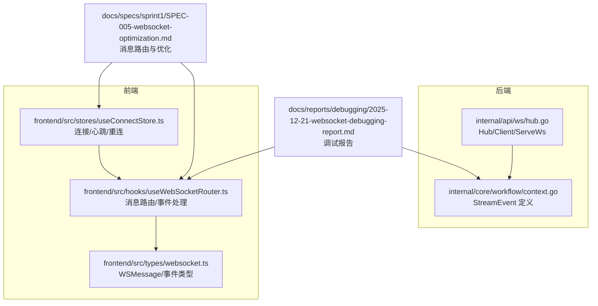
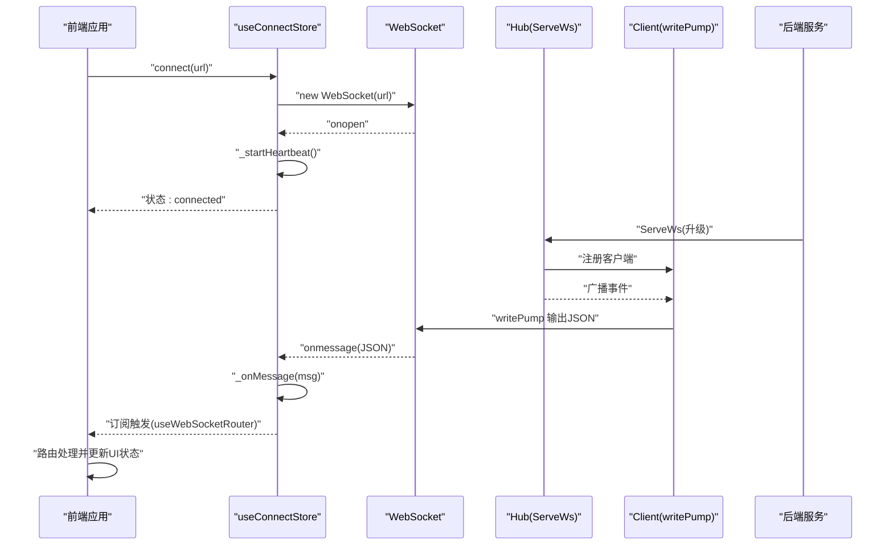
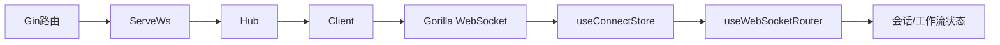
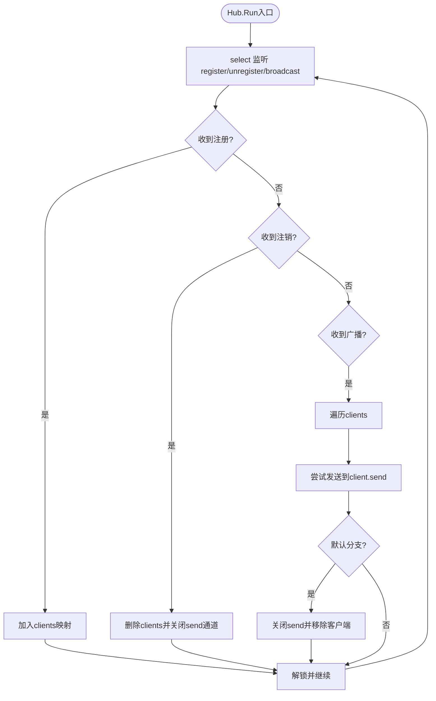

# 连接问题

<cite>
**本文引用的文件**
- [hub.go](file://internal/api/ws/hub.go)
- [context.go](file://internal/core/workflow/context.go)
- [useWebSocketRouter.ts](file://frontend/src/hooks/useWebSocketRouter.ts)
- [websocket.ts](file://frontend/src/types/websocket.ts)
- [useConnectStore.ts](file://frontend/src/stores/useConnectStore.ts)
- [SPEC-005-websocket-optimization.md](file://docs/specs/sprint1/SPEC-005-websocket-optimization.md)
- [SPEC-703-session-ws-connect-fix.md](file://docs/specs/sprint7/SPEC-703-session-ws-connect-fix.md)
- [2025-12-21-websocket-debugging-report.md](file://docs/reports/debugging/2025-12-21-websocket-debugging-report.md)
- [hub_test.go](file://internal/api/ws/hub_test.go)
</cite>

## 目录
1. [简介](#简介)
2. [项目结构](#项目结构)
3. [核心组件](#核心组件)
4. [架构总览](#架构总览)
5. [详细组件分析](#详细组件分析)
6. [依赖关系分析](#依赖关系分析)
7. [性能考量](#性能考量)
8. [故障排除指南](#故障排除指南)
9. [结论](#结论)
10. [附录](#附录)

## 简介
本指南聚焦于WebSocket连接问题的系统性排查与修复，覆盖以下关键场景：
- WebSocket升级失败、客户端注册异常
- 消息静默丢失（前后端消息格式不一致）
- 会话状态不更新（缺少显式状态事件）
- 广播通道阻塞、写泵关闭与客户端断开
- 前端useWebSocketRouter钩子事件处理调试方法
- 日志定位与修复前后对比

目标是帮助开发者快速定位问题根因，理解连接管理机制，并给出可操作的修复步骤与最佳实践。

## 项目结构
围绕WebSocket通信的关键文件分布如下：
- 后端：WebSocket Hub与升级入口、工作流事件模型
- 前端：连接状态管理、消息路由与事件类型定义
- 文档：协议优化、连接修复与调试报告



图表来源
- [hub.go](file://internal/api/ws/hub.go#L1-L124)
- [context.go](file://internal/core/workflow/context.go#L1-L36)
- [useConnectStore.ts](file://frontend/src/stores/useConnectStore.ts#L1-L128)
- [useWebSocketRouter.ts](file://frontend/src/hooks/useWebSocketRouter.ts#L1-L126)
- [websocket.ts](file://frontend/src/types/websocket.ts#L1-L52)
- [SPEC-005-websocket-optimization.md](file://docs/specs/sprint1/SPEC-005-websocket-optimization.md#L1-L355)
- [2025-12-21-websocket-debugging-report.md](file://docs/reports/debugging/2025-12-21-websocket-debugging-report.md#L1-L272)

章节来源
- [hub.go](file://internal/api/ws/hub.go#L1-L124)
- [context.go](file://internal/core/workflow/context.go#L1-L36)
- [useConnectStore.ts](file://frontend/src/stores/useConnectStore.ts#L1-L128)
- [useWebSocketRouter.ts](file://frontend/src/hooks/useWebSocketRouter.ts#L1-L126)
- [websocket.ts](file://frontend/src/types/websocket.ts#L1-L52)
- [SPEC-005-websocket-optimization.md](file://docs/specs/sprint1/SPEC-005-websocket-optimization.md#L1-L355)
- [2025-12-21-websocket-debugging-report.md](file://docs/reports/debugging/2025-12-21-websocket-debugging-report.md#L1-L272)

## 核心组件
- Hub/Client/WritePump：后端负责连接升级、客户端注册、广播事件与写泵输出
- StreamEvent：后端事件载体，序列化为JSON
- useConnectStore：前端连接生命周期、心跳、重连与消息透传
- useWebSocketRouter：前端消息路由与UI状态更新
- WSMessage/事件类型：前端对消息格式的约定

章节来源
- [hub.go](file://internal/api/ws/hub.go#L1-L124)
- [context.go](file://internal/core/workflow/context.go#L1-L36)
- [useConnectStore.ts](file://frontend/src/stores/useConnectStore.ts#L1-L128)
- [useWebSocketRouter.ts](file://frontend/src/hooks/useWebSocketRouter.ts#L1-L126)
- [websocket.ts](file://frontend/src/types/websocket.ts#L1-L52)

## 架构总览
后端通过Gin路由将HTTP升级为WebSocket，Hub维护客户端集合并通过广播通道向所有客户端推送事件；前端通过Zustand连接状态存储订阅消息，useWebSocketRouter根据事件类型路由到会话与工作流状态管理。



图表来源
- [hub.go](file://internal/api/ws/hub.go#L109-L124)
- [useConnectStore.ts](file://frontend/src/stores/useConnectStore.ts#L40-L124)
- [useWebSocketRouter.ts](file://frontend/src/hooks/useWebSocketRouter.ts#L113-L126)

## 详细组件分析

### 后端 Hub/Client/ServeWs 与连接管理
- 升级与注册
  - ServeWs使用Upgrader将HTTP升级为WebSocket，失败时记录日志并返回
  - 创建Client并注册到Hub的register通道
- Hub运行循环
  - 维护clients映射，支持注册/注销
  - 广播通道向所有客户端发送事件；若发送阻塞，默认分支关闭通道并移除客户端
- Client写泵
  - writePump持续从send通道读取事件并编码为文本消息发送
  - 若通道关闭或写入错误，关闭连接

```mermaid
classDiagram
class Hub {
+clients map[Client]bool
+broadcast chan StreamEvent
+register chan Client
+unregister chan Client
+mu Mutex
+Run()
+Broadcast(event)
}
class Client {
+hub *Hub
+conn *websocket.Conn
+send chan StreamEvent
+writePump()
}
class StreamEvent {
+Type string
+Timestamp time
+NodeID string
+Data map[string]interface{}
}
Hub --> Client : "注册/注销"
Client --> Hub : "写回通道"
Hub --> StreamEvent : "广播"
```

图表来源
- [hub.go](file://internal/api/ws/hub.go#L1-L124)
- [context.go](file://internal/core/workflow/context.go#L1-L36)

章节来源
- [hub.go](file://internal/api/ws/hub.go#L1-L124)
- [context.go](file://internal/core/workflow/context.go#L1-L36)

### 前端连接与心跳/重连
- 连接状态
  - connect：创建WebSocket，设置状态，启动心跳
  - onclose：清理心跳定时器，按策略重连
  - onerror：记录错误
  - onmessage：解析JSON为WSMessage，写入_lastMessage供订阅
- 心跳与重连
  - 心跳周期固定，发送ping命令
  - 重连次数上限与指数退避延迟

章节来源
- [useConnectStore.ts](file://frontend/src/stores/useConnectStore.ts#L1-L128)
- [SPEC-005-websocket-optimization.md](file://docs/specs/sprint1/SPEC-005-websocket-optimization.md#L107-L208)

### 前端消息路由与事件处理
- 订阅_lastMessage，去重后路由到对应处理器
- 路由事件类型包括：token_stream、node_state_change、node:parallel_start、token_usage、execution:paused、execution:completed、error、human_interaction_required、node_resumed
- 更新会话与工作流状态，必要时自动将会话状态置为running

章节来源
- [useWebSocketRouter.ts](file://frontend/src/hooks/useWebSocketRouter.ts#L1-L126)
- [websocket.ts](file://frontend/src/types/websocket.ts#L1-L52)
- [SPEC-005-websocket-optimization.md](file://docs/specs/sprint1/SPEC-005-websocket-optimization.md#L208-L355)

### 消息格式不一致（JSON字段type与event）
- 问题根因
  - 后端StreamEvent使用JSON tag "event"（Go侧）
  - 前端WSMessage期望字段为event（TS侧）
  - 早期存在type与event混用导致消息静默丢失
- 修复要点
  - 统一字段名为event，确保前后端一致
  - 通过文档与工具保证类型同步，避免手动维护

章节来源
- [context.go](file://internal/core/workflow/context.go#L1-L36)
- [websocket.ts](file://frontend/src/types/websocket.ts#L1-L52)
- [2025-12-21-websocket-debugging-report.md](file://docs/reports/debugging/2025-12-21-websocket-debugging-report.md#L1-L272)

## 依赖关系分析
- 后端
  - Gin路由 -> ServeWs -> Hub -> Client -> Gorilla WebSocket
  - StreamEvent -> JSON编码 -> TextMessage
- 前端
  - useConnectStore -> WebSocket -> Zustand订阅 -> useWebSocketRouter
  - WSMessage/事件类型 -> 路由处理 -> 会话/工作流状态更新



图表来源
- [hub.go](file://internal/api/ws/hub.go#L109-L124)
- [useConnectStore.ts](file://frontend/src/stores/useConnectStore.ts#L1-L128)
- [useWebSocketRouter.ts](file://frontend/src/hooks/useWebSocketRouter.ts#L1-L126)

章节来源
- [hub.go](file://internal/api/ws/hub.go#L1-L124)
- [useConnectStore.ts](file://frontend/src/stores/useConnectStore.ts#L1-L128)
- [useWebSocketRouter.ts](file://frontend/src/hooks/useWebSocketRouter.ts#L1-L126)

## 性能考量
- 广播通道容量与背压
  - Hub广播通道为无缓冲，写泵默认分支关闭通道并移除客户端，避免阻塞扩散
  - 建议合理设置Client.send通道容量，平衡内存占用与吞吐
- 心跳与重连
  - 心跳周期与重连退避策略需结合网络环境调整
- JSON序列化
  - writePump中逐条编码，建议避免过大事件体或拆分事件

章节来源
- [hub.go](file://internal/api/ws/hub.go#L39-L107)
- [useConnectStore.ts](file://frontend/src/stores/useConnectStore.ts#L1-L128)

## 故障排除指南

### 1) WebSocket升级失败
- 现象
  - 前端连接状态卡在connecting，后端日志出现upgrade error
- 排查步骤
  - 检查CORS策略：Upgrader.CheckOrigin在开发环境允许任意来源，生产需严格限制
  - 检查路由路径与中间件顺序，确保ServeWs被正确挂载
  - 检查代理/反向代理是否正确转发Upgrade头
- 修复建议
  - 明确CheckOrigin策略，避免跨域问题
  - 在路由层打印请求头，确认Upgrade成功
- 相关实现
  - 升级失败日志与注册流程见ServeWs

章节来源
- [hub.go](file://internal/api/ws/hub.go#L110-L124)
- [SPEC-703-session-ws-connect-fix.md](file://docs/specs/sprint7/SPEC-703-session-ws-connect-fix.md#L189-L196)

### 2) 客户端注册异常
- 现象
  - 客户端连接成功但未收到消息
- 排查步骤
  - 确认Hub.Run已在后台协程运行
  - 确认Client注册已进入register通道
  - 检查Hub.clients映射是否包含该Client
- 修复建议
  - 确保Hub.Run在ServeWs之后启动
  - 在测试中等待注册完成再广播事件
- 相关实现
  - Hub.Run与注册/注销逻辑

章节来源
- [hub.go](file://internal/api/ws/hub.go#L39-L68)
- [hub_test.go](file://internal/api/ws/hub_test.go#L1-L112)

### 3) 消息静默丢失（前后端消息格式不一致）
- 现象
  - 后端发送消息，前端Router无处理，UI无更新
- 根因
  - 早期后端使用"type"字段，前端期望"event"字段，导致解析失败或字段缺失
- 修复前后对比
  - 后端StreamEvent JSON tag统一为"event"
  - 前端WSMessage字段保持"event"
- 诊断方法
  - 在前端onmessage处打印原始JSON，核对字段名
  - 在后端writePump处确认编码后的字段名
- 相关实现
  - StreamEvent定义与writePump编码

章节来源
- [context.go](file://internal/core/workflow/context.go#L1-L36)
- [useWebSocketRouter.ts](file://frontend/src/hooks/useWebSocketRouter.ts#L1-L126)
- [websocket.ts](file://frontend/src/types/websocket.ts#L1-L52)
- [2025-12-21-websocket-debugging-report.md](file://docs/reports/debugging/2025-12-21-websocket-debugging-report.md#L1-L272)

### 4) 会话状态不更新
- 现象
  - 工作流运行中，UI仍显示IDLE
- 根因
  - 后端未发送显式的execution:started事件，前端仅基于节点状态推断会话状态
- 修复建议
  - 在首个节点running时，前端自动将会话状态置为running
  - 或后端补充显式状态事件
- 相关实现
  - useWebSocketRouter中对node_state_change的处理

章节来源
- [useWebSocketRouter.ts](file://frontend/src/hooks/useWebSocketRouter.ts#L1-L126)
- [2025-12-21-websocket-debugging-report.md](file://docs/reports/debugging/2025-12-21-websocket-debugging-report.md#L155-L181)

### 5) 广播通道阻塞与客户端断开
- 现象
  - 某些客户端停止接收消息
- 根因
  - Hub广播通道默认分支关闭send通道并移除客户端，防止阻塞扩散
- 诊断方法
  - 在writePump中观察通道关闭与连接关闭
  - 检查客户端是否长时间未消费send通道
- 修复建议
  - 提升Client.send通道容量，或优化前端消费速度
  - 在Hub中增加更细粒度的健康检查与清理
- 相关实现
  - Hub广播与默认分支处理

章节来源
- [hub.go](file://internal/api/ws/hub.go#L55-L66)
- [hub.go](file://internal/api/ws/hub.go#L82-L107)

### 6) 前端useWebSocketRouter钩子调试方法
- 订阅_lastMessage，避免在多处重复解析
- 去重策略：基于event+timestamp组合去重
- 事件路由：针对不同event分支更新会话与工作流状态
- 日志定位：在路由函数内打印收到的事件，确认字段与数据结构
- 相关实现
  - 订阅与路由逻辑

章节来源
- [useWebSocketRouter.ts](file://frontend/src/hooks/useWebSocketRouter.ts#L1-L126)
- [useConnectStore.ts](file://frontend/src/stores/useConnectStore.ts#L1-L128)

### 7) 日志定位与修复前后差异
- 后端
  - 升级失败日志：ServeWs中记录upgrade error
  - 广播与写泵：writePump中编码错误会终止写泵
- 前端
  - 连接状态：onopen/onclose/onerror
  - 消息解析：onmessage中JSON解析异常会记录错误
- 修复前后对比
  - JSON字段统一为event
  - 首个节点running时自动更新会话状态
  - 补充心跳与重连策略

章节来源
- [hub.go](file://internal/api/ws/hub.go#L110-L124)
- [useConnectStore.ts](file://frontend/src/stores/useConnectStore.ts#L40-L124)
- [2025-12-21-websocket-debugging-report.md](file://docs/reports/debugging/2025-12-21-websocket-debugging-report.md#L1-L272)

## 结论
- WebSocket连接问题通常源于协议不一致、升级失败、广播阻塞与前端路由缺失
- 通过统一JSON字段名、完善心跳与重连、明确状态事件与去重策略，可显著提升稳定性
- 建议引入类型自动生成与端到端消息格式测试，从源头避免协议分歧

## 附录

### 关键流程图：广播与写泵


图表来源
- [hub.go](file://internal/api/ws/hub.go#L39-L68)