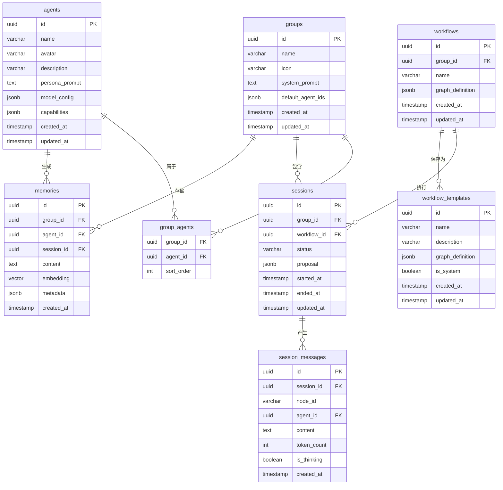

# 实体关系与ER图

<cite>
**本文档引用的文件**
- [001_init_schema.up.sql](file://internal/infrastructure/db/migrations/001_init_schema.up.sql)
- [entity.go](file://internal/core/group/entity.go)
- [agent/entity.go](file://internal/core/agent/entity.go)
- [session.go](file://internal/core/workflow/session.go)
- [types.go](file://internal/core/workflow/types.go)
- [service.go](file://internal/core/memory/service.go)
- [types.go](file://internal/core/memory/types.go)
- [SPEC-408-memory-protocol.md](file://docs/specs/backend/SPEC-408-memory-protocol.md)
- [04_storage.md](file://docs/tdd/04_storage.md)
</cite>

## 目录
1. [引言](#引言)
2. [核心实体关系](#核心实体关系)
3. [详细实体关系说明](#详细实体关系说明)
4. [索引设计与查询性能](#索引设计与查询性能)
5. [典型数据访问路径](#典型数据访问路径)
6. [结论](#结论)

## 引言
本文档详细描述了基于Mermaid语法的实体关系图（ER图）和SQL迁移脚本，重点阐述了系统中核心实体之间的关系。文档涵盖了groups与agents之间的多对多关系、workflows与groups的归属关系、sessions与workflows的执行关系、session_messages与sessions的从属关系，以及memories与groups、agents、sessions的多维关联。同时，文档解释了外键约束、级联删除策略、索引设计及其对查询性能的影响。

**Section sources**
- [001_init_schema.up.sql](file://internal/infrastructure/db/migrations/001_init_schema.up.sql#L1-L96)

## 核心实体关系



**Diagram sources**
- [001_init_schema.up.sql](file://internal/infrastructure/db/migrations/001_init_schema.up.sql#L4-L95)

## 详细实体关系说明

### groups与agents的多对多关系
groups与agents之间通过`group_agents`关联表建立多对多关系。一个群组可以包含多个智能体，一个智能体也可以属于多个群组。这种关系通过`group_agents`表实现，该表包含`group_id`和`agent_id`两个外键，分别引用`groups`和`agents`表的主键。`sort_order`字段用于定义智能体在群组中的显示顺序。

**Section sources**
- [001_init_schema.up.sql](file://internal/infrastructure/db/migrations/001_init_schema.up.sql#L28-L34)
- [entity.go](file://internal/core/group/entity.go#L1-L19)
- [agent/entity.go](file://internal/core/agent/entity.go#L1-L37)

### workflows与groups的归属关系
workflows与groups之间存在一对多的归属关系。每个工作流都归属于一个特定的群组，通过`workflows`表中的`group_id`外键实现。当群组被删除时，其下的所有工作流也会被级联删除（ON DELETE CASCADE），确保数据的一致性。

**Section sources**
- [001_init_schema.up.sql](file://internal/infrastructure/db/migrations/001_init_schema.up.sql#L37-L44)
- [types.go](file://internal/core/workflow/types.go#L43-L67)

### sessions与workflows的执行关系
sessions与workflows之间存在一对一的执行关系。每个会话实例都是对某个工作流的执行，通过`sessions`表中的`workflow_id`外键关联。会话表还包含`status`字段来跟踪执行状态，以及`started_at`和`ended_at`时间戳来记录执行时间。

**Section sources**
- [001_init_schema.up.sql](file://internal/infrastructure/db/migrations/001_init_schema.up.sql#L56-L65)
- [session.go](file://internal/core/workflow/session.go#L1-L165)

### session_messages与sessions的从属关系
session_messages与sessions之间存在一对多的从属关系。每个会话会产生多条消息，通过`session_messages`表中的`session_id`外键实现。消息表还包含`node_id`和`agent_id`字段，用于记录消息产生的节点和生成消息的智能体。

**Section sources**
- [001_init_schema.up.sql](file://internal/infrastructure/db/migrations/001_init_schema.up.sql#L67-L78)
- [session.go](file://internal/core/workflow/session.go#L1-L165)

### memories的多维关联
memories表与多个实体存在多维关联。它通过`group_id`外键与groups关联，表示群组记忆；通过`agent_id`外键与agents关联，表示智能体记忆；通过`session_id`外键与sessions关联，表示会话记忆。`agent_id`字段可以为空，表示这是群组级别的记忆而非特定智能体的记忆。

**Section sources**
- [001_init_schema.up.sql](file://internal/infrastructure/db/migrations/001_init_schema.up.sql#L80-L95)
- [service.go](file://internal/core/memory/service.go#L139-L208)
- [types.go](file://internal/core/memory/types.go#L1-L27)

## 索引设计与查询性能

### 向量相似度搜索索引
系统使用`idx_memories_embedding`索引来优化向量相似度搜索。该索引基于`embedding`字段创建，使用`ivfflat`方法和`vector_cosine_ops`操作符类，支持高效的余弦相似度计算。索引的`lists`参数设置为100，平衡了查询性能和内存使用。

```sql
CREATE INDEX idx_memories_embedding ON memories USING ivfflat (embedding vector_cosine_ops) WITH (lists = 100);
```

### 其他关键索引
系统还创建了其他关键索引以优化查询性能：
- `idx_memories_group`：在`memories`表的`group_id`字段上创建，用于快速检索特定群组的所有记忆。
- `idx_session_messages_session`：在`session_messages`表的`session_id`字段上创建，用于快速检索特定会话的所有消息。

这些索引显著提高了数据检索的效率，特别是在处理大量数据时。

**Section sources**
- [001_init_schema.up.sql](file://internal/infrastructure/db/migrations/001_init_schema.up.sql#L91-L95)
- [SPEC-408-memory-protocol.md](file://docs/specs/backend/SPEC-408-memory-protocol.md#L10-L58)

## 典型数据访问路径

### 加载某群组下所有历史会议及其记忆记录
典型的JOIN查询逻辑如下：

```sql
SELECT 
    s.id as session_id,
    s.started_at,
    s.ended_at,
    m.content as memory_content,
    m.created_at as memory_created_at
FROM sessions s
LEFT JOIN memories m ON s.id = m.session_id
WHERE s.group_id = '指定群组ID'
ORDER BY s.started_at DESC, m.created_at DESC;
```

此查询首先从`sessions`表中获取指定群组的所有会话，然后通过LEFT JOIN连接`memories`表，获取每个会话相关的记忆记录。结果按会话开始时间降序排列，每个会话的记忆记录按创建时间降序排列，便于用户查看历史数据。

**Section sources**
- [001_init_schema.up.sql](file://internal/infrastructure/db/migrations/001_init_schema.up.sql#L56-L95)
- [04_storage.md](file://docs/tdd/04_storage.md#L26-L164)

## 结论
本文档详细描述了系统的实体关系模型，包括核心实体之间的各种关系、外键约束、级联删除策略和索引设计。通过合理的数据库设计和索引优化，系统能够高效地处理复杂的多维数据关联，支持高效的向量相似度搜索和数据检索操作。这些设计决策为系统的可扩展性和高性能奠定了坚实的基础。