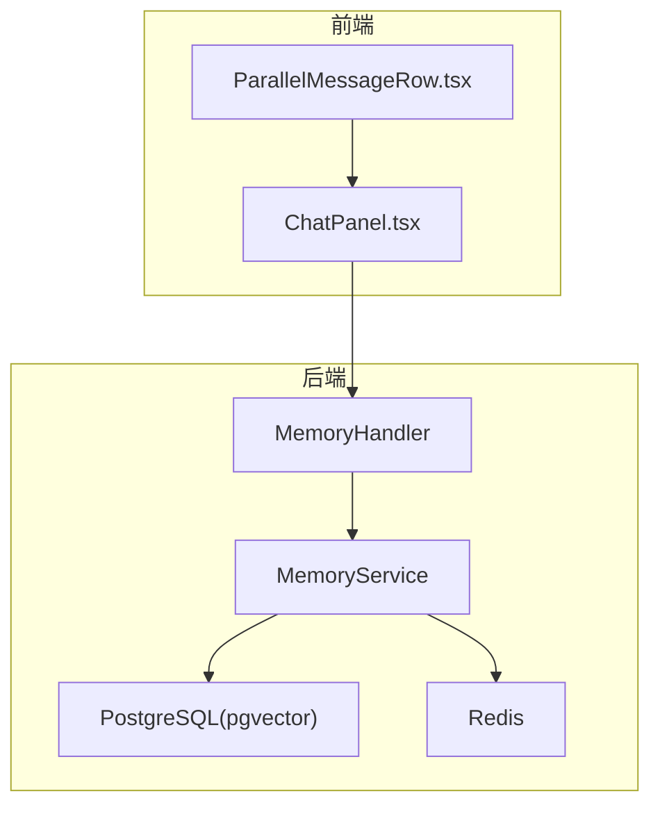
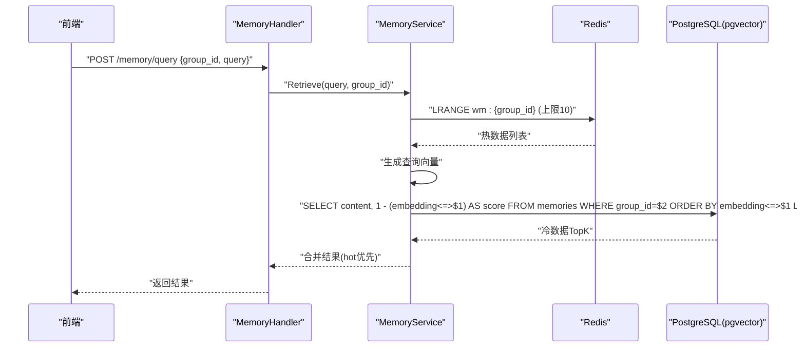
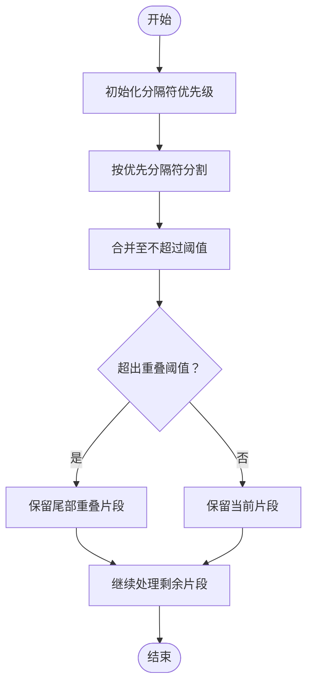
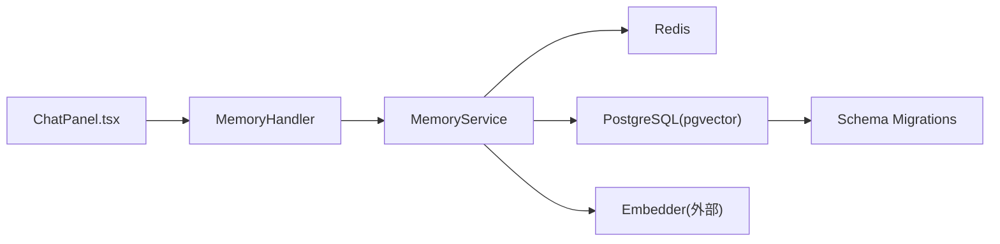

# 性能优化与查询策略

<cite>
**本文引用的文件**
- [SPEC-408-memory-protocol.md](file://docs/specs/backend/SPEC-408-memory-protocol.md)
- [SPEC-407-cost-estimation-api.md](file://docs/specs/backend/SPEC-407-cost-estimation-api.md)
- [SPEC-503-performance-optimization.md](file://docs/specs/sprint5/SPEC-503-performance-optimization.md)
- [SPEC-504-security-hardening.md](file://docs/specs/sprint5/SPEC-504-security-hardening.md)
- [SPEC-609-architecture-fixes.md](file://docs/specs/sprint6/SPEC-609-architecture-fixes.md)
- [SPEC-001-session-store.md](file://docs/specs/sprint1/SPEC-001-session-store.md)
- [SPEC-302-cost-estimator.md](file://docs/specs/sprint4/SPEC-302-cost-estimator.md)
- [04_storage.md](file://docs/tdd/04_storage.md)
- [07_nfr.md](file://docs/tdd/07_nfr.md)
- [001_init_schema.up.sql](file://internal/infrastructure/db/migrations/001_init_schema.up.sql)
- [postgres.go](file://internal/infrastructure/db/postgres.go)
- [redis.go](file://internal/infrastructure/cache/redis.go)
- [memory.go](file://internal/api/handler/memory.go)
- [service.go](file://internal/core/memory/service.go)
- [splitter.go](file://internal/core/memory/splitter.go)
- [ChatPanel.tsx](file://frontend/src/components/chat/ChatPanel.tsx)
- [ParallelMessageRow.tsx](file://frontend/src/components/chat/ParallelMessageRow.tsx)
</cite>

## 目录
1. [简介](#简介)
2. [项目结构](#项目结构)
3. [核心组件](#核心组件)
4. [架构总览](#架构总览)
5. [详细组件分析](#详细组件分析)
6. [依赖关系分析](#依赖关系分析)
7. [性能考量](#性能考量)
8. [故障排查指南](#故障排查指南)
9. [结论](#结论)
10. [附录](#附录)

## 简介
本文件聚焦于数据模型与检索性能优化，围绕以下目标展开：
- 在 session_messages 上创建 session_id 索引以加速会话消息读取
- 在 memories 表上使用 IVFFlat 索引进行高效向量相似度搜索
- 通过 memory splitter 将大文本切分为适合嵌入的小块，提升处理效率
- 提供典型查询（如“查找最近N次会议中的关键决策点”）的 SQL 示例与执行计划分析思路
- 给出分页、缓存、读写分离等性能调优建议，并说明如何监控慢查询与内存使用

## 项目结构
后端采用 Go + Gin + pgx 连接池 + Redis 缓存 + pgvector 向量检索；前端使用 React，消息渲染采用虚拟滚动与增量更新。数据库迁移脚本定义了 session_messages 与 memories 的表结构及索引。

图表来源
- [memory.go](file://internal/api/handler/memory.go#L1-L68)
- [service.go](file://internal/core/memory/service.go#L159-L209)
- [redis.go](file://internal/infrastructure/cache/redis.go#L1-L51)
- [postgres.go](file://internal/infrastructure/db/postgres.go#L1-L66)
- [SPEC-408-memory-protocol.md](file://docs/specs/backend/SPEC-408-memory-protocol.md#L10-L58)

章节来源
- [SPEC-408-memory-protocol.md](file://docs/specs/backend/SPEC-408-memory-protocol.md#L10-L58)
- [SPEC-001-session-store.md](file://docs/specs/sprint1/SPEC-001-session-store.md#L342-L425)
- [04_storage.md](file://docs/tdd/04_storage.md#L26-L115)

## 核心组件
- 记忆服务（MemoryService）
  - 三层记忆协议：隔离区（Quarantine）、工作记忆（Working Memory，热缓存）、长期记忆（Long-Term Memory，pgvector）
  - 检索顺序：先热缓存（Redis），再冷数据（pgvector）
- 记忆处理器（MemoryHandler）
  - 对外暴露 ingest/query 接口，设置请求超时，调用 MemoryService
- 数据库连接池（PostgreSQL）
  - 单例连接池初始化、Ping 校验、迁移执行
- 缓存客户端（Redis）
  - 单例客户端初始化、Ping 校验
- 文本切分器（RecursiveCharacterSplitter）
  - 基于分隔符递归切分，支持重叠合并，控制块大小

章节来源
- [service.go](file://internal/core/memory/service.go#L90-L134)
- [service.go](file://internal/core/memory/service.go#L159-L209)
- [memory.go](file://internal/api/handler/memory.go#L1-L68)
- [postgres.go](file://internal/infrastructure/db/postgres.go#L1-L66)
- [redis.go](file://internal/infrastructure/cache/redis.go#L1-L51)
- [splitter.go](file://internal/core/memory/splitter.go#L1-L100)

## 架构总览
三层记忆协议与检索流程如下：

图表来源
- [memory.go](file://internal/api/handler/memory.go#L50-L67)
- [service.go](file://internal/core/memory/service.go#L159-L209)
- [SPEC-408-memory-protocol.md](file://docs/specs/backend/SPEC-408-memory-protocol.md#L10-L58)

## 详细组件分析

### 1) session_messages 索引设计与会话消息读取优化
- 设计动机
  - 会话消息按 session_id 聚合展示，频繁按会话查询消息列表，需要 session_id 索引以避免全表扫描
- 现状与建议
  - 现有迁移脚本已创建 session_id 索引，建议在高频查询场景下结合执行计划分析，确保索引选择性良好
  - 若出现热点会话导致单表压力过大，可考虑按时间分区或读写分离
- 典型查询与执行计划分析思路
  - 查询最近N条消息（按 created_at 降序）
  - 建议使用覆盖索引（如 session_id + created_at）减少回表
  - 使用 EXPLAIN ANALYZE 观察是否命中索引、是否发生排序或临时表
- 分页策略
  - 使用游标分页（基于 created_at + id）避免 OFFSET/LIMIT 的深层偏移开销
  - 前端采用虚拟滚动与增量渲染，降低 UI 压力

章节来源
- [001_init_schema.up.sql](file://internal/infrastructure/db/migrations/001_init_schema.up.sql#L67-L80)
- [SPEC-001-session-store.md](file://docs/specs/sprint1/SPEC-001-session-store.md#L342-L425)
- [ChatPanel.tsx](file://frontend/src/components/chat/ChatPanel.tsx#L40-L56)
- [ParallelMessageRow.tsx](file://frontend/src/components/chat/ParallelMessageRow.tsx#L1-L37)

### 2) memories 表向量检索优化与 IVFFlat 索引
- 设计动机
  - 需要对 content 嵌入向量进行相似度检索，cosine 距离越小越相似
  - 使用 pgvector 的 IVFFlat 索引，lists 参数影响构建速度与查询精度
- 现状与建议
  - 迁移脚本中已创建 IVFFlat 索引，lists=100；根据数据规模与查询延迟目标，可评估 HNSW 的召回率优势
  - 建议定期重建索引（批量导入后）并监控查询延迟
- 典型查询与执行计划分析思路
  - 查询语句：按 group_id 过滤，使用向量距离排序并限制返回数量
  - 使用 EXPLAIN (ANALYZE, BUFFERS) 观察索引扫描、排序代价与内存使用
- 向量检索性能指标
  - TDD 目标：向量检索 < 100ms；可通过索引参数、批量嵌入、缓存 TopK 结果进一步优化

章节来源
- [001_init_schema.up.sql](file://internal/infrastructure/db/migrations/001_init_schema.up.sql#L80-L95)
- [service.go](file://internal/core/memory/service.go#L159-L209)
- [SPEC-408-memory-protocol.md](file://docs/specs/backend/SPEC-408-memory-protocol.md#L10-L58)
- [07_nfr.md](file://docs/tdd/07_nfr.md#L52-L60)

### 3) memory splitter：大文本切分与嵌入效率
- 设计动机
  - 嵌入模型对输入长度有限制，过长文本会增加成本与延迟
- 算法要点
  - 递归按分隔符切分（优先级从高到低），超过阈值则合并，支持重叠避免语义断裂
  - 控制块大小与重叠长度，平衡召回与成本
- 性能收益
  - 小块嵌入更快、更稳定；便于后续去重与缓存
  - 重叠有助于上下文连续性，提升检索质量

图表来源
- [splitter.go](file://internal/core/memory/splitter.go#L1-L100)

章节来源
- [splitter.go](file://internal/core/memory/splitter.go#L1-L100)
- [service.go](file://internal/core/memory/service.go#L115-L134)

### 4) 典型查询示例与执行计划分析
- 场景：查找最近N次会议中的关键决策点
  - 假设关键决策点可由特定关键词或结构化提示词识别，先检索最近N次会议，再在每会话内检索相关片段
  - SQL 思路
    - 会话列表：按 ended_at 降序取 N 条
    - 会话消息：按 session_id 过滤，使用 LIKE 或全文检索匹配关键词
  - 执行计划分析
    - 使用 EXPLAIN ANALYZE 观察是否命中 session_id 索引、是否发生排序或临时表
    - 若关键词检索成本高，可考虑在消息内容上建立 GIN/Fuzzy 索引或预处理关键词向量
- 场景：按 group_id 检索向量相似片段
  - SQL 思路
    - 使用 cosine 距离排序并 LIMIT K
  - 执行计划分析
    - 观察是否命中 IVFFlat 索引、排序代价与内存使用

章节来源
- [001_init_schema.up.sql](file://internal/infrastructure/db/migrations/001_init_schema.up.sql#L67-L95)
- [service.go](file://internal/core/memory/service.go#L159-L209)

### 5) 分页、缓存、读写分离等性能调优建议
- 分页
  - 游标分页：基于 created_at + id，避免 OFFSET/LIMIT 的深层偏移
  - 前端：虚拟滚动 + 增量渲染，减少 DOM 数量
- 缓存
  - 热数据：Redis 列表保存最近若干条消息，设置 TTL，限制列表长度
  - 冷数据：向量检索结果可做短期缓存（如按 group_id + query hash）
- 读写分离
  - 读流量大：将只读查询路由至只读副本
  - 写流量大：批量写入队列化，异步落库
- 并发与限流
  - API 层限流：基于 Redis 滑动窗口实现
  - 请求超时：接口层设置合理超时，避免阻塞

章节来源
- [SPEC-504-security-hardening.md](file://docs/specs/sprint5/SPEC-504-security-hardening.md#L90-L142)
- [SPEC-503-performance-optimization.md](file://docs/specs/sprint5/SPEC-503-performance-optimization.md#L165-L175)
- [ChatPanel.tsx](file://frontend/src/components/chat/ChatPanel.tsx#L40-L56)
- [ParallelMessageRow.tsx](file://frontend/src/components/chat/ParallelMessageRow.tsx#L1-L37)
- [service.go](file://internal/core/memory/service.go#L90-L134)

### 6) 监控慢查询与内存使用
- 慢查询
  - 数据库：开启慢查询日志，记录执行时间与计划
  - 应用：埋点记录检索耗时、向量生成耗时、缓存命中率
- 内存使用
  - 服务端：监控进程 RSS、goroutine 数、GC 次数与暂停时间
  - 前端：监控渲染帧率、DOM 节点数量、虚拟列表可视区域大小
- 指标目标
  - 向量检索 < 100ms；首字延迟 < 500ms；内存占用 < 500MB

章节来源
- [07_nfr.md](file://docs/tdd/07_nfr.md#L52-L60)
- [SPEC-503-performance-optimization.md](file://docs/specs/sprint5/SPEC-503-performance-optimization.md#L165-L175)

## 依赖关系分析

图表来源
- [memory.go](file://internal/api/handler/memory.go#L1-L68)
- [service.go](file://internal/core/memory/service.go#L159-L209)
- [redis.go](file://internal/infrastructure/cache/redis.go#L1-L51)
- [postgres.go](file://internal/infrastructure/db/postgres.go#L1-L66)
- [001_init_schema.up.sql](file://internal/infrastructure/db/migrations/001_init_schema.up.sql#L67-L95)

章节来源
- [SPEC-609-architecture-fixes.md](file://docs/specs/sprint6/SPEC-609-architecture-fixes.md#L103-L136)

## 性能考量
- 索引与查询
  - session_messages.session_id 索引用于按会话检索
  - memories.embedding IVFFlat 索引用于向量相似度检索
- 缓存策略
  - Redis 热缓存优先，pgvector 冷数据兜底
- 文本切分
  - 控制块大小与重叠，提升嵌入效率与检索质量
- 前端渲染
  - 虚拟列表 + 增量 DOM 更新，降低 UI 压力

章节来源
- [001_init_schema.up.sql](file://internal/infrastructure/db/migrations/001_init_schema.up.sql#L67-L95)
- [service.go](file://internal/core/memory/service.go#L159-L209)
- [splitter.go](file://internal/core/memory/splitter.go#L1-L100)
- [SPEC-408-memory-protocol.md](file://docs/specs/backend/SPEC-408-memory-protocol.md#L10-L58)
- [SPEC-001-session-store.md](file://docs/specs/sprint1/SPEC-001-session-store.md#L342-L425)

## 故障排查指南
- 连接池与缓存
  - 数据库连接池初始化失败：检查 URL 解析、Ping 失败原因
  - Redis 连接失败：检查地址、密码、DB 号，确认 Ping 成功
- 检索异常
  - 向量检索超时：检查索引是否可用、数据量是否足够、查询向量维度是否匹配
  - 热缓存未命中：确认键名格式、TTL 设置、列表长度裁剪
- 性能问题
  - 慢查询：使用 EXPLAIN 分析，关注索引扫描、排序与内存使用
  - 内存占用过高：检查 goroutine 泄漏、缓存膨胀、前端渲染区域过大

章节来源
- [postgres.go](file://internal/infrastructure/db/postgres.go#L1-L66)
- [redis.go](file://internal/infrastructure/cache/redis.go#L1-L51)
- [service.go](file://internal/core/memory/service.go#L159-L209)
- [SPEC-504-security-hardening.md](file://docs/specs/sprint5/SPEC-504-security-hardening.md#L90-L142)

## 结论
通过在 session_messages 上建立 session_id 索引、在 memories 上使用 IVFFlat 向量索引、配合 memory splitter 的文本切分与 Redis 热缓存，系统在检索与渲染层面实现了较好的性能平衡。建议持续监控慢查询与内存使用，结合游标分页与虚拟渲染进一步优化用户体验，并在数据量增长时评估 HNSW 索引与读写分离策略。

## 附录
- 相关规范与指标
  - 记忆协议与三层架构
  - 性能指标目标
  - 成本估算 API 与前端集成

章节来源
- [SPEC-408-memory-protocol.md](file://docs/specs/backend/SPEC-408-memory-protocol.md#L10-L58)
- [07_nfr.md](file://docs/tdd/07_nfr.md#L52-L60)
- [SPEC-302-cost-estimator.md](file://docs/specs/sprint4/SPEC-302-cost-estimator.md#L47-L115)
- [SPEC-407-cost-estimation-api.md](file://docs/specs/backend/SPEC-407-cost-estimation-api.md#L96-L101)