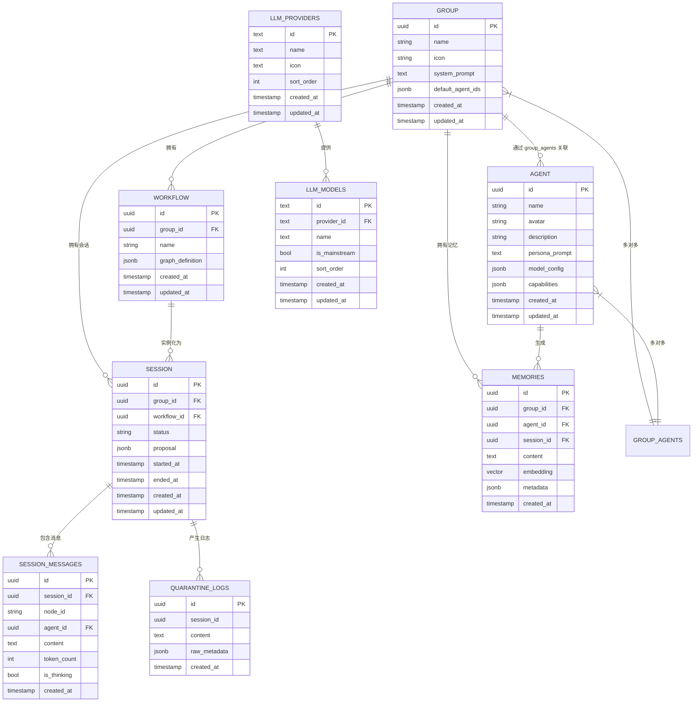

# 数据模型

<cite>
**本文档中引用的文件**  
- [001_init_schema.up.sql](file://internal/infrastructure/db/migrations/001_init_schema.up.sql)
- [002_add_quarantine_logs.up.sql](file://internal/infrastructure/db/migrations/002_add_quarantine_logs.up.sql)
- [003_add_updated_at_columns.up.sql](file://internal/infrastructure/db/migrations/003_add_updated_at_columns.up.sql)
- [004_create_llm_options.up.sql](file://internal/infrastructure/db/migrations/004_create_llm_options.up.sql)
- [agent.go](file://internal/core/agent/entity.go)
- [group.go](file://internal/core/group/entity.go)
- [session.go](file://internal/core/workflow/session.go)
- [types.go](file://internal/core/workflow/types.go)
- [types.go](file://internal/core/memory/types.go)
- [service.go](file://internal/core/memory/service.go)
</cite>

## 目录
1. [简介](#简介)
2. [核心实体表结构](#核心实体表结构)
3. [实体关系图（ERD）](#实体关系图（erd）)
4. [记忆数据的三层结构](#记忆数据的三层结构)
5. [数据生命周期管理](#数据生命周期管理)
6. [索引与查询优化策略](#索引与查询优化策略)

## 简介
本数据模型文档详细描述了基于PostgreSQL的系统数据库设计，涵盖核心实体（Agent、Group、Workflow、Session、Memory）的表结构、字段类型、主外键关系和索引策略。文档还解释了`workflow_runs`如何记录执行历史，以及`memory_records`的三层结构（隔离区、工作记忆、长期记忆）。此外，本文档阐述了会话的创建、执行、归档流程，以及记忆数据的持久化与检索机制。

## 核心实体表结构

### Agent（智能体）
存储AI智能体的配置信息，包括名称、头像、角色提示词、模型配置和能力。

**字段说明**：
- `id`: UUID主键
- `name`: 智能体名称（VARCHAR 64）
- `avatar`: 头像URL
- `description`: 描述信息
- `persona_prompt`: 角色提示词（核心字段）
- `model_config`: 模型配置JSONB（默认使用gpt-4o）
- `capabilities`: 能力配置JSONB（如网络搜索、代码执行）
- `created_at`, `updated_at`: 时间戳

**Section sources**
- [001_init_schema.up.sql](file://internal/infrastructure/db/migrations/001_init_schema.up.sql#L16-L26)
- [agent.go](file://internal/core/agent/entity.go#L9-L37)

### Group（协作组）
表示一个项目或上下文协作组，包含组名、图标、系统提示和默认智能体。

**字段说明**：
- `id`: UUID主键
- `name`: 组名称（VARCHAR 128）
- `icon`: 图标URL
- `system_prompt`: 系统级提示词
- `default_agent_ids`: 默认智能体ID数组（JSONB）
- `created_at`, `updated_at`: 时间戳

**Section sources**
- [001_init_schema.up.sql](file://internal/infrastructure/db/migrations/001_init_schema.up.sql#L5-L13)
- [group.go](file://internal/core/group/entity.go#L9-L19)

### Workflow（工作流）
定义工作流的图形化结构，关联到特定组。

**字段说明**：
- `id`: UUID主键
- `group_id`: 所属组ID（外键）
- `name`: 工作流名称
- `graph_definition`: 图形定义JSONB（节点与连接）
- `created_at`, `updated_at`: 时间戳

**Section sources**
- [001_init_schema.up.sql](file://internal/infrastructure/db/migrations/001_init_schema.up.sql#L37-L44)
- [types.go](file://internal/core/workflow/types.go#L43-L60)

### Session（会话）
表示工作流的一次执行实例，记录状态、提案和时间。

**字段说明**：
- `id`: UUID主键
- `group_id`: 所属组（外键）
- `workflow_id`: 关联工作流（外键）
- `status`: 状态（pending, running, completed等）
- `proposal`: 提案内容JSONB
- `started_at`, `ended_at`: 开始/结束时间
- `created_at`, `updated_at`: 时间戳（v0.0.3添加）

**Section sources**
- [001_init_schema.up.sql](file://internal/infrastructure/db/migrations/001_init_schema.up.sql#L57-L65)
- [003_add_updated_at_columns.up.sql](file://internal/infrastructure/db/migrations/003_add_updated_at_columns.up.sql#L4-L5)
- [session.go](file://internal/core/workflow/session.go#L12-L21)

### Memories（长期记忆）
向量数据库表，存储可检索的记忆片段，支持语义搜索。

**字段说明**：
- `id`: UUID主键
- `group_id`: 所属组（外键）
- `agent_id`: 来源智能体（可为空）
- `session_id`: 关联会话（外键）
- `content`: 记忆文本内容
- `embedding`: 向量嵌入（1536维）
- `metadata`: 元数据JSONB
- `created_at`: 创建时间

**索引**：
- `idx_memories_group`: 按组ID索引
- `idx_memories_embedding`: IVFFlat向量索引（余弦相似度）

**Section sources**
- [001_init_schema.up.sql](file://internal/infrastructure/db/migrations/001_init_schema.up.sql#L81-L95)
- [service.go](file://internal/core/memory/service.go#L139-L151)

### quarantine_logs（隔离日志）
临时存储待审核内容，防止低质量信息污染记忆。

**字段说明**：
- `id`: UUID主键
- `session_id`: 关联会话
- `content`: 原始内容
- `raw_metadata`: 原始元数据（含node_id等）
- `created_at`: 创建时间

**索引**：
- `idx_quarantine_logs_session`: 按会话ID索引

**Section sources**
- [002_add_quarantine_logs.up.sql](file://internal/infrastructure/db/migrations/002_add_quarantine_logs.up.sql#L1-L10)
- [service.go](file://internal/core/memory/service.go#L29-L57)

### llm_providers 与 llm_models（LLM选项）
管理可用的LLM提供商和模型列表。

**字段说明**：
- `llm_providers`: 提供商ID、名称、图标
- `llm_models`: 模型ID、提供商外键、显示名称、主流标志

**索引**：
- `idx_llm_models_provider`: 按提供商索引

**Section sources**
- [004_create_llm_options.up.sql](file://internal/infrastructure/db/migrations/004_create_llm_options.up.sql#L1-L22)

## 实体关系图（ERD）

**Diagram sources**
- [001_init_schema.up.sql](file://internal/infrastructure/db/migrations/001_init_schema.up.sql)
- [002_add_quarantine_logs.up.sql](file://internal/infrastructure/db/migrations/002_add_quarantine_logs.up.sql)
- [004_create_llm_options.up.sql](file://internal/infrastructure/db/migrations/004_create_llm_options.up.sql)

## 记忆数据的三层结构

系统采用三层记忆架构，实现从原始输入到长期知识的渐进式沉淀。

### 第一层：隔离区（Quarantine）
- **存储位置**：PostgreSQL `quarantine_logs` 表
- **作用**：所有新生成的内容首先写入此层，接受初步过滤
- **写入机制**：由 `MemoryManager.LogQuarantine()` 方法调用
- **内容特征**：未经验证的原始输出，可能包含幻觉或低质量信息

### 第二层：工作记忆（Working Memory）
- **存储位置**：Redis List（键格式 `wm:{group_id}`）
- **作用**：存储高置信度、近期相关的上下文信息
- **写入机制**：通过 `UpdateWorkingMemory()` 方法，需通过入口过滤器
- **过滤规则**：
  - 置信度低于0.8的内容被拒绝
  - 内容长度少于50字符的被忽略
- **生命周期**：TTL 24小时，最多保留最近50条

### 第三层：长期记忆（Long-Term Memory）
- **存储位置**：PostgreSQL `memories` 表（向量存储）
- **作用**：持久化高质量知识，支持语义检索
- **写入机制**：通过 `Promote()` 方法，需人工或自动审核
- **处理流程**：
  1. 文本分割（500字符块，50字符重叠）
  2. 使用 `text-embedding-ada-002` 生成向量
  3. 存储内容、嵌入向量和元数据
- **检索机制**：混合检索，同时查询工作记忆（Redis）和长期记忆（PGVector）

**Section sources**
- [types.go](file://internal/core/memory/types.go#L7-L27)
- [service.go](file://internal/core/memory/service.go#L28-L209)

## 数据生命周期管理

### 会话生命周期
1. **创建**：用户启动工作流，创建 `session` 记录，状态为 `pending`
2. **执行**：状态变为 `running`，开始执行节点，消息写入 `session_messages`
3. **暂停/恢复**：支持手动暂停（`paused`）和恢复（`running`）
4. **完成**：所有节点执行完毕，状态为 `completed`，记录 `ended_at`
5. **归档**：历史会话可被归档，但保留用于记忆提取和审计

### 记忆数据生命周期
1. **生成**：节点输出首先进入 `quarantine_logs`
2. **过滤**：通过置信度过滤进入Redis工作记忆
3. **提升**：经审核后，通过 `Promote()` 拆分并嵌入到 `memories` 表
4. **检索**：新会话通过 `Retrieve()` 获取相关上下文（Redis + PGVector）
5. **过期**：工作记忆24小时后自动过期，长期记忆永久保留

**Section sources**
- [session.go](file://internal/core/workflow/session.go#L42-L165)
- [service.go](file://internal/core/memory/service.go#L159-L209)

## 索引与查询优化策略

### 主要索引
| 表名 | 索引名 | 字段 | 类型 | 用途 |
|------|--------|------|------|------|
| session_messages | idx_session_messages_session | session_id | B-Tree | 按会话查询消息 |
| memories | idx_memories_group | group_id | B-Tree | 按组查询记忆 |
| memories | idx_memories_embedding | embedding | IVFFlat | 向量相似度搜索 |
| quarantine_logs | idx_quarantine_logs_session | session_id | B-Tree | 按会话审计日志 |
| llm_models | idx_llm_models_provider | provider_id | B-Tree | 按提供商查询模型 |

### 查询优化
- **向量搜索**：使用余弦相似度 `<=>` 运算符，结合IVFFlat索引加速
- **混合检索**：应用层合并Redis（低延迟）和PGVector（高精度）结果
- **分页与限制**：记忆检索限制返回5条最相关结果
- **缓存策略**：工作记忆使用Redis，实现毫秒级响应

**Section sources**
- [001_init_schema.up.sql](file://internal/infrastructure/db/migrations/001_init_schema.up.sql#L78-L95)
- [002_add_quarantine_logs.up.sql](file://internal/infrastructure/db/migrations/002_add_quarantine_logs.up.sql#L9)
- [004_create_llm_options.up.sql](file://internal/infrastructure/db/migrations/004_create_llm_options.up.sql#L21)