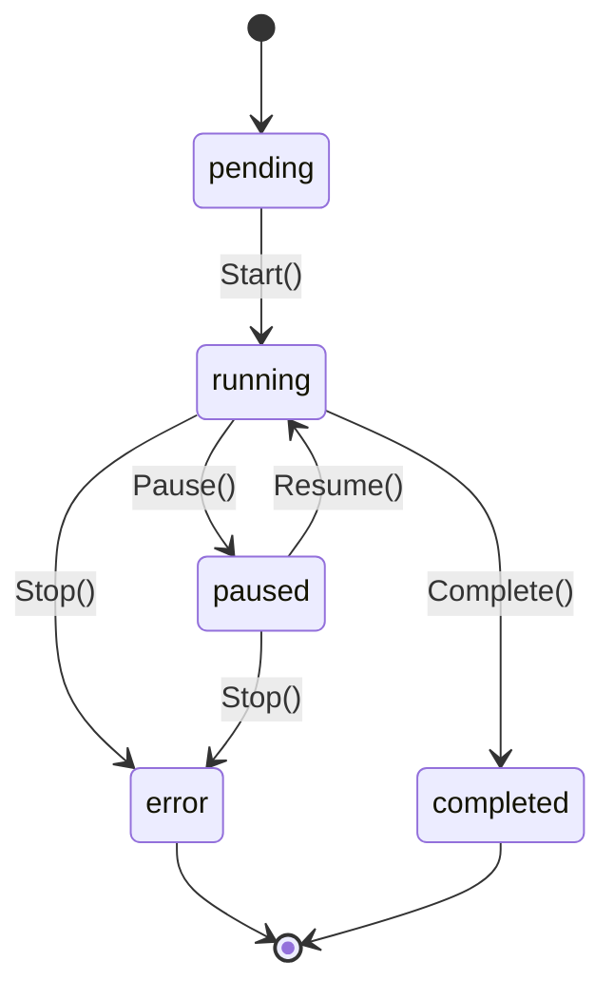
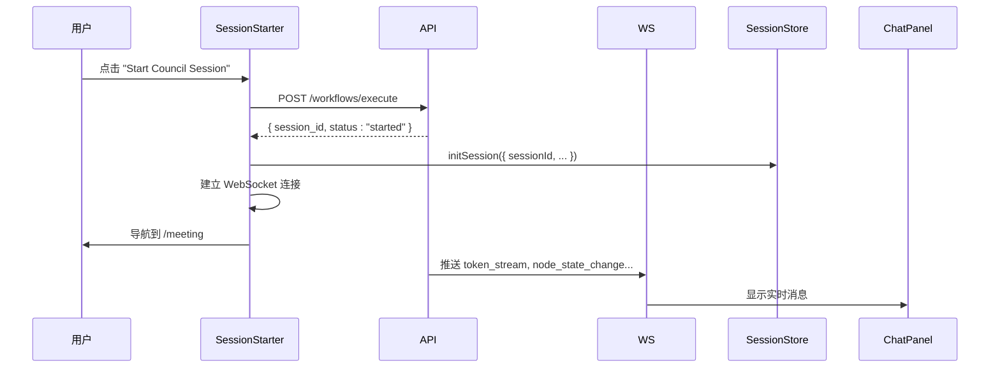

# 会话生命周期管理

<cite>
**本文档引用的文件**  
- [session.go](file://internal/core/workflow/session.go)
- [engine.go](file://internal/core/workflow/engine.go)
- [useSessionStore.ts](file://frontend/src/stores/useSessionStore.ts)
- [useWebSocketRouter.ts](file://frontend/src/hooks/useWebSocketRouter.ts)
- [workflow.go](file://internal/api/handler/workflow.go)
- [SPEC-001-session-store.md](file://docs/specs/sprint1/SPEC-001-session-store.md)
- [SPEC-703-session-ws-connect-fix.md](file://docs/specs/sprint7/SPEC-703-session-ws-connect-fix.md)
- [003_add_updated_at_columns.up.sql](file://internal/infrastructure/db/migrations/003_add_updated_at_columns.up.sql)
</cite>

## 目录
1. [引言](#引言)
2. [会话状态流转](#会话状态流转)
3. [会话启动流程](#会话启动流程)
4. [会话暂停与恢复机制](#会话暂停与恢复机制)
5. [异常中断与恢复策略](#异常中断与恢复策略)
6. [高并发状态一致性保障](#高并发状态一致性保障)
7. [结论](#结论)

## 引言

会话（Session）是工作流执行的核心运行实例，管理着从创建到终止的完整生命周期。本文档详细描述了会话的状态流转过程、启动流程、暂停与恢复机制，以及在高并发场景下的状态一致性保障措施。通过分析核心代码和规格文档，本文为开发者和维护人员提供了全面的会话管理指南。

## 会话状态流转

会话在其生命周期中经历多个状态，包括 pending、running、paused、completed 和 error。这些状态的转换由特定的触发条件和逻辑控制。



**Diagram sources**
- [session.go](file://internal/core/workflow/session.go#L14-L21)

### 状态定义与转换

会话状态由 `SessionStatus` 枚举定义，包含以下值：

- **pending**: 会话已创建但尚未开始执行
- **running**: 会话正在执行中
- **paused**: 会话被暂停
- **completed**: 会话正常完成
- **failed**: 会话因错误而终止
- **cancelled**: 会话被取消

当会话创建时，其初始状态为 `pending`。调用 `Start()` 方法后，状态变为 `running`，并记录开始时间。会话可以通过 `Pause()` 和 `Resume()` 方法在 `running` 和 `paused` 状态之间切换。当工作流执行完成时，调用 `Complete()` 方法将状态设置为 `completed`，并记录结束时间。如果发生错误或用户主动停止，会话状态变为 `failed`。

**Section sources**
- [session.go](file://internal/core/workflow/session.go#L12-L21)

## 会话启动流程

会话的启动流程涉及多个关键步骤，包括 WebSocket 连接建立、工作流初始化和上下文加载。

### WebSocket 连接建立

根据 SPEC-703 规格文档，会话启动时必须建立 WebSocket 连接以实现实时通信。前端在成功调用 API 启动会话后，需要调用 `useConnectStore.connect()` 方法建立连接。



**Diagram sources**
- [SPEC-703-session-ws-connect-fix.md](file://docs/specs/sprint7/SPEC-703-session-ws-connect-fix.md#L15-L35)
- [SessionStarter.tsx](file://frontend/src/features/meeting/SessionStarter.tsx#L96-L99)

### 工作流初始化

会话启动时，后端创建 `Session` 实例并初始化工作流引擎。`Execute` 方法处理会话启动请求，创建会话并启动执行。

**Section sources**
- [workflow.go](file://internal/api/handler/workflow.go#L58-L123)

## 会话暂停与恢复机制

会话的暂停与恢复机制基于 Go 语言的 channel 特性实现，确保了线程安全和高效的控制。

### 暂停机制

当调用 `Pause()` 方法时，会话检查当前状态是否为 `running`。如果是，则将状态设置为 `paused`，并创建一个新的阻塞 channel `resumeCh`。

```go
func (s *Session) Pause() {
    s.mu.Lock()
    defer s.mu.Unlock()
    if s.Status == SessionRunning {
        s.Status = SessionPaused
        s.resumeCh = make(chan struct{}) // 创建新的阻塞通道
    }
}
```

**Section sources**
- [session.go](file://internal/core/workflow/session.go#L74-L81)

### 恢复机制

恢复机制通过关闭 `resumeCh` channel 来解除所有等待中的 goroutine 的阻塞状态。

```go
func (s *Session) Resume() {
    s.mu.Lock()
    defer s.mu.Unlock()
    if s.Status == SessionPaused {
        s.Status = SessionRunning
        close(s.resumeCh) // 解除所有等待者的阻塞
    }
}
```

**Section sources**
- [session.go](file://internal/core/workflow/session.go#L83-L90)

## 异常中断与恢复策略

系统通过多种机制处理异常中断情况，确保会话状态的一致性和可恢复性。

### 错误处理

当工作流执行中发生错误时，引擎会发出错误事件并通过 WebSocket 推送到前端。

```go
func (e *Engine) emitError(nodeID string, err error) {
    log.Printf("Error in node %s: %v", nodeID, err)
    e.StreamChannel <- StreamEvent{
        Type:      "error",
        Timestamp: time.Now(),
        NodeID:    nodeID,
        Data:      map[string]interface{}{"error": err.Error()},
    }
    e.updateStatus(nodeID, StatusFailed)
}
```

**Section sources**
- [engine.go](file://internal/core/workflow/engine.go#L173-L182)

### 人机交互恢复

对于需要人工审核的节点，系统会暂停执行并等待用户输入。当收到用户响应后，调用 `ResumeNode` 方法恢复执行。

```go
func (h *WorkflowHandler) ResumeNode(c *gin.Context) {
    engine := h.getEngine(id)
    if engine == nil {
        c.JSON(http.StatusNotFound, gin.H{"error": "Session not found or not active"})
        return
    }

    if err := engine.ResumeNode(c.Request.Context(), req.NodeID, output); err != nil {
        c.JSON(http.StatusConflict, gin.H{"error": err.Error()})
        return
    }

    c.JSON(http.StatusOK, gin.H{"status": "resumed"})
}
```

**Section sources**
- [workflow.go](file://internal/api/handler/workflow.go#L217-L245)

## 高并发状态一致性保障

在高并发场景下，系统通过数据库事务控制和缓存同步机制确保会话状态的一致性。

### 数据库事务控制

数据库迁移脚本为会话表添加了 `updated_at` 字段，用于跟踪记录的最后更新时间。

```sql
-- 为 sessions 表添加 updated_at 列
ALTER TABLE sessions ADD COLUMN updated_at TIMESTAMPTZ DEFAULT NOW();
```

**Section sources**
- [003_add_updated_at_columns.up.sql](file://internal/infrastructure/db/migrations/003_add_updated_at_columns.up.sql#L4-L5)

### 缓存同步机制

系统使用 Redis 作为缓存层，通过 `Cache` 接口提供统一的缓存操作。`MockCache` 实现用于测试环境，确保缓存逻辑的正确性。

**Section sources**
- [redis.go](file://internal/infrastructure/cache/redis.go)
- [mock.go](file://internal/infrastructure/cache/mock.go)

## 结论

会话生命周期管理是系统的核心功能之一，通过精心设计的状态流转、启动流程、暂停恢复机制和高并发保障措施，确保了工作流执行的可靠性和稳定性。开发者在实现相关功能时，应遵循本文档描述的模式和最佳实践，确保系统的健壮性和可维护性。