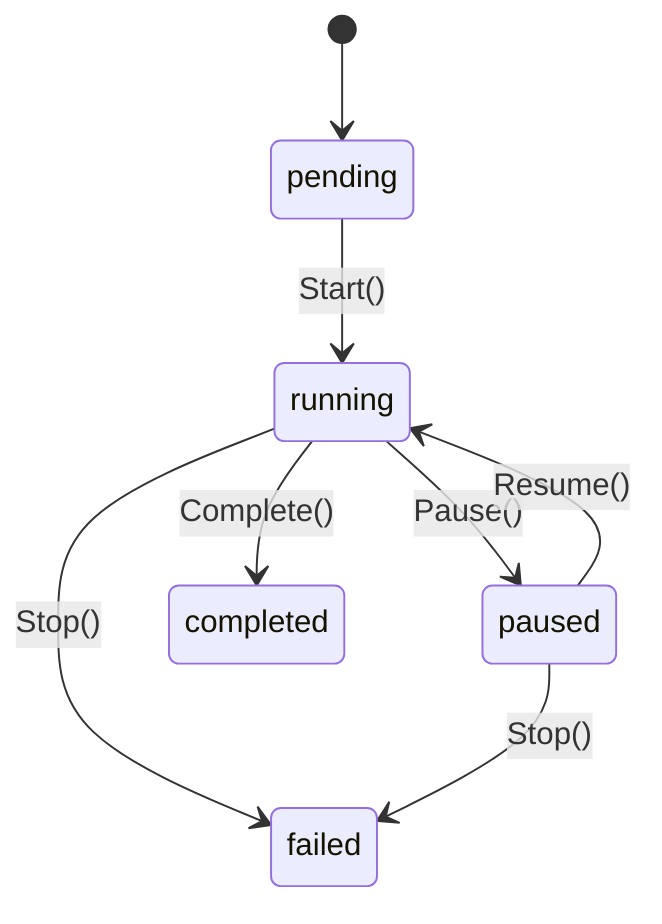
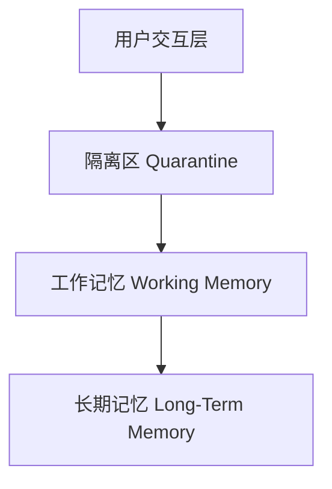
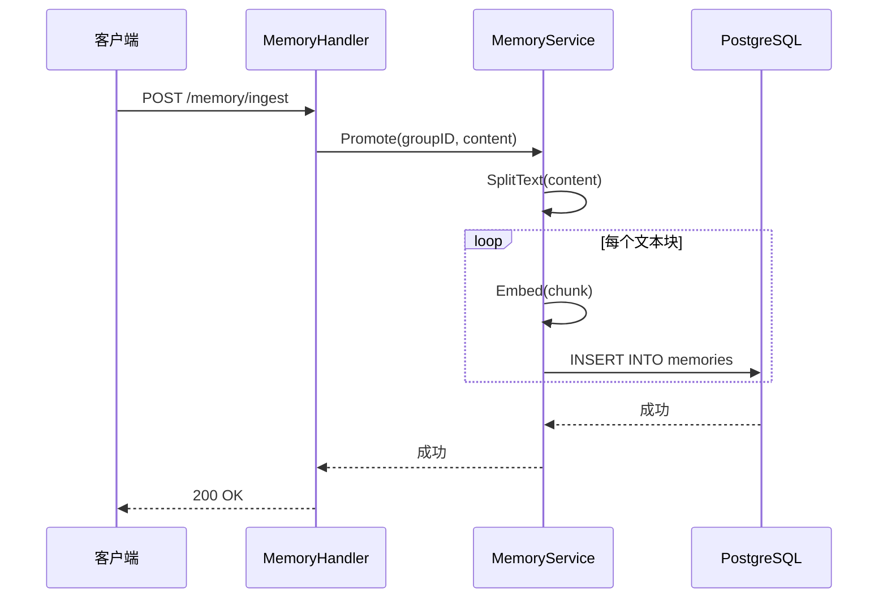
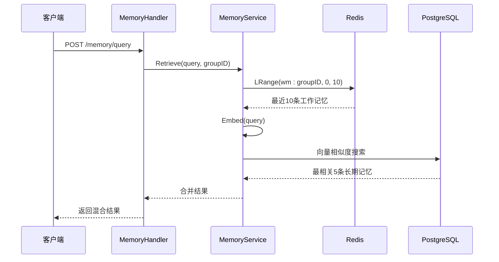

# 数据生命周期管理

<cite>
**本文档引用的文件**  
- [session.go](file://internal/core/workflow/session.go)
- [service.go](file://internal/core/memory/service.go)
- [types.go](file://internal/core/memory/types.go)
- [memory.go](file://internal/api/handler/memory.go)
- [memory.go](file://internal/core/middleware/memory.go)
- [postgres.go](file://internal/infrastructure/db/postgres.go)
- [redis.go](file://internal/infrastructure/cache/redis.go)
- [001_init_schema.up.sql](file://internal/infrastructure/db/migrations/001_init_schema.up.sql)
- [main.go](file://cmd/council/main.go)
</cite>

## 目录
1. [会话状态机与生命周期](#会话状态机与生命周期)  
2. [记忆数据分层存储机制](#记忆数据分层存储机制)  
3. [服务层API与数据操作](#服务层api与数据操作)  
4. [高并发数据一致性保障](#高并发数据一致性保障)

## 会话状态机与生命周期

会话（Session）是工作流执行的核心单元，其状态转换机制通过有限状态机（FSM）实现，确保执行过程的可控性和可追溯性。会话状态定义在 `internal/core/workflow/session.go` 中，包含五种核心状态：

- **待处理（pending）**：会话已创建但尚未启动
- **运行中（running）**：会话正在执行节点
- **已暂停（paused）**：会话被主动暂停
- **已完成（completed）**：会话正常结束
- **已失败（failed）**：会话因错误或中断终止

状态转换由 `Session` 结构体的方法驱动，通过互斥锁（`sync.RWMutex`）保证线程安全。状态转换流程如下：

**状态转换机制说明**：
- **启动（Start）**：调用 `Start()` 方法将状态从 `pending` 转为 `running`，同时记录开始时间并创建可取消的上下文（`context.WithCancel`）用于资源管理。
- **暂停（Pause）**：仅当状态为 `running` 时可执行，状态转为 `paused`，并通过创建新的阻塞通道 `resumeCh` 暂停后续执行。
- **恢复（Resume）**：仅当状态为 `paused` 时可执行，状态转为 `running`，并通过关闭 `resumeCh` 通道解除阻塞，恢复执行。
- **完成（Complete）**：将状态设为 `completed`，记录结束时间，并调用 `cancel()` 清理资源。
- **停止（Stop）**：从 `running` 或 `paused` 状态均可执行，状态转为 `failed`，用于异常终止。

会话状态的持久化通过数据库 `sessions` 表实现，关键字段包括：
- `status`：存储当前状态（如 "running"）
- `started_at`：记录启动时间
- `ended_at`：记录结束时间

前端通过 WebSocket 接收状态变更事件，实现 UI 实时更新。

**会话状态机来源**
- [session.go](file://internal/core/workflow/session.go#L12-L21)
- [workflow.go](file://internal/api/handler/workflow.go#L125-L169)

## 记忆数据分层存储机制

系统采用三级记忆存储架构，确保数据的隔离性、时效性和可检索性。该架构在 `docs/specs/backend/SPEC-408-memory-protocol.md` 中有明确设计，并在代码中实现。

### 三级存储架构

#### 1. 隔离区（Quarantine）
- **存储位置**：PostgreSQL 的 `quarantine_logs` 表
- **特点**：永久存储，用于保留原始产出，防止有害内容扩散
- **写入时机**：每个节点执行后，由 `MemoryMiddleware` 自动调用 `LogQuarantine` 方法写入
- **数据结构**：
  - `session_id`：关联会话ID
  - `content`：原始内容
  - `raw_metadata`：元数据（含 `node_id`）

#### 2. 工作记忆（Working Memory）
- **存储位置**：Redis List（键格式：`wm:{group_id}`）
- **特点**：热缓存，设置24小时TTL，限制最多50条记录
- **写入时机**：节点执行后，通过入口过滤器（Ingress Filter）后写入
- **入口过滤规则**：
  - 置信度过滤：`confidence < 0.8` 的内容被拒绝
  - 内容长度过滤：少于50字符的内容被忽略
- **读取方式**：`Retrieve` 方法优先从Redis获取最近10条记录

#### 3. 长期记忆（Long-Term Memory）
- **存储位置**：PostgreSQL 的 `memories` 表（使用 `pgvector` 扩展）
- **特点**：向量化存储，支持语义检索
- **写入时机**：通过 `/memory/ingest` API 显式调用 `Promote` 方法
- **处理流程**：
  1. **文本分割**：使用 `RecursiveCharacterSplitter` 将内容分割为500字符的块
  2. **向量化**：调用LLM嵌入模型（如 `text-embedding-ada-002`）生成向量
  3. **存储**：将内容块和向量存入数据库
- **检索方式**：基于余弦相似度进行向量搜索，返回最相关的5条记录

**记忆分层存储来源**
- [service.go](file://internal/core/memory/service.go#L28-L157)
- [types.go](file://internal/core/memory/types.go#L7-L20)
- [001_init_schema.up.sql](file://internal/infrastructure/db/migrations/001_init_schema.up.sql#L80-L96)

## 服务层API与数据操作

系统通过RESTful API暴露记忆管理功能，允许外部服务创建、检索和归档数据。

### 记忆API端点

| 端点 | 方法 | 功能 | 请求体 |
|------|------|------|--------|
| `/memory/ingest` | POST | 提升内容至长期记忆 | `{ "group_id": "...", "content": "..." }` |
| `/memory/query` | POST | 混合检索记忆数据 | `{ "group_id": "...", "query": "..." }` |

### API实现流程

#### 1. 数据归档（Ingest）

#### 2. 数据检索（Query）

**API实现来源**
- [memory.go](file://internal/api/handler/memory.go#L20-L67)
- [main.go](file://cmd/council/main.go#L138-L139)

## 高并发数据一致性保障

系统通过多层机制确保高并发场景下的数据一致性。

### 1. 会话状态一致性
- **内存锁**：`Session` 结构体使用 `sync.RWMutex` 保护状态字段（`Status`、`StartTime` 等），防止并发读写冲突。
- **原子操作**：状态转换方法（如 `Pause`、`Resume`）在锁保护下执行，确保状态变更的原子性。

### 2. 数据库存储一致性
- **连接池**：PostgreSQL 使用 `pgxpool.Pool` 单例模式，确保连接的高效复用和事务一致性。
- **迁移管理**：启动时自动执行数据库迁移，确保表结构一致性。

### 3. 缓存一致性
- **单例模式**：Redis 客户端通过 `sync.Once` 初始化，避免重复连接。
- **TTL与修剪**：工作记忆设置24小时TTL，并通过 `LTrim` 限制列表长度，防止内存溢出。

### 4. 分布式协调（未来扩展）
- 当前系统为单实例架构，未来可通过引入分布式锁（如Redis Redlock）或消息队列（如Kafka）实现多实例间的协调。

**数据一致性来源**
- [session.go](file://internal/core/workflow/session.go#L39)
- [postgres.go](file://internal/infrastructure/db/postgres.go#L12-L15)
- [redis.go](file://internal/infrastructure/cache/redis.go#L11-L14)