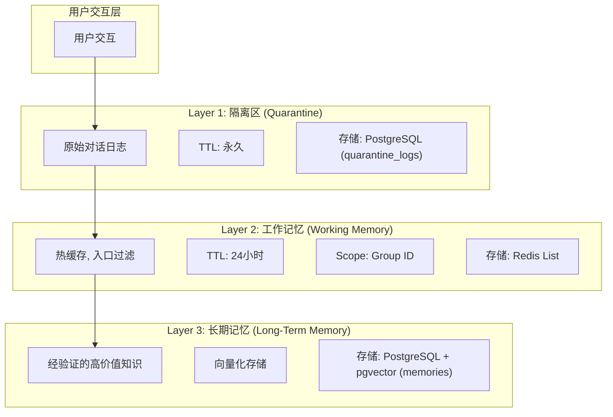
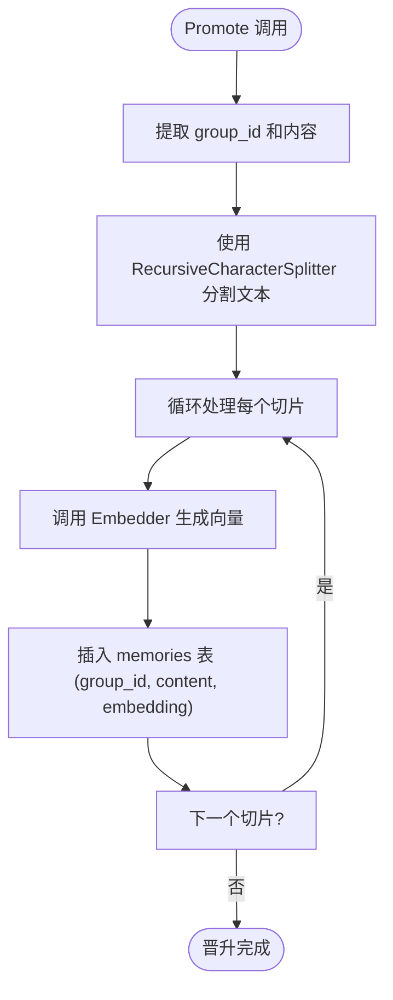
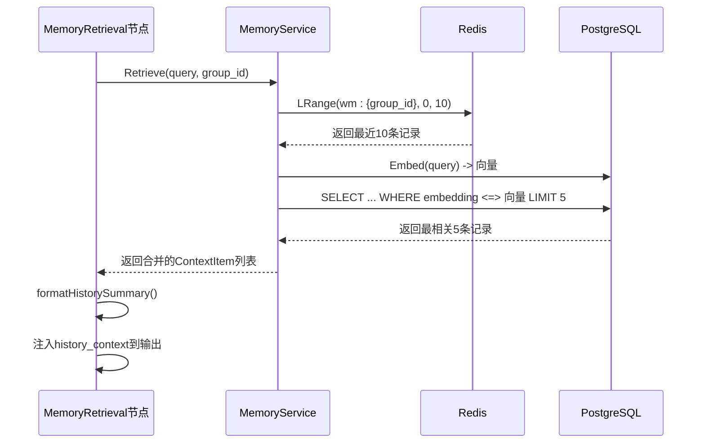

# 记忆数据生命周期

<cite>
**本文档引用文件**  
- [types.go](file://internal/core/memory/types.go)
- [splitter.go](file://internal/core/memory/splitter.go)
- [service.go](file://internal/core/memory/service.go)
- [SPEC-408-memory-protocol.md](file://docs/specs/backend/SPEC-408-memory-protocol.md)
- [SPEC-607-memory-retrieval-node.md](file://docs/specs/sprint6/SPEC-607-memory-retrieval-node.md)
- [memory.go](file://internal/core/middleware/memory.go)
- [memory_retrieval.go](file://internal/core/workflow/nodes/memory_retrieval.go)
- [memory.go](file://internal/api/handler/memory.go)
- [redis.go](file://internal/infrastructure/cache/redis.go)
- [postgres.go](file://internal/infrastructure/db/postgres.go)
- [001_init_schema.up.sql](file://internal/infrastructure/db/migrations/001_init_schema.up.sql)
</cite>

## 目录
1. [引言](#引言)
2. [三层记忆系统架构](#三层记忆系统架构)
3. [记忆数据生成与流转机制](#记忆数据生成与流转机制)
4. [记忆切片与持久化](#记忆切片与持久化)
5. [记忆检索机制](#记忆检索机制)
6. [过期策略与清理机制](#过期策略与清理机制)
7. [服务层API示例](#服务层api示例)
8. [结论](#结论)

## 引言

本文件系统阐述了三层记忆系统的数据生命周期，涵盖从数据生成、流转、切片、持久化到检索的完整流程。系统基于SPEC-408记忆协议，实现了隔离区、工作记忆和长期记忆三个层级的协同工作，确保记忆数据的质量、可用性和性能。记忆检索节点（SPEC-607）作为关键组件，实现了从长期记忆中召回上下文的能力。本文档详细说明了各层级的数据结构、存储策略、触发机制以及向量嵌入与语义搜索的集成方式。

## 三层记忆系统架构

系统采用三层记忆架构，每一层服务于不同的目的并采用不同的存储技术，形成一个从原始数据到高价值知识的净化与沉淀流程。



**图示来源**
- [SPEC-408-memory-protocol.md](file://docs/specs/backend/SPEC-408-memory-protocol.md#1-架构概述)
- [service.go](file://internal/core/memory/service.go#L28-L97)
- [memory.go](file://internal/core/middleware/memory.go#L42-L69)

## 记忆数据生成与流转机制

记忆数据的生命周期始于节点执行完成后的自动触发。通过`MemoryMiddleware`中间件，系统在每个节点执行后自动捕获输出内容，并将其写入相应的记忆层级。

### 自动触发流程

1.  **节点执行完成**：当工作流中的一个节点（如Agent节点）完成执行后，其输出结果（包含`content`字段）被返回。
2.  **中间件拦截**：`MemoryMiddleware`的`AfterNodeExecution`方法被调用，拦截该输出。
3.  **数据提取**：从输出中提取`content`和`metadata`。
4.  **双层写入**：
    *   **隔离区 (Tier 1)**：调用`MemoryManager.LogQuarantine`方法，将原始内容、会话ID、节点ID和元数据写入PostgreSQL的`quarantine_logs`表。此操作是强制性的，所有产出均被记录。
    *   **工作记忆 (Tier 2)**：如果输出中包含`group_id`，则调用`MemoryManager.UpdateWorkingMemory`方法，将内容写入Redis。此操作受入口过滤器保护。

**关键代码路径**
- `MemoryMiddleware.AfterNodeExecution`：负责在节点执行后触发记忆写入。
- `MemoryManager.LogQuarantine`：将数据写入隔离区。
- `MemoryManager.UpdateWorkingMemory`：将数据写入工作记忆。

**本节来源**
- [memory.go](file://internal/core/middleware/memory.go#L28-L72)
- [types.go](file://internal/core/memory/types.go#L10-L13)
- [SPEC-408-memory-protocol.md](file://docs/specs/backend/SPEC-408-memory-protocol.md#3-layer-1-quarantine-隔离区)

## 记忆切片与持久化

长期记忆的构建依赖于`Promote`操作，该操作将工作记忆或隔离区中的高质量内容晋升为可检索的长期知识。此过程由`splitter.go`实现的`RecursiveCharacterSplitter`进行切片。

### 切片与晋升流程

1.  **触发晋升**：用户或系统通过API调用`MemoryManager.Promote`方法，指定`group_id`和待晋升的内容。
2.  **文本切片**：`Promote`方法内部创建一个`RecursiveCharacterSplitter`实例，使用500字符的块大小和50字符的重叠。
3.  **递归分割**：切片器按优先级顺序（`\n\n`, `\n`, ` `, `""`）递归分割文本，确保语义完整性。
4.  **向量嵌入**：对每个切片调用`Embedder.Embed`方法（使用`text-embedding-ada-002`模型）生成向量。
5.  **持久化存储**：将每个切片的内容、向量嵌入和元数据批量插入到PostgreSQL的`memories`表中。



**图示来源**
- [splitter.go](file://internal/core/memory/splitter.go#L7-L101)
- [service.go](file://internal/core/memory/service.go#L115-L157)
- [001_init_schema.up.sql](file://internal/infrastructure/db/migrations/001_init_schema.up.sql#L80-L95)

## 记忆检索机制

记忆检索节点（`memory_retrieval`）是实现上下文召回的核心。它遵循SPEC-607规范，从长期记忆中检索相关历史，并将其注入后续节点的上下文。

### 检索流程

1.  **节点执行**：`MemoryRetrievalProcessor`的`Process`方法被调用。
2.  **查询构建**：从输入上下文中提取`topic`、`group_id`等信息作为查询依据。
3.  **混合检索**：`MemoryService.Retrieve`方法执行两阶段检索：
    *   **热检索 (Hot)**：从Redis的`wm:{group_id}`列表中获取最近的10条工作记忆，相关度分数为1.0。
    *   **冷检索 (Cold)**：对查询文本生成向量嵌入，然后在PostgreSQL的`memories`表上执行向量相似度搜索（余弦距离），返回最相关的5条记录。
4.  **结果聚合**：将热检索和冷检索的结果合并为一个`[]ContextItem`列表。
5.  **上下文注入**：将检索结果格式化为Markdown摘要，并注入到输出上下文的`history_context`字段中。



**图示来源**
- [memory_retrieval.go](file://internal/core/workflow/nodes/memory_retrieval.go#L24-L83)
- [service.go](file://internal/core/memory/service.go#L159-L208)
- [SPEC-607-memory-retrieval-node.md](file://docs/specs/sprint6/SPEC-607-memory-retrieval-node.md#4-技术实现)

## 过期策略与清理机制

系统为不同层级的记忆实现了差异化的过期策略，以平衡数据新鲜度和存储成本。

### 工作记忆过期策略

*   **TTL (Time-To-Live)**：所有写入Redis工作记忆的条目均设置24小时的TTL。
*   **自动清理**：Redis服务器会自动删除过期的键，无需额外的清理任务。`CleanupWorkingMemory`方法目前为空，为未来可能的归档或手动清理逻辑预留。
*   **容量限制**：通过`LTrim`命令，将每个`wm:{group_id}`列表的长度限制为50条，确保只保留最新的记忆。

### 隔离区与长期记忆

*   **隔离区**：无TTL，数据永久保留，直到被手动删除或晋升。
*   **长期记忆**：无TTL，数据永久存储，代表经过验证的高价值知识。

**本节来源**
- [service.go](file://internal/core/memory/service.go#L90-L94)
- [redis.go](file://internal/infrastructure/cache/redis.go)
- [SPEC-408-memory-protocol.md](file://docs/specs/backend/SPEC-408-memory-protocol.md#1-架构概述)

## 服务层API示例

系统通过HTTP API暴露记忆的创建（晋升）和查询功能。

### API端点

*   **POST /api/v1/memory/ingest**：晋升内容到长期记忆。
*   **POST /api/v1/memory/query**：根据查询检索记忆。

### 创建与查询示例

```bash
# 示例1: 晋升内容到长期记忆
curl -X POST http://localhost:8080/api/v1/memory/ingest \
  -H "Content-Type: application/json" \
  -d '{
    "group_id": "grp-123",
    "content": "项目最终决定采用微服务架构，以提高可扩展性和部署灵活性。"
  }'

# 示例2: 查询相关记忆
curl -X POST http://localhost:8080/api/v1/memory/query \
  -H "Content-Type: application/json" \
  -d '{
    "group_id": "grp-123",
    "query": "项目的架构决策是什么？"
  }'
```

响应示例：
```json
{
  "results": [
    {
      "content": "项目最终决定采用微服务架构，以提高可扩展性和部署灵活性。",
      "source": "cold",
      "score": 0.98
    },
    {
      "content": "热数据：用户刚刚讨论了架构选项。",
      "source": "hot",
      "score": 1.0
    }
  ]
}
```

**本节来源**
- [memory.go](file://internal/api/handler/memory.go#L25-L67)

## 结论

本系统通过三层记忆协议（隔离区、工作记忆、长期记忆）实现了高效、可靠的记忆数据生命周期管理。数据在节点执行后自动触发，经由切片、嵌入和持久化流程进入长期记忆。记忆检索节点通过混合检索（Redis + PGVector）实现了低延迟、高精度的上下文召回。差异化的过期策略确保了工作记忆的时效性，同时保留了核心知识的永久性。整个系统设计符合SPEC-408和SPEC-607规范，为构建具备长期记忆能力的智能体系统提供了坚实的基础。