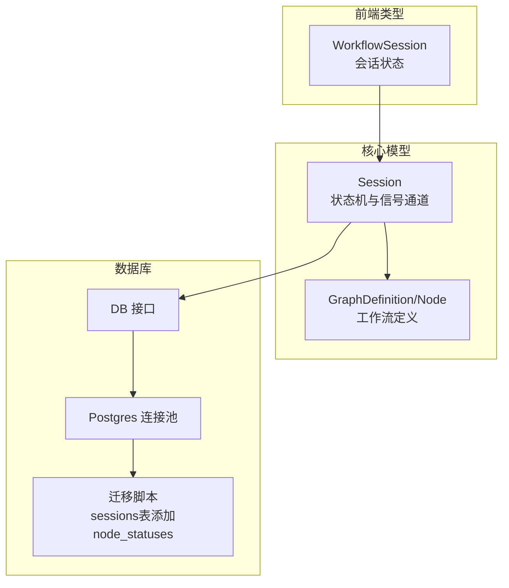
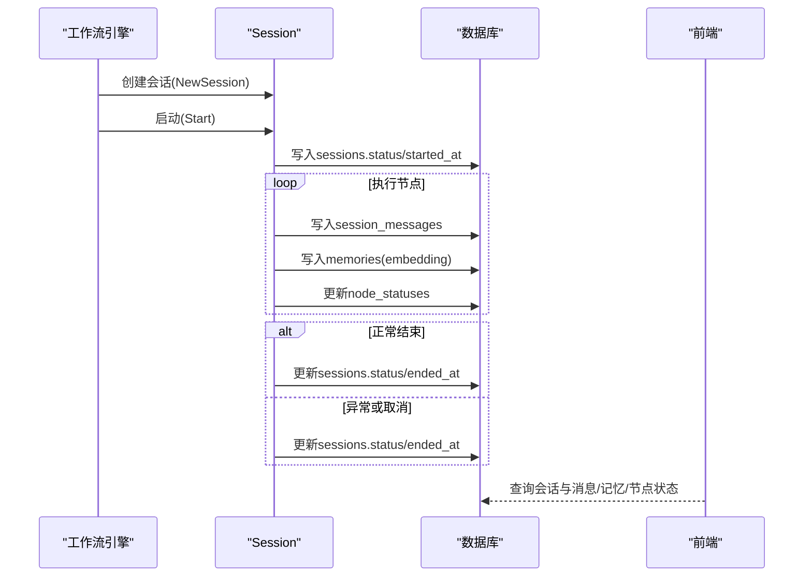
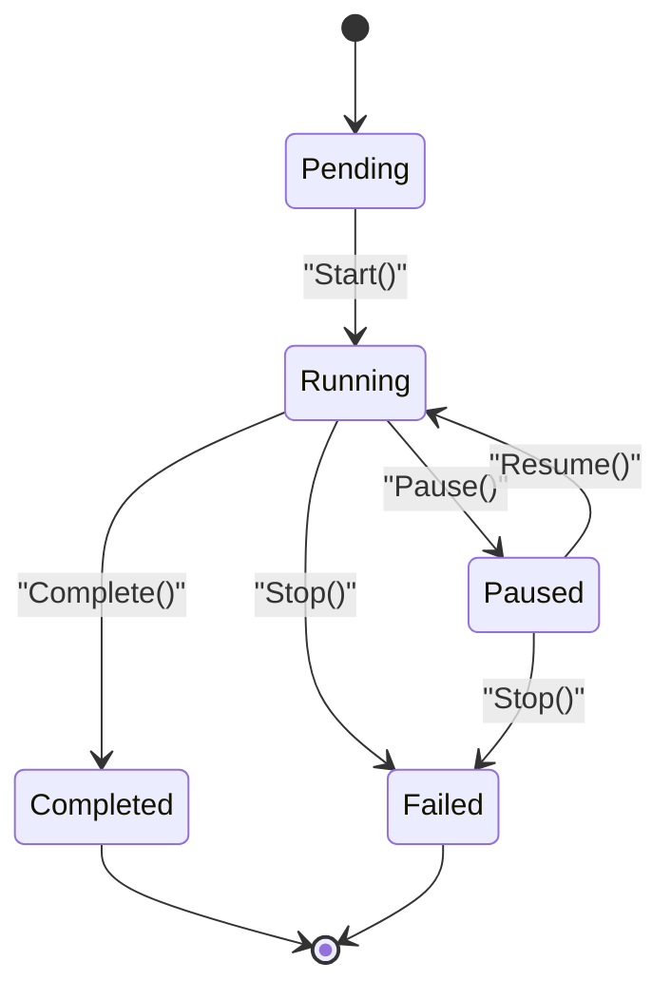
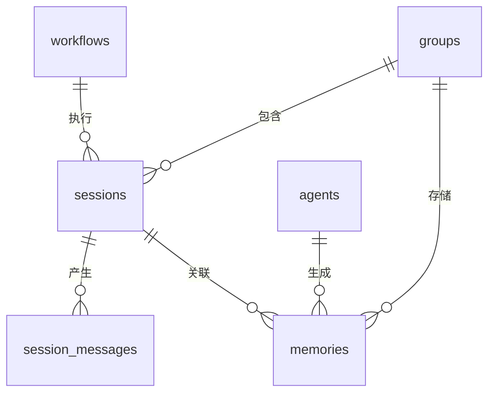
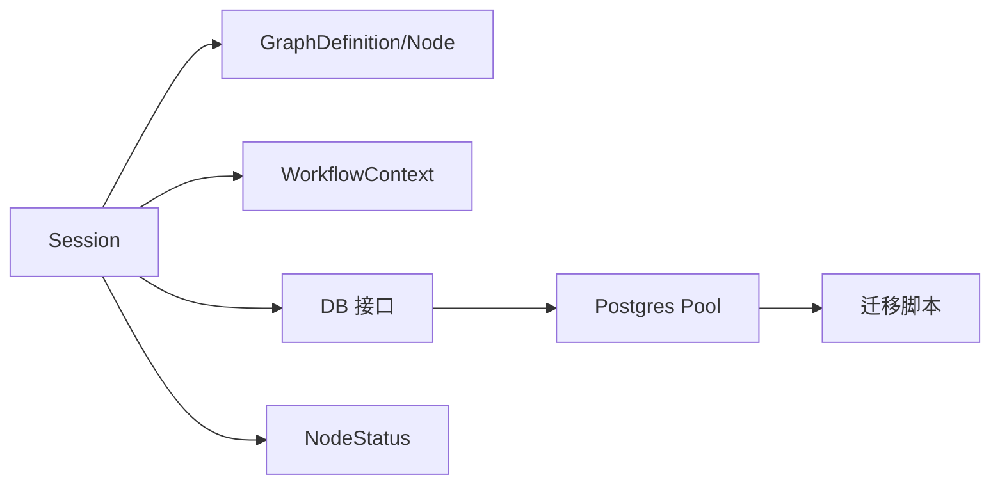

# 会话实体模型

<cite>
**本文引用的文件**
- [session.go](file://internal/core/workflow/session.go)
- [session_repository.go](file://internal/core/workflow/session_repository.go)
- [types.go](file://internal/core/workflow/types.go)
- [002_add_node_statuses.up.sql](file://internal/infrastructure/db/migrations/002_add_node_statuses.up.sql)
- [session.ts](file://frontend/src/types/session.ts)
</cite>

## 更新摘要
**变更内容**
- 更新了会话实体模型以包含节点状态持久化功能
- 新增了`node_statuses`字段的数据库映射、结构体定义和持久化方法
- 更新了状态机相关文档以反映新的节点状态类型

## 目录
1. [简介](#简介)
2. [项目结构](#项目结构)
3. [核心组件](#核心组件)
4. [架构总览](#架构总览)
5. [详细组件分析](#详细组件分析)
6. [依赖分析](#依赖分析)
7. [性能考虑](#性能考虑)
8. [故障排查指南](#故障排查指南)
9. [结论](#结论)
10. [附录](#附录)

## 简介
本文件系统性阐述"会话"实体模型在代码中的结构定义、数据库映射关系、业务语义与生命周期管理，以及与工作流定义、群组上下文、消息与记忆表之间的关联查询模式。重点覆盖：
- 结构体字段类型、约束与用途（如ID为主键、状态机、提案proposal、起止时间）
- 作为工作流执行实例的角色与与Workflow、Group的关联
- 数据库索引策略（如session_messages.session_id外键索引）
- 状态机转换逻辑（启动、暂停/恢复、完成/失败/取消）
- 启动会话、更新状态、存储提案的调用路径与示例位置
- 与session_messages、memories表的关联查询模式
- **新增：节点状态持久化字段`node_statuses`的实现与使用**

## 项目结构
围绕会话实体的关键代码与数据结构分布如下：
- 核心模型与状态机：internal/core/workflow/session.go
- 类型与节点定义：internal/core/workflow/types.go
- 数据库Schema与索引：internal/infrastructure/db/migrations/002_add_node_statuses.up.sql
- 会话持久化仓库：internal/core/workflow/session_repository.go
- 前端会话类型定义：frontend/src/types/session.ts

**图表来源**
- [session.go](file://internal/core/workflow/session.go#L1-L252)
- [types.go](file://internal/core/workflow/types.go#L1-L68)
- [002_add_node_statuses.up.sql](file://internal/infrastructure/db/migrations/002_add_node_statuses.up.sql#L1-L2)
- [session.ts](file://frontend/src/types/session.ts#L1-L99)

## 核心组件
- Session结构体：承载一次工作流执行实例的状态、时间戳、输入输出、错误与并发控制
- SessionStatus：会话状态机枚举（pending、running、paused、completed、failed、cancelled）
- GraphDefinition/Node：工作流静态定义，用于驱动会话执行
- NodeStatus：节点状态机枚举（pending、running、completed、failed、skipped、suspended）
- 数据库表：sessions、session_messages、memories，分别记录会话、消息与向量记忆
- **新增：SessionEntity结构体中的`NodeStatuses`字段，用于持久化存储各节点的执行状态**

**章节来源**
- [session.go](file://internal/core/workflow/session.go#L12-L40)
- [types.go](file://internal/core/workflow/types.go#L8-L18)
- [session_repository.go](file://internal/core/workflow/session_repository.go#L8-L17)

## 架构总览
会话实体在系统中的位置与交互如下：
- Session由工作流引擎创建，持有GraphDefinition与执行上下文
- 执行期间通过信号通道与中间件协作，产生消息与记忆
- 数据层通过迁移脚本为sessions表添加node_statuses JSONB列，用于持久化节点状态
- 前端以WorkflowSession类型消费会话状态与节点快照

**图表来源**
- [session.go](file://internal/core/workflow/session.go#L42-L252)
- [002_add_node_statuses.up.sql](file://internal/infrastructure/db/migrations/002_add_node_statuses.up.sql#L1-L2)
- [session.ts](file://frontend/src/types/session.ts#L72-L93)

## 详细组件分析

### Session结构体与状态机
- 字段与语义
  - ID：字符串标识符，初始化时生成唯一值
  - Graph：指向工作流图定义，决定执行路径
  - Status：会话状态机，支持pending、running、paused、completed、failed、cancelled
  - StartTime/EndTime：记录执行起止时间
  - Inputs/Outputs/Error：执行输入、输出与错误
  - ctx/cancel/resumeCh：可取消上下文与暂停/恢复通道
  - SignalChannels：节点间信号通道，支持非阻塞发送
  - mu：读写锁，保证并发安全
  - **NodeStatuses：新增字段，用于存储各节点的执行状态，类型为map[string]NodeStatus**
  - ContextData：运行时上下文，用于存储循环变量等数据
- 状态转换
  - NewSession：初始状态pending
  - Start：进入running并设置StartTime，创建可取消上下文
  - Pause/Resume：在running与paused之间切换，通过resumeCh阻塞/唤醒
  - Complete：标记completed并设置EndTime，清理cancel
  - Stop：标记failed并设置EndTime，清理cancel
  - WaitIfPaused：在paused状态下阻塞直到Resume或上下文取消
  - GetSignalChannel/SendSignal：基于节点ID的信号通道管理与发送
- 并发与线程安全
  - 所有状态变更均加互斥锁保护
  - WaitIfPaused对读锁进行保护，避免竞态

**章节来源**
- [session.go](file://internal/core/workflow/session.go#L12-L40)
- [session.go](file://internal/core/workflow/session.go#L51-L252)

### 数据库映射与索引策略
- sessions表
  - 主键：id（UUID）
  - 外键：group_id（groups.id，级联删除）、workflow_id（workflows.id）
  - 字段：status（varchar，默认pending）、proposal（JSONB）、started_at、ended_at
  - **新增：node_statuses（JSONB，默认'{}'），用于持久化存储各节点的执行状态**
  - 索引：updated_at列（迁移脚本添加）
- session_messages表
  - 主键：id（UUID）
  - 外键：session_id（sessions.id，级联删除）
  - 字段：node_id、agent_id、content、token_count、is_thinking、created_at
  - 索引：idx_session_messages_session(session_id)，加速按会话查询消息
- memories表
  - 主键：id（UUID）
  - 外键：group_id（groups.id，级联删除）、agent_id（agents.id）、session_id（sessions.id）
  - 字段：content、embedding（向量）、metadata、created_at
  - 索引：idx_memories_group(group_id)、idx_memories_embedding（ivfflat向量索引）

**图表来源**
- [002_add_node_statuses.up.sql](file://internal/infrastructure/db/migrations/002_add_node_statuses.up.sql#L1-L2)
- [003_add_updated_at_columns.up.sql](file://internal/infrastructure/db/migrations/003_add_updated_at_columns.up.sql#L1-L5)

### 业务语义与与工作流、群组的关联
- 作为工作流执行实例
  - Session由GraphDefinition驱动，承载一次完整的工作流执行过程
  - 通过WorkflowContext传递SessionID与全局输入，供节点处理器使用
- 与Group上下文
  - sessions.group_id外键关联groups，体现会话所属群组
  - memories.session_id外键关联sessions，体现会话产生的记忆
- 与Workflow定义
  - sessions.workflow_id外键关联workflows，体现会话执行的具体工作流版本
- 与消息与记忆
  - session_messages记录会话期间各节点的消息产出
  - memories记录会话期间的文本嵌入与元数据，支持检索
- **新增：节点状态持久化**
  - sessions表的node_statuses字段记录了各节点的执行状态，支持工作流执行状态的持久化和恢复
  - 通过JSONB类型存储，支持灵活的节点状态查询和更新

**章节来源**
- [types.go](file://internal/core/workflow/types.go#L43-L67)
- [context.go](file://internal/core/workflow/context.go#L16-L35)
- [002_add_node_statuses.up.sql](file://internal/infrastructure/db/migrations/002_add_node_statuses.up.sql#L1-L2)

### 关联查询模式
- 会话详情与消息
  - 通过sessions.id匹配session_messages.session_id，按created_at排序获取消息列表
  - 可结合agent_id过滤特定Agent的消息
- 会话详情与记忆
  - 通过sessions.id匹配memories.session_id，按created_at或向量相似度检索
  - 使用idx_memories_embedding加速向量检索
- 会话列表与群组
  - 通过groups.id匹配sessions.group_id，筛选某群组下的所有会话
- 会话状态与时序
  - 通过sessions.status与started_at/ended_at进行状态与时序筛选
- **新增：节点状态查询**
  - 通过sessions.node_statuses字段查询特定节点的状态
  - 支持JSONB查询操作，如`node_statuses->>'node1' = 'running'`

**章节来源**
- [002_add_node_statuses.up.sql](file://internal/infrastructure/db/migrations/002_add_node_statuses.up.sql#L1-L2)

### 代码示例与调用路径（示例位置）
- 启动会话
  - 路径：NewSession -> Start
  - 示例位置：[session.go](file://internal/core/workflow/session.go#L112-L132)
- 更新状态（完成）
  - 路径：Complete
  - 示例位置：[session.go](file://internal/core/workflow/session.go#L134-L142)
- 更新状态（失败/取消）
  - 路径：Stop
  - 示例位置：[session.go](file://internal/core/workflow/session.go#L231-L242)
- 存储提案（proposal）
  - 会话结构体包含proposal字段；数据库schema中sessions.proposal为JSONB
  - 示例位置：[session.go](file://internal/core/workflow/session.go#L23-L40)、[001_init_schema.up.sql](file://internal/infrastructure/db/migrations/001_init_schema.up.sql#L56-L65)
- 会话消息与记忆写入
  - 通过session_messages与memories表写入，使用外键session_id关联
  - 示例位置：[001_init_schema.up.sql](file://internal/infrastructure/db/migrations/001_init_schema.up.sql#L68-L96)
- **新增：节点状态更新**
  - 路径：通过SessionRepository.UpdateNodeStatus方法更新特定节点状态
  - 示例位置：[session_repository.go](file://internal/core/workflow/session_repository.go#L25)
- 数据库连接与迁移
  - 初始化连接池、运行迁移
  - 示例位置：[postgres.go](file://internal/infrastructure/db/postgres.go#L1-L65)、[interface.go](file://internal/infrastructure/db/interface.go#L1-L15)
- 工作流持久化（参考）
  - 工作流定义的持久化仓库，展示外键与JSONB字段的使用
  - 示例位置：[workflow_repository.go](file://internal/infrastructure/persistence/workflow_repository.go#L1-L47)

**章节来源**
- [session.go](file://internal/core/workflow/session.go#L42-L252)
- [session_repository.go](file://internal/core/workflow/session_repository.go#L25)
- [002_add_node_statuses.up.sql](file://internal/infrastructure/db/migrations/002_add_node_statuses.up.sql#L1-L2)
- [postgres.go](file://internal/infrastructure/db/postgres.go#L1-L65)
- [interface.go](file://internal/infrastructure/db/interface.go#L1-L15)
- [workflow_repository.go](file://internal/infrastructure/persistence/workflow_repository.go#L1-L47)

## 依赖分析
- 组件耦合
  - Session依赖GraphDefinition与WorkflowContext，用于执行与上下文传递
  - Session通过DB接口与Postgres连接池交互，写入sessions、session_messages、memories
  - **新增：Session通过NodeStatuses字段与节点状态机耦合**
- 外部依赖
  - 数据库：PostgreSQL + pgvector扩展
  - 连接池：pgxpool
  - 迁移：TDD推荐的up/down脚本
- 循环依赖
  - 未发现直接循环依赖；Session仅依赖核心类型与上下文，不反向依赖持久层

**图表来源**
- [session.go](file://internal/core/workflow/session.go#L1-L252)
- [types.go](file://internal/core/workflow/types.go#L1-L68)
- [context.go](file://internal/core/workflow/context.go#L1-L35)
- [interface.go](file://internal/infrastructure/db/interface.go#L1-L15)
- [postgres.go](file://internal/infrastructure/db/postgres.go#L1-L65)
- [002_add_node_statuses.up.sql](file://internal/infrastructure/db/migrations/002_add_node_statuses.up.sql#L1-L2)

## 性能考虑
- 索引策略
  - session_messages.session_id：按会话查询消息的高频场景
  - memories.group_id：按群组检索记忆
  - memories.embedding：向量检索索引，提升相似度查询性能
- 时间字段
  - sessions.started_at/ended_at便于时序分析与报表统计
  - updated_at便于增量同步与审计
- 并发与锁
  - Session内部使用互斥锁保护状态与通道，避免竞态
  - WaitIfPaused通过通道阻塞，减少忙轮询
- **新增：节点状态持久化性能**
  - 使用JSONB类型存储节点状态，支持高效的查询和更新操作
  - 避免了为每个节点状态创建单独的表或行，减少了数据库I/O开销

[本节为通用指导，无需列出具体文件来源]

## 故障排查指南
- 状态机异常
  - 若会话无法从paused恢复，检查Resume是否被调用且resumeCh已关闭
  - 若Stop后仍处于running，确认Stop是否正确设置状态并调用cancel
- 数据一致性
  - sessions与session_messages、memories的外键约束确保删除一致性
  - 如出现"找不到会话"的查询结果，检查session_id是否正确传入
- 向量检索问题
  - 若向量索引未生效，确认pgvector扩展已启用且idx_memories_embedding存在
- 连接与迁移
  - 若迁移失败，检查数据库URL与连接池初始化流程
  - 确认迁移脚本顺序与目标数据库版本兼容
- **新增：节点状态问题**
  - 若节点状态未正确更新，检查SessionRepository.UpdateNodeStatus是否被正确调用
  - 确认node_statuses字段的JSONB格式是否正确
  - 检查数据库迁移脚本是否已成功应用

**章节来源**
- [session.go](file://internal/core/workflow/session.go#L74-L252)
- [002_add_node_statuses.up.sql](file://internal/infrastructure/db/migrations/002_add_node_statuses.up.sql#L1-L2)
- [postgres.go](file://internal/infrastructure/db/postgres.go#L1-L65)

## 结论
Session实体模型清晰地将一次工作流执行抽象为可追踪、可观测、可并发控制的实例。通过明确的状态机、严谨的数据库外键与索引设计，以及与消息、记忆表的紧密关联，支撑了从执行到回放的全链路能力。**新增的节点状态持久化功能**通过在sessions表中添加node_statuses JSONB列，实现了对各节点执行状态的持久化存储，增强了工作流执行状态的可靠性和可恢复性。配合前端类型定义，实现了前后端一致的会话状态语义。

[本节为总结，无需列出具体文件来源]

## 附录
- 前端会话类型
  - WorkflowSession：包含id、workflowId、groupId、status、startedAt、completedAt、节点状态快照与统计
  - 示例位置：[session.ts](file://frontend/src/types/session.ts#L72-L93)
- 迁移脚本参考
  - sessions表添加node_statuses列
  - 示例位置：[002_add_node_statuses.up.sql](file://internal/infrastructure/db/migrations/002_add_node_statuses.up.sql#L1-L2)
- 下游脚本（不影响会话模型）
  - [002_add_node_statuses.down.sql](file://internal/infrastructure/db/migrations/002_add_node_statuses.down.sql#L1-L1)