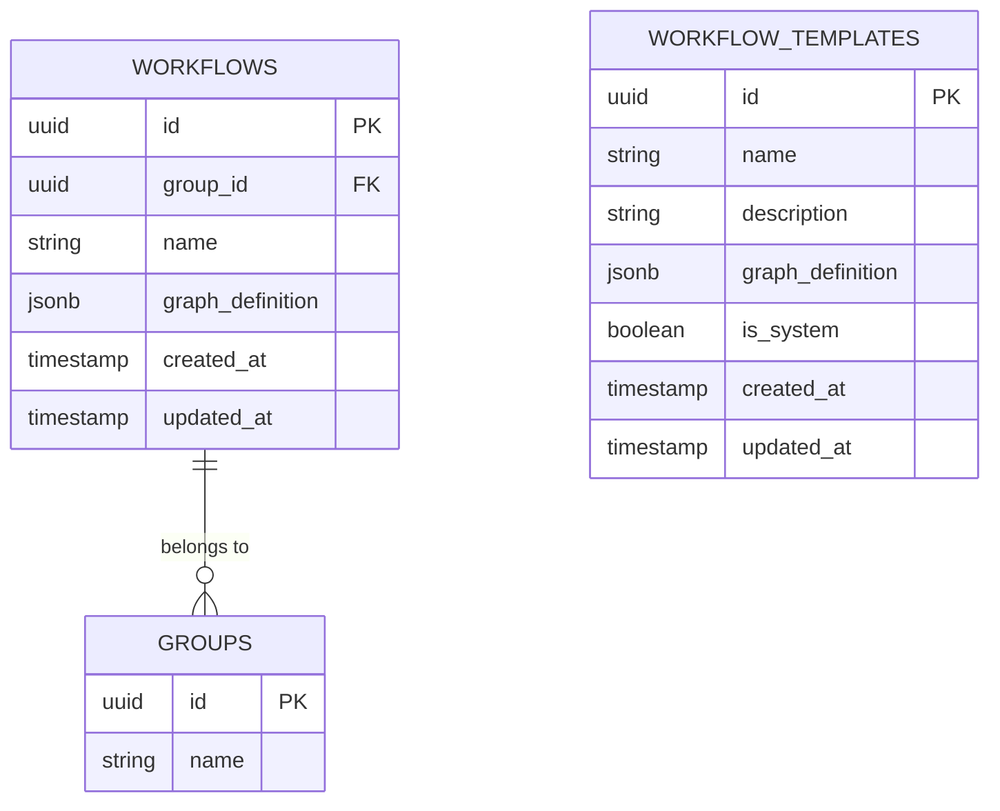

# 工作流实体模型

<cite>
**本文档引用的文件**  
- [types.go](file://internal/core/workflow/types.go)
- [001_init_schema.up.sql](file://internal/infrastructure/db/migrations/001_init_schema.up.sql)
- [003_add_updated_at_columns.up.sql](file://internal/infrastructure/db/migrations/003_add_updated_at_columns.up.sql)
- [workflow_repository.go](file://internal/infrastructure/persistence/workflow_repository.go)
- [template.go](file://internal/core/workflow/template.go)
</cite>

## 目录
1. [引言](#引言)
2. [核心结构定义](#核心结构定义)
3. [数据库映射关系](#数据库映射关系)
4. [工作流DAG设计](#工作流dag设计)
5. [节点执行状态管理](#节点执行状态管理)
6. [JSONB字段序列化机制](#jsonb字段序列化机制)
7. [数据库索引与版本控制](#数据库索引与版本控制)
8. [工作流创建与拓扑解析](#工作流创建与拓扑解析)
9. [流程控制与执行逻辑](#流程控制与执行逻辑)
10. [与Session和Template的关联关系](#与session和template的关联关系)

## 引言
本文档详细阐述了“Council”系统中工作流（Workflow）实体模型的设计与实现。该模型基于有向无环图（DAG）结构，支持多种节点类型和复杂执行逻辑，是系统自动化决策流程的核心。文档将深入解析其Go语言结构定义、数据库存储方式、状态管理机制以及与其他关键实体的关联。

## 核心结构定义

工作流的核心结构在 `internal/core/workflow/types.go` 文件中定义，主要包括 `GraphDefinition` 和 `Node` 两个结构体。

- **GraphDefinition**: 代表工作流的静态定义，包含工作流的ID、名称、描述以及节点集合。
- **Node**: 代表工作流中的单个节点，包含节点ID、类型、名称、后继节点ID列表和节点属性。

此外，还定义了 `NodeType` 枚举，用于区分不同类型的节点，如起始节点、智能体节点、投票节点等。

**Section sources**
- [types.go](file://internal/core/workflow/types.go#L43-L66)

## 数据库映射关系

工作流的持久化存储通过PostgreSQL数据库实现，主要涉及 `workflows` 和 `workflow_templates` 两张表。

- **workflows 表**: 存储用户创建或修改的工作流实例。其 `graph_definition` 字段为JSONB类型，直接存储 `GraphDefinition` 结构体的JSON序列化结果。
- **workflow_templates 表**: 存储可复用的工作流模板，结构与 `workflows` 表类似，但增加了 `is_system` 字段以区分系统内置模板和用户自定义模板。

`workflows` 表通过 `group_id` 外键与 `groups` 表关联，表明工作流属于某个特定的智能体组。



**Diagram sources**
- [001_init_schema.up.sql](file://internal/infrastructure/db/migrations/001_init_schema.up.sql#L37-L44)
- [003_add_updated_at_columns.up.sql](file://internal/infrastructure/db/migrations/003_add_updated_at_columns.up.sql#L1-L2)

## 工作流DAG设计

工作流采用有向无环图（DAG）来建模复杂的执行流程。其设计要点如下：

### 节点类型 (NodeType)
系统定义了丰富的节点类型，以支持多样化的业务场景：
- **NodeTypeStart**: 流程的起始节点。
- **NodeTypeEnd**: 流程的结束节点。
- **NodeTypeAgent**: 调用一个或多个智能体（Agent）执行任务。
- **NodeTypeVote**: 实现投票逻辑，根据多个智能体的输出进行决策。
- **NodeTypeLoop**: 实现循环逻辑，支持重复执行子流程。
- **NodeTypeFactCheck**: 对输出内容进行事实核查。
- **NodeTypeHumanReview**: 插入人工审核环节。
- **NodeTypeMemoryRetrieval**: 从记忆库中检索相关信息。

### 节点连接 (NextIDs)
节点间的连接关系通过 `Node` 结构体的 `NextIDs` 字段实现。该字段是一个字符串切片，存储了当前节点所有后继节点的ID。这种“邻接表”形式的设计使得构建和遍历DAG变得非常高效。

### 节点属性 (Properties)
`Properties` 字段是一个 `map[string]interface{}` 类型的通用映射，用于存储节点特定的配置信息。例如，一个 `NodeTypeAgent` 节点的 `Properties` 可能包含 `prompt`（提示词）、`model`（使用的LLM模型）等配置。

**Section sources**
- [types.go](file://internal/core/workflow/types.go#L25-L41)

## 节点执行状态管理

节点的执行状态由 `NodeStatus` 枚举定义，用于跟踪工作流执行过程中的各个阶段：
- **StatusPending**: 节点等待执行。
- **StatusRunning**: 节点正在执行。
- **StatusCompleted**: 节点成功完成。
- **StatusFailed**: 节点执行失败。
- **StatusSkipped**: 节点被跳过。
- **StatusSuspended**: 节点执行被挂起（例如，等待人工审核）。

这些状态在工作流引擎执行过程中动态更新，为用户提供实时的执行进度反馈。

**Section sources**
- [types.go](file://internal/core/workflow/types.go#L8-L17)

## JSONB字段序列化机制

`workflows` 表中的 `graph_definition` 字段是JSONB类型，它直接存储了 `GraphDefinition` 结构体的JSON序列化结果。

当创建工作流或更新工作流时，Go代码会使用 `json.Marshal()` 函数将 `GraphDefinition` 对象转换为JSON字节流，并存入数据库。反之，当从数据库读取工作流时，会使用 `json.Unmarshal()` 函数将JSON数据反序列化回 `GraphDefinition` 对象。

这种设计的优势在于：
1.  **灵活性**: JSONB可以存储任意嵌套的结构，无需预先定义所有字段。
2.  **查询能力**: PostgreSQL支持对JSONB字段进行高效的查询和索引。
3.  **简化代码**: 避免了为每个字段编写复杂的SQL映射代码。

**Section sources**
- [workflow_repository.go](file://internal/infrastructure/persistence/workflow_repository.go#L37-L40)
- [workflow_repository.go](file://internal/infrastructure/persistence/workflow_repository.go#L59-L62)

## 数据库索引与版本控制

### 数据库索引
为了优化查询性能，数据库为关键字段建立了索引：
- `workflows` 表的 `id` 字段有主键索引。
- `workflows` 表的 `group_id` 字段有外键索引，加速按组查询工作流。
- `workflow_templates` 表的 `is_system` 字段可以建立索引，以快速区分系统模板和用户模板。

### 版本控制机制
系统通过 `updated_at` 时间戳字段实现简单的版本控制。`workflows` 和 `workflow_templates` 表都包含 `created_at` 和 `updated_at` 字段。

- **created_at**: 记录工作流或模板的创建时间。
- **updated_at**: 每次更新工作流或模板时，该字段会自动更新为当前时间。

通过比较 `updated_at` 字段，可以轻松判断哪个版本是最新的，并按更新时间对工作流列表进行排序。

**Section sources**
- [001_init_schema.up.sql](file://internal/infrastructure/db/migrations/001_init_schema.up.sql#L42-L43)
- [003_add_updated_at_columns.up.sql](file://internal/infrastructure/db/migrations/003_add_updated_at_columns.up.sql#L1-L2)
- [workflow_repository.go](file://internal/infrastructure/persistence/workflow_repository.go#L71)

## 工作流创建与拓扑解析

### 创建工作流
创建工作流的流程如下：
1.  客户端构造一个 `GraphDefinition` 对象。
2.  调用 `WorkflowRepository.Create()` 方法。
3.  该方法将 `GraphDefinition` 序列化为JSON，并执行 `INSERT` 语句将其存入 `workflows` 表。

### 解析节点拓扑
解析工作流拓扑结构是执行引擎的核心任务。引擎会：
1.  从数据库加载 `graph_definition` 的JSON数据。
2.  反序列化为 `GraphDefinition` 对象。
3.  从 `StartNodeID` 开始，根据每个节点的 `NextIDs` 字段递归遍历整个DAG，构建执行计划。

**Section sources**
- [workflow_repository.go](file://internal/infrastructure/persistence/workflow_repository.go#L21-L46)

## 流程控制与执行逻辑

工作流的执行由 `Engine` 组件控制。其核心逻辑是遍历DAG，按拓扑顺序执行每个节点。

1.  **状态机**: 引擎维护一个状态机，根据当前节点的 `NodeStatus` 决定下一步操作。
2.  **节点处理器**: 不同的 `NodeType` 对应不同的处理器（如 `agent.go`, `vote.go`）。引擎根据节点类型调用相应的处理器。
3.  **中间件**: 系统支持 `Middleware` 接口，允许在节点执行前后插入逻辑，如熔断器、记忆检索等，以增强安全性和可观测性。

**Section sources**
- [types.go](file://internal/core/workflow/types.go#L61-L65)

## 与Session和Template的关联关系

### 与Session的关联
`Session`（会话）是工作流的一次具体执行实例。它们之间的关系如下：
- **workflows 表** 与 **sessions 表** 通过 `workflow_id` 外键关联。
- 一个工作流（`workflow`）可以被启动多次，每次启动都会创建一个新的 `session`。
- `session` 表中的 `status` 字段记录了本次执行的总体状态。

### 与Template的关联
`Template`（模板）是预定义的工作流，用于快速创建新的工作流实例。
- **workflow_templates 表** 存储了模板的 `graph_definition`。
- 当用户选择一个模板来创建工作流时，系统会复制该模板的 `GraphDefinition`，并将其存入 `workflows` 表。
- `Template` 结构体本身也包含一个 `Graph` 字段，其类型就是 `GraphDefinition`，这保证了模板与工作流定义的一致性。

```mermaid
classDiagram
class GraphDefinition {
+string ID
+string Name
+string Description
+map[string]*Node Nodes
+string StartNodeID
}
class Node {
+string ID
+NodeType Type
+string Name
+[]string NextIDs
+map[string]interface{} Properties
}
class Template {
+string ID
+string Name
+string Description
+TemplateCategory Category
+bool IsSystem
+GraphDefinition Graph
+time.Time CreatedAt
+time.Time UpdatedAt
}
class WorkflowEntity {
+string ID
+string Name
+GraphDefinition GraphDefinition
+time.Time CreatedAt
+time.Time UpdatedAt
}
class Session {
+string ID
+string WorkflowID
+string Status
+interface{} Proposal
}
GraphDefinition "1" --> "1..*" Node : 包含
Template "1" --> "1" GraphDefinition : 定义
WorkflowEntity "1" --> "1" GraphDefinition : 定义
Session "1" --> "1" WorkflowEntity : 实例化
```

**Diagram sources**
- [types.go](file://internal/core/workflow/types.go#L43-L58)
- [template.go](file://internal/core/workflow/template.go#L18-L27)

**Section sources**
- [types.go](file://internal/core/workflow/types.go#L43-L58)
- [template.go](file://internal/core/workflow/template.go#L18-L27)
- [001_init_schema.up.sql](file://internal/infrastructure/db/migrations/001_init_schema.up.sql#L57-L65)