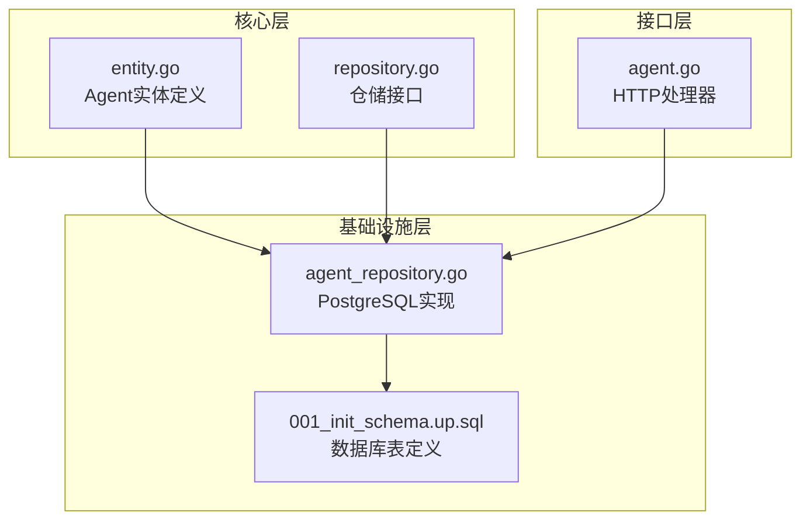
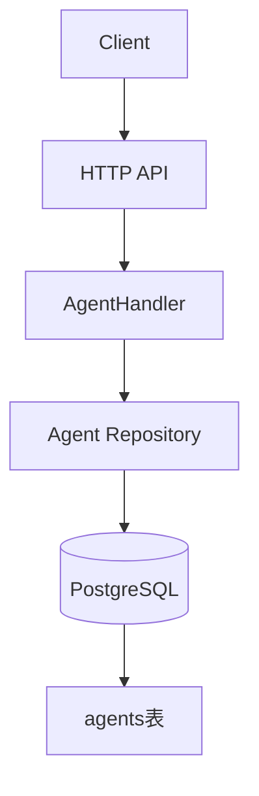
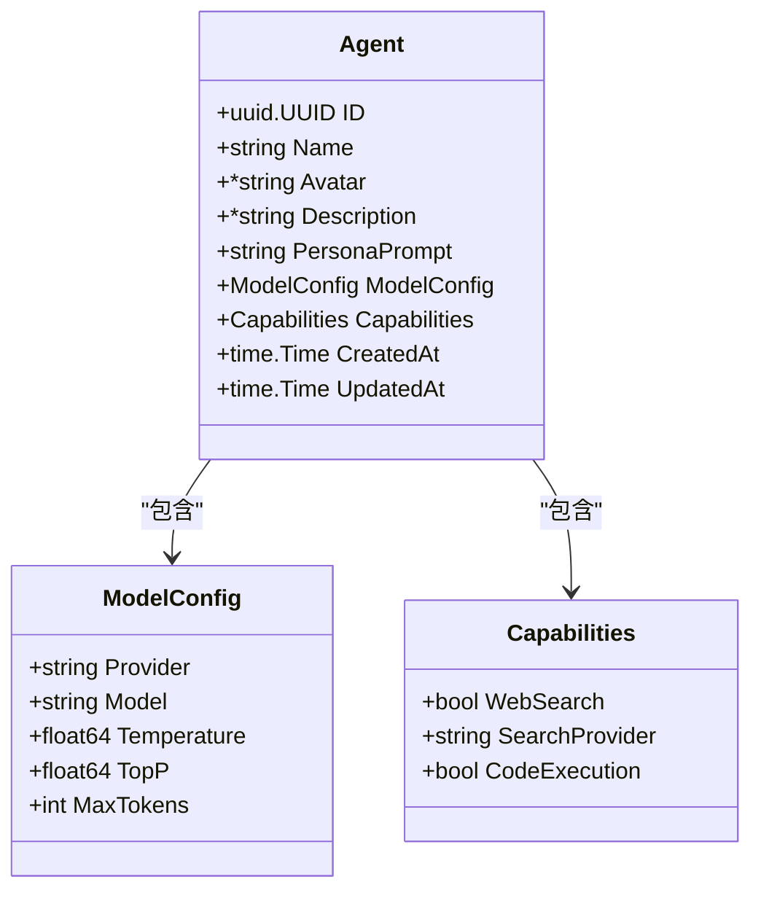
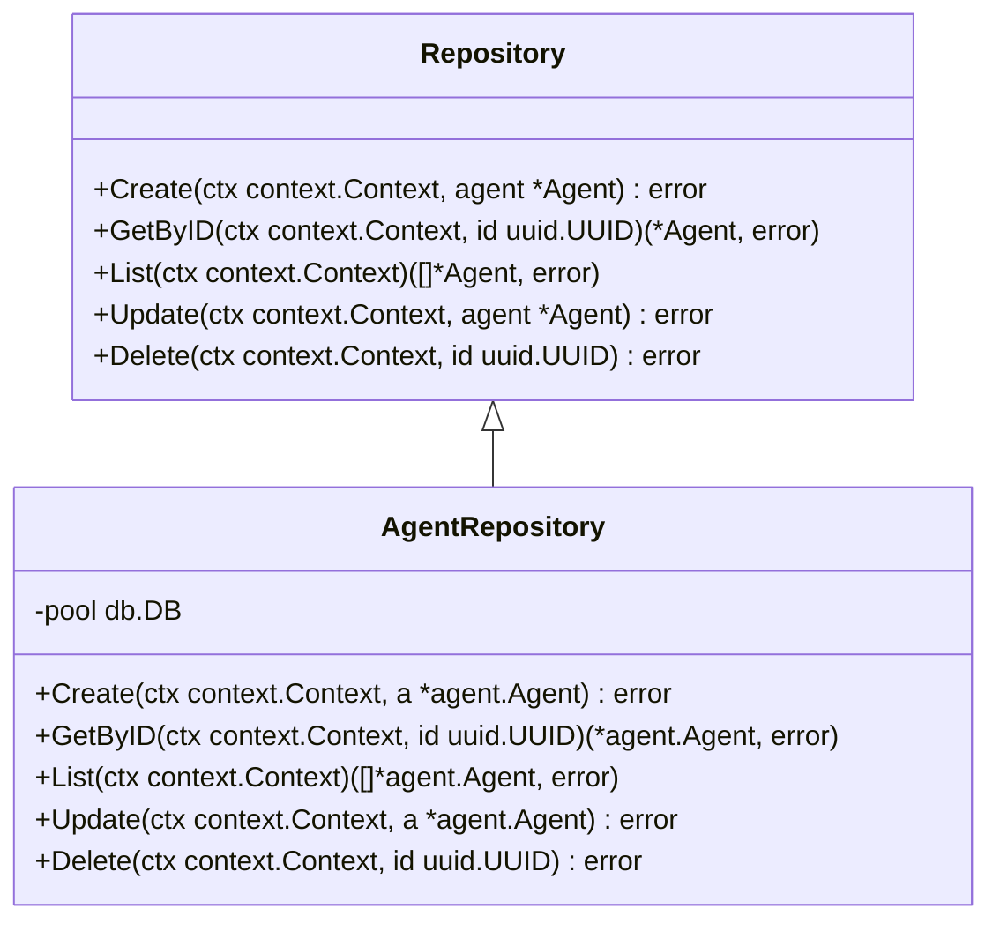
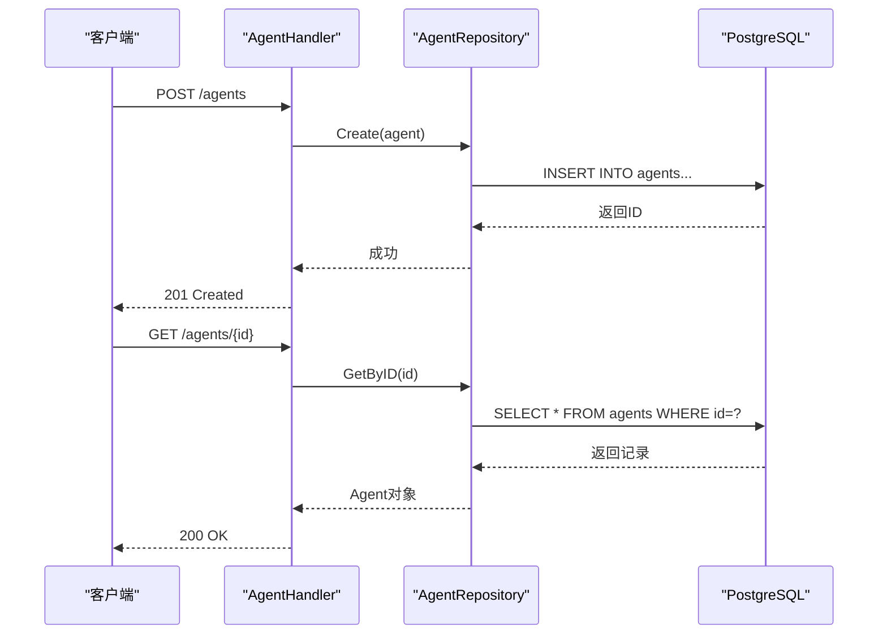
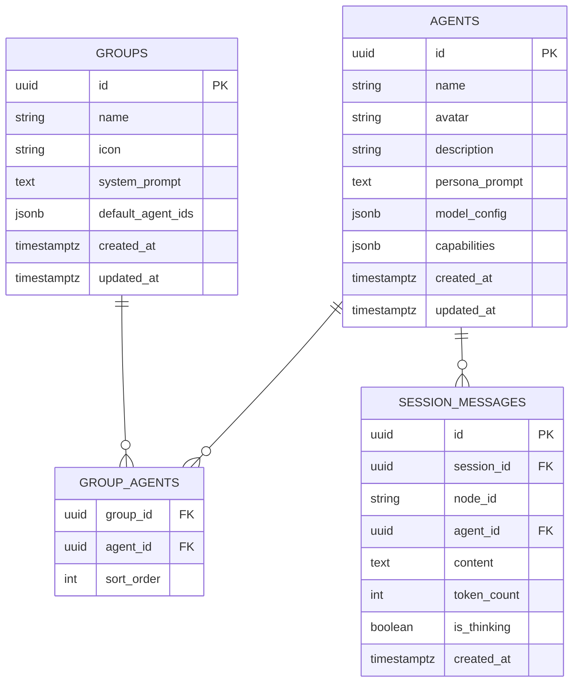

# 智能体实体模型

<cite>
**本文档引用文件**  
- [entity.go](file://internal/core/agent/entity.go)
- [repository.go](file://internal/core/agent/repository.go)
- [agent_repository.go](file://internal/infrastructure/persistence/agent_repository.go)
- [agent.go](file://internal/api/handler/agent.go)
- [001_init_schema.up.sql](file://internal/infrastructure/db/migrations/001_init_schema.up.sql)
- [group.go](file://internal/core/group/entity.go)
- [session.go](file://internal/core/workflow/session.go)
</cite>

## 目录
1. [引言](#引言)
2. [项目结构](#项目结构)
3. [核心组件](#核心组件)
4. [架构概述](#架构概述)
5. [详细组件分析](#详细组件分析)
6. [依赖分析](#依赖分析)
7. [性能考虑](#性能考虑)
8. [故障排除指南](#故障排除指南)
9. [结论](#结论)

## 引言
本文档详细描述了智能体（Agent）实体模型的设计与实现，涵盖其在Go代码中的结构定义、数据库映射关系、业务语义以及与其他实体的关联。重点分析`Agent`、`ModelConfig`和`Capabilities`三个核心结构体，解释各字段的类型、约束条件和用途，并提供数据库索引策略、JSONB字段查询示例及数据访问模式。

## 项目结构
智能体相关代码主要分布在`internal/core/agent`目录下，包含实体定义和仓储接口；持久化实现在`internal/infrastructure/persistence`中；API处理逻辑位于`internal/api/handler`。数据库表结构通过`internal/infrastructure/db/migrations`中的SQL迁移文件定义。



**图示来源**
- [entity.go](file://internal/core/agent/entity.go)
- [repository.go](file://internal/core/agent/repository.go)
- [agent_repository.go](file://internal/infrastructure/persistence/agent_repository.go)
- [001_init_schema.up.sql](file://internal/infrastructure/db/migrations/001_init_schema.up.sql)
- [agent.go](file://internal/api/handler/agent.go)

**本节来源**
- [entity.go](file://internal/core/agent/entity.go)
- [repository.go](file://internal/core/agent/repository.go)
- [agent_repository.go](file://internal/infrastructure/persistence/agent_repository.go)
- [001_init_schema.up.sql](file://internal/infrastructure/db/migrations/001_init_schema.up.sql)
- [agent.go](file://internal/api/handler/agent.go)

## 核心组件
智能体实体模型由`Agent`结构体为核心，包含`ModelConfig`用于指定LLM配置，`Capabilities`定义智能体能力。所有字段均通过JSON标签支持序列化，DB标签支持数据库映射。ID为UUID主键，Name为非空字符串，PersonaPrompt存储AI角色提示词。

**本节来源**
- [entity.go](file://internal/core/agent/entity.go#L9-L36)

## 架构概述
系统采用分层架构，智能体实体位于核心领域层，通过仓储模式与基础设施层解耦。API处理器调用仓储接口实现CRUD操作，数据库使用PostgreSQL并利用JSONB类型存储复杂配置。



**图示来源**
- [agent.go](file://internal/api/handler/agent.go)
- [repository.go](file://internal/core/agent/repository.go)
- [agent_repository.go](file://internal/infrastructure/persistence/agent_repository.go)
- [001_init_schema.up.sql](file://internal/infrastructure/db/migrations/001_init_schema.up.sql)

## 详细组件分析

### Agent结构体分析
`Agent`结构体定义了智能体的核心属性，包括唯一标识、名称、头像、描述、角色提示词、模型配置、能力集以及时间戳。

#### 结构体定义


**图示来源**
- [entity.go](file://internal/core/agent/entity.go#L9-L36)

#### 字段说明
| 字段名 | 类型 | 约束 | 用途 |
|-------|------|------|------|
| ID | uuid.UUID | 主键，非空 | 唯一标识符 |
| Name | string | VARCHAR(64)，非空 | 智能体名称 |
| Avatar | *string | VARCHAR(256)，可为空 | 头像URL |
| Description | *string | VARCHAR(512)，可为空 | 描述信息 |
| PersonaPrompt | string | TEXT，非空 | AI角色提示词 |
| ModelConfig | ModelConfig | JSONB，默认值 | LLM配置 |
| Capabilities | Capabilities | JSONB，默认值 | 功能能力 |
| CreatedAt | time.Time | TIMESTAMPTZ，非空 | 创建时间 |
| UpdatedAt | time.Time | TIMESTAMPTZ，非空 | 更新时间 |

**本节来源**
- [entity.go](file://internal/core/agent/entity.go#L9-L36)
- [001_init_schema.up.sql](file://internal/infrastructure/db/migrations/001_init_schema.up.sql#L16-L26)

### 数据库映射分析
智能体实体映射到PostgreSQL的`agents`表，使用JSONB类型存储`ModelConfig`和`Capabilities`结构。

#### 表结构
```sql
CREATE TABLE agents (
    id UUID PRIMARY KEY DEFAULT gen_random_uuid(),
    name VARCHAR(64) NOT NULL,
    avatar VARCHAR(256),
    description VARCHAR(512),
    persona_prompt TEXT NOT NULL,
    model_config JSONB NOT NULL DEFAULT '{"provider": "openai", "model": "gpt-4o", "temperature": 0.7}',
    capabilities JSONB DEFAULT '{"web_search": true, "search_provider": "tavily", "code_execution": false}',
    created_at TIMESTAMPTZ DEFAULT NOW(),
    updated_at TIMESTAMPTZ DEFAULT NOW()
);
```

#### 索引策略
- 主键索引：`id`字段自动创建主键索引
- 名称索引：建议为`name`字段创建索引以加速查询
- JSONB索引：可为`model_config`和`capabilities`创建GIN索引以支持复杂查询

#### JSONB查询示例
```sql
-- 查询支持网络搜索的智能体
SELECT * FROM agents WHERE (capabilities->>'web_search')::boolean = true;

-- 查询使用OpenAI提供商的智能体
SELECT * FROM agents WHERE model_config->>'provider' = 'openai';

-- 查询特定模型的智能体
SELECT * FROM agents WHERE model_config->>'model' = 'gpt-4o';
```

**本节来源**
- [001_init_schema.up.sql](file://internal/infrastructure/db/migrations/001_init_schema.up.sql#L16-L26)

### 数据访问分析
通过仓储模式实现数据访问，提供创建、查询、更新、删除等操作。

#### 仓储接口


**图示来源**
- [repository.go](file://internal/core/agent/repository.go)
- [agent_repository.go](file://internal/infrastructure/persistence/agent_repository.go)

#### API调用流程


**图示来源**
- [agent.go](file://internal/api/handler/agent.go)
- [agent_repository.go](file://internal/infrastructure/persistence/agent_repository.go)

**本节来源**
- [repository.go](file://internal/core/agent/repository.go)
- [agent_repository.go](file://internal/infrastructure/persistence/agent_repository.go)
- [agent.go](file://internal/api/handler/agent.go)

## 依赖分析
智能体实体与其他实体存在明确的关联关系。



**图示来源**
- [001_init_schema.up.sql](file://internal/infrastructure/db/migrations/001_init_schema.up.sql)
- [group.go](file://internal/core/group/entity.go)
- [session.go](file://internal/core/workflow/session.go)

**本节来源**
- [001_init_schema.up.sql](file://internal/infrastructure/db/migrations/001_init_schema.up.sql)
- [group.go](file://internal/core/group/entity.go)
- [session.go](file://internal/core/workflow/session.go)

## 性能考虑
- 使用UUID作为主键确保分布式环境下的唯一性
- JSONB字段支持高效的索引和查询操作
- 所有时间字段均使用TIMESTAMPTZ类型确保时区一致性
- 建议为频繁查询的字段（如name）创建索引
- 批量操作时考虑使用事务提高性能

## 故障排除指南
- **创建失败**：检查必填字段是否为空，特别是name和persona_prompt
- **查询无结果**：验证ID格式是否正确，确保使用有效的UUID
- **更新异常**：确认ID存在且未被删除
- **JSONB解析错误**：检查model_config和capabilities的JSON格式
- **性能问题**：检查是否缺少必要索引，特别是对name字段的查询

**本节来源**
- [agent_repository.go](file://internal/infrastructure/persistence/agent_repository.go)
- [agent.go](file://internal/api/handler/agent.go)

## 结论
智能体实体模型设计合理，通过清晰的结构体定义和数据库映射实现了AI智能体的核心功能。采用仓储模式有效解耦了业务逻辑与数据访问，支持灵活的LLM配置和能力扩展。建议进一步完善索引策略以优化查询性能，并加强JSONB字段的验证机制。