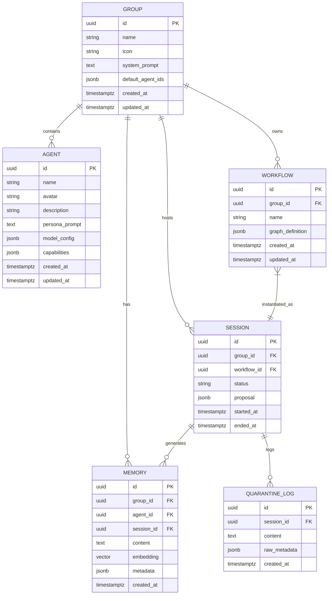

# 核心实体模型

<cite>
**本文档引用的文件**
- [entity.go](file://internal/core/agent/entity.go)
- [entity.go](file://internal/core/group/entity.go)
- [types.go](file://internal/core/workflow/types.go)
- [session.go](file://internal/core/workflow/session.go)
- [types.go](file://internal/core/memory/types.go)
- [001_init_schema.up.sql](file://internal/infrastructure/db/migrations/001_init_schema.up.sql)
- [service.go](file://internal/core/memory/service.go)
- [splitter.go](file://internal/core/memory/splitter.go)
- [agent.go](file://internal/api/handler/agent.go)
- [group.go](file://internal/api/handler/group.go)
- [workflow.go](file://internal/api/handler/workflow.go)
- [memory.go](file://internal/api/handler/memory.go)
</cite>

## 目录
1. [引言](#引言)
2. [Agent实体](#agent实体)
3. [Group实体](#group实体)
4. [Workflow实体](#workflow实体)
5. [Session实体](#session实体)
6. [Memory实体](#memory实体)
7. [实体关系与数据流](#实体关系与数据流)
8. [总结](#总结)

## 引言
本文件详细描述了“Council”系统中的五个核心实体：Agent、Group、Workflow、Session和Memory。这些实体构成了系统的基础架构，支持多LLM代理协作、工作流编排、会议状态管理以及三层记忆机制。文档将从Go代码结构、数据库映射、业务语义、字段约束及实际使用示例等方面进行深入分析。

**Section sources**
- [entity.go](file://internal/core/agent/entity.go#L1-L37)
- [entity.go](file://internal/core/group/entity.go#L1-L19)
- [types.go](file://internal/core/workflow/types.go#L1-L67)
- [session.go](file://internal/core/workflow/session.go#L1-L165)
- [types.go](file://internal/core/memory/types.go#L1-L27)

## Agent实体
Agent代表一个AI角色，具备特定的人格提示、模型配置和能力集。

### 结构定义
```go
type Agent struct {
	ID            uuid.UUID    `json:"id" db:"id"`
	Name          string       `json:"name" db:"name"`
	Avatar        *string      `json:"avatar" db:"avatar"`
	Description   *string      `json:"description" db:"description"`
	PersonaPrompt string       `json:"persona_prompt" db:"persona_prompt"`
	ModelConfig   ModelConfig  `json:"model_config" db:"model_config"`
	Capabilities  Capabilities `json:"capabilities" db:"capabilities"`
	CreatedAt     time.Time    `json:"created_at" db:"created_at"`
	UpdatedAt     time.Time    `json:"updated_at" db:"updated_at"`
}
```

### 字段说明
- **ID**: 唯一标识符，UUID类型
- **Name**: 代理名称，非空字符串（最大64字符）
- **Avatar**: 头像URL，可为空
- **Description**: 描述信息，可为空（最大512字符）
- **PersonaPrompt**: 人格提示词，非空文本字段
- **ModelConfig**: 模型配置，包含LLM提供商、模型名、温度、TopP、最大token数
- **Capabilities**: 能力集，支持网络搜索、代码执行等
- **CreatedAt/UpdatedAt**: 时间戳

### 数据库映射
```sql
CREATE TABLE agents (
    id UUID PRIMARY KEY DEFAULT gen_random_uuid(),
    name VARCHAR(64) NOT NULL,
    avatar VARCHAR(256),
    description VARCHAR(512),
    persona_prompt TEXT NOT NULL,
    model_config JSONB NOT NULL DEFAULT '{"provider": "openai", "model": "gpt-4o", "temperature": 0.7}',
    capabilities JSONB DEFAULT '{"web_search": true, "search_provider": "tavily", "code_execution": false}',
    created_at TIMESTAMPTZ DEFAULT NOW(),
    updated_at TIMESTAMPTZ DEFAULT NOW()
);
```

### 业务语义
Agent是系统中最基本的AI执行单元，支持多LLM提供商配置（如OpenAI、Gemini、DeepSeek等），可通过API创建、更新、查询和删除。

**Section sources**
- [entity.go](file://internal/core/agent/entity.go#L9-L37)
- [001_init_schema.up.sql](file://internal/infrastructure/db/migrations/001_init_schema.up.sql#L16-L26)
- [agent.go](file://internal/api/handler/agent.go#L1-L99)

## Group实体
Group作为容器管理一组Agent及其默认配置，代表一个项目或上下文。

### 结构定义
```go
type Group struct {
	ID              uuid.UUID   `json:"id" db:"id"`
	Name            string      `json:"name" db:"name"`
	Icon            *string     `json:"icon" db:"icon"`
	SystemPrompt    *string     `json:"system_prompt" db:"system_prompt"`
	DefaultAgentIDs []uuid.UUID `json:"default_agent_ids" db:"default_agent_ids"`
	CreatedAt       time.Time   `json:"created_at" db:"created_at"`
	UpdatedAt       time.Time   `json:"updated_at" db:"updated_at"`
}
```

### 字段说明
- **ID**: 唯一标识符
- **Name**: 组名，非空
- **Icon**: 图标URL
- **SystemPrompt**: 系统级提示词，影响组内所有Agent
- **DefaultAgentIDs**: 默认Agent列表
- **CreatedAt/UpdatedAt**: 时间戳

### 数据库映射
```sql
CREATE TABLE groups (
    id UUID PRIMARY KEY DEFAULT gen_random_uuid(),
    name VARCHAR(128) NOT NULL,
    icon VARCHAR(256),
    system_prompt TEXT,
    default_agent_ids JSONB DEFAULT '[]',
    created_at TIMESTAMPTZ DEFAULT NOW(),
    updated_at TIMESTAMPTZ DEFAULT NOW()
);
```

### 业务语义
Group用于组织Agent集合，提供共享上下文和默认配置。通过`group_agents`关联表建立多对多关系。

**Section sources**
- [entity.go](file://internal/core/group/entity.go#L9-L19)
- [001_init_schema.up.sql](file://internal/infrastructure/db/migrations/001_init_schema.up.sql#L5-L13)
- [group.go](file://internal/api/handler/group.go#L1-L99)

## Workflow实体
Workflow通过DAG（有向无环图）定义复杂的工作流逻辑。

### 结构定义
```go
type GraphDefinition struct {
	ID          string           `json:"id"`
	Name        string           `json:"name"`
	Description string           `json:"description"`
	Nodes       map[string]*Node `json:"nodes"`
	StartNodeID string           `json:"start_node_id"`
}

type Node struct {
	ID         string                 `json:"id"`
	Type       NodeType               `json:"type"`
	Name       string                 `json:"name"`
	NextIDs    []string               `json:"next_ids,omitempty"`
	Properties map[string]interface{} `json:"properties"`
}
```

### 节点类型
- `start/end`: 起始/结束节点
- `agent`: 调用Agent
- `vote`: 投票决策
- `loop`: 循环控制
- `fact_check`: 事实核查
- `human_review`: 人工审核
- `memory_retrieval`: 记忆检索

### 数据库映射
```sql
CREATE TABLE workflows (
    id UUID PRIMARY KEY DEFAULT gen_random_uuid(),
    group_id UUID REFERENCES groups(id) ON DELETE CASCADE,
    name VARCHAR(128) NOT NULL,
    graph_definition JSONB NOT NULL,
    created_at TIMESTAMPTZ DEFAULT NOW(),
    updated_at TIMESTAMPTZ DEFAULT NOW()
);
```

### 业务语义
Workflow支持可视化编排，允许用户构建包含并行、循环、投票等逻辑的复杂流程。

**Section sources**
- [types.go](file://internal/core/workflow/types.go#L43-L66)
- [001_init_schema.up.sql](file://internal/infrastructure/db/migrations/001_init_schema.up.sql#L37-L44)

## Session实体
Session记录每次会议的执行状态与输出结果。

### 结构定义
```go
type Session struct {
	ID        string
	Graph     *GraphDefinition
	Status    SessionStatus
	StartTime time.Time
	EndTime   time.Time
	Inputs    map[string]interface{}
	Outputs   map[string]interface{}
	Error     error
	// 内部状态管理字段...
}
```

### 状态枚举
- `pending`: 待启动
- `running`: 运行中
- `paused`: 暂停
- `completed`: 完成
- `failed`: 失败
- `cancelled`: 取消

### 数据库映射
```sql
CREATE TABLE sessions (
    id UUID PRIMARY KEY DEFAULT gen_random_uuid(),
    group_id UUID REFERENCES groups(id) ON DELETE CASCADE,
    workflow_id UUID REFERENCES workflows(id),
    status VARCHAR(32) DEFAULT 'pending',
    proposal JSONB,
    started_at TIMESTAMPTZ,
    ended_at TIMESTAMPTZ
);
```

### 业务语义
Session是Workflow的一次具体执行实例，支持暂停、恢复、停止等控制操作，并通过WebSocket实时推送状态更新。

**Section sources**
- [session.go](file://internal/core/workflow/session.go#L12-L165)
- [001_init_schema.up.sql](file://internal/infrastructure/db/migrations/001_init_schema.up.sql#L57-L65)
- [workflow.go](file://internal/api/handler/workflow.go#L58-L246)

## Memory实体
Memory实现三层记忆架构，支持向量嵌入与元数据检索。

### 接口定义
```go
type MemoryManager interface {
	LogQuarantine(ctx context.Context, sessionID, nodeID, content string, metadata map[string]interface{}) error
	UpdateWorkingMemory(ctx context.Context, groupID, content string, metadata map[string]interface{}) error
	Promote(ctx context.Context, groupID, digest string) error
	Retrieve(ctx context.Context, query, groupID string) ([]ContextItem, error)
}
```

### 三层架构
1. **隔离层（Quarantine）**: 记录可疑输出，存入`quarantine_logs`表
2. **工作内存（Working Memory）**: 热数据缓存于Redis，保留最近50条，TTL 24小时
3. **长期记忆（LTM）**: 向量化存储于PostgreSQL的`memories`表，使用pgvector扩展

### 分片与嵌入
- 使用`RecursiveCharacterSplitter`按`\n\n`, `\n`, ` `等分隔符递归切分文本
- 使用LLM嵌入模型（如text-embedding-ada-002）生成1536维向量
- 支持基于余弦相似度的混合检索（热+冷）

### 数据库映射
```sql
CREATE TABLE memories (
    id UUID PRIMARY KEY DEFAULT gen_random_uuid(),
    group_id UUID REFERENCES groups(id) ON DELETE CASCADE,
    agent_id UUID REFERENCES agents(id),
    session_id UUID REFERENCES sessions(id),
    content TEXT NOT NULL,
    embedding VECTOR(1536),
    metadata JSONB DEFAULT '{}',
    created_at TIMESTAMPTZ DEFAULT NOW()
);
CREATE INDEX idx_memories_embedding ON memories USING ivfflat (embedding vector_cosine_ops) WITH (lists = 100);
```

### 业务语义
Memory系统支持上下文感知的智能检索，为Agent提供历史信息参考，提升对话连贯性与准确性。

**Section sources**
- [types.go](file://internal/core/memory/types.go#L7-L27)
- [service.go](file://internal/core/memory/service.go#L1-L209)
- [splitter.go](file://internal/core/memory/splitter.go#L1-L101)
- [001_init_schema.up.sql](file://internal/infrastructure/db/migrations/001_init_schema.up.sql#L80-L96)
- [memory.go](file://internal/api/handler/memory.go#L1-L68)

## 实体关系与数据流


**Diagram sources**
- [001_init_schema.up.sql](file://internal/infrastructure/db/migrations/001_init_schema.up.sql#L5-L96)

## 总结
本文档全面解析了Council系统的五大核心实体，展示了其在代码、数据库和业务层面的设计与实现。这些实体共同构建了一个强大而灵活的AI协作平台，支持复杂的多代理工作流、精细化的状态管理以及智能的记忆系统。