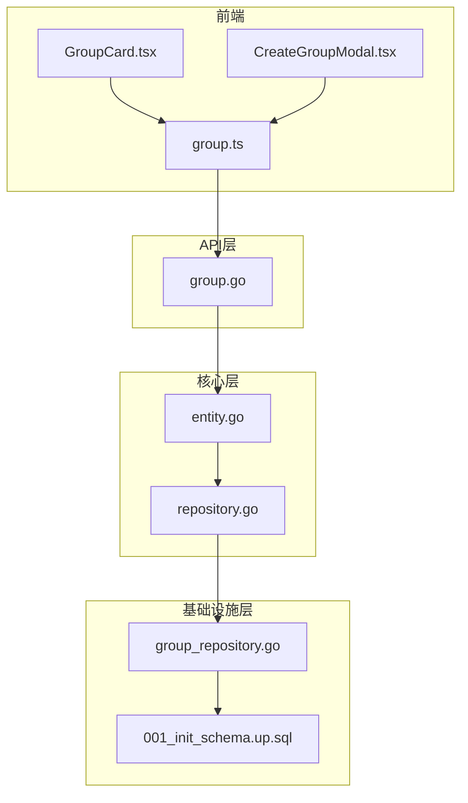
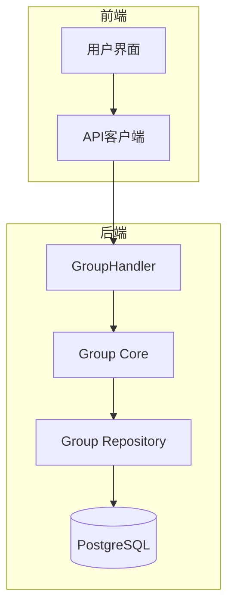
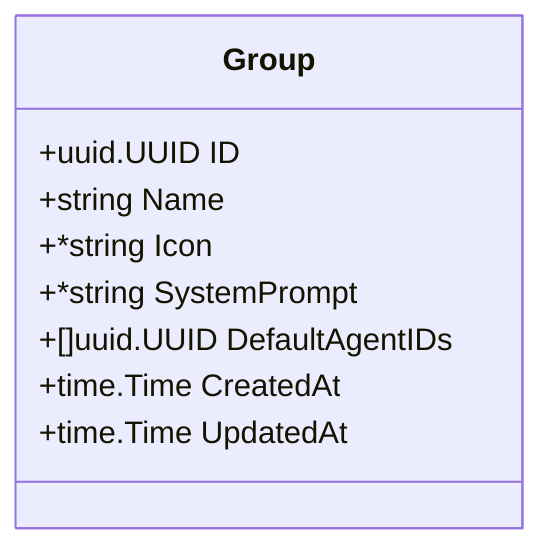
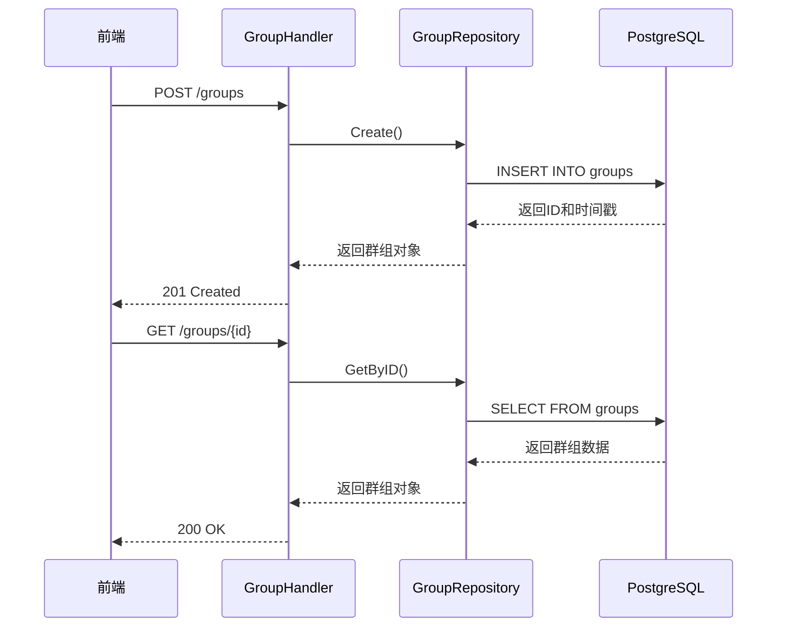
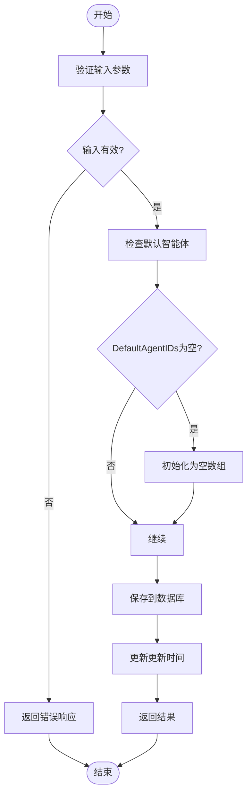
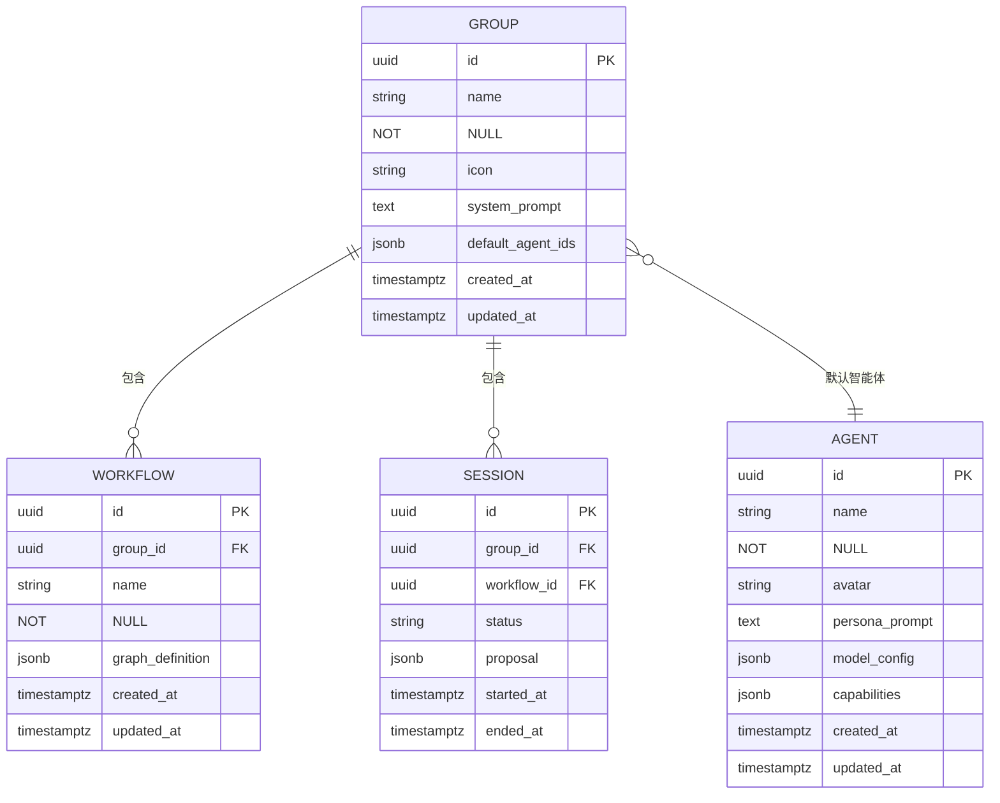

# 群组实体模型

<cite>
**本文档引用文件**   
- [entity.go](file://internal/core/group/entity.go)
- [group_repository.go](file://internal/infrastructure/persistence/group_repository.go)
- [001_init_schema.up.sql](file://internal/infrastructure/db/migrations/001_init_schema.up.sql)
- [group.go](file://internal/api/handler/group.go)
- [agent.go](file://internal/core/agent/entity.go)
- [seeder.go](file://internal/resources/seeder.go)
- [group_test.go](file://internal/api/handler/group_test.go)
- [CreateGroupModal.tsx](file://frontend/src/features/groups/components/CreateGroupModal.tsx)
- [group.ts](file://frontend/src/types/group.ts)
</cite>

## 目录
1. [简介](#简介)
2. [项目结构](#项目结构)
3. [核心组件](#核心组件)
4. [架构概述](#架构概述)
5. [详细组件分析](#详细组件分析)
6. [依赖分析](#依赖分析)
7. [性能考虑](#性能考虑)
8. [故障排除指南](#故障排除指南)
9. [结论](#结论)

## 简介
群组实体模型是本系统中的核心协作单元，代表一个项目或上下文环境。它作为智能体（Agent）、工作流（Workflow）和会话（Session）的容器，为AI协作提供隔离的上下文环境。该模型通过`default_agent_ids`字段实现默认智能体配置，支持创建具有预设成员的协作组。群组可配置系统提示词（SystemPrompt）来定义其上下文语义，并通过图标（Icon）进行视觉标识。系统预设了"理事会"（The Council）等默认群组，包含正方、反方和裁判等角色智能体。

## 项目结构
群组实体模型分布在多个模块中，形成了清晰的分层架构。核心定义位于`internal/core/group/entity.go`，数据访问层在`internal/infrastructure/persistence/group_repository.go`，数据库表结构定义在`internal/infrastructure/db/migrations/001_init_schema.up.sql`，API处理在`internal/api/handler/group.go`。前端类型定义在`frontend/src/types/group.ts`，UI组件在`frontend/src/features/groups/components/`目录下。这种分层设计实现了关注点分离，便于维护和扩展。

**图源**
- [entity.go](file://internal/core/group/entity.go)
- [group.go](file://internal/api/handler/group.go)
- [group_repository.go](file://internal/infrastructure/persistence/group_repository.go)
- [001_init_schema.up.sql](file://internal/infrastructure/db/migrations/001_init_schema.up.sql)
- [CreateGroupModal.tsx](file://frontend/src/features/groups/components/CreateGroupModal.tsx)
- [group.ts](file://frontend/src/types/group.ts)

**节源**
- [entity.go](file://internal/core/group/entity.go)
- [group.go](file://internal/api/handler/group.go)
- [group_repository.go](file://internal/infrastructure/persistence/group_repository.go)
- [001_init_schema.up.sql](file://internal/infrastructure/db/migrations/001_init_schema.up.sql)

## 核心组件
群组实体的核心是`Group`结构体，定义了群组的所有属性。它包含ID、名称、图标、系统提示词、默认智能体ID列表以及创建和更新时间戳。该结构体通过JSON和数据库标签实现了序列化和持久化。`GroupRepository`接口定义了创建、读取、更新和删除操作，而`GroupRepository`实现类则提供了PostgreSQL数据库的具体操作。API处理器`GroupHandler`将HTTP请求映射到这些操作，实现了RESTful接口。

**节源**
- [entity.go](file://internal/core/group/entity.go#L9-L18)
- [repository.go](file://internal/core/group/repository.go#L9-L16)
- [group_repository.go](file://internal/infrastructure/persistence/group_repository.go#L13-L21)

## 架构概述
群组实体模型采用经典的分层架构，从上到下分为前端、API层、核心层和基础设施层。前端通过API与后端交互，API层处理HTTP请求并调用核心服务，核心层定义业务逻辑和数据结构，基础设施层负责数据持久化。这种架构确保了高内聚低耦合，使得各层可以独立开发和测试。群组与智能体之间通过`group_agents`关联表实现多对多关系，支持灵活的成员管理。

**图源**
- [group.go](file://internal/api/handler/group.go)
- [entity.go](file://internal/core/group/entity.go)
- [repository.go](file://internal/core/group/repository.go)
- [group_repository.go](file://internal/infrastructure/persistence/group_repository.go)

## 详细组件分析
### 群组实体分析
群组实体是系统中的核心协作单元，作为智能体、工作流和会话的容器。它通过`default_agent_ids`字段实现默认智能体配置，支持创建具有预设成员的协作组。群组可配置系统提示词来定义其上下文语义，并通过图标进行视觉标识。

#### 结构体定义

**图源**
- [entity.go](file://internal/core/group/entity.go#L10-L18)

#### 字段说明
- **ID**: UUID类型，主键，唯一标识群组
- **Name**: 字符串类型，非空，群组名称
- **Icon**: 字符串指针类型，可选，群组图标
- **SystemPrompt**: 字符串指针类型，可选，定义群组上下文的系统提示词
- **DefaultAgentIDs**: UUID数组，存储默认智能体ID列表
- **CreatedAt**: 时间类型，记录创建时间
- **UpdatedAt**: 时间类型，记录更新时间

**节源**
- [entity.go](file://internal/core/group/entity.go#L11-L17)

### API工作流分析
群组API提供了完整的CRUD操作，支持前端对群组的管理。创建群组时，前端发送包含名称、图标、系统提示词和默认智能体ID列表的JSON数据。后端验证数据后，将其持久化到数据库。读取操作支持获取单个群组或群组列表。更新操作允许修改群组属性，删除操作则移除群组及其关联数据。

**图源**
- [group.go](file://internal/api/handler/group.go#L19-L98)
- [group_repository.go](file://internal/infrastructure/persistence/group_repository.go#L23-L43)

**节源**
- [group.go](file://internal/api/handler/group.go#L19-L98)
- [group_repository.go](file://internal/infrastructure/persistence/group_repository.go#L23-L113)

### 复杂逻辑分析
群组实体的创建和更新逻辑需要处理默认智能体ID列表的特殊情况。当创建群组时，如果`default_agent_ids`为空，系统会自动初始化为空数组。更新操作会自动更新`updated_at`时间戳，确保数据的一致性。数据库迁移脚本定义了`groups`表的结构，包括主键、索引和默认值。

**图源**
- [group_repository.go](file://internal/infrastructure/persistence/group_repository.go#L23-L113)
- [001_init_schema.up.sql](file://internal/infrastructure/db/migrations/001_init_schema.up.sql#L5-L13)

**节源**
- [group_repository.go](file://internal/infrastructure/persistence/group_repository.go#L23-L113)
- [001_init_schema.up.sql](file://internal/infrastructure/db/migrations/001_init_schema.up.sql#L5-L13)

## 依赖分析
群组实体与其他核心组件有紧密的依赖关系。它与智能体实体通过`default_agent_ids`字段关联，形成多对多关系。工作流实体通过`group_id`外键与群组关联，实现工作流的上下文隔离。会话实体也与群组关联，确保会话在正确的上下文中执行。这些依赖关系通过数据库外键约束和应用层逻辑共同维护。

**图源**
- [001_init_schema.up.sql](file://internal/infrastructure/db/migrations/001_init_schema.up.sql#L5-L65)
- [entity.go](file://internal/core/group/entity.go)
- [agent.go](file://internal/core/agent/entity.go)

**节源**
- [001_init_schema.up.sql](file://internal/infrastructure/db/migrations/001_init_schema.up.sql#L5-L65)
- [entity.go](file://internal/core/group/entity.go)
- [agent.go](file://internal/core/agent/entity.go)

## 性能考虑
群组实体的性能优化主要体现在数据库索引和查询优化上。`groups`表的`id`字段有主键索引，确保了基于ID的查询效率。`created_at`字段的排序查询也得到了优化。对于频繁的列表查询，可以考虑添加适当的索引。API层的处理逻辑简洁高效，避免了不必要的计算和数据库访问。缓存机制可以进一步提升读取性能，特别是对于频繁访问的默认群组。

## 故障排除指南
当遇到群组相关的问题时，可以从以下几个方面进行排查：检查数据库连接是否正常，验证群组ID格式是否正确，确认默认智能体ID是否存在，检查系统提示词长度是否超出限制。测试文件提供了完整的测试用例，可以用于验证群组功能的正确性。日志记录可以帮助追踪问题根源，特别是在创建和更新操作失败时。

**节源**
- [group_test.go](file://internal/api/handler/group_test.go)
- [group_repository_test.go](file://internal/infrastructure/persistence/group_repository_test.go)

## 结论
群组实体模型是系统中的核心协作单元，通过清晰的分层架构和良好的设计实现了高内聚低耦合。它作为智能体、工作流和会话的容器，为AI协作提供了隔离的上下文环境。通过`default_agent_ids`字段实现的默认智能体配置，支持创建具有预设成员的协作组。系统的可扩展性和维护性得到了保障，为未来的功能扩展奠定了坚实的基础。