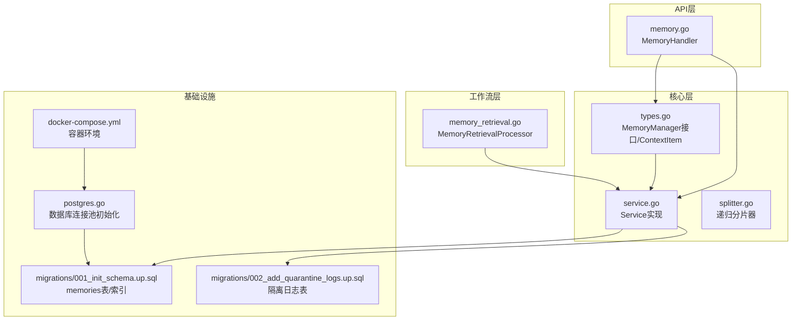
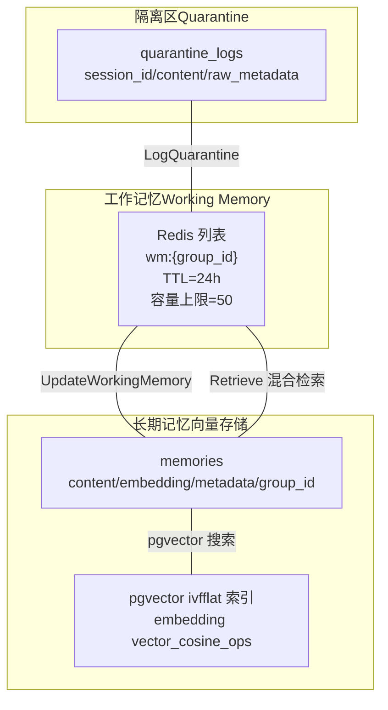
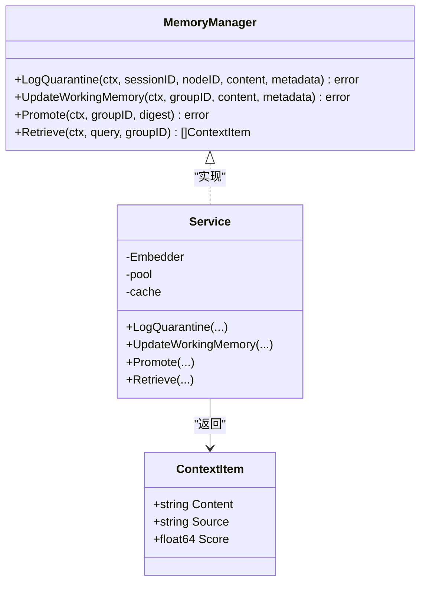
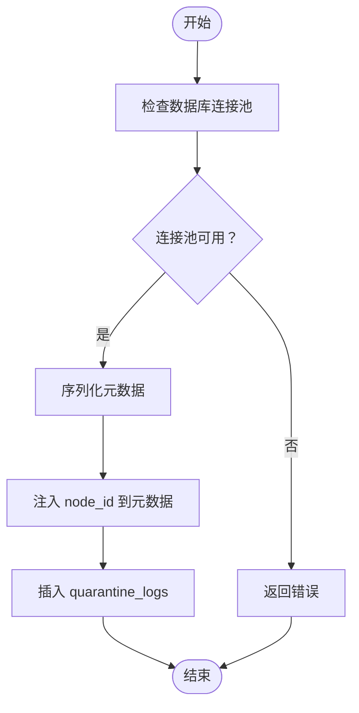
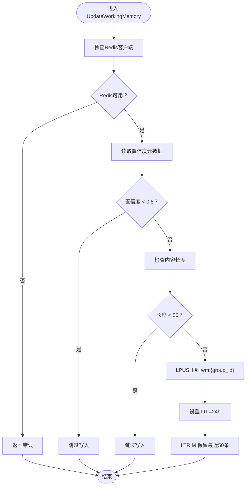
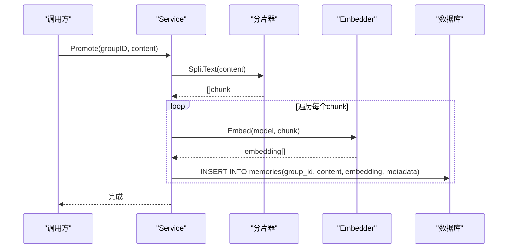
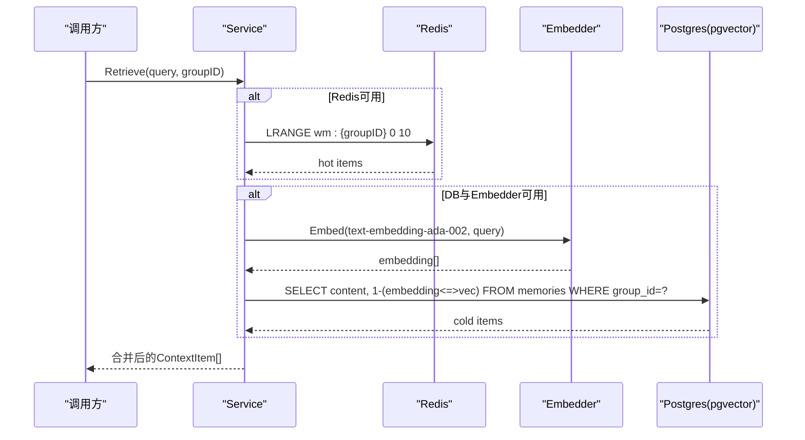
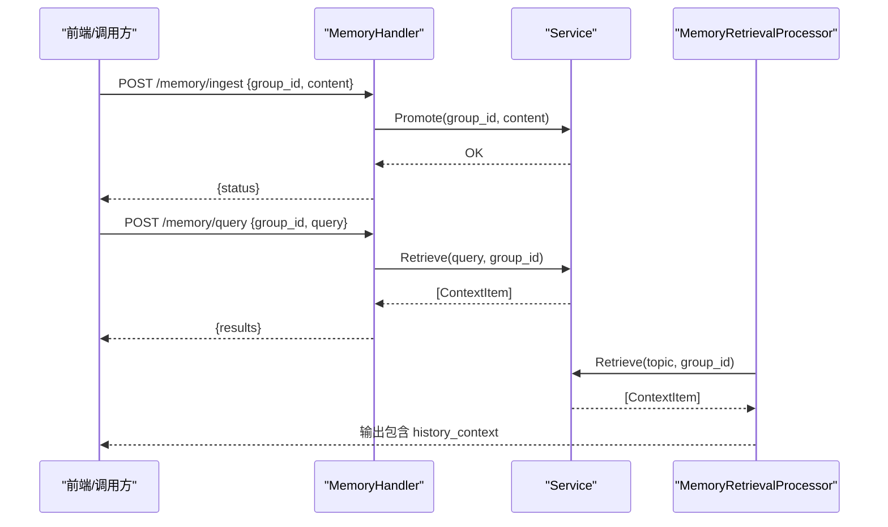
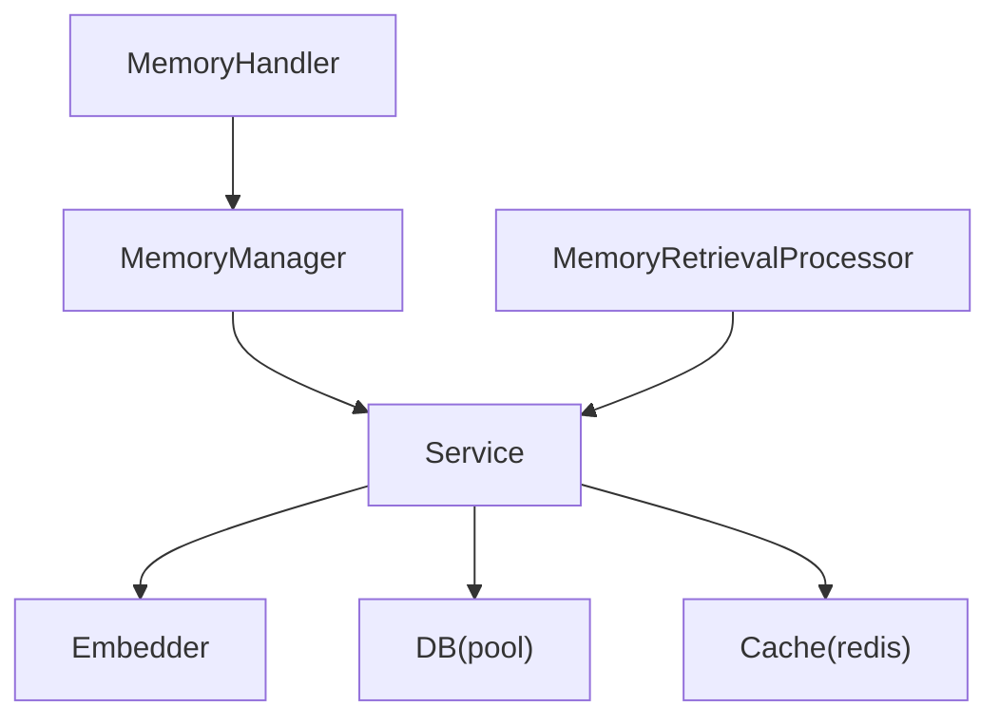

# 记忆实体模型

<cite>
**本文引用的文件**
- [internal/core/memory/types.go](file://internal/core/memory/types.go)
- [internal/core/memory/service.go](file://internal/core/memory/service.go)
- [internal/core/memory/splitter.go](file://internal/core/memory/splitter.go)
- [internal/api/handler/memory.go](file://internal/api/handler/memory.go)
- [internal/core/workflow/nodes/memory_retrieval.go](file://internal/core/workflow/nodes/memory_retrieval.go)
- [internal/infrastructure/db/migrations/001_init_schema.up.sql](file://internal/infrastructure/db/migrations/001_init_schema.up.sql)
- [internal/infrastructure/db/migrations/002_add_quarantine_logs.up.sql](file://internal/infrastructure/db/migrations/002_add_quarantine_logs.up.sql)
- [internal/infrastructure/db/postgres.go](file://internal/infrastructure/db/postgres.go)
- [docker-compose.yml](file://docker-compose.yml)
- [internal/core/memory/service_test.go](file://internal/core/memory/service_test.go)
- [internal/api/handler/memory_test.go](file://internal/api/handler/memory_test.go)
</cite>

## 目录
1. [简介](#简介)
2. [项目结构](#项目结构)
3. [核心组件](#核心组件)
4. [架构总览](#架构总览)
5. [详细组件分析](#详细组件分析)
6. [依赖关系分析](#依赖关系分析)
7. [性能考量](#性能考量)
8. [故障排查指南](#故障排查指南)
9. [结论](#结论)
10. [附录](#附录)

## 简介
本文件围绕“记忆实体模型”进行系统化技术文档化，重点覆盖以下方面：
- Go代码中的类型与接口定义：MemoryManager接口、ContextItem结构体
- 对应数据库表的映射关系：memories表字段、quarantine_logs隔离日志表
- 三层记忆架构：隔离区（Quarantine）、工作记忆（Working Memory）、长期记忆（向量存储）
- pgvector索引（ivfflat）配置策略与混合检索（Retrieve方法）实现原理
- 记忆写入、相似性搜索、上下文召回的调用流程与示例路径
- 在工作流中作为知识沉淀与上下文增强的核心作用

## 项目结构
与记忆系统直接相关的模块分布如下：
- 核心服务与类型：internal/core/memory
- API处理器：internal/api/handler
- 工作流节点：internal/core/workflow/nodes
- 数据库迁移与连接：internal/infrastructure/db
- 测试：internal/core/memory/service_test.go、internal/api/handler/memory_test.go

图表来源
- [internal/core/memory/types.go](file://internal/core/memory/types.go#L1-L27)
- [internal/core/memory/service.go](file://internal/core/memory/service.go#L1-L209)
- [internal/core/memory/splitter.go](file://internal/core/memory/splitter.go#L1-L101)
- [internal/api/handler/memory.go](file://internal/api/handler/memory.go#L1-L68)
- [internal/core/workflow/nodes/memory_retrieval.go](file://internal/core/workflow/nodes/memory_retrieval.go#L1-L103)
- [internal/infrastructure/db/migrations/001_init_schema.up.sql](file://internal/infrastructure/db/migrations/001_init_schema.up.sql#L80-L96)
- [internal/infrastructure/db/migrations/002_add_quarantine_logs.up.sql](file://internal/infrastructure/db/migrations/002_add_quarantine_logs.up.sql#L1-L9)
- [internal/infrastructure/db/postgres.go](file://internal/infrastructure/db/postgres.go#L1-L66)
- [docker-compose.yml](file://docker-compose.yml#L1-L23)

章节来源
- [internal/core/memory/types.go](file://internal/core/memory/types.go#L1-L27)
- [internal/core/memory/service.go](file://internal/core/memory/service.go#L1-L209)
- [internal/api/handler/memory.go](file://internal/api/handler/memory.go#L1-L68)
- [internal/core/workflow/nodes/memory_retrieval.go](file://internal/core/workflow/nodes/memory_retrieval.go#L1-L103)
- [internal/infrastructure/db/migrations/001_init_schema.up.sql](file://internal/infrastructure/db/migrations/001_init_schema.up.sql#L80-L96)
- [internal/infrastructure/db/migrations/002_add_quarantine_logs.up.sql](file://internal/infrastructure/db/migrations/002_add_quarantine_logs.up.sql#L1-L9)
- [internal/infrastructure/db/postgres.go](file://internal/infrastructure/db/postgres.go#L1-L66)
- [docker-compose.yml](file://docker-compose.yml#L1-L23)

## 核心组件
- MemoryManager接口：定义三层记忆协议与混合检索能力
- ContextItem结构体：检索结果项，包含内容、来源（热/冷）与相似度分数
- Service实现：封装隔离日志写入、工作记忆写入、长期记忆写入与检索
- 分片器：将长文本按规则切分为适合向量化与存储的块
- API处理器：对外暴露记忆写入与查询接口
- 工作流节点：在执行过程中注入历史上下文

章节来源
- [internal/core/memory/types.go](file://internal/core/memory/types.go#L1-L27)
- [internal/core/memory/service.go](file://internal/core/memory/service.go#L1-L209)
- [internal/core/memory/splitter.go](file://internal/core/memory/splitter.go#L1-L101)
- [internal/api/handler/memory.go](file://internal/api/handler/memory.go#L1-L68)
- [internal/core/workflow/nodes/memory_retrieval.go](file://internal/core/workflow/nodes/memory_retrieval.go#L1-L103)

## 架构总览
三层记忆架构与数据流概览：
- 隔离区（Quarantine）：记录潜在风险或待审内容，写入隔离日志表
- 工作记忆（Working Memory）：短期上下文缓存，基于Redis列表，带过滤与容量限制
- 长期记忆（向量存储）：基于pgvector的向量检索，支持混合检索

图表来源
- [internal/infrastructure/db/migrations/002_add_quarantine_logs.up.sql](file://internal/infrastructure/db/migrations/002_add_quarantine_logs.up.sql#L1-L9)
- [internal/infrastructure/db/migrations/001_init_schema.up.sql](file://internal/infrastructure/db/migrations/001_init_schema.up.sql#L80-L96)
- [internal/core/memory/service.go](file://internal/core/memory/service.go#L28-L97)
- [internal/core/memory/service.go](file://internal/core/memory/service.go#L159-L209)

## 详细组件分析

### 接口与数据模型
- MemoryManager接口定义了三层记忆协议与混合检索：
  - LogQuarantine：写入隔离日志
  - UpdateWorkingMemory：写入工作记忆
  - Promote：将内容分片、向量化后写入长期记忆
  - Retrieve：混合检索（先热后冷）
- ContextItem用于承载检索结果项，包含内容、来源与分数

图表来源
- [internal/core/memory/types.go](file://internal/core/memory/types.go#L1-L27)
- [internal/core/memory/service.go](file://internal/core/memory/service.go#L1-L209)

章节来源
- [internal/core/memory/types.go](file://internal/core/memory/types.go#L1-L27)
- [internal/core/memory/service.go](file://internal/core/memory/service.go#L1-L209)

### 隔离区（Quarantine）
- 职责：记录潜在风险或待审内容，便于审计与复核
- 存储：quarantine_logs表，字段包括会话标识、原始内容、原始元数据
- 写入逻辑：序列化元数据，注入节点标识，插入隔离日志表

图表来源
- [internal/core/memory/service.go](file://internal/core/memory/service.go#L28-L58)
- [internal/infrastructure/db/migrations/002_add_quarantine_logs.up.sql](file://internal/infrastructure/db/migrations/002_add_quarantine_logs.up.sql#L1-L9)

章节来源
- [internal/core/memory/service.go](file://internal/core/memory/service.go#L28-L58)
- [internal/infrastructure/db/migrations/002_add_quarantine_logs.up.sql](file://internal/infrastructure/db/migrations/002_add_quarantine_logs.up.sql#L1-L9)

### 工作记忆（Working Memory）
- 职责：短期上下文缓存，支持快速回放与低延迟检索
- 存储：Redis列表，键名格式为wm:{group_id}，TTL=24小时，容量上限=50条
- 过滤策略：置信度阈值与长度阈值（MVP阶段）
- 写入逻辑：通过Ingress过滤后写入Redis列表，自动修剪至容量上限

图表来源
- [internal/core/memory/service.go](file://internal/core/memory/service.go#L60-L97)

章节来源
- [internal/core/memory/service.go](file://internal/core/memory/service.go#L60-L97)

### 长期记忆（向量存储）
- 职责：持久化知识，支持相似性检索
- 表结构：memories表，字段包括group_id、agent_id、session_id、content、embedding、metadata、created_at
- 向量化：Promote时对内容进行分片，逐段调用Embedder生成向量并入库
- 元数据：可携带来源信息与时间戳等

图表来源
- [internal/core/memory/service.go](file://internal/core/memory/service.go#L115-L157)
- [internal/core/memory/splitter.go](file://internal/core/memory/splitter.go#L1-L101)

章节来源
- [internal/core/memory/service.go](file://internal/core/memory/service.go#L115-L157)
- [internal/core/memory/splitter.go](file://internal/core/memory/splitter.go#L1-L101)
- [internal/infrastructure/db/migrations/001_init_schema.up.sql](file://internal/infrastructure/db/migrations/001_init_schema.up.sql#L80-L90)

### 混合检索（Retrieve）
- 检索顺序：先从工作记忆（Redis）取最近若干条，再从长期记忆（pgvector）做向量相似度检索
- 向量距离：使用余弦距离计算相似度，返回前若干条
- 结果合并：将热源（hot）与冷源（cold）结果合并，形成上下文项集合

图表来源
- [internal/core/memory/service.go](file://internal/core/memory/service.go#L159-L209)

章节来源
- [internal/core/memory/service.go](file://internal/core/memory/service.go#L159-L209)

### API与工作流集成
- API处理器：
  - Ingest：接收内容并触发Promote动作
  - Query：接收查询并调用Retrieve返回上下文
- 工作流节点：
  - MemoryRetrievalProcessor：从输入提取主题/查询与group_id，调用Service.Retrieve并格式化为历史上下文注入输出

图表来源
- [internal/api/handler/memory.go](file://internal/api/handler/memory.go#L1-L68)
- [internal/core/workflow/nodes/memory_retrieval.go](file://internal/core/workflow/nodes/memory_retrieval.go#L1-L103)
- [internal/core/memory/service.go](file://internal/core/memory/service.go#L159-L209)

章节来源
- [internal/api/handler/memory.go](file://internal/api/handler/memory.go#L1-L68)
- [internal/core/workflow/nodes/memory_retrieval.go](file://internal/core/workflow/nodes/memory_retrieval.go#L1-L103)

## 依赖关系分析
- 组件耦合：
  - Service依赖Embedder、DB、Cache三类外部组件
  - Handler依赖MemoryManager接口，便于替换实现
  - 工作流节点依赖Service，实现上下文注入
- 外部依赖：
  - PostgreSQL + pgvector扩展
  - Redis
  - Docker Compose提供本地环境

图表来源
- [internal/api/handler/memory.go](file://internal/api/handler/memory.go#L1-L68)
- [internal/core/memory/types.go](file://internal/core/memory/types.go#L1-L27)
- [internal/core/memory/service.go](file://internal/core/memory/service.go#L1-L209)
- [internal/core/workflow/nodes/memory_retrieval.go](file://internal/core/workflow/nodes/memory_retrieval.go#L1-L103)

章节来源
- [internal/api/handler/memory.go](file://internal/api/handler/memory.go#L1-L68)
- [internal/core/memory/types.go](file://internal/core/memory/types.go#L1-L27)
- [internal/core/memory/service.go](file://internal/core/memory/service.go#L1-L209)
- [internal/core/workflow/nodes/memory_retrieval.go](file://internal/core/workflow/nodes/memory_retrieval.go#L1-L103)

## 性能考量
- Redis工作记忆：
  - 列表操作为O(1)，容量限制与TTL确保内存占用可控
  - 建议根据业务并发调整容量上限与TTL
- 向量检索：
  - ivfflat索引已创建；lists参数建议结合数据规模与查询延迟权衡
  - 余弦距离计算成本与向量维度相关，建议使用与Embedder匹配的维度
- 写入批处理：
  - 当前Promote逐段嵌入与入库，可考虑批量嵌入以减少往返开销（MVP阶段为简化）

[本节为通用性能建议，不直接分析具体文件]

## 故障排查指南
- 数据库连接失败：
  - 检查数据库URL与连接池初始化是否成功
  - 确认pgvector扩展已启用
- Redis不可用：
  - 检查Redis容器状态与网络连通性
- 检索为空：
  - 确认group_id正确且memories中有对应记录
  - 检查Embedder是否可用及模型名称是否匹配
- 写入失败：
  - 检查Promote流程中分片与嵌入是否成功
  - 查看隔离日志表写入是否正常

章节来源
- [internal/infrastructure/db/postgres.go](file://internal/infrastructure/db/postgres.go#L1-L66)
- [docker-compose.yml](file://docker-compose.yml#L1-L23)
- [internal/core/memory/service.go](file://internal/core/memory/service.go#L115-L157)
- [internal/core/memory/service.go](file://internal/core/memory/service.go#L159-L209)

## 结论
该记忆实体模型通过三层架构实现了从隔离、工作到长期的完整知识管理闭环。通过Redis与pgvector的组合，既满足了低延迟的上下文增强，又提供了可扩展的向量检索能力。API与工作流节点的解耦设计，使得记忆能力可以灵活地融入各类业务场景。

[本节为总结性内容，不直接分析具体文件]

## 附录

### 数据库表与字段设计
- memories表
  - 字段：id、group_id、agent_id、session_id、content、embedding、metadata、created_at
  - 索引：按group_id建立普通索引；embedding建立ivfflat索引（余弦距离）
- quarantine_logs表
  - 字段：id、session_id、content、raw_metadata、created_at
  - 索引：按session_id建立索引

章节来源
- [internal/infrastructure/db/migrations/001_init_schema.up.sql](file://internal/infrastructure/db/migrations/001_init_schema.up.sql#L80-L96)
- [internal/infrastructure/db/migrations/002_add_quarantine_logs.up.sql](file://internal/infrastructure/db/migrations/002_add_quarantine_logs.up.sql#L1-L9)

### pgvector索引配置策略
- 索引类型：ivfflat
- 距离函数：余弦距离（vector_cosine_ops）
- 参数：lists=100（可根据数据规模与查询延迟调优）
- 注意事项：空表可能影响索引创建，建议在有数据后再验证

章节来源
- [internal/infrastructure/db/migrations/001_init_schema.up.sql](file://internal/infrastructure/db/migrations/001_init_schema.up.sql#L90-L96)

### 混合检索（Retrieve）实现要点
- 热源优先：从Redis取最近若干条，保证低延迟
- 冷源补充：向量相似度检索，按余弦相似度排序
- 结果合并：统一包装为ContextItem，便于上层消费

章节来源
- [internal/core/memory/service.go](file://internal/core/memory/service.go#L159-L209)

### 记忆写入、相似性搜索、上下文召回的示例路径
- 记忆写入（Promote）
  - 示例路径：[internal/core/memory/service.go](file://internal/core/memory/service.go#L115-L157)
- 相似性搜索（Retrieve）
  - 示例路径：[internal/core/memory/service.go](file://internal/core/memory/service.go#L159-L209)
- 上下文召回（工作流节点）
  - 示例路径：[internal/core/workflow/nodes/memory_retrieval.go](file://internal/core/workflow/nodes/memory_retrieval.go#L23-L103)

### API端点与调用
- 写入接口：POST /memory/ingest
  - 请求体字段：group_id、content
  - 示例路径：[internal/api/handler/memory.go](file://internal/api/handler/memory.go#L20-L43)
- 查询接口：POST /memory/query
  - 请求体字段：group_id、query
  - 示例路径：[internal/api/handler/memory.go](file://internal/api/handler/memory.go#L45-L68)

### 测试参考
- 服务层测试（隔离、工作记忆、Promote、Retrieve）
  - 示例路径：[internal/core/memory/service_test.go](file://internal/core/memory/service_test.go#L1-L123)
- API层测试（Ingest、Query）
  - 示例路径：[internal/api/handler/memory_test.go](file://internal/api/handler/memory_test.go#L1-L55)