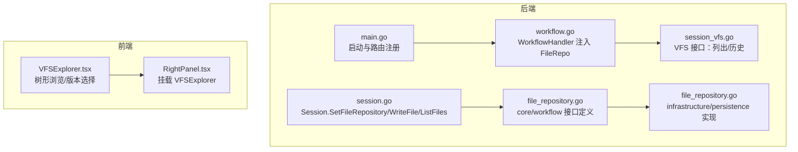
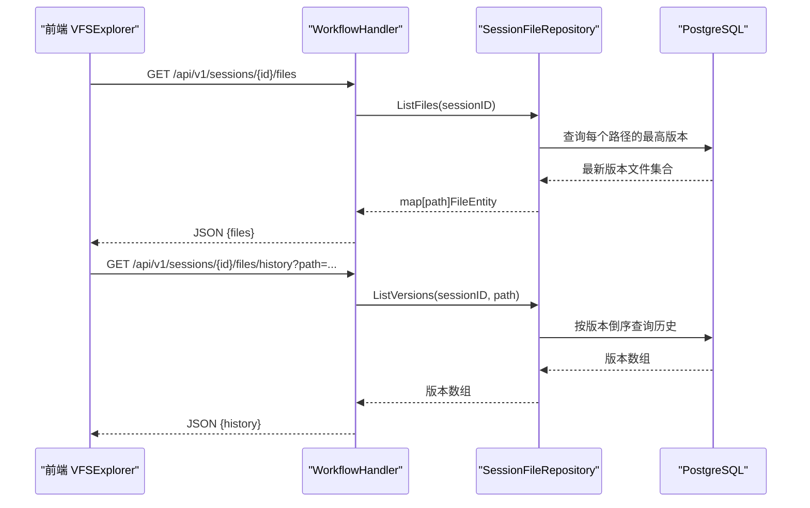
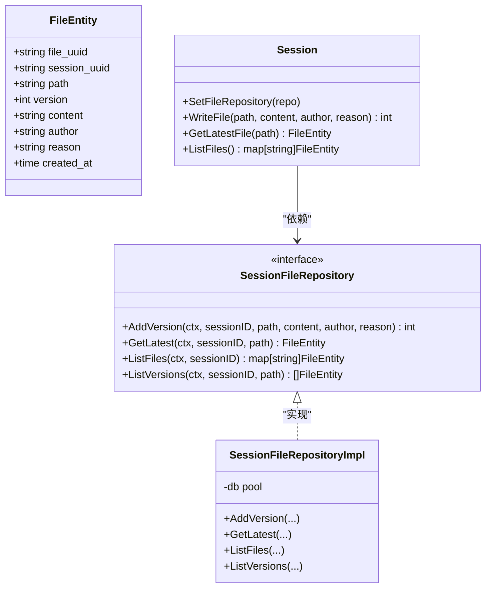
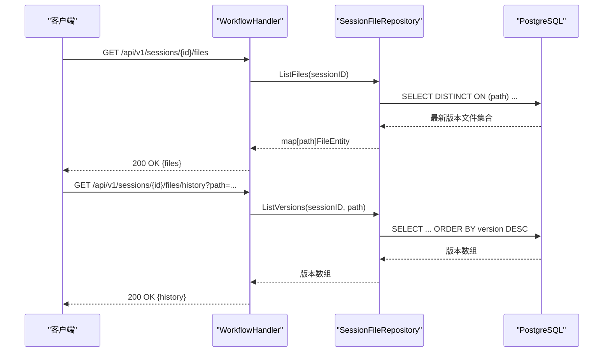
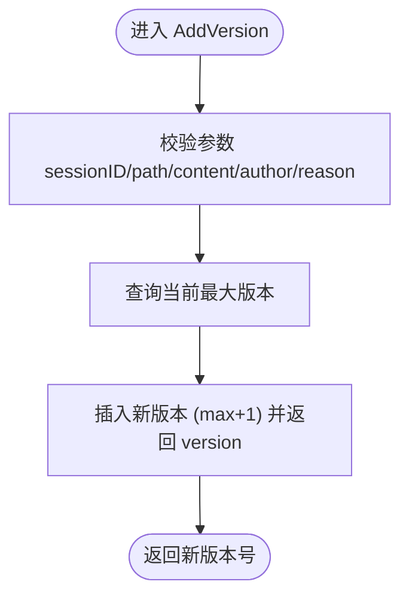
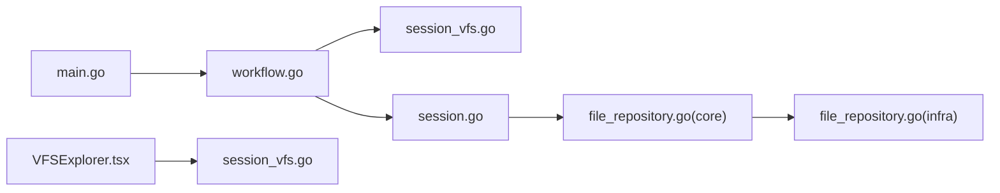

# 虚拟文件系统与会话文件

<cite>
**本文引用的文件列表**
- [main.go](file://cmd/council/main.go)
- [SPEC-1100-foundation.md](file://docs/specs/sprint11/SPEC-1100-foundation.md)
- [SPEC-1201-vfs-frontend.md](file://docs/specs/sprint12/SPEC-1201-vfs-frontend.md)
- [session_vfs.go](file://internal/api/handler/session_vfs.go)
- [workflow.go](file://internal/api/handler/workflow.go)
- [session.go](file://internal/core/workflow/session.go)
- [file_repository.go](file://internal/core/workflow/file_repository.go)
- [file_repository.go](file://internal/infrastructure/persistence/file_repository.go)
- [file_repository_test.go](file://internal/infrastructure/persistence/file_repository_test.go)
- [session_mock.go](file://internal/infrastructure/mocks/session_mock.go)
- [VFSExplorer.tsx](file://frontend/src/components/vfs/VFSExplorer.tsx)
- [RightPanel.tsx](file://frontend/src/components/panels/RightPanel.tsx)
</cite>

## 目录
1. [简介](#简介)
2. [项目结构](#项目结构)
3. [核心组件](#核心组件)
4. [架构总览](#架构总览)
5. [详细组件分析](#详细组件分析)
6. [依赖关系分析](#依赖关系分析)
7. [性能考量](#性能考量)
8. [故障排查指南](#故障排查指南)
9. [结论](#结论)

## 简介
本文件系统（VFS）用于在会话生命周期内记录与追踪由代理或用户修改产生的文件版本。它通过“会话级”版本化存储，支持：
- 列出会话中所有最新版本的文件
- 查看指定文件的历史版本
- 在前端以树形结构浏览文件，并切换版本查看内容

该能力由后端接口、领域模型、持久层与前端组件共同实现，贯穿执行期与会话期的数据流。

## 项目结构
围绕 VFS 的关键位置如下：
- 后端入口与路由：服务启动、注入仓库、注册 API 路由
- API 层：提供 VFS 列表与历史查询接口
- 领域层：会话对象持有文件仓库并暴露写入、读取、列举等方法
- 持久层：PostgreSQL 表结构与仓库实现
- 前端：VFS 浏览器组件，树形展示与版本切换

图表来源
- [main.go](file://cmd/council/main.go#L80-L162)
- [workflow.go](file://internal/api/handler/workflow.go#L20-L45)
- [session_vfs.go](file://internal/api/handler/session_vfs.go#L1-L43)
- [session.go](file://internal/core/workflow/session.go#L44-L99)
- [file_repository.go](file://internal/core/workflow/file_repository.go#L20-L35)
- [file_repository.go](file://internal/infrastructure/persistence/file_repository.go#L1-L104)
- [VFSExplorer.tsx](file://frontend/src/components/vfs/VFSExplorer.tsx#L180-L295)
- [RightPanel.tsx](file://frontend/src/components/panels/RightPanel.tsx#L4-L76)

章节来源
- [main.go](file://cmd/council/main.go#L80-L162)
- [SPEC-1100-foundation.md](file://docs/specs/sprint11/SPEC-1100-foundation.md#L24-L60)

## 核心组件
- 文件实体与接口
  - 文件实体包含文件唯一标识、所属会话、路径、版本号、内容、作者、原因、创建时间等字段。
  - 会话文件仓库接口定义了新增版本、获取最新版本、列出会话最新文件、列出指定文件历史版本等方法。
- 会话与文件仓库
  - 会话在执行时注入文件仓库；对外提供写入文件、获取最新文件、列出会话文件的方法。
- 数据库与仓库实现
  - 使用 PostgreSQL 存储会话文件版本，提供原子性地计算下一个版本并插入，以及按最新版本去重查询、按版本倒序查询历史。
- API 层
  - 提供会话级 VFS 列表与历史查询接口，参数校验与错误处理。
- 前端 VFS 浏览器
  - 将后端返回的文件列表转换为树形结构，支持展开目录、选中文件、切换版本查看内容。

章节来源
- [file_repository.go](file://internal/core/workflow/file_repository.go#L8-L35)
- [session.go](file://internal/core/workflow/session.go#L44-L99)
- [file_repository.go](file://internal/infrastructure/persistence/file_repository.go#L19-L104)
- [session_vfs.go](file://internal/api/handler/session_vfs.go#L10-L43)
- [VFSExplorer.tsx](file://frontend/src/components/vfs/VFSExplorer.tsx#L1-L178)

## 架构总览
下图展示了从请求到数据落库再到前端渲染的完整链路。

图表来源
- [session_vfs.go](file://internal/api/handler/session_vfs.go#L10-L43)
- [file_repository.go](file://internal/infrastructure/persistence/file_repository.go#L55-L104)
- [VFSExplorer.tsx](file://frontend/src/components/vfs/VFSExplorer.tsx#L188-L206)

## 详细组件分析

### 后端 API 与路由
- 路由注册
  - 在启动时注册 VFS 相关路由：列出会话文件、获取文件历史。
- 处理器职责
  - 从路径参数与查询参数解析会话 ID 与文件路径，调用仓库方法并返回 JSON 结果。
  - 对空参数进行校验，对内部错误返回统一错误响应。

章节来源
- [main.go](file://cmd/council/main.go#L137-L158)
- [session_vfs.go](file://internal/api/handler/session_vfs.go#L10-L43)

### 会话与文件仓库交互
- 会话注入
  - 执行流程中，工作流处理器为会话设置文件仓库，确保后续节点可写入文件版本。
- 写入与读取
  - 写入：调用仓库新增版本，返回新版本号；读取：获取最新版本或列出会话最新文件。
- 并发与一致性
  - 仓库实现通过数据库查询最大版本并原子插入，保证单调递增版本号；同时数据库层面有复合唯一索引约束，避免并发冲突。

章节来源
- [workflow.go](file://internal/api/handler/workflow.go#L63-L74)
- [session.go](file://internal/core/workflow/session.go#L44-L99)
- [file_repository.go](file://internal/infrastructure/persistence/file_repository.go#L19-L35)

### 数据库与仓库实现
- 表结构要点
  - 包含会话外键、路径、版本、内容、作者、原因、创建时间；对 (session_id, path, version) 建唯一索引，确保严格版本化。
  - 为 (session_id, path) 建索引，支撑快速查找最新版本与历史查询。
- 查询策略
  - 列出会话最新文件：使用 DISTINCT ON (path) 按版本降序排序，保证每条路径仅取最高版本。
  - 获取历史：按版本降序返回全部版本。
  - 新增版本：先查询当前最大版本，再插入 max+1，返回新版本号。

章节来源
- [SPEC-1100-foundation.md](file://docs/specs/sprint11/SPEC-1100-foundation.md#L24-L60)
- [file_repository.go](file://internal/infrastructure/persistence/file_repository.go#L19-L104)

### 前端 VFS 浏览器
- 组件职责
  - 通过 /api/v1/sessions/{id}/files 获取最新文件列表，构建树形结构。
  - 选中文件后，根据文件路径调用 /api/v1/sessions/{id}/files/history 获取历史版本，并允许切换版本查看内容。
  - 显示作者与修改原因，便于溯源。
- 用户体验
  - 支持展开/折叠目录、高亮选中项、显示版本号、加载态与错误提示。

章节来源
- [VFSExplorer.tsx](file://frontend/src/components/vfs/VFSExplorer.tsx#L1-L178)
- [VFSExplorer.tsx](file://frontend/src/components/vfs/VFSExplorer.tsx#L180-L295)
- [RightPanel.tsx](file://frontend/src/components/panels/RightPanel.tsx#L4-L76)

### 类图（代码级）

图表来源
- [file_repository.go](file://internal/core/workflow/file_repository.go#L8-L35)
- [session.go](file://internal/core/workflow/session.go#L44-L99)
- [file_repository.go](file://internal/infrastructure/persistence/file_repository.go#L1-L104)

### 序列图（API 工作流）

图表来源
- [session_vfs.go](file://internal/api/handler/session_vfs.go#L10-L43)
- [file_repository.go](file://internal/infrastructure/persistence/file_repository.go#L55-L104)

### 流程图（新增版本逻辑）

图表来源
- [file_repository.go](file://internal/infrastructure/persistence/file_repository.go#L19-L35)

## 依赖关系分析
- 后端依赖注入
  - main 中创建 SessionFileRepository 并注入到 WorkflowHandler。
  - WorkflowHandler 在执行会话时为 Session 注入 FileRepo。
- 前端依赖
  - VFSExplorer 通过固定 API 路径拉取数据，不直接依赖后端实现细节。
- 测试与模拟
  - 提供 MockSessionFileRepository 用于单元测试，验证写入、获取最新、列出文件、列出历史等行为。

图表来源
- [main.go](file://cmd/council/main.go#L80-L162)
- [workflow.go](file://internal/api/handler/workflow.go#L20-L45)
- [session_vfs.go](file://internal/api/handler/session_vfs.go#L10-L43)
- [session.go](file://internal/core/workflow/session.go#L44-L99)
- [file_repository.go](file://internal/core/workflow/file_repository.go#L20-L35)
- [file_repository.go](file://internal/infrastructure/persistence/file_repository.go#L1-L104)
- [VFSExplorer.tsx](file://frontend/src/components/vfs/VFSExplorer.tsx#L180-L295)

章节来源
- [main.go](file://cmd/council/main.go#L80-L162)
- [workflow.go](file://internal/api/handler/workflow.go#L63-L74)
- [session_vfs.go](file://internal/api/handler/session_vfs.go#L10-L43)
- [session.go](file://internal/core/workflow/session.go#L44-L99)
- [file_repository.go](file://internal/infrastructure/persistence/file_repository.go#L1-L104)
- [session_mock.go](file://internal/infrastructure/mocks/session_mock.go#L42-L101)

## 性能考量
- 查询优化
  - 最新文件查询使用 DISTINCT ON (path) 与 ORDER BY version DESC，配合 (session_id, path) 索引，具备良好性能。
  - 历史查询按版本倒序，适合小规模历史回溯。
- 写入优化
  - 新增版本通过子查询计算 max+1 并原子插入，避免应用层竞态。
- 前端渲染
  - 树形构建在客户端完成，建议对大文件列表做分页或懒加载优化（当前实现基于一次性拉取）。
- 可扩展点
  - 若历史版本过多，可考虑分页查询或缓存热点路径的最新版本。

## 故障排查指南
- 常见错误与定位
  - 参数缺失：当 session_id 或 path 缺失时，接口返回 400 错误。
  - 数据库异常：仓库层捕获 SQL 错误并返回 500，前端显示通用错误提示。
  - 未注入仓库：会话未注入文件仓库时，写入/读取会失败。
- 单元测试参考
  - 测试覆盖新增版本、获取最新版本、列出会话最新文件等场景，可作为行为基线。
- 前端问题
  - 若无文件显示，请确认会话 ID 正确且后端已写入文件版本；检查网络面板与错误提示。

章节来源
- [session_vfs.go](file://internal/api/handler/session_vfs.go#L10-L43)
- [file_repository_test.go](file://internal/infrastructure/persistence/file_repository_test.go#L1-L98)
- [session.go](file://internal/core/workflow/session.go#L50-L99)
- [VFSExplorer.tsx](file://frontend/src/components/vfs/VFSExplorer.tsx#L230-L254)

## 结论
VFS 通过“会话级版本化文件存储”，为工作流执行过程中的文件变更提供了可追溯、可回滚的能力。后端以清晰的接口与实现分离、前端以直观的树形浏览与版本切换，形成完整的闭环。后续可在历史分页、差异对比、实时推送等方面进一步增强用户体验与性能表现。