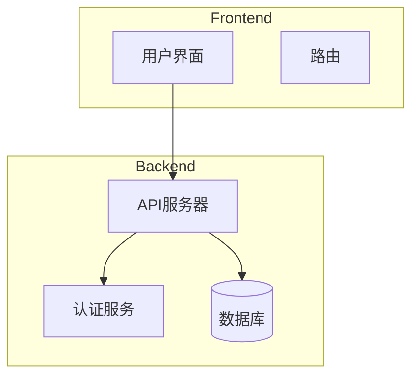
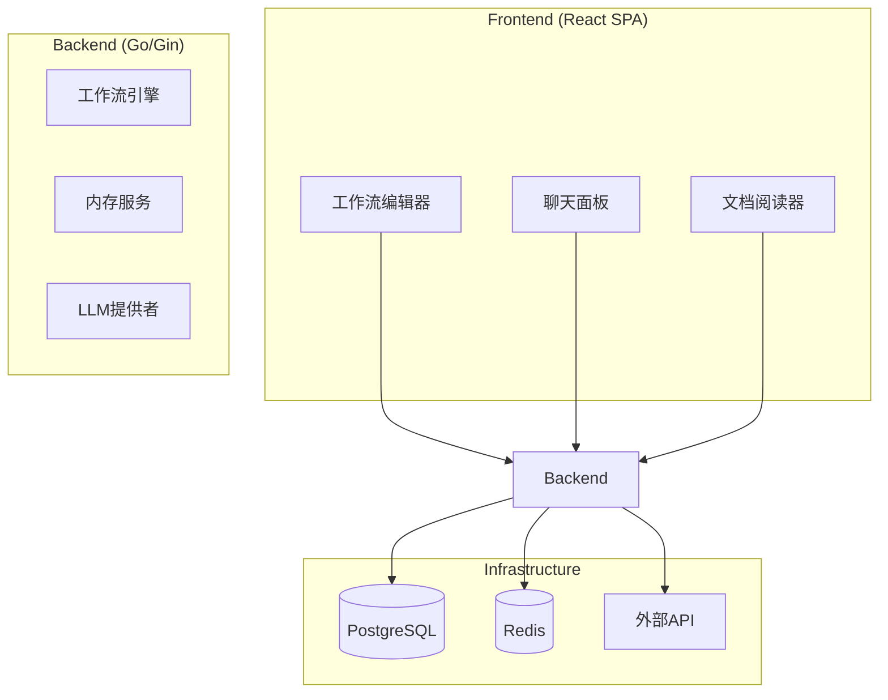
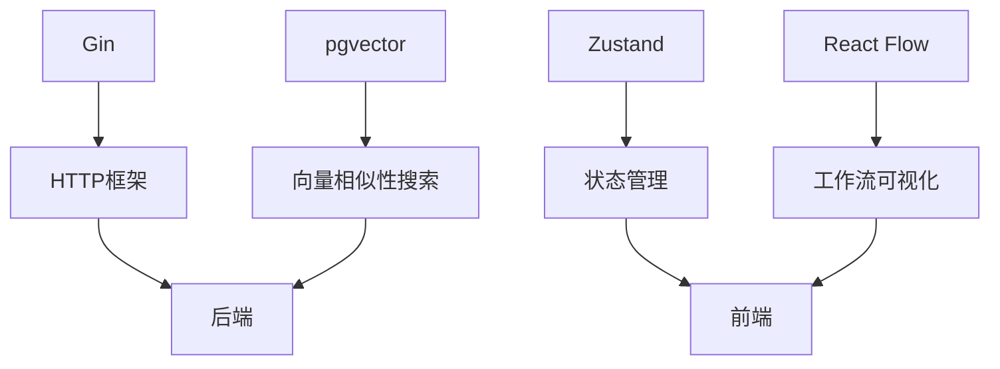

# 文档验证

<cite>
**本文档中引用的文件**  
- [README.md](file://README.md)
- [main.go](file://cmd/council/main.go)
- [config.go](file://internal/pkg/config/config.go)
- [engine.go](file://internal/core/workflow/engine.go)
- [service.go](file://internal/core/memory/service.go)
- [workflow.go](file://internal/api/handler/workflow.go)
- [hub.go](file://internal/api/ws/hub.go)
- [fact_check.go](file://internal/core/middleware/fact_check.go)
- [circuit_breaker.go](file://internal/core/middleware/circuit_breaker.go)
- [fact_check.go](file://internal/core/workflow/nodes/fact_check.go)
- [human_review.go](file://internal/core/workflow/nodes/human_review.go)
- [loop.go](file://internal/core/workflow/nodes/loop.go)
</cite>

## 目录
1. [简介](#简介)
2. [项目结构](#项目结构)
3. [核心组件](#核心组件)
4. [架构概述](#架构概述)
5. [详细组件分析](#详细组件分析)
6. [依赖分析](#依赖分析)
7. [性能考虑](#性能考虑)
8. [故障排除指南](#故障排除指南)
9. [结论](#结论)

## 简介
The Council 是一个可视化多智能体协作系统和个人私有思考库。该项目旨在通过AI驱动的工作流、智能节点和先进的能力，为用户提供一个强大的决策支持和协作平台。系统采用Go语言作为后端，React作为前端，结合PostgreSQL和Redis等基础设施，实现了高效、可扩展的多智能体协作功能。

**Section sources**
- [README.md](file://README.md#L1-L352)

## 项目结构
The Council 项目采用分层架构，主要分为以下几个部分：
- **cmd/council/**: 应用程序入口点
- **internal/**: 核心业务逻辑和基础设施
- **frontend/**: 前端应用
- **docs/**: 文档和规范
- **e2e/**: 端到端测试



**Diagram sources **
- [README.md](file://README.md#L290-L312)

**Section sources**
- [README.md](file://README.md#L290-L312)

## 核心组件
The Council 的核心组件包括工作流引擎、内存服务、中间件和API处理器。这些组件共同协作，实现了多智能体的可视化协作和决策支持。

**Section sources**
- [main.go](file://cmd/council/main.go#L1-L154)
- [engine.go](file://internal/core/workflow/engine.go#L1-L246)
- [service.go](file://internal/core/memory/service.go#L1-L209)

## 架构概述
The Council 采用分层架构，从前端到后端，再到基础设施，形成了一个完整的多智能体协作系统。前端使用React SPA，后端使用Go/Gin，基础设施包括PostgreSQL和Redis。



**Diagram sources **
- [README.md](file://README.md#L150-L175)

**Section sources**
- [README.md](file://README.md#L149-L187)

## 详细组件分析
### 工作流引擎分析
工作流引擎是The Council的核心，负责协调和执行工作流。它通过图定义、状态管理和节点工厂来实现复杂的多智能体协作。

```mermaid
classDiagram
class Engine {
+Graph *GraphDefinition
+Status map[string]NodeStatus
+NodeFactory func(node *Node) (NodeProcessor, error)
+StreamChannel chan StreamEvent
+Run(ctx context.Context)
+executeNode(ctx context.Context, nodeID string, input map[string]interface{})
+handleParallel(ctx context.Context, node *Node, input map[string]interface{})
+updateStatus(nodeID string, status NodeStatus)
+GetStatus(nodeID string) NodeStatus
+emitError(nodeID string, err error)
+ResumeNode(ctx context.Context, nodeID string, output map[string]interface{}) error
}
class GraphDefinition {
+StartNodeID string
+Nodes map[string]*Node
+Validate() error
}
class Node {
+ID string
+Type string
+NextIDs []string
}
class NodeProcessor {
<<interface>>
+Process(ctx context.Context, input map[string]interface{}, stream chan<- StreamEvent) (map[string]interface{}, error)
}
class StreamEvent {
+Type string
+Timestamp time.Time
+NodeID string
+Data map[string]interface{}
}
Engine --> GraphDefinition : "使用"
Engine --> Node : "管理"
Engine --> NodeProcessor : "创建"
Engine --> StreamEvent : "发送"
```

**Diagram sources **
- [engine.go](file://internal/core/workflow/engine.go#L1-L246)

**Section sources**
- [engine.go](file://internal/core/workflow/engine.go#L1-L246)

### 内存服务分析
内存服务实现了三层内存系统，包括隔离区、工作内存和长期知识。它通过嵌入器、数据库和缓存来实现高效的数据存储和检索。

```mermaid
classDiagram
class Service {
+Embedder llm.Embedder
+pool db.DB
+cache cache.Cache
+LogQuarantine(ctx context.Context, sessionID string, nodeID string, content string, metadata map[string]interface{}) error
+UpdateWorkingMemory(ctx context.Context, groupID string, content string, metadata map[string]interface{}) error
+CleanupWorkingMemory(ctx context.Context) error
+Promote(ctx context.Context, groupID string, content string) error
+Retrieve(ctx context.Context, query string, groupID string) ([]ContextItem, error)
}
class Embedder {
<<interface>>
+Embed(ctx context.Context, model string, text string) ([]float32, error)
}
class DB {
<<interface>>
+Exec(ctx context.Context, query string, args ...interface{}) (Result, error)
+Query(ctx context.Context, query string, args ...interface{}) (Rows, error)
}
class Cache {
<<interface>>
+LPush(ctx context.Context, key string, value interface{}) *StringCmd
+LRange(ctx context.Context, key string, start, stop int64) *StringSliceCmd
+Expire(ctx context.Context, key string, expiration time.Duration) *BoolCmd
+LTrim(ctx context.Context, key string, start, stop int64) *StatusCmd
}
Service --> Embedder : "使用"
Service --> DB : "使用"
Service --> Cache : "使用"
```

**Diagram sources **
- [service.go](file://internal/core/memory/service.go#L1-L209)

**Section sources**
- [service.go](file://internal/core/memory/service.go#L1-L209)

### 中间件分析
中间件系统实现了反幻觉和电路断路器功能，确保系统的安全性和稳定性。

```mermaid
classDiagram
class Middleware {
<<interface>>
+Name() string
+BeforeNodeExecution(ctx context.Context, session *workflow.Session, node *workflow.Node) error
+AfterNodeExecution(ctx context.Context, session *workflow.Session, node *workflow.Node, output map[string]interface{}) (map[string]interface{}, error)
}
class FactCheckTrigger {
+MetricRegex *regexp.Regexp
+CitationRegex *regexp.Regexp
+Name() string
+BeforeNodeExecution(ctx context.Context, session *workflow.Session, node *workflow.Node) error
+AfterNodeExecution(ctx context.Context, session *workflow.Session, node *workflow.Node, output map[string]interface{}) (map[string]interface{}, error)
}
class CircuitBreaker {
+MaxRecursionDepth int
+Name() string
+BeforeNodeExecution(ctx context.Context, session *workflow.Session, node *workflow.Node) error
+AfterNodeExecution(ctx context.Context, session *workflow.Session, node *workflow.Node, output map[string]interface{}) (map[string]interface{}, error)
}
Middleware <|-- FactCheckTrigger
Middleware <|-- CircuitBreaker
```

**Diagram sources **
- [fact_check.go](file://internal/core/middleware/fact_check.go#L1-L53)
- [circuit_breaker.go](file://internal/core/middleware/circuit_breaker.go#L1-L40)

**Section sources**
- [fact_check.go](file://internal/core/middleware/fact_check.go#L1-L53)
- [circuit_breaker.go](file://internal/core/middleware/circuit_breaker.go#L1-L40)

### 节点处理器分析
节点处理器实现了事实检查、人工审查和循环功能，支持复杂的工作流逻辑。

```mermaid
classDiagram
class NodeProcessor {
<<interface>>
+Process(ctx context.Context, input map[string]interface{}, stream chan<- workflow.StreamEvent) (map[string]interface{}, error)
}
class FactCheckProcessor {
+LLM llm.LLMProvider
+SearchClient search.SearchClient
+VerifyThreshold float64
+Process(ctx context.Context, input map[string]interface{}, stream chan<- workflow.StreamEvent) (map[string]interface{}, error)
}
class HumanReviewProcessor {
+TimeoutMinutes int
+AllowSkip bool
+Process(ctx context.Context, input map[string]interface{}, stream chan<- workflow.StreamEvent) (map[string]interface{}, error)
}
class LoopProcessor {
+MaxRounds int
+ExitOnScore int
+Process(ctx context.Context, input map[string]interface{}, stream chan<- workflow.StreamEvent) (map[string]interface{}, error)
}
NodeProcessor <|-- FactCheckProcessor
NodeProcessor <|-- HumanReviewProcessor
NodeProcessor <|-- LoopProcessor
```

**Diagram sources **
- [fact_check.go](file://internal/core/workflow/nodes/fact_check.go#L1-L114)
- [human_review.go](file://internal/core/workflow/nodes/human_review.go#L1-L47)
- [loop.go](file://internal/core/workflow/nodes/loop.go#L1-L67)

**Section sources**
- [fact_check.go](file://internal/core/workflow/nodes/fact_check.go#L1-L114)
- [human_review.go](file://internal/core/workflow/nodes/human_review.go#L1-L47)
- [loop.go](file://internal/core/workflow/nodes/loop.go#L1-L67)

## 依赖分析
The Council 项目依赖于多个外部库和工具，包括Gin、React Flow、pgvector等。这些依赖项为项目提供了HTTP框架、工作流可视化和向量相似性搜索等功能。



**Diagram sources **
- [README.md](file://README.md#L340-L346)

**Section sources**
- [README.md](file://README.md#L339-L347)

## 性能考虑
The Council 项目在设计时考虑了性能优化，包括使用Redis作为缓存、PostgreSQL作为数据库、以及Go语言的高效并发处理。这些设计选择确保了系统在高负载下的稳定性和响应速度。

**Section sources**
- [README.md](file://README.md#L177-L187)

## 故障排除指南
在使用The Council时，可能会遇到一些常见问题，如服务启动失败、数据库连接问题等。建议检查环境变量配置、依赖项安装情况以及日志输出，以快速定位和解决问题。

**Section sources**
- [README.md](file://README.md#L314-L330)

## 结论
The Council 项目通过其强大的多智能体协作功能和先进的技术栈，为用户提供了一个高效、可扩展的决策支持平台。通过深入分析其架构和核心组件，我们可以更好地理解和利用这一系统，实现更智能的协作和决策。

**Section sources**
- [README.md](file://README.md#L1-L352)