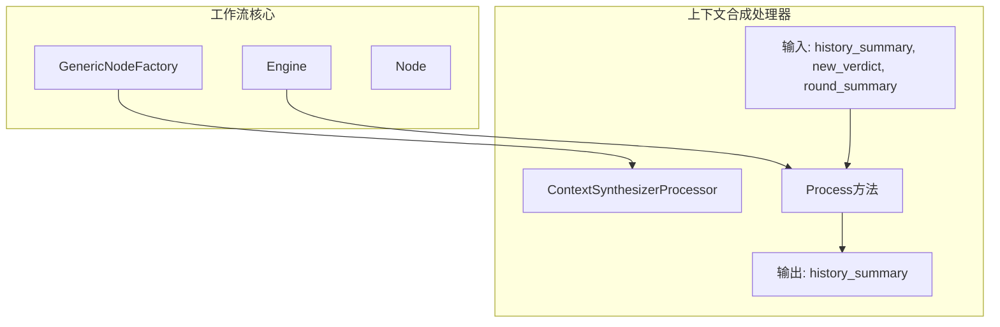
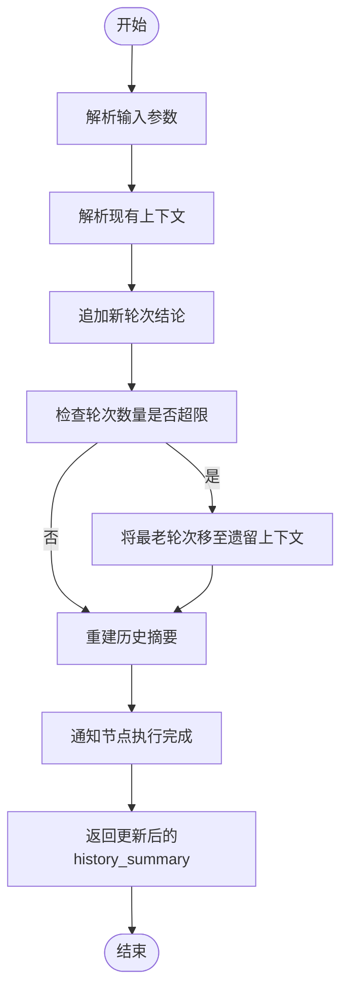
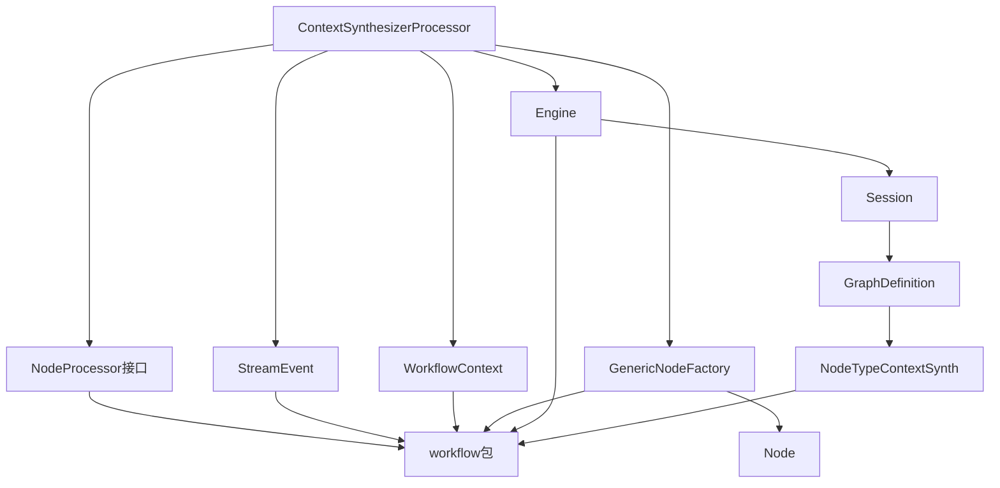

# 上下文合成处理器

<cite>
**本文档引用的文件**  
- [context_synth.go](file://internal/core/workflow/nodes/context_synth.go)
- [context_synth_test.go](file://internal/core/workflow/nodes/context_synth_test.go)
- [SPEC-1104-context-synth.md](file://docs/specs/sprint11/SPEC-1104-context-synth.md)
- [context_keys.go](file://internal/council/context_keys.go)
- [merge_strategy.go](file://internal/council/merge_strategy.go)
- [factory.go](file://internal/council/factory.go)
- [types.go](file://internal/core/workflow/types.go)
- [engine.go](file://internal/core/workflow/engine.go)
</cite>

## 目录
1. [简介](#简介)
2. [核心功能与设计目标](#核心功能与设计目标)
3. [上下文合成处理器的架构](#上下文合成处理器的架构)
4. [详细组件分析](#详细组件分析)
5. [依赖关系分析](#依赖关系分析)
6. [性能与优化考虑](#性能与优化考虑)
7. [故障排除指南](#故障排除指南)
8. [结论](#结论)

## 简介
上下文合成处理器（Context Synthesizer Processor）是本系统中用于解决“无限上下文”问题的关键组件。它通过确定性地主动总结历史轮次内容，确保提示（prompt）保持简洁且相关，避免因上下文过长导致的性能下降或信息冗余。该处理器在议会辩论和优化工作流中扮演着核心角色，负责管理多轮迭代中的上下文累积与修剪。

## 核心功能与设计目标
上下文合成处理器的主要目标是实现对历史上下文的有效管理，具体包括：
- **历史摘要维护**：持续维护一个包含所有轮次结论的历史摘要。
- **滚动窗口机制**：采用滚动窗口算法，仅保留最近的若干轮次完整内容，其余则压缩为单行摘要并移至“遗留上下文”部分。
- **自动修剪**：当轮次数量超过预设阈值时，自动将最旧的轮次从完整记录区移至摘要区，从而控制上下文总长度。
- **结构化输出**：生成结构化的Markdown格式输出，便于后续LLM解析和使用。

该设计遵循SPEC-1104规范，旨在通过本地处理而非依赖RAG随机检索的方式，提供更可控、高效的上下文管理方案。

**Section sources**
- [SPEC-1104-context-synth.md](file://docs/specs/sprint11/SPEC-1104-context-synth.md#L1-L45)

## 上下文合成处理器的架构
上下文合成处理器作为工作流引擎中的一个节点类型（`NodeTypeContextSynth`），其运行依赖于整个工作流框架的支持。它通过实现`NodeProcessor`接口，被集成到工作流执行流程中，并由`GenericNodeFactory`根据节点配置动态创建。

**Diagram sources**
- [context_synth.go](file://internal/core/workflow/nodes/context_synth.go#L12-L93)
- [types.go](file://internal/core/workflow/types.go#L41)
- [factory.go](file://internal/core/workflow/nodes/factory.go#L134-L142)
- [engine.go](file://internal/core/workflow/engine.go#L152-L158)

## 详细组件分析

### 上下文合成处理器实现分析
`ContextSynthesizerProcessor`结构体包含一个关键字段`MaxRecentRounds`，用于定义保留的最近轮次数目。其`Process`方法执行以下步骤：

1. **状态通知**：向流通道发送“运行中”事件，通知前端更新节点状态。
2. **输入解析**：从输入映射中提取当前历史摘要、新结论及本轮摘要。
3. **上下文解析**：调用`parseContext`函数将现有历史摘要拆分为“遗留上下文”列表和“轮次数据”列表。
4. **追加新轮次**：将新的结论内容连同可选的摘要信息一起追加到轮次列表中。
5. **容量检查与修剪**：若轮次总数超过`MaxRecentRounds`，则将超出部分的最老轮次移至“遗留上下文”，并从主列表中移除。
6. **重建输出**：使用`strings.Builder`高效构建新的历史摘要字符串，包含“遗留上下文”和“按时间顺序排列的结论”两部分。
7. **完成通知**：发送“已完成”事件，并返回更新后的上下文。

此过程确保了上下文的有序性和可读性，同时有效控制了数据体积。

#### 处理流程图

**Diagram sources**
- [context_synth.go](file://internal/core/workflow/nodes/context_synth.go#L16-L92)

### 上下文解析与提取逻辑
`parseContext`函数负责将纯文本的历史摘要解析为结构化数据。它假设输入文本由“## Legacy Context”和“## Chronological Verdicts”两个主要部分组成。前者包含以`- `开头的摘要条目，后者包含以`## Round`为标题的完整轮次内容。

`extractSummary`函数用于从单个轮次文本中提取隐藏的摘要信息，其优先级如下：
1. 查找`<!-- S: ... -->`标记内的内容。
2. 若无标记，则提取第一行文本并去除`#`号前缀作为摘要。

这种设计允许在不增加额外LLM调用的情况下，利用预设的元数据进行高效上下文压缩。

**Section sources**
- [context_synth.go](file://internal/core/workflow/nodes/context_synth.go#L101-L177)

## 依赖关系分析
上下文合成处理器的正常运行依赖于多个核心模块的协同工作：

**Diagram sources**
- [types.go](file://internal/core/workflow/types.go)
- [context.go](file://internal/core/workflow/context.go)
- [engine.go](file://internal/core/workflow/engine.go)
- [factory.go](file://internal/core/workflow/nodes/factory.go)

## 性能与优化考虑
上下文合成处理器的设计充分考虑了性能因素：
- **内存效率**：使用`strings.Builder`避免字符串拼接时的多次内存分配。
- **计算复杂度**：解析和修剪操作的时间复杂度为O(n)，其中n为历史轮次数，通常较小，因此整体开销可控。
- **避免LLM调用**：通过启发式方法提取摘要，避免了为每次修剪发起额外的LLM请求，显著降低了延迟和成本。
- **流式通信**：通过`stream`通道实时通知前端状态变化，保证了用户体验的流畅性。

未来可进一步优化的方向包括引入更智能的摘要算法（如基于LLM的压缩）或支持更灵活的上下文分层策略。

## 故障排除指南
在使用上下文合成处理器时可能遇到的问题及解决方案：

- **问题：历史摘要格式错误导致解析失败**
  - **原因**：输入的`history_summary`不符合预期的Markdown结构。
  - **解决方案**：确保上游节点输出的摘要遵循“## Legacy Context”和“## Chronological Verdicts”的格式规范。

- **问题：旧轮次未被正确修剪**
  - **原因**：`MaxRecentRounds`配置值过大或未正确传递。
  - **解决方案**：检查节点属性中的`max_recent_rounds`设置，并确认其在处理器初始化时被正确读取。

- **问题：流事件未被前端接收**
  - **原因**：`stream`通道阻塞或前端订阅逻辑有误。
  - **解决方案**：验证`StreamChannel`的缓冲区大小，并检查前端WebSocket连接状态。

**Section sources**
- [context_synth.go](file://internal/core/workflow/nodes/context_synth.go#L16-L92)
- [engine.go](file://internal/core/workflow/engine.go#L242-L248)

## 结论
上下文合成处理器是本系统实现高效、可控的多轮对话管理的核心组件。它通过精巧的滚动窗口算法和结构化文本处理，解决了长上下文带来的挑战。其设计体现了模块化、可配置和高性能的特点，为复杂的AI工作流提供了坚实的基础设施支持。未来可通过增强解析鲁棒性和引入自适应修剪策略来进一步提升其能力。