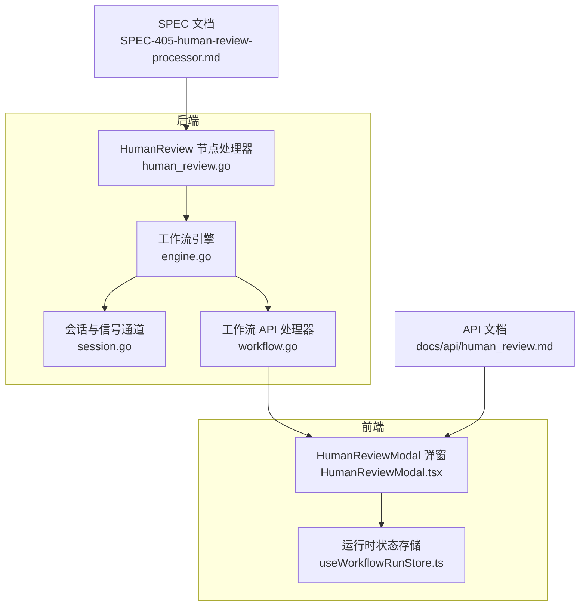
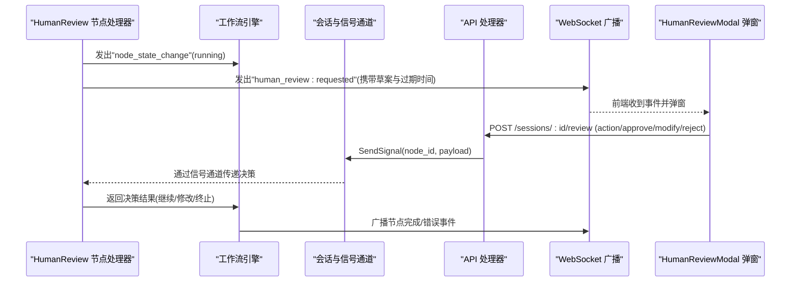
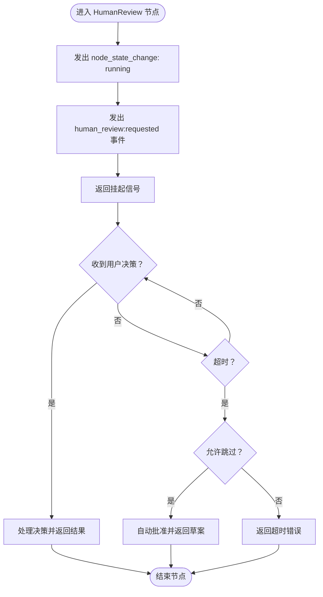
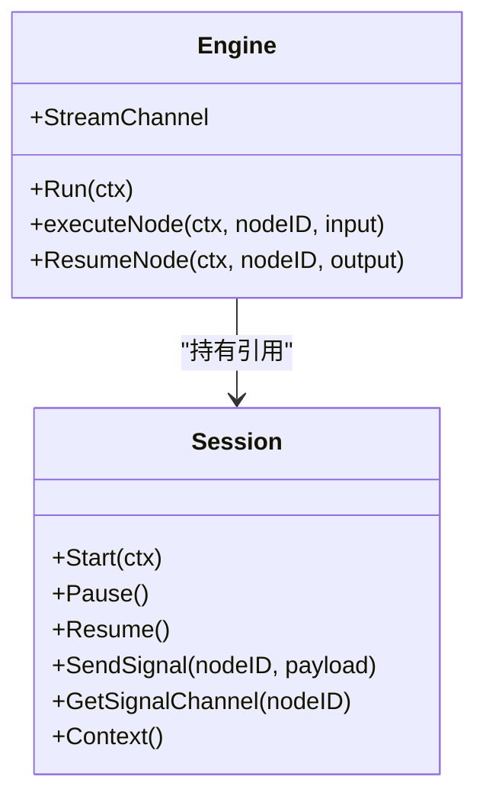
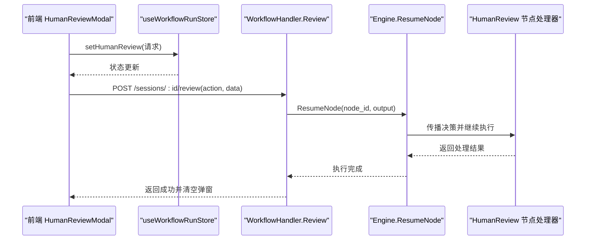
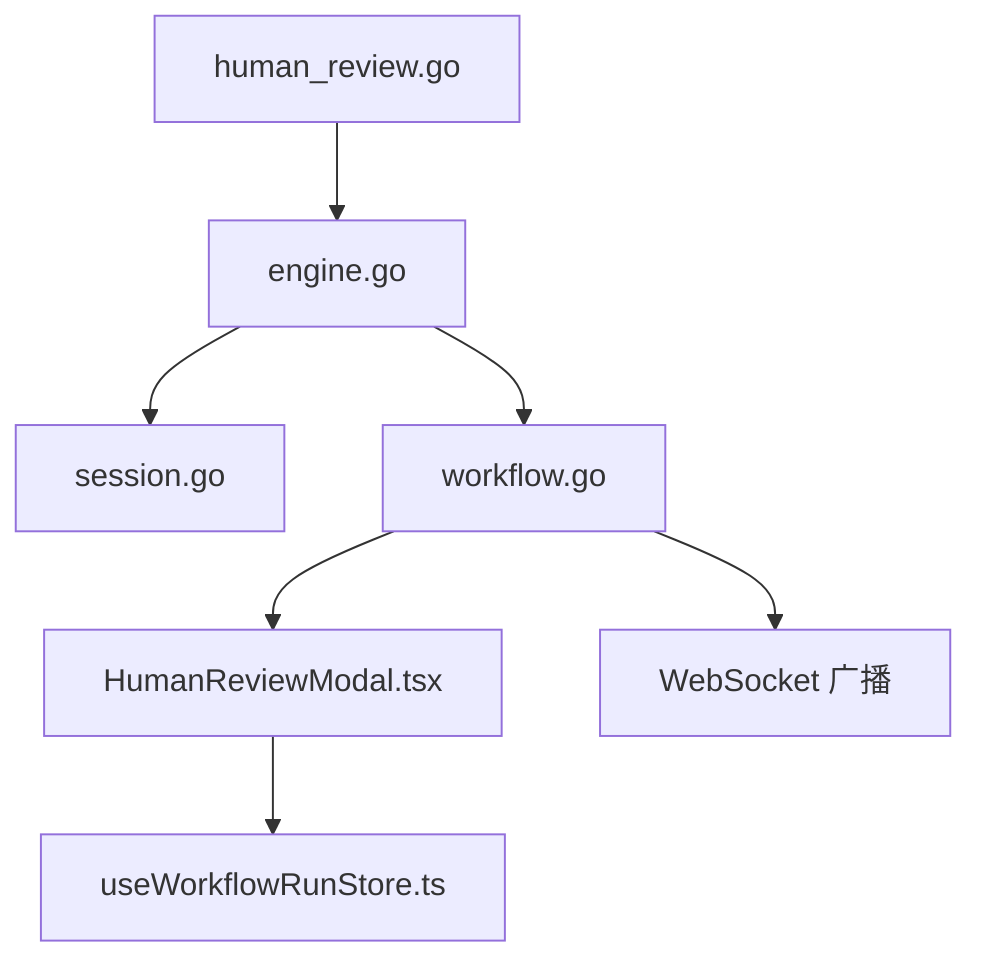

# 人类裁决

<cite>
**本文引用的文件**
- [internal/core/workflow/nodes/human_review.go](file://internal/core/workflow/nodes/human_review.go)
- [internal/core/workflow/engine.go](file://internal/core/workflow/engine.go)
- [internal/core/workflow/session.go](file://internal/core/workflow/session.go)
- [internal/api/handler/workflow.go](file://internal/api/handler/workflow.go)
- [frontend/src/features/execution/components/HumanReviewModal.tsx](file://frontend/src/features/execution/components/HumanReviewModal.tsx)
- [frontend/src/stores/useWorkflowRunStore.ts](file://frontend/src/stores/useWorkflowRunStore.ts)
- [docs/api/human_review.md](file://docs/api/human_review.md)
- [docs/specs/backend/SPEC-405-human-review-processor.md](file://docs/specs/backend/SPEC-405-human-review-processor.md)
- [docs/specs/sprint4/SPEC-301-human-review-modal.md](file://docs/specs/sprint4/SPEC-301-human-review-modal.md)
- [internal/resources/seeder.go](file://internal/resources/seeder.go)
</cite>

## 目录
1. [引言](#引言)
2. [项目结构](#项目结构)
3. [核心组件](#核心组件)
4. [架构总览](#架构总览)
5. [详细组件分析](#详细组件分析)
6. [依赖关系分析](#依赖关系分析)
7. [性能考虑](#性能考虑)
8. [故障排查指南](#故障排查指南)
9. [结论](#结论)
10. [附录](#附录)

## 引言
本文件系统性阐述“人类裁决”机制的设计目标与实现细节，重点说明其作为防止AI幻觉、保障决策质量的关键控制点。文档覆盖以下关键内容：
- 人类裁决处理器如何中断自动化流程并触发前端 HumanReviewModal 弹窗，展示待确认的决策草案及其依据；
- 节点表单配置项（如超时设置、强制介入条件）与后端状态持久化逻辑；
- 完整的人机协作流程示例，包括用户确认、驳回与修改反馈的闭环处理；
- 安全考量，包括防重复提交、权限验证与审计日志记录的建议与现状。

## 项目结构
围绕“人类裁决”的实现，涉及后端工作流引擎、节点处理器、会话与信号通道、API处理器以及前端弹窗与状态管理等模块。下图给出与人类裁决直接相关的文件与职责映射。

**图表来源**
- [internal/core/workflow/nodes/human_review.go](file://internal/core/workflow/nodes/human_review.go#L1-L47)
- [internal/core/workflow/engine.go](file://internal/core/workflow/engine.go#L1-L246)
- [internal/core/workflow/session.go](file://internal/core/workflow/session.go#L1-L165)
- [internal/api/handler/workflow.go](file://internal/api/handler/workflow.go#L1-L246)
- [frontend/src/features/execution/components/HumanReviewModal.tsx](file://frontend/src/features/execution/components/HumanReviewModal.tsx#L1-L91)
- [frontend/src/stores/useWorkflowRunStore.ts](file://frontend/src/stores/useWorkflowRunStore.ts#L1-L301)
- [docs/api/human_review.md](file://docs/api/human_review.md#L1-L146)
- [docs/specs/backend/SPEC-405-human-review-processor.md](file://docs/specs/backend/SPEC-405-human-review-processor.md#L1-L106)

**章节来源**
- [internal/core/workflow/nodes/human_review.go](file://internal/core/workflow/nodes/human_review.go#L1-L47)
- [internal/core/workflow/engine.go](file://internal/core/workflow/engine.go#L1-L246)
- [internal/core/workflow/session.go](file://internal/core/workflow/session.go#L1-L165)
- [internal/api/handler/workflow.go](file://internal/api/handler/workflow.go#L1-L246)
- [frontend/src/features/execution/components/HumanReviewModal.tsx](file://frontend/src/features/execution/components/HumanReviewModal.tsx#L1-L91)
- [frontend/src/stores/useWorkflowRunStore.ts](file://frontend/src/stores/useWorkflowRunStore.ts#L1-L301)
- [docs/api/human_review.md](file://docs/api/human_review.md#L1-L146)
- [docs/specs/backend/SPEC-405-human-review-processor.md](file://docs/specs/backend/SPEC-405-human-review-processor.md#L1-L106)

## 核心组件
- 人类裁决节点处理器：负责在工作流到达裁决节点时发出“需要人工干预”的事件，并以挂起方式阻断后续执行，等待用户决策或超时。
- 工作流引擎：统一调度节点执行，识别处理器返回的挂起信号，更新节点状态并维持会话生命周期。
- 会话与信号通道：为每个节点维护独立的信号通道，用于接收前端提交的决策信号。
- API 处理器：提供 REST 接口接收用户决策，向会话的信号通道投递决策，随后恢复被挂起的节点执行。
- 前端 HumanReviewModal：监听后端 WebSocket 事件，弹出裁决弹窗，支持审批、修改、驳回三种动作，并在提交后清空弹窗状态。
- 前端运行时状态存储：集中管理会话执行状态、节点状态、人类裁决请求等，驱动 UI 渲染与交互。

**章节来源**
- [internal/core/workflow/nodes/human_review.go](file://internal/core/workflow/nodes/human_review.go#L1-L47)
- [internal/core/workflow/engine.go](file://internal/core/workflow/engine.go#L1-L246)
- [internal/core/workflow/session.go](file://internal/core/workflow/session.go#L1-L165)
- [internal/api/handler/workflow.go](file://internal/api/handler/workflow.go#L1-L246)
- [frontend/src/features/execution/components/HumanReviewModal.tsx](file://frontend/src/features/execution/components/HumanReviewModal.tsx#L1-L91)
- [frontend/src/stores/useWorkflowRunStore.ts](file://frontend/src/stores/useWorkflowRunStore.ts#L1-L301)

## 架构总览
下图展示从工作流节点到前端弹窗的整体调用链路与数据流。

**图表来源**
- [internal/core/workflow/nodes/human_review.go](file://internal/core/workflow/nodes/human_review.go#L1-L47)
- [internal/core/workflow/engine.go](file://internal/core/workflow/engine.go#L1-L246)
- [internal/core/workflow/session.go](file://internal/core/workflow/session.go#L1-L165)
- [internal/api/handler/workflow.go](file://internal/api/handler/workflow.go#L1-L246)
- [docs/api/human_review.md](file://docs/api/human_review.md#L1-L146)

## 详细组件分析

### 人类裁决节点处理器（后端）
- 设计目标
  - 在工作流中插入“人类最终裁决”环节，确保关键决策由人把关，防止AI幻觉与偏差。
  - 通过事件与信号通道实现前后端解耦，保证流程可控与可观测。
- 关键行为
  - 发出节点状态变更事件，标记当前节点为“运行中”。
  - 发出“human_review:requested”事件，携带会话ID、节点ID、草案内容与过期时间等上下文。
  - 返回挂起信号，使引擎暂停该节点的后续推进，等待用户决策或超时。
- 节点表单配置项
  - 超时分钟数：影响前端弹窗的倒计时与后端等待窗口。
  - 允许跳过：在超时后是否自动批准（取决于业务策略）。
- 状态持久化
  - 当前实现通过事件与信号通道进行状态流转；若需持久化，可在SPEC-405中扩展 ReviewStore 以保存 HumanReviewRequest，并在超时或异常时进行审计与恢复。

**图表来源**
- [internal/core/workflow/nodes/human_review.go](file://internal/core/workflow/nodes/human_review.go#L1-L47)
- [docs/specs/backend/SPEC-405-human-review-processor.md](file://docs/specs/backend/SPEC-405-human-review-processor.md#L1-L106)

**章节来源**
- [internal/core/workflow/nodes/human_review.go](file://internal/core/workflow/nodes/human_review.go#L1-L47)
- [docs/specs/backend/SPEC-405-human-review-processor.md](file://docs/specs/backend/SPEC-405-human-review-processor.md#L1-L106)

### 工作流引擎与会话
- 引擎职责
  - 统一调度节点执行，识别挂起信号并更新节点状态。
  - 将节点输出与错误广播至 WebSocket，供前端订阅。
- 会话与信号通道
  - 为每个节点维护独立的信号通道，用于接收前端提交的决策。
  - 提供阻塞/非阻塞发送能力，避免竞争与丢失。

**图表来源**
- [internal/core/workflow/engine.go](file://internal/core/workflow/engine.go#L1-L246)
- [internal/core/workflow/session.go](file://internal/core/workflow/session.go#L1-L165)

**章节来源**
- [internal/core/workflow/engine.go](file://internal/core/workflow/engine.go#L1-L246)
- [internal/core/workflow/session.go](file://internal/core/workflow/session.go#L1-L165)

### API 处理器与前端交互
- API 处理器
  - 提供控制接口与信号接口，用于暂停/恢复/停止会话与向指定节点发送信号。
  - 在“人类裁决”场景中，接收前端提交的 review 请求，构造输出并调用引擎恢复被挂起的节点。
- 前端 HumanReviewModal
  - 监听 WebSocket 事件，弹出裁决弹窗，支持审批、修改、驳回三种动作。
  - 提交后清理弹窗状态，避免重复提交。
- 前端运行时状态存储
  - 统一管理会话执行状态、节点状态与人类裁决请求，驱动 UI 渲染与交互。

**图表来源**
- [internal/api/handler/workflow.go](file://internal/api/handler/workflow.go#L1-L246)
- [frontend/src/features/execution/components/HumanReviewModal.tsx](file://frontend/src/features/execution/components/HumanReviewModal.tsx#L1-L91)
- [frontend/src/stores/useWorkflowRunStore.ts](file://frontend/src/stores/useWorkflowRunStore.ts#L1-L301)

**章节来源**
- [internal/api/handler/workflow.go](file://internal/api/handler/workflow.go#L1-L246)
- [frontend/src/features/execution/components/HumanReviewModal.tsx](file://frontend/src/features/execution/components/HumanReviewModal.tsx#L1-L91)
- [frontend/src/stores/useWorkflowRunStore.ts](file://frontend/src/stores/useWorkflowRunStore.ts#L1-L301)

### 节点表单配置与工作流编排
- 表单配置项
  - 超时分钟数：影响前端倒计时与后端等待窗口。
  - 允许跳过：在SPEC-405中体现为 AllowSkip 字段，用于超时后的自动批准策略。
- 工作流编排
  - 示例工作流包含“开始 → 代理节点 → 人类裁决 → 循环决策 → 结束”，人类裁决节点作为关键决策点插入。

**图表来源**
- [internal/resources/seeder.go](file://internal/resources/seeder.go#L222-L244)

**章节来源**
- [internal/resources/seeder.go](file://internal/resources/seeder.go#L222-L244)
- [docs/specs/backend/SPEC-405-human-review-processor.md](file://docs/specs/backend/SPEC-405-human-review-processor.md#L1-L106)

## 依赖关系分析
- 组件耦合
  - HumanReview 节点处理器与工作流引擎通过挂起信号耦合，引擎负责状态管理与事件广播。
  - 会话与信号通道为节点与前端之间提供可靠通信通道。
  - API 处理器与前端通过 REST 与 WebSocket 协同，形成闭环。
- 外部依赖
  - WebSocket 广播：将引擎事件推送到前端。
  - 前端状态存储：集中管理会话与节点状态，驱动 UI。

**图表来源**
- [internal/core/workflow/nodes/human_review.go](file://internal/core/workflow/nodes/human_review.go#L1-L47)
- [internal/core/workflow/engine.go](file://internal/core/workflow/engine.go#L1-L246)
- [internal/core/workflow/session.go](file://internal/core/workflow/session.go#L1-L165)
- [internal/api/handler/workflow.go](file://internal/api/handler/workflow.go#L1-L246)
- [frontend/src/features/execution/components/HumanReviewModal.tsx](file://frontend/src/features/execution/components/HumanReviewModal.tsx#L1-L91)
- [frontend/src/stores/useWorkflowRunStore.ts](file://frontend/src/stores/useWorkflowRunStore.ts#L1-L301)

**章节来源**
- [internal/core/workflow/nodes/human_review.go](file://internal/core/workflow/nodes/human_review.go#L1-L47)
- [internal/core/workflow/engine.go](file://internal/core/workflow/engine.go#L1-L246)
- [internal/core/workflow/session.go](file://internal/core/workflow/session.go#L1-L165)
- [internal/api/handler/workflow.go](file://internal/api/handler/workflow.go#L1-L246)
- [frontend/src/features/execution/components/HumanReviewModal.tsx](file://frontend/src/features/execution/components/HumanReviewModal.tsx#L1-L91)
- [frontend/src/stores/useWorkflowRunStore.ts](file://frontend/src/stores/useWorkflowRunStore.ts#L1-L301)

## 性能考虑
- 事件广播与通道缓冲
  - 引擎通过带缓冲的事件通道推送节点状态，前端按需消费，避免阻塞后端执行。
- 信号通道设计
  - 为每个节点维护独立的信号通道，容量通常为1，避免并发竞争与消息丢失。
- 超时与自动批准
  - 合理设置超时与 AllowSkip 策略，平衡用户体验与风险控制。

[本节为通用指导，无需列出具体文件来源]

## 故障排查指南
- 常见问题
  - 弹窗未出现：检查 WebSocket 事件是否正确广播，前端是否订阅到 human_review:requested。
  - 提交无效：确认 API 返回状态码与错误信息，检查节点是否仍处于挂起状态。
  - 重复提交：前端在提交后会清空弹窗状态，避免重复提交；若仍出现，检查前端状态同步逻辑。
- 审计与日志
  - 建议在SPEC-405中扩展 ReviewStore，记录 HumanReviewRequest 的创建、过期、提交与结果，便于审计与复盘。
  - 引擎在节点失败时广播错误事件，前端可据此定位问题。

**章节来源**
- [docs/api/human_review.md](file://docs/api/human_review.md#L1-L146)
- [frontend/src/stores/useWorkflowRunStore.ts](file://frontend/src/stores/useWorkflowRunStore.ts#L1-L301)
- [internal/core/workflow/engine.go](file://internal/core/workflow/engine.go#L1-L246)

## 结论
“人类裁决”机制通过在关键节点引入人工干预，有效降低AI幻觉风险并提升决策质量。后端以事件与信号通道实现解耦，前端以弹窗与状态存储提供直观交互。结合合理的超时与自动批准策略，以及可扩展的持久化与审计能力，可构建稳健、可控、可追溯的人机协作流程。

[本节为总结性内容，无需列出具体文件来源]

## 附录

### API 与前端交互要点
- WebSocket 事件
  - human_review:requested：后端向前端推送裁决请求，包含草案与过期时间。
  - human_review:reminder：超时前5分钟提醒。
  - human_review:expired：超时处理通知。
- REST 端点
  - POST /api/v1/sessions/:id/review：提交人类裁决，支持 approve、modify、reject 三类动作。

**章节来源**
- [docs/api/human_review.md](file://docs/api/human_review.md#L1-L146)
- [docs/specs/sprint4/SPEC-301-human-review-modal.md](file://docs/specs/sprint4/SPEC-301-human-review-modal.md#L1-L125)