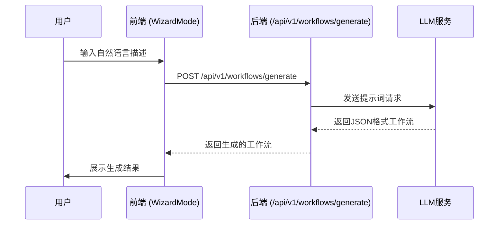
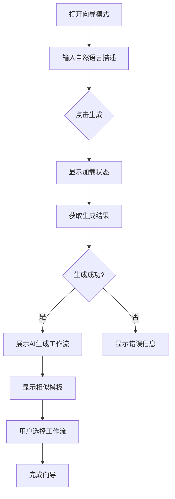

# 向导模式

<cite>
**本文档引用的文件**  
- [WizardMode.tsx](file://frontend/src/features/editor/components/Wizard/WizardMode.tsx)
- [useGenerateWorkflow.ts](file://frontend/src/hooks/useGenerateWorkflow.ts)
- [workflow_mgmt.go](file://internal/api/handler/workflow_mgmt.go)
- [nl2workflow.md](file://docs/tdd/02_core/13_nl2workflow.md)
- [SPEC-206-wizard-mode.md](file://docs/specs/sprint3/SPEC-206-wizard-mode.md)
- [template.go](file://internal/core/workflow/template.go)
</cite>

## 目录
1. [简介](#简介)
2. [技术实现](#技术实现)
3. [用户体验设计](#用户体验设计)
4. [与核心引擎的集成](#与核心引擎的集成)
5. [实际使用示例](#实际使用示例)
6. [优化策略与限制](#优化策略与限制)
7. [结论](#结论)

## 简介

向导模式是一项旨在降低用户交互门槛的功能，通过自然语言输入（NL2Workflow）自动生成可执行的工作流结构。该功能允许用户以自然语言描述其需求，系统将自动解析并生成相应的工作流，极大地简化了复杂流程的创建过程。

**Section sources**
- [SPEC-206-wizard-mode.md](file://docs/specs/sprint3/SPEC-206-wizard-mode.md#L8-L13)

## 技术实现

向导模式的技术实现基于NL2Workflow模块，该模块负责将用户的自然语言描述转换为结构化的工作流定义。前端组件`WizardMode`通过调用`useGenerateWorkflow` Hook与后端API进行通信，发起工作流生成请求。



**Diagram sources**
- [WizardMode.tsx](file://frontend/src/features/editor/components/Wizard/WizardMode.tsx#L14-L31)
- [useGenerateWorkflow.ts](file://frontend/src/hooks/useGenerateWorkflow.ts#L15-L46)
- [workflow_mgmt.go](file://internal/api/handler/workflow_mgmt.go#L110-L188)

**Section sources**
- [nl2workflow.md](file://docs/tdd/02_core/13_nl2workflow.md#L1-L72)
- [workflow_mgmt.go](file://internal/api/handler/workflow_mgmt.go#L110-L188)

## 用户体验设计

向导模式采用三步向导流程，为用户提供清晰的交互路径：

1. **意图输入**：用户在文本框中描述其会议需求
2. **流程选择**：系统展示AI生成的工作流及相似模板供选择
3. **预览与确认**：用户可预览生成的工作流并决定是否立即执行或进入编辑器微调

界面设计上，向导模式采用了现代化的模态对话框，包含进度指示器、输入区域和结果预览。当生成成功时，会显示"AI Success"标识，并提供推荐的工作流卡片。



**Diagram sources**
- [WizardMode.tsx](file://frontend/src/features/editor/components/Wizard/WizardMode.tsx#L73-L174)
- [SPEC-206-wizard-mode.md](file://docs/specs/sprint3/SPEC-206-wizard-mode.md#L53-L110)

**Section sources**
- [WizardMode.tsx](file://frontend/src/features/editor/components/Wizard/WizardMode.tsx#L1-L180)
- [SPEC-206-wizard-mode.md](file://docs/specs/sprint3/SPEC-206-wizard-mode.md#L16-L24)

## 与核心引擎的集成

向导模式通过NL2Workflow模块与核心引擎紧密集成。当用户提交自然语言描述后，系统会调用`/api/v1/workflows/generate`端点，该端点由`WorkflowMgmtHandler.Generate`方法处理。

后端实现中，系统首先尝试匹配现有模板，然后构造包含用户需求、相似模板和可用Agent的提示词，发送给LLM服务。LLM返回的JSON格式响应会被解析为`GraphDefinition`对象，经过验证后返回给前端。

```mermaid
classDiagram
class WizardMode {
+open : boolean
+onClose() : void
+onComplete(graph : BackendGraph) : void
-step : 1|2|3
-intent : string
-generatedResult : {graph, similar}
+handleGenerate() : Promise~void~
+handleSelectGraph(graph : BackendGraph) : void
}
class useGenerateWorkflow {
+generate(prompt : string) : Promise~GenerateWorkflowResponse~
+isGenerating : boolean
+error : string | null
}
class NL2WorkflowService {
+LLM : LLMProvider
+TemplateRepo : TemplateRepository
+Generate(req : WorkflowGenerationRequest) : *GraphDefinition
}
class WorkflowMgmtHandler {
+Generate(c : *gin.Context) : void
}
WizardMode --> useGenerateWorkflow : 使用
useGenerateWorkflow --> WorkflowMgmtHandler : 调用API
WorkflowMgmtHandler --> NL2WorkflowService : 调用
```

**Diagram sources**
- [nl2workflow.md](file://docs/tdd/02_core/13_nl2workflow.md#L6-L64)
- [workflow_mgmt.go](file://internal/api/handler/workflow_mgmt.go#L110-L188)

**Section sources**
- [nl2workflow.md](file://docs/tdd/02_core/13_nl2workflow.md#L1-L72)
- [workflow_mgmt.go](file://internal/api/handler/workflow_mgmt.go#L110-L188)

## 实际使用示例

以下是从"帮我组织一场关于AI伦理的辩论"到生成完整工作流的全过程：

1. 用户在向导模式中输入："帮我组织一场关于AI伦理的辩论，需要正反双方各两名专家，一名主持人，进行三轮辩论和最终投票"

2. 系统解析该描述，调用NL2Workflow服务生成工作流：

```json
{
  "nodes": [
    {
      "id": "start",
      "type": "start",
      "name": "Start",
      "next_ids": ["moderator_intro"]
    },
    {
      "id": "moderator_intro",
      "type": "agent",
      "name": "主持人开场",
      "next_ids": ["affirmative_round1"]
    },
    {
      "id": "affirmative_round1",
      "type": "agent",
      "name": "正方第一轮",
      "next_ids": ["negative_round1"]
    },
    {
      "id": "negative_round1",
      "type": "agent",
      "name": "反方第一轮",
      "next_ids": ["affirmative_round2"]
    },
    {
      "id": "vote",
      "type": "vote",
      "name": "投票",
      "next_ids": ["end"]
    },
    {
      "id": "end",
      "type": "end",
      "name": "End"
    }
  ],
  "edges": [
    {"source": "start", "target": "moderator_intro"},
    {"source": "moderator_intro", "target": "affirmative_round1"},
    {"source": "affirmative_round1", "target": "negative_round1"},
    {"source": "negative_round1", "target": "affirmative_round2"},
    {"source": "vote", "target": "end"}
  ]
}
```

3. 前端接收生成结果，展示AI生成的工作流和可能的相似模板（如"标准辩论流程"）

4. 用户选择AI生成的工作流，系统将其加载到工作流编辑器中准备执行

**Section sources**
- [SPEC-206-wizard-mode.md](file://docs/specs/sprint3/SPEC-206-wizard-mode.md#L115-L143)
- [nl2workflow.md](file://docs/tdd/02_core/13_nl2workflow.md#L21-L38)

## 优化策略与限制

### 生成准确性优化策略

1. **模板匹配**：在生成前先尝试匹配现有模板，提高生成质量
2. **上下文增强**：将可用Agent列表和相似模板作为上下文提供给LLM
3. **JSON格式约束**：要求LLM输出严格的JSON格式，减少解析错误
4. **后处理清理**：移除可能存在的Markdown代码块标记

### 上下文理解限制

1. **复杂逻辑识别**：对于非常复杂的条件逻辑，LLM可能无法准确识别
2. **领域专业知识**：特定领域的专业术语可能需要额外的上下文支持
3. **长文本处理**：过长的描述可能导致关键信息被忽略

### 人工修正路径

当生成结果不理想时，用户可以通过以下路径进行修正：

1. **重新生成**：修改输入描述，重新生成工作流
2. **手动编辑**：进入工作流编辑器，对生成的工作流进行手动调整
3. **模板参考**：参考相似模板，结合AI生成结果进行优化

**Section sources**
- [nl2workflow.md](file://docs/tdd/02_core/13_nl2workflow.md#L18-L20)
- [workflow_mgmt.go](file://internal/api/handler/workflow_mgmt.go#L165-L172)

## 结论

向导模式通过自然语言转工作流技术，极大地降低了用户创建复杂工作流的门槛。该功能结合了前端友好的用户体验设计和后端强大的NL2Workflow引擎，实现了从自然语言到可执行工作流的无缝转换。尽管存在一定的上下文理解限制，但通过模板匹配、上下文增强等优化策略，以及提供人工修正路径，确保了功能的实用性和可靠性。