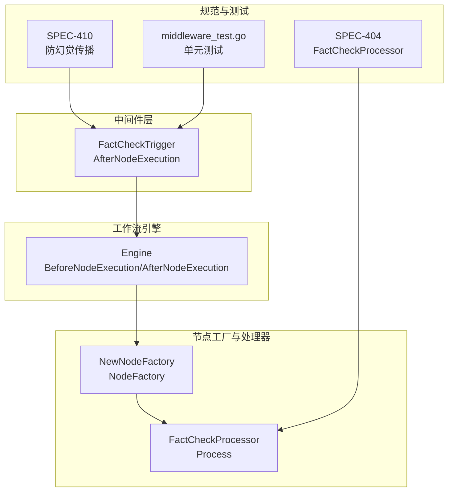
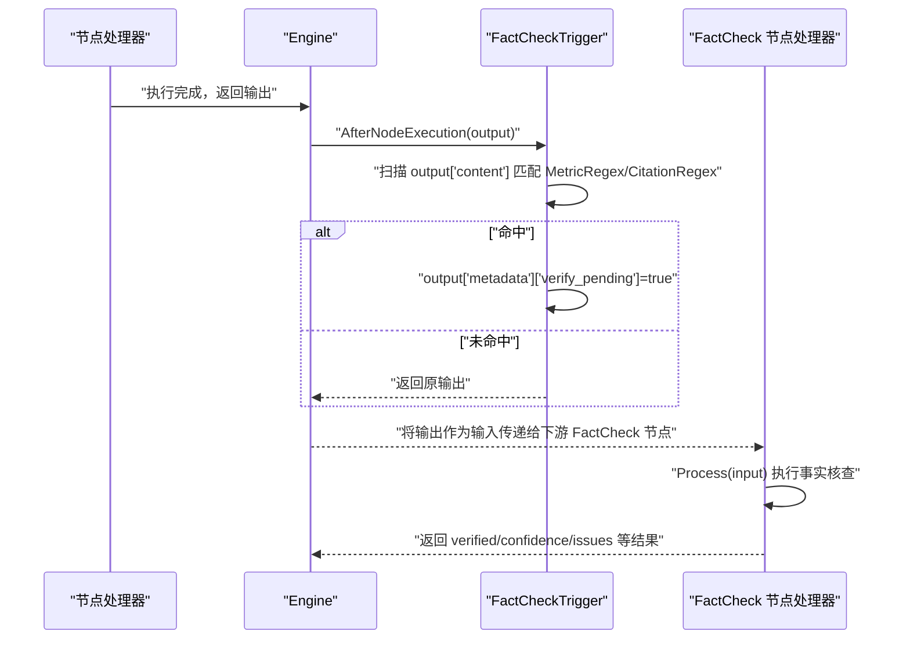
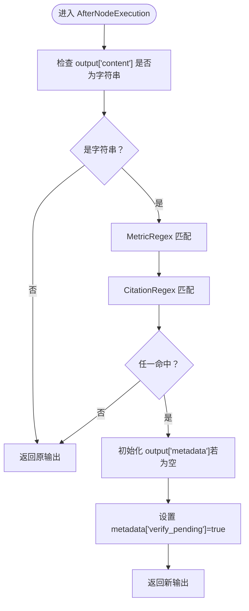
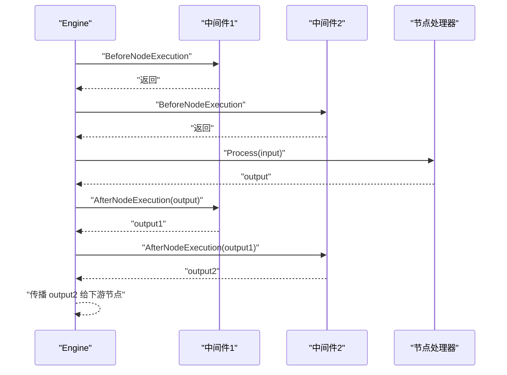
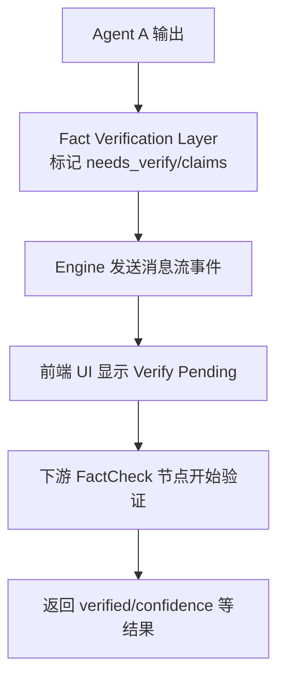
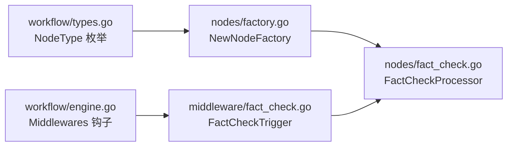

# 中间件触发机制

<cite>
**本文引用的文件**
- [internal/core/middleware/fact_check.go](file://internal/core/middleware/fact_check.go)
- [internal/core/workflow/engine.go](file://internal/core/workflow/engine.go)
- [internal/core/workflow/types.go](file://internal/core/workflow/types.go)
- [internal/core/workflow/nodes/factory.go](file://internal/core/workflow/nodes/factory.go)
- [internal/core/workflow/nodes/fact_check.go](file://internal/core/workflow/nodes/fact_check.go)
- [docs/specs/backend/SPEC-410-anti-hallucination.md](file://docs/specs/backend/SPEC-410-anti-hallucination.md)
- [docs/specs/backend/SPEC-404-factcheck-processor.md](file://docs/specs/backend/SPEC-404-factcheck-processor.md)
- [internal/core/middleware/middleware_test.go](file://internal/core/middleware/middleware_test.go)
</cite>

## 目录
1. [引言](#引言)
2. [项目结构](#项目结构)
3. [核心组件](#核心组件)
4. [架构总览](#架构总览)
5. [详细组件分析](#详细组件分析)
6. [依赖关系分析](#依赖关系分析)
7. [性能考量](#性能考量)
8. [故障排查指南](#故障排查指南)
9. [结论](#结论)

## 引言
本文件系统化阐述反幻觉中间件在事实核查流程中的触发机制，重点围绕 FactCheckTrigger 结构体的正则表达式匹配策略展开，解释 MetricRegex 和 CitationRegex 如何识别待验证声明；说明在 AfterNodeExecution 钩子中如何检测输出内容并标记 verify_pending 元数据；结合 SPEC-410 规范，描述该机制如何与事实核查节点形成闭环，实现自动化的验证请求触发；同时讨论当前实现的局限性（基于规则的简单匹配）与未来改进方向（语义相似度检测），并提供调试指南，帮助定位中间件触发日志与验证元数据传播路径。

## 项目结构
围绕“反幻觉中间件触发机制”，本次分析聚焦以下模块：
- 中间件层：FactCheckTrigger 定义于中间件包，负责在节点执行后扫描输出并注入 verify_pending 标记。
- 工作流引擎：Engine 在节点执行前后调用中间件钩子，串联中间件与节点处理器。
- 节点工厂与处理器：FactCheck 节点由工厂创建，节点处理器负责实际的事实核查逻辑。
- 规范文档：SPEC-410 与 SPEC-404 描述了事实核查层的预期行为与与中间件的集成方式。



图表来源
- [internal/core/middleware/fact_check.go](file://internal/core/middleware/fact_check.go#L1-L52)
- [internal/core/workflow/engine.go](file://internal/core/workflow/engine.go#L92-L120)
- [internal/core/workflow/nodes/factory.go](file://internal/core/workflow/nodes/factory.go#L78-L87)
- [internal/core/workflow/nodes/fact_check.go](file://internal/core/workflow/nodes/fact_check.go#L20-L113)
- [docs/specs/backend/SPEC-410-anti-hallucination.md](file://docs/specs/backend/SPEC-410-anti-hallucination.md#L1-L157)
- [docs/specs/backend/SPEC-404-factcheck-processor.md](file://docs/specs/backend/SPEC-404-factcheck-processor.md#L1-L79)
- [internal/core/middleware/middleware_test.go](file://internal/core/middleware/middleware_test.go#L24-L39)

章节来源
- [internal/core/middleware/fact_check.go](file://internal/core/middleware/fact_check.go#L1-L52)
- [internal/core/workflow/engine.go](file://internal/core/workflow/engine.go#L92-L120)
- [internal/core/workflow/nodes/factory.go](file://internal/core/workflow/nodes/factory.go#L78-L87)
- [docs/specs/backend/SPEC-410-anti-hallucination.md](file://docs/specs/backend/SPEC-410-anti-hallucination.md#L1-L157)
- [docs/specs/backend/SPEC-404-factcheck-processor.md](file://docs/specs/backend/SPEC-404-factcheck-processor.md#L1-L79)
- [internal/core/middleware/middleware_test.go](file://internal/core/middleware/middleware_test.go#L24-L39)

## 核心组件
- FactCheckTrigger：定义两个正则表达式字段 MetricRegex 与 CitationRegex，用于在 AfterNodeExecution 钩子中扫描输出内容，命中即为该输出打上 verify_pending 元数据标记。
- Engine：在节点执行前调用 BeforeNodeExecution，执行后调用 AfterNodeExecution，遍历 Middlewares 并将输出传递给每个中间件进行后处理。
- FactCheck 节点处理器：由工厂根据节点类型创建，负责对声明进行搜索与 LLM 判定，最终输出 verified、confidence、issues 等结果。
- 规范文档：SPEC-410 描述了事实核查层的预期行为与与下游 FactCheck 节点的集成方式；SPEC-404 描述了 FactCheckProcessor 的数据结构与处理流程。

章节来源
- [internal/core/middleware/fact_check.go](file://internal/core/middleware/fact_check.go#L1-L52)
- [internal/core/workflow/engine.go](file://internal/core/workflow/engine.go#L92-L120)
- [internal/core/workflow/nodes/factory.go](file://internal/core/workflow/nodes/factory.go#L78-L87)
- [docs/specs/backend/SPEC-410-anti-hallucination.md](file://docs/specs/backend/SPEC-410-anti-hallucination.md#L1-L157)
- [docs/specs/backend/SPEC-404-factcheck-processor.md](file://docs/specs/backend/SPEC-404-factcheck-processor.md#L1-L79)

## 架构总览
下图展示了从节点执行到中间件触发再到事实核查节点的完整闭环：



图表来源
- [internal/core/workflow/engine.go](file://internal/core/workflow/engine.go#L92-L120)
- [internal/core/middleware/fact_check.go](file://internal/core/middleware/fact_check.go#L31-L51)
- [internal/core/workflow/nodes/fact_check.go](file://internal/core/workflow/nodes/fact_check.go#L20-L113)

## 详细组件分析

### FactCheckTrigger：正则匹配与 verify_pending 标记
- 结构体字段
  - MetricRegex：用于识别数值类指标（例如百分比、金额等）。
  - CitationRegex：用于识别外部引用或来源标注。
- 初始化
  - NewFactCheckTrigger 返回带有预编译正则的实例，便于高效匹配。
- 钩子行为
  - AfterNodeExecution：读取 output["content"] 字段，若命中任一正则，则在 output["metadata"] 中设置 verify_pending=true，从而为后续事实核查节点提供触发信号。
  - BeforeNodeExecution：当前实现为空操作，保留扩展空间。
- 测试覆盖
  - middleware_test.go 对 AfterNodeExecution 的行为进行了验证，确保命中后 metadata 中出现 verify_pending 标记。



图表来源
- [internal/core/middleware/fact_check.go](file://internal/core/middleware/fact_check.go#L31-L51)
- [internal/core/middleware/middleware_test.go](file://internal/core/middleware/middleware_test.go#L24-L39)

章节来源
- [internal/core/middleware/fact_check.go](file://internal/core/middleware/fact_check.go#L1-L52)
- [internal/core/middleware/middleware_test.go](file://internal/core/middleware/middleware_test.go#L24-L39)

### 工作流引擎：中间件钩子调用链
- BeforeNodeExecution：按顺序调用每个中间件的 BeforeNodeExecution，可用于前置拦截或限流。
- 执行节点处理器：获取 NodeFactory 创建的处理器并执行，返回输出。
- AfterNodeExecution：按顺序调用每个中间件的 AfterNodeExecution，将上一步输出作为输入传入，中间件可修改输出并继续向下游传播。
- 错误处理：若中间件抛错，引擎会发出错误事件并终止当前节点执行。



图表来源
- [internal/core/workflow/engine.go](file://internal/core/workflow/engine.go#L92-L120)

章节来源
- [internal/core/workflow/engine.go](file://internal/core/workflow/engine.go#L92-L120)

### 节点工厂与 FactCheck 节点处理器
- 节点工厂
  - NewNodeFactory 根据节点类型创建对应处理器，FactCheck 节点使用默认 LLM Provider，并读取 verify_threshold 作为阈值。
- FactCheck 节点处理器
  - Process：从输入聚合文本，调用搜索客户端获取检索摘要，再通过 LLM 生成判定，最终输出 verified、confidence、issues、search_summary 等字段，并发出 node_state_change 事件。

```mermaid
classDiagram
class FactCheckTrigger {
+MetricRegex
+CitationRegex
+Name() string
+BeforeNodeExecution(...)
+AfterNodeExecution(...)
}
class Engine {
+Middlewares []Middleware
+BeforeNodeExecution(...)
+AfterNodeExecution(...)
}
class FactCheckProcessor {
+Process(ctx,input,stream) map[string]interface{}
}
Engine --> FactCheckTrigger : "调用钩子"
Engine --> FactCheckProcessor : "创建并执行"
```

图表来源
- [internal/core/middleware/fact_check.go](file://internal/core/middleware/fact_check.go#L1-L52)
- [internal/core/workflow/engine.go](file://internal/core/workflow/engine.go#L92-L120)
- [internal/core/workflow/nodes/factory.go](file://internal/core/workflow/nodes/factory.go#L78-L87)
- [internal/core/workflow/nodes/fact_check.go](file://internal/core/workflow/nodes/fact_check.go#L20-L113)

章节来源
- [internal/core/workflow/nodes/factory.go](file://internal/core/workflow/nodes/factory.go#L78-L87)
- [internal/core/workflow/nodes/fact_check.go](file://internal/core/workflow/nodes/fact_check.go#L20-L113)

### 与 SPEC-410 的闭环设计
- SPEC-410 描述了“事实核查层”在 Agent 输出到 Agent 输入之间的传播，对关键数据自动标记“Verify Pending”。该规范还定义了 VerificationResult 与 Claim 的结构，以及前端如何高亮未验证声明。
- 当中间件命中后，verify_pending 元数据被注入；下游 FactCheck 节点读取该元数据并执行核查，形成从“规则触发”到“节点验证”的闭环。



图表来源
- [docs/specs/backend/SPEC-410-anti-hallucination.md](file://docs/specs/backend/SPEC-410-anti-hallucination.md#L1-L157)
- [internal/core/middleware/fact_check.go](file://internal/core/middleware/fact_check.go#L31-L51)
- [internal/core/workflow/nodes/fact_check.go](file://internal/core/workflow/nodes/fact_check.go#L20-L113)

章节来源
- [docs/specs/backend/SPEC-410-anti-hallucination.md](file://docs/specs/backend/SPEC-410-anti-hallucination.md#L1-L157)

### 与 SPEC-404 的事实核查节点对接
- SPEC-404 定义了 FactCheckProcessor 的数据结构与处理流程，强调从输入提取声明、搜索验证、LLM 分析与汇总结果。
- 中间件触发与节点处理的衔接点在于：中间件负责“标记”，节点负责“验证”。两者配合实现自动化验证请求触发。

章节来源
- [docs/specs/backend/SPEC-404-factcheck-processor.md](file://docs/specs/backend/SPEC-404-factcheck-processor.md#L1-L79)

## 依赖关系分析
- 中间件接口
  - Middleware 接口定义了 Name、BeforeNodeExecution、AfterNodeExecution 三个方法，Engine 通过 Middlewares 字段持有中间件列表并在执行前后依次调用。
- 节点类型与工厂
  - NodeType 枚举包含 "fact_check"；NodeFactory 根据类型创建 FactCheckProcessor，并注入 LLM Provider 与 verify_threshold。
- 规范与实现一致性
  - SPEC-410 的“needs_verify/claims”与中间件的 verify_pending 元数据在概念上一致，均用于指示后续节点应进行核查。



图表来源
- [internal/core/workflow/types.go](file://internal/core/workflow/types.go#L25-L41)
- [internal/core/workflow/nodes/factory.go](file://internal/core/workflow/nodes/factory.go#L78-L87)
- [internal/core/workflow/nodes/fact_check.go](file://internal/core/workflow/nodes/fact_check.go#L20-L113)
- [internal/core/workflow/engine.go](file://internal/core/workflow/engine.go#L92-L120)
- [internal/core/middleware/fact_check.go](file://internal/core/middleware/fact_check.go#L1-L52)

章节来源
- [internal/core/workflow/types.go](file://internal/core/workflow/types.go#L25-L41)
- [internal/core/workflow/nodes/factory.go](file://internal/core/workflow/nodes/factory.go#L78-L87)
- [internal/core/workflow/engine.go](file://internal/core/workflow/engine.go#L92-L120)

## 性能考量
- 正则匹配成本
  - MetricRegex 与 CitationRegex 为预编译正则，匹配开销主要取决于输出内容长度与匹配次数。建议在中间件初始化时复用已编译的正则对象，避免重复编译。
- 中间件链路
  - AfterNodeExecution 会在每个中间件上串行执行，若中间件数量较多，应关注整体延迟。可通过减少不必要的中间件或优化中间件内部逻辑降低开销。
- 节点处理
  - FactCheck 节点涉及外部搜索与 LLM 调用，属于 IO 密集型任务。建议在节点内部对搜索失败与 LLM 解析失败进行降级处理，保证工作流不中断。

[本节为通用性能建议，不直接分析具体文件]

## 故障排查指南
- 中间件未触发
  - 检查 AfterNodeExecution 是否被调用：查看 Engine 的 AfterNodeExecution 调用链是否正常执行。
  - 检查 output["content"] 是否存在且为字符串：若非字符串或缺失，中间件不会进行正则匹配。
  - 检查正则是否正确初始化：确认 MetricRegex 与 CitationRegex 已在 NewFactCheckTrigger 中预编译。
- verify_pending 未出现
  - 确认命中条件：只有当 MetricRegex 或 CitationRegex 任一匹配成功才会设置 verify_pending。
  - 确认 metadata 初始化：若 output["metadata"] 不存在，中间件会新建空 map 再写入 verify_pending。
- 事实核查节点未执行
  - 确认下游节点类型为 "fact_check"，且 NodeFactory 能正确创建 FactCheckProcessor。
  - 确认 verify_threshold 配置正确，FactCheck 节点会据此决定整体通过与否。
- 单元测试参考
  - middleware_test.go 中包含针对 AfterNodeExecution 的断言，可对照其用例定位问题。

章节来源
- [internal/core/middleware/fact_check.go](file://internal/core/middleware/fact_check.go#L31-L51)
- [internal/core/middleware/middleware_test.go](file://internal/core/middleware/middleware_test.go#L24-L39)
- [internal/core/workflow/engine.go](file://internal/core/workflow/engine.go#L92-L120)
- [internal/core/workflow/nodes/factory.go](file://internal/core/workflow/nodes/factory.go#L78-L87)

## 结论
- 当前实现以规则驱动的方式在 AfterNodeExecution 钩子中扫描输出内容，命中 MetricRegex 或 CitationRegex 即注入 verify_pending 元数据，为下游 FactCheck 节点提供自动触发信号。
- 该机制与 SPEC-410 的“事实核查层”理念一致，形成从规则触发到节点验证的闭环。
- 局限性
  - 基于规则的简单匹配可能漏检或误报，无法覆盖复杂语义场景。
- 改进建议
  - 引入语义相似度检测，对声明进行更细粒度的识别与分类，提升准确性。
  - 将正则规则抽象为可配置的模式集合，支持动态更新与灰度发布。
  - 在中间件中引入缓存与去重策略，避免重复标记与重复验证。

[本节为总结性内容，不直接分析具体文件]