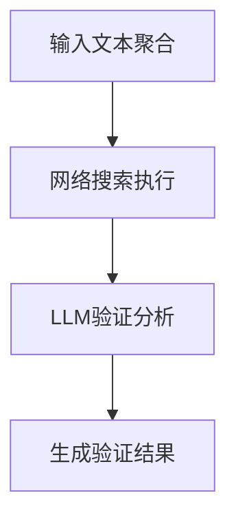

# 事实核查实现机制

<cite>
**本文档引用文件**  
- [fact_check.go](file://internal/core/workflow/nodes/fact_check.go#L1-L114)
- [llm.go](file://internal/infrastructure/llm/llm.go#L7-L41)
- [tavily.go](file://internal/infrastructure/search/tavily.go#L14-L41)
- [types.go](file://internal/core/workflow/types.go#L8-L18)
- [context.go](file://internal/core/workflow/context.go#L8-L14)
- [factory.go](file://internal/core/workflow/nodes/factory.go#L78-L87)
- [config.go](file://internal/pkg/config/config.go#L28-L33)
- [FactCheckNodeForm.tsx](file://frontend/src/features/editor/components/PropertyPanel/NodeForms/FactCheckNodeForm.tsx#L27-L30)
</cite>

## 目录
1. [核心组件](#核心组件)
2. [三阶段处理流程](#三阶段处理流程)
3. [节点状态事件推送](#节点状态事件推送)
4. [优雅降级策略](#优雅降级策略)
5. [LLM提示词设计](#llm提示词设计)
6. [可信度评分机制](#可信度评分机制)
7. [输入输出结构](#输入输出结构)

## 核心组件

事实核查节点的核心实现由`FactCheckProcessor`结构体驱动，该结构体包含三个关键字段：`LLM`、`SearchClient`和`VerifyThreshold`。`LLM`字段实现了`LLMProvider`接口，负责调用大语言模型进行验证分析；`SearchClient`字段实现了`SearchClient`接口，用于执行网络搜索获取外部信息；`VerifyThreshold`字段定义了验证的置信度阈值。这三个组件协同工作，形成了从信息检索到智能验证的完整闭环。

**核心组件来源**
- [fact_check.go](file://internal/core/workflow/nodes/fact_check.go#L14-L18)
- [llm.go](file://internal/infrastructure/llm/llm.go#L35-L41)
- [tavily.go](file://internal/infrastructure/search/tavily.go#L14-L17)

## 三阶段处理流程

`Process`方法的执行分为三个清晰的阶段：输入文本聚合、网络搜索执行与结果摘要生成、LLM验证与可信度评分。第一阶段遍历输入映射，将所有字符串值聚合为待验证文本；第二阶段调用搜索客户端获取网络搜索结果，并构建结构化摘要；第三阶段利用LLM对文本进行验证分析，生成结构化验证结果。

**流程图来源**
- [fact_check.go](file://internal/core/workflow/nodes/fact_check.go#L27-L63)

## 节点状态事件推送

事实核查节点通过`stream`通道实时推送节点状态变更事件。在处理开始时，推送"running"状态事件；在处理完成时，推送"completed"状态事件。这种实时事件推送机制使前端能够及时更新节点执行状态，提供良好的用户体验。

**节点状态事件来源**
- [fact_check.go](file://internal/core/workflow/nodes/fact_check.go#L20-L25)
- [context.go](file://internal/core/workflow/context.go#L8-L14)
- [types.go](file://internal/core/workflow/types.go#L8-L18)

## 优雅降级策略

当搜索失败时，系统采用优雅降级策略，不会中断整个处理流程。具体实现是在搜索出现错误时，向流通道推送错误事件，同时将搜索结果设置为"[Search unavailable]"占位符，确保后续LLM验证阶段仍能继续执行。这种设计保证了系统的健壮性和可用性。

**优雅降级策略来源**
- [fact_check.go](file://internal/core/workflow/nodes/fact_check.go#L42-L49)

## LLM提示词设计

LLM提示词设计精心构造，引导模型输出结构化JSON验证结果。提示词包含待验证文本和网络搜索结果，明确要求模型分析文本准确性，并以特定JSON格式输出验证结果，包括`verified`、`confidence`和`issues`三个字段。这种结构化输出便于后续程序化处理和分析。

**LLM提示词设计来源**
- [fact_check.go](file://internal/core/workflow/nodes/fact_check.go#L66-L74)

## 可信度评分机制

`confidence`字段的默认值设定逻辑体现了系统的智能判断。当LLM成功响应且未发现明显问题时，默认置信度为0.9；当LLM标记潜在不准确时，置信度降为0.7。这种分级置信度机制反映了系统对验证结果的不确定性评估，为后续决策提供重要参考。

**可信度评分机制来源**
- [fact_check.go](file://internal/core/workflow/nodes/fact_check.go#L76-L94)
- [config.go](file://internal/pkg/config/config.go#L28-L33)

## 输入输出结构

输入数据通过遍历映射对象被转换为待验证文本，所有字符串值被聚合处理。最终输出结果包含`verified`、`confidence`、`issues`、`search_summary`和`timestamp`等字段，形成完整的验证报告。这种结构化输出便于前端展示和后续处理。

**输入输出结构来源**
- [fact_check.go](file://internal/core/workflow/nodes/fact_check.go#L28-L33)
- [fact_check.go](file://internal/core/workflow/nodes/fact_check.go#L98-L104)
- [FactCheckNodeForm.tsx](file://frontend/src/features/editor/components/PropertyPanel/NodeForms/FactCheckNodeForm.tsx#L27-L30)