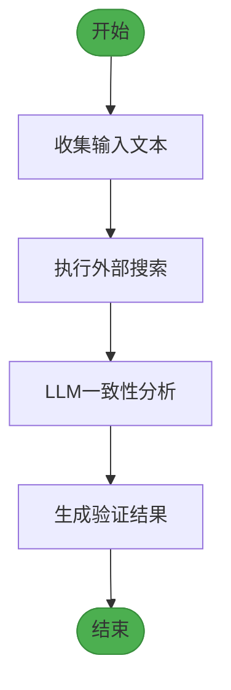
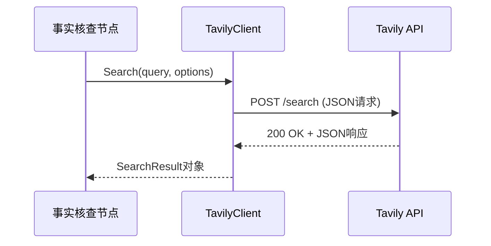
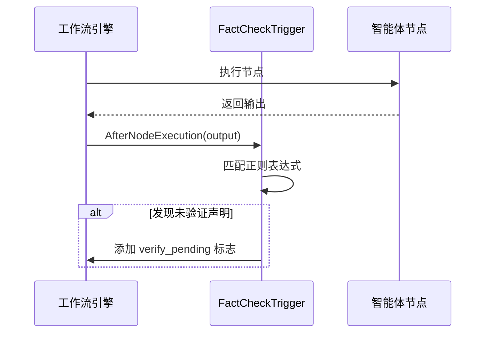
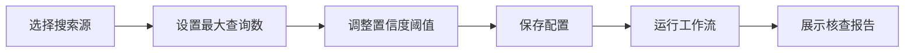

# 事实核查节点

<cite>
**本文档中引用的文件**  
- [fact_check.go](file://internal/core/workflow/nodes/fact_check.go)
- [fact_check_test.go](file://internal/core/workflow/nodes/fact_check_test.go)
- [middleware/fact_check.go](file://internal/core/middleware/fact_check.go)
- [tavily.go](file://internal/infrastructure/search/tavily.go)
- [FactCheckNodeForm.tsx](file://frontend/src/features/editor/components/PropertyPanel/NodeForms/FactCheckNodeForm.tsx)
- [workflow.ts](file://frontend/src/types/workflow.ts)
- [SPEC-404-factcheck-processor.md](file://docs/specs/backend/SPEC-404-factcheck-processor.md)
</cite>

## 目录
1. [引言](#引言)
2. [验证机制与可信度评估流程](#验证机制与可信度评估流程)
3. [外部搜索服务集成（Tavily）](#外部搜索服务集成tavily)
4. [引用标注、证据溯源与矛盾检测算法实现](#引用标注证据溯源与矛盾检测算法实现)
5. [中间件层协同机制](#中间件层协同机制)
6. [前端配置与报告展示](#前端配置与报告展示)
7. [误报/漏报问题调试指南](#误报漏报问题调试指南)

## 引言
事实核查节点是本系统中用于确保智能体输出内容准确性和可信度的核心组件。该节点依据SPEC-404规范设计，通过调用外部权威信息源进行交叉验证，并生成量化可信度评分。其主要功能包括：自动提取待验证声明、调用外部搜索引擎获取证据、利用大语言模型分析一致性、输出结构化核查结果，并通过中间件机制影响后续决策路径。本文档将深入解析其技术实现与工作流程。

## 验证机制与可信度评估流程
事实核查节点遵循一个三阶段验证流程：输入收集、外部验证和可信度判定。首先，节点从上游输入中聚合所有待验证的文本内容；其次，使用配置的搜索客户端（如Tavily）执行网络搜索以获取权威信息；最后，通过大语言模型（LLM）对比原始内容与搜索结果的一致性，生成最终的验证结论和置信度评分。



**图示来源**  
- [fact_check.go](file://internal/core/workflow/nodes/fact_check.go#L20-L114)

**本节来源**  
- [fact_check.go](file://internal/core/workflow/nodes/fact_check.go#L20-L114)
- [SPEC-404-factcheck-processor.md](file://docs/specs/backend/SPEC-404-factcheck-processor.md#L37-L75)

## 外部搜索服务集成（Tavily）
系统通过`TavilyClient`实现与Tavily搜索API的集成。该客户端封装了HTTP请求逻辑，支持高级搜索深度和直接答案提取。在事实核查过程中，系统会构造包含查询语句、最大结果数和搜索类型等参数的请求体，发送至Tavily API端点。返回结果包括直接答案和多个来源条目，每个条目包含标题、URL、内容摘要和相关性分数。



**图示来源**  
- [tavily.go](file://internal/infrastructure/search/tavily.go#L80-L143)
- [fact_check.go](file://internal/core/workflow/nodes/fact_check.go#L38-L63)

**本节来源**  
- [tavily.go](file://internal/infrastructure/search/tavily.go#L1-L154)
- [fact_check.go](file://internal/core/workflow/nodes/fact_check.go#L38-L63)

## 引用标注、证据溯源与矛盾检测算法实现
在`fact_check.go`中，系统实现了完整的证据处理逻辑。首先，从输入映射中提取所有字符串值作为待验证内容。然后，调用搜索服务获取结果并构建摘要。接着，构造专用提示词（prompt），要求LLM判断原始文本与搜索结果之间的一致性，并以JSON格式返回验证状态、置信度及问题列表。系统通过简单的字符串匹配解析LLM响应中的`"verified": false`字段来判定是否存在矛盾。

```mermaid
classDiagram
class FactCheckProcessor {
+LLM LLMProvider
+SearchClient SearchClient
+VerifyThreshold float64
+Process(ctx, input, stream) (map[string]interface{}, error)
}
class SearchResult {
+Query string
+Results []SearchItem
+Answer string
}
class SearchItem {
+Title string
+URL string
+Content string
+Score float64
}
class CompletionResponse {
+Content string
+Usage Usage
}
FactCheckProcessor --> SearchResult : "使用"
FactCheckProcessor --> CompletionResponse : "接收"
SearchResult --> SearchItem : "包含"
```

**图示来源**  
- [fact_check.go](file://internal/core/workflow/nodes/fact_check.go#L14-L114)
- [tavily.go](file://internal/infrastructure/search/tavily.go#L26-L39)
- [llm.go](file://internal/infrastructure/llm/llm.go#L24-L27)

**本节来源**  
- [fact_check.go](file://internal/core/workflow/nodes/fact_check.go#L65-L96)
- [fact_check_test.go](file://internal/core/workflow/nodes/fact_check_test.go#L13-L62)

## 中间件层协同机制
事实核查功能还通过`middleware/fact_check.go`中的`FactCheckTrigger`中间件与系统其他部分协同工作。该中间件在节点执行后扫描输出内容，若发现标记为`[Specific Metric]`或`[External Citation]`的未验证声明，则自动在元数据中添加`verify_pending: true`标志，触发后续的事实核查流程。这种机制确保了对潜在幻觉内容的主动检测，增强了系统的防御能力。



**图示来源**  
- [middleware/fact_check.go](file://internal/core/middleware/fact_check.go#L31-L52)
- [engine.go](file://internal/core/workflow/engine.go#L113-L120)

**本节来源**  
- [middleware/fact_check.go](file://internal/core/middleware/fact_check.go#L10-L53)
- [engine.go](file://internal/core/workflow/engine.go#L93-L120)

## 前端配置与报告展示
前端通过`FactCheckNodeForm.tsx`组件提供用户友好的配置界面。用户可选择启用Tavily、Serper或本地知识库作为搜索源，设置最大查询数量（1-10），并调整置信度阈值（50%-100%）。这些配置项以滑块和复选框形式呈现，实时更新工作流节点数据。核查完成后，系统在报告中展示验证状态、置信度评分、搜索摘要及具体问题列表，帮助用户理解评估依据。



**图示来源**  
- [FactCheckNodeForm.tsx](file://frontend/src/features/editor/components/PropertyPanel/NodeForms/FactCheckNodeForm.tsx#L11-L87)
- [workflow.ts](file://frontend/src/types/workflow.ts#L27-L31)

**本节来源**  
- [FactCheckNodeForm.tsx](file://frontend/src/features/editor/components/PropertyPanel/NodeForms/FactCheckNodeForm.tsx#L1-L88)
- [workflow.ts](file://frontend/src/types/workflow.ts#L27-L31)

## 误报/漏报问题调试指南
当出现误报（False Positive）或漏报（False Negative）时，应按以下步骤排查：
1. **检查搜索服务状态**：确认Tavily API密钥已正确配置且服务可达。
2. **验证输入内容提取**：确保上游节点输出包含完整待验证文本。
3. **审查LLM提示词逻辑**：检查`fact_check.go`中构造的prompt是否清晰明确。
4. **调整置信度阈值**：根据实际场景微调`VerifyThreshold`参数。
5. **测试中间件触发条件**：确认`[Specific Metric]`等标记被正确识别。
6. **查看日志流**：通过`StreamEvent`监控节点执行状态和错误信息。

**本节来源**  
- [fact_check.go](file://internal/core/workflow/nodes/fact_check.go#L43-L47)
- [middleware/fact_check.go](file://internal/core/middleware/fact_check.go#L34-L35)
- [fact_check_test.go](file://internal/core/workflow/nodes/fact_check_test.go#L31-L62)