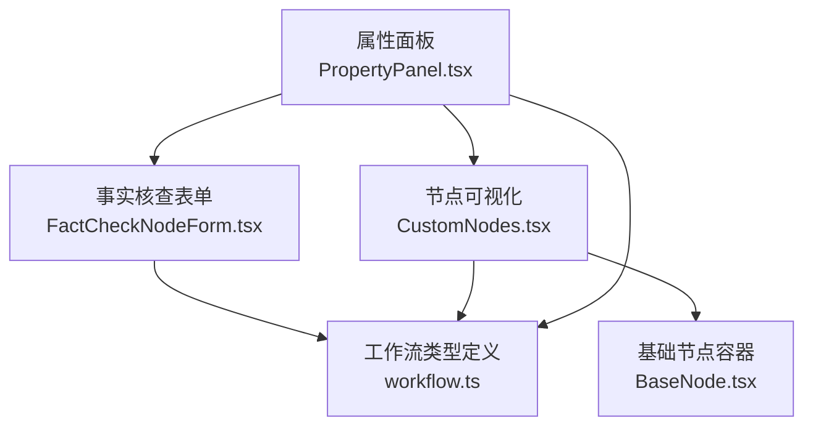
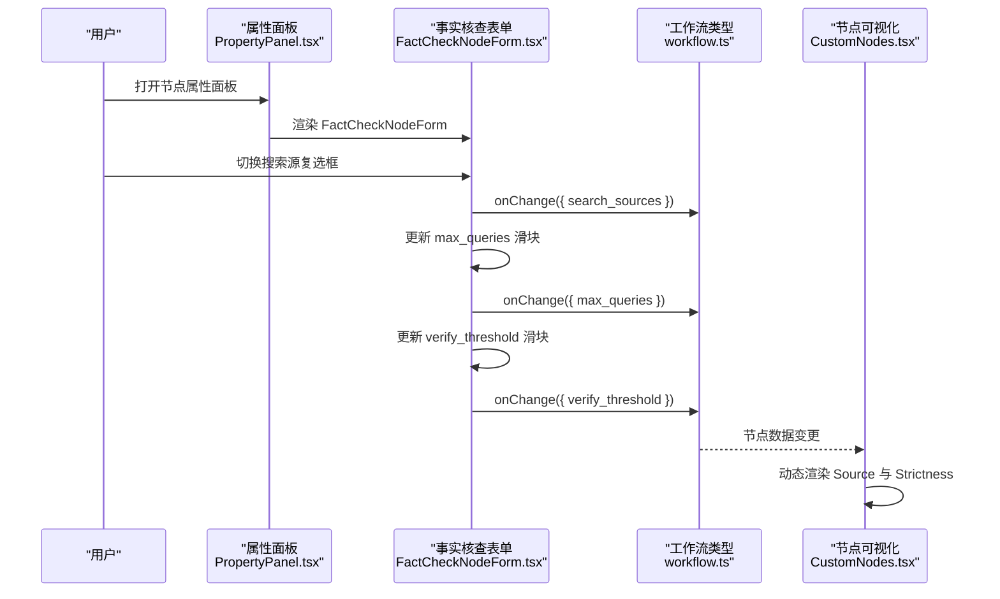
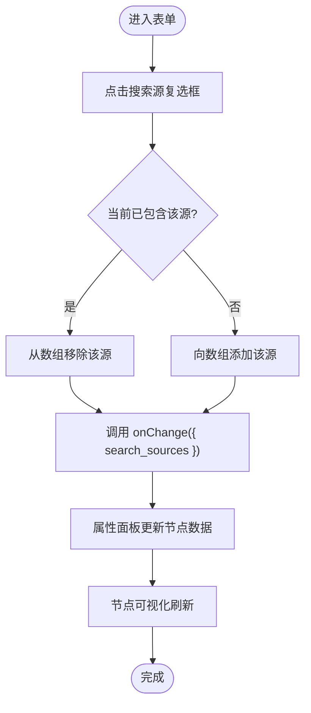
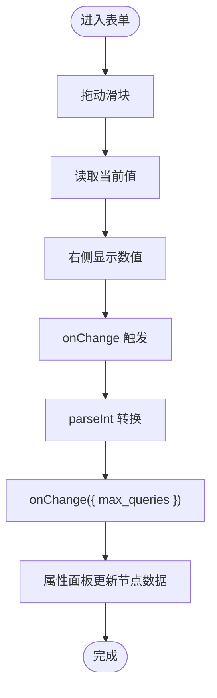
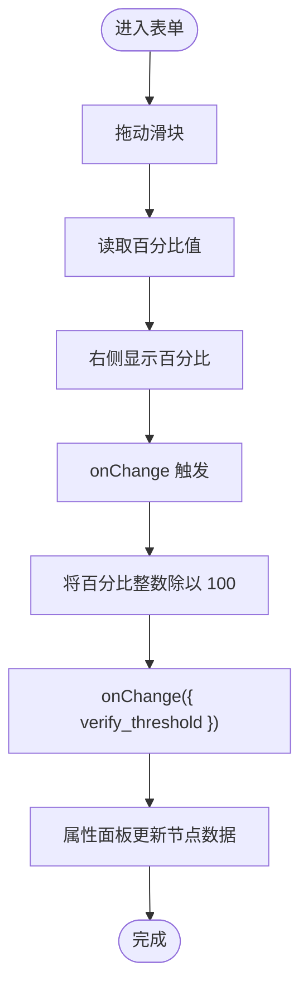
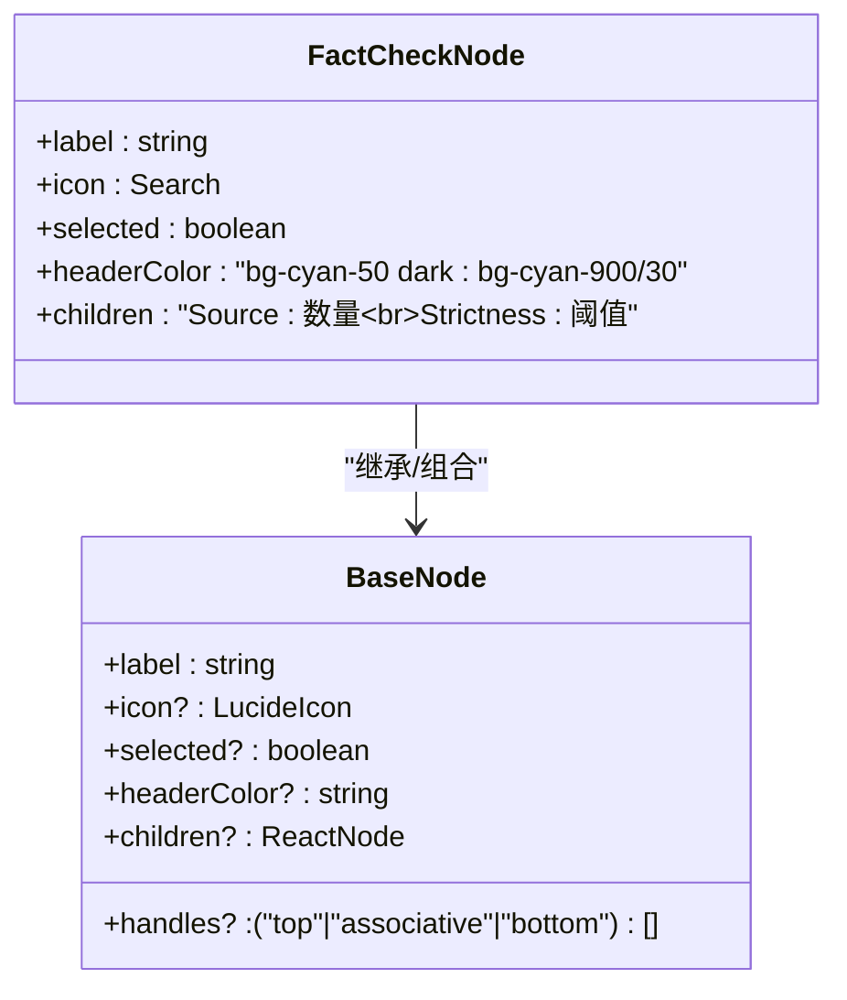
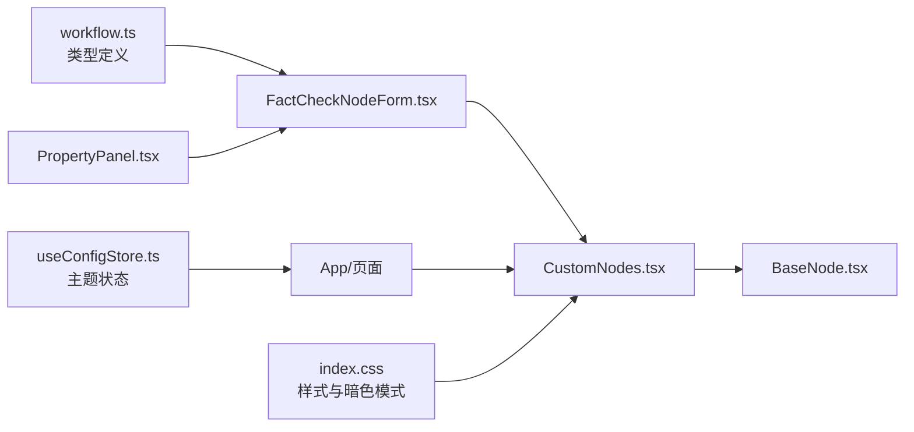

# 前端配置界面

<cite>
**本文引用的文件**
- [FactCheckNodeForm.tsx](file://frontend/src/features/editor/components/PropertyPanel/NodeForms/FactCheckNodeForm.tsx)
- [CustomNodes.tsx](file://frontend/src/components/workflow/nodes/CustomNodes.tsx)
- [PropertyPanel.tsx](file://frontend/src/features/editor/components/PropertyPanel/PropertyPanel.tsx)
- [workflow.ts](file://frontend/src/types/workflow.ts)
- [BaseNode.tsx](file://frontend/src/components/workflow/nodes/BaseNode.tsx)
- [index.css](file://frontend/src/index.css)
- [useConfigStore.ts](file://frontend/src/stores/useConfigStore.ts)
- [SPEC-203-factcheck-humanreview-nodes.md](file://docs/specs/sprint3/SPEC-203-factcheck-humanreview-nodes.md)
- [design_draft.md](file://docs/plans/design_draft.md)
</cite>

## 目录
1. [引言](#引言)
2. [项目结构](#项目结构)
3. [核心组件](#核心组件)
4. [架构总览](#架构总览)
5. [详细组件分析](#详细组件分析)
6. [依赖关系分析](#依赖关系分析)
7. [性能考虑](#性能考虑)
8. [故障排查指南](#故障排查指南)
9. [结论](#结论)
10. [附录](#附录)

## 引言
本文件围绕事实核查节点的前端配置界面进行系统化说明，重点覆盖以下方面：
- 搜索源选择器（tavily、serper、local_kb）的多选框实现与状态管理
- 最大查询数滑块（max_queries）与置信度阈值滑块（verify_threshold）的双向数据绑定、值转换与百分比显示逻辑
- CustomNodes.tsx 中 FactCheckNode 的可视化呈现，以及如何根据配置动态显示数据源数量与严格度级别
- UI/UX 设计考量：青色主题、图标选择、响应式布局
- 自定义主题扩展的指导建议

## 项目结构
事实核查节点的前端配置界面由三层协同构成：
- 属性面板（Property Panel）：承载各节点类型的配置表单
- 表单组件（FactCheckNodeForm）：具体节点的输入控件集合
- 节点可视化（CustomNodes）：在画布上以节点形式展示配置信息

图表来源
- [PropertyPanel.tsx](file://frontend/src/features/editor/components/PropertyPanel/PropertyPanel.tsx#L18-L41)
- [FactCheckNodeForm.tsx](file://frontend/src/features/editor/components/PropertyPanel/NodeForms/FactCheckNodeForm.tsx#L1-L88)
- [CustomNodes.tsx](file://frontend/src/components/workflow/nodes/CustomNodes.tsx#L76-L94)
- [workflow.ts](file://frontend/src/types/workflow.ts#L27-L31)
- [BaseNode.tsx](file://frontend/src/components/workflow/nodes/BaseNode.tsx#L1-L47)

章节来源
- [PropertyPanel.tsx](file://frontend/src/features/editor/components/PropertyPanel/PropertyPanel.tsx#L18-L41)
- [workflow.ts](file://frontend/src/types/workflow.ts#L27-L31)

## 核心组件
- 事实核查表单（FactCheckNodeForm）
  - 提供三个搜索源的多选框，支持勾选/取消
  - 提供最大查询数滑块（1-10）
  - 提供置信度阈值滑块（50-100），以百分比显示并转换为小数存储
- 节点可视化（CustomNodes.FactCheckNode）
  - 使用搜索图标作为节点图标
  - 头部使用青色系配色
  - 动态显示“Source: 数量”和“Strictness: 阈值”

章节来源
- [FactCheckNodeForm.tsx](file://frontend/src/features/editor/components/PropertyPanel/NodeForms/FactCheckNodeForm.tsx#L1-L88)
- [CustomNodes.tsx](file://frontend/src/components/workflow/nodes/CustomNodes.tsx#L76-L94)
- [workflow.ts](file://frontend/src/types/workflow.ts#L27-L31)

## 架构总览
从用户交互到数据持久化的整体流程如下：

图表来源
- [PropertyPanel.tsx](file://frontend/src/features/editor/components/PropertyPanel/PropertyPanel.tsx#L18-L41)
- [FactCheckNodeForm.tsx](file://frontend/src/features/editor/components/PropertyPanel/NodeForms/FactCheckNodeForm.tsx#L1-L88)
- [CustomNodes.tsx](file://frontend/src/components/workflow/nodes/CustomNodes.tsx#L76-L94)
- [workflow.ts](file://frontend/src/types/workflow.ts#L27-L31)

## 详细组件分析

### 搜索源选择器（多选框）实现与状态管理
- 数据模型
  - 类型定义包含 search_sources 字段，取值为三者之一的组合数组
- 控件实现
  - 三个 label+input 复选框分别对应 tavily、serper、local_kb
  - 点击切换时通过 handleSourceToggle 计算新数组并回调 onChange
- 状态管理
  - 表单接收 data 和 onChange，onChange 将部分字段回传给父组件 PropertyPanel
  - PropertyPanel 将更新后的数据合并到当前节点的 data 上

图表来源
- [FactCheckNodeForm.tsx](file://frontend/src/features/editor/components/PropertyPanel/NodeForms/FactCheckNodeForm.tsx#L11-L17)
- [PropertyPanel.tsx](file://frontend/src/features/editor/components/PropertyPanel/PropertyPanel.tsx#L29-L31)
- [workflow.ts](file://frontend/src/types/workflow.ts#L27-L31)

章节来源
- [FactCheckNodeForm.tsx](file://frontend/src/features/editor/components/PropertyPanel/NodeForms/FactCheckNodeForm.tsx#L11-L17)
- [PropertyPanel.tsx](file://frontend/src/features/editor/components/PropertyPanel/PropertyPanel.tsx#L29-L31)
- [workflow.ts](file://frontend/src/types/workflow.ts#L27-L31)

### 最大查询数滑块（max_queries）双向绑定
- 输入控件
  - type=range，min=1，max=10，step=1
  - 当前值来自 data.max_queries 或默认 3
- 显示逻辑
  - 右侧实时显示当前数值（monospace 字体）
- 双向绑定
  - onChange 将字符串转为整数后通过 onChange 回传
  - PropertyPanel 合并到节点 data，触发重渲染

图表来源
- [FactCheckNodeForm.tsx](file://frontend/src/features/editor/components/PropertyPanel/NodeForms/FactCheckNodeForm.tsx#L54-L67)
- [PropertyPanel.tsx](file://frontend/src/features/editor/components/PropertyPanel/PropertyPanel.tsx#L29-L31)

章节来源
- [FactCheckNodeForm.tsx](file://frontend/src/features/editor/components/PropertyPanel/NodeForms/FactCheckNodeForm.tsx#L54-L67)
- [PropertyPanel.tsx](file://frontend/src/features/editor/components/PropertyPanel/PropertyPanel.tsx#L29-L31)

### 置信度阈值滑块（verify_threshold）双向绑定与百分比显示
- 输入控件
  - type=range，min=50，max=100，step=5
  - 当前值来自 data.verify_threshold 或默认 0.7，显示为百分比
- 百分比显示
  - 右侧显示 Math.round(value*100)+'%'
- 双向绑定
  - onChange 接收百分比整数，转换为小数后通过 onChange 回传
  - PropertyPanel 合并到节点 data，触发重渲染

图表来源
- [FactCheckNodeForm.tsx](file://frontend/src/features/editor/components/PropertyPanel/NodeForms/FactCheckNodeForm.tsx#L70-L84)
- [PropertyPanel.tsx](file://frontend/src/features/editor/components/PropertyPanel/PropertyPanel.tsx#L29-L31)

章节来源
- [FactCheckNodeForm.tsx](file://frontend/src/features/editor/components/PropertyPanel/NodeForms/FactCheckNodeForm.tsx#L70-L84)
- [PropertyPanel.tsx](file://frontend/src/features/editor/components/PropertyPanel/PropertyPanel.tsx#L29-L31)

### 节点可视化（FactCheckNode）动态呈现
- 图标与主题
  - 使用搜索图标（Search）
  - 头部使用青色系背景色（cyan-50/dark:cyan-900/30）
- 动态信息
  - Source：显示 data.search_sources 的长度，若为空则显示“Auto”
  - Strictness：显示 data.verify_threshold 的值，默认 0.8

图表来源
- [CustomNodes.tsx](file://frontend/src/components/workflow/nodes/CustomNodes.tsx#L76-L94)
- [BaseNode.tsx](file://frontend/src/components/workflow/nodes/BaseNode.tsx#L1-L47)

章节来源
- [CustomNodes.tsx](file://frontend/src/components/workflow/nodes/CustomNodes.tsx#L76-L94)
- [BaseNode.tsx](file://frontend/src/components/workflow/nodes/BaseNode.tsx#L1-L47)

### UI/UX 设计考量与响应式布局
- 青色主题与图标
  - 节点头部采用青色系，符合事实核查“验证/核查”的语义
  - 使用搜索图标直观表达节点功能
- 百分比显示与可读性
  - 置信度阈值以百分比显示，便于快速理解
  - 数值采用等宽字体，提升对齐与可读性
- 响应式布局
  - 属性面板固定宽度并支持滚动，适配不同屏幕尺寸
  - 节点容器具备 Handle 支持，便于在画布中拖拽连接
- 主题与暗色模式
  - 通过全局主题状态控制明暗模式
  - 节点与控件均遵循暗色模式下的对比度与可读性

章节来源
- [CustomNodes.tsx](file://frontend/src/components/workflow/nodes/CustomNodes.tsx#L76-L94)
- [FactCheckNodeForm.tsx](file://frontend/src/features/editor/components/PropertyPanel/NodeForms/FactCheckNodeForm.tsx#L54-L84)
- [PropertyPanel.tsx](file://frontend/src/features/editor/components/PropertyPanel/PropertyPanel.tsx#L44-L54)
- [useConfigStore.ts](file://frontend/src/stores/useConfigStore.ts#L1-L35)
- [index.css](file://frontend/src/index.css#L1-L91)
- [design_draft.md](file://docs/plans/design_draft.md#L124-L131)

### 自定义主题扩展指导
- 颜色体系
  - 在现有青色主题基础上，可新增“验证成功/失败/警告”等状态色
  - 保持与暗色模式的对比度一致性
- 组件样式扩展
  - 通过 Tailwind 类名扩展节点头部颜色与边框
  - 为滑块控件增加自定义样式类，统一滑块外观
- 图标与语义
  - 保持图标与节点语义一致（例如“验证”场景使用检查/搜索类图标）
- 响应式与无障碍
  - 确保触摸目标尺寸与间距满足移动端可用性
  - 为滑块与复选框提供清晰的键盘导航与屏幕阅读器支持

章节来源
- [index.css](file://frontend/src/index.css#L1-L91)
- [design_draft.md](file://docs/plans/design_draft.md#L124-L131)

## 依赖关系分析
- 组件耦合
  - FactCheckNodeForm 依赖 workflow.ts 中的类型定义
  - PropertyPanel 根据节点类型分发到对应表单
  - CustomNodes 依赖 BaseNode 进行统一渲染
- 数据流向
  - 用户输入 -> 表单 onChange -> PropertyPanel 合并 -> 节点数据更新 -> 可视化刷新
- 外观与主题
  - 节点头部颜色、图标与暗色模式由全局主题与样式文件共同决定

图表来源
- [workflow.ts](file://frontend/src/types/workflow.ts#L27-L31)
- [PropertyPanel.tsx](file://frontend/src/features/editor/components/PropertyPanel/PropertyPanel.tsx#L18-L41)
- [FactCheckNodeForm.tsx](file://frontend/src/features/editor/components/PropertyPanel/NodeForms/FactCheckNodeForm.tsx#L1-L88)
- [CustomNodes.tsx](file://frontend/src/components/workflow/nodes/CustomNodes.tsx#L76-L94)
- [BaseNode.tsx](file://frontend/src/components/workflow/nodes/BaseNode.tsx#L1-L47)
- [useConfigStore.ts](file://frontend/src/stores/useConfigStore.ts#L1-L35)
- [index.css](file://frontend/src/index.css#L1-L91)

章节来源
- [workflow.ts](file://frontend/src/types/workflow.ts#L27-L31)
- [PropertyPanel.tsx](file://frontend/src/features/editor/components/PropertyPanel/PropertyPanel.tsx#L18-L41)
- [CustomNodes.tsx](file://frontend/src/components/workflow/nodes/CustomNodes.tsx#L76-L94)
- [BaseNode.tsx](file://frontend/src/components/workflow/nodes/BaseNode.tsx#L1-L47)
- [useConfigStore.ts](file://frontend/src/stores/useConfigStore.ts#L1-L35)
- [index.css](file://frontend/src/index.css#L1-L91)

## 性能考虑
- 表单渲染
  - 使用受控组件，避免不必要的重渲染
  - 滑块与复选框的 onChange 仅传递必要字段，减少父组件合并成本
- 节点渲染
  - CustomNodes 仅在 data 变更时重新渲染，避免频繁计算
- 主题切换
  - 通过全局主题状态切换，避免在每个节点内重复判断

[本节为通用性能建议，不直接分析具体文件]

## 故障排查指南
- 搜索源未生效
  - 检查 handleSourceToggle 是否正确返回新的 search_sources 数组
  - 确认 PropertyPanel 的 onUpdate 是否将变更合并到节点 data
- 滑块值异常
  - max_queries：确认 onChange 中的 parseInt 是否正确
  - verify_threshold：确认百分比到小数的转换是否按预期执行
- 可视化不更新
  - 确认节点 data 的 search_sources 与 verify_threshold 是否被正确传入
  - 检查 CustomNodes 中的默认值与空值处理逻辑

章节来源
- [FactCheckNodeForm.tsx](file://frontend/src/features/editor/components/PropertyPanel/NodeForms/FactCheckNodeForm.tsx#L11-L17)
- [PropertyPanel.tsx](file://frontend/src/features/editor/components/PropertyPanel/PropertyPanel.tsx#L29-L31)
- [CustomNodes.tsx](file://frontend/src/components/workflow/nodes/CustomNodes.tsx#L76-L94)

## 结论
事实核查节点的前端配置界面以简洁直观为核心目标：通过多选框明确表达搜索源选择，通过滑块提供可感知的阈值调节，并在节点可视化中以“Source 数量”和“Strictness 阈值”直观反馈配置。配合青色主题与搜索图标，既强化了语义也提升了可读性。整体实现遵循受控组件与类型安全的设计原则，便于维护与扩展。

[本节为总结性内容，不直接分析具体文件]

## 附录
- 规范参考
  - 事实核查节点 UI 规范与属性定义参见设计规范文档
- 相关文件路径
  - 表单组件：frontend/src/features/editor/components/PropertyPanel/NodeForms/FactCheckNodeForm.tsx
  - 节点可视化：frontend/src/components/workflow/nodes/CustomNodes.tsx
  - 属性面板：frontend/src/features/editor/components/PropertyPanel/PropertyPanel.tsx
  - 类型定义：frontend/src/types/workflow.ts
  - 基础节点容器：frontend/src/components/workflow/nodes/BaseNode.tsx
  - 主题状态：frontend/src/stores/useConfigStore.ts
  - 样式与暗色模式：frontend/src/index.css
  - 设计蓝图与响应式策略：docs/plans/design_draft.md
  - 规范文档：docs/specs/sprint3/SPEC-203-factcheck-humanreview-nodes.md