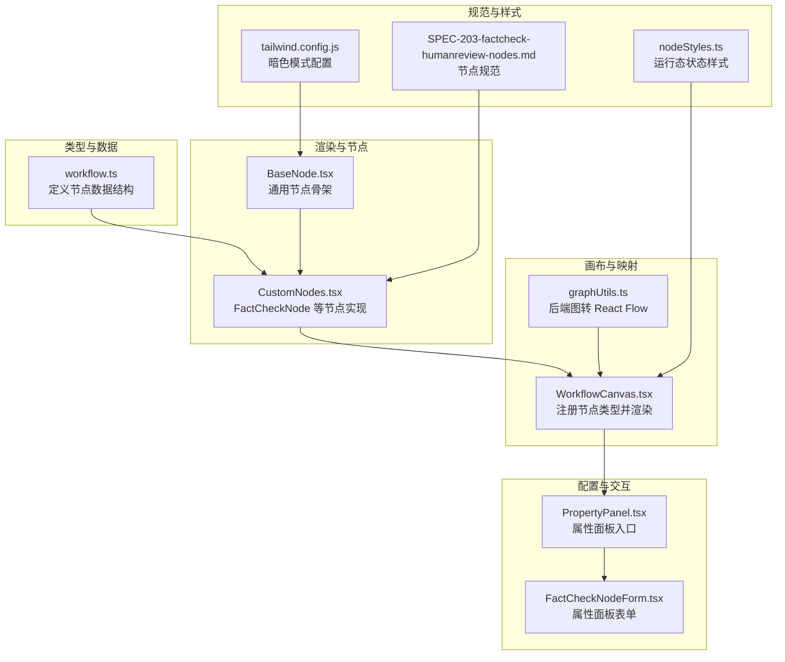
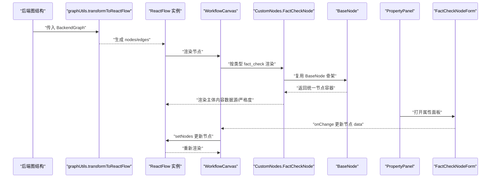
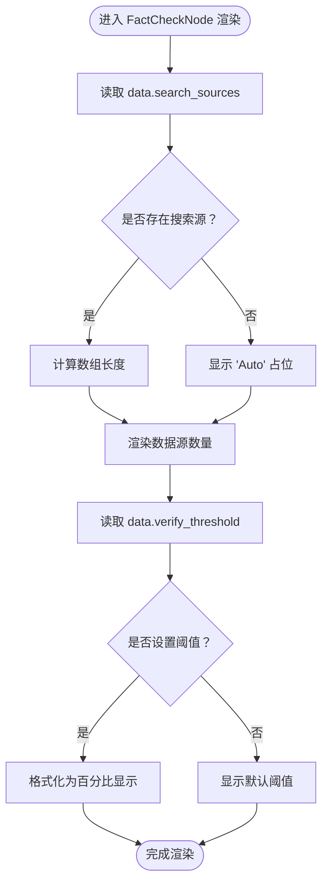
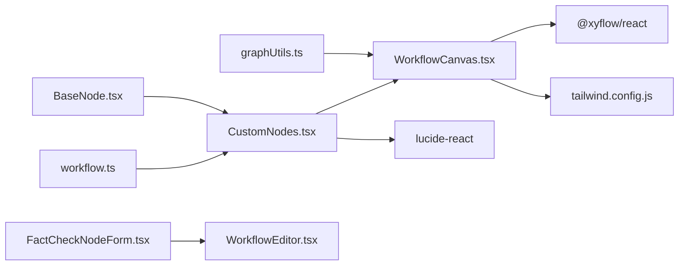

# 节点可视化呈现

<cite>
**本文引用的文件**
- [CustomNodes.tsx](file://frontend/src/components/workflow/nodes/CustomNodes.tsx)
- [BaseNode.tsx](file://frontend/src/components/workflow/nodes/BaseNode.tsx)
- [WorkflowCanvas.tsx](file://frontend/src/components/workflow/WorkflowCanvas.tsx)
- [graphUtils.ts](file://frontend/src/utils/graphUtils.ts)
- [workflow.ts](file://frontend/src/types/workflow.ts)
- [FactCheckNodeForm.tsx](file://frontend/src/features/editor/components/PropertyPanel/NodeForms/FactCheckNodeForm.tsx)
- [SPEC-203-factcheck-humanreview-nodes.md](file://docs/specs/sprint3/SPEC-203-factcheck-humanreview-nodes.md)
- [nodeStyles.ts](file://frontend/src/utils/nodeStyles.ts)
- [tailwind.config.js](file://frontend/tailwind.config.js)
</cite>

## 目录
1. [引言](#引言)
2. [项目结构](#项目结构)
3. [核心组件](#核心组件)
4. [架构总览](#架构总览)
5. [详细组件分析](#详细组件分析)
6. [依赖关系分析](#依赖关系分析)
7. [性能考量](#性能考量)
8. [故障排查指南](#故障排查指南)
9. [结论](#结论)
10. [附录](#附录)

## 引言
本文件围绕工作流画布中的“事实核查”节点（FactCheckNode）的可视化实现进行系统性剖析。目标是：
- 基于 CustomNodes.tsx 中的 FactCheckNode 组件，解释其如何继承并复用 BaseNode 的结构设计与属性传递模式；
- 详细说明节点头部标签、图标与主题色的配置方式；
- 解析节点主体内容的动态渲染逻辑：如何依据 data.search_sources 数组长度显示数据源数量，以及 verify_threshold 如何格式化为百分比显示；
- 探讨 UI 设计决策：信息密度控制、文字层级、响应式布局适配与暗色模式兼容性；
- 提供可落地的自定义扩展建议，如新增状态指示器、支持更多搜索源类型、实现动态颜色编码等。

## 项目结构
事实核查节点的可视化实现由以下层次组成：
- 类型层：定义节点数据结构（WorkflowNodeData、FactCheckNodeData）；
- 渲染层：BaseNode 提供统一的节点骨架；CustomNodes 定义各节点的具体内容；
- 画布层：WorkflowCanvas 注册并渲染节点类型，graphUtils 将后端图结构映射到 React Flow；
- 配置层：PropertyPanel 与 FactCheckNodeForm 提供属性面板与交互控件；
- 文档规范：SPEC-203 对节点样式、默认值与交互进行约束。

图表来源
- [workflow.ts](file://frontend/src/types/workflow.ts#L1-L45)
- [BaseNode.tsx](file://frontend/src/components/workflow/nodes/BaseNode.tsx#L1-L48)
- [CustomNodes.tsx](file://frontend/src/components/workflow/nodes/CustomNodes.tsx#L1-L140)
- [WorkflowCanvas.tsx](file://frontend/src/components/workflow/WorkflowCanvas.tsx#L1-L149)
- [graphUtils.ts](file://frontend/src/utils/graphUtils.ts#L1-L131)
- [FactCheckNodeForm.tsx](file://frontend/src/features/editor/components/PropertyPanel/NodeForms/FactCheckNodeForm.tsx#L1-L88)
- [SPEC-203-factcheck-humanreview-nodes.md](file://docs/specs/sprint3/SPEC-203-factcheck-humanreview-nodes.md#L1-L152)
- [nodeStyles.ts](file://frontend/src/utils/nodeStyles.ts#L1-L38)
- [tailwind.config.js](file://frontend/tailwind.config.js#L1-L13)

章节来源
- [CustomNodes.tsx](file://frontend/src/components/workflow/nodes/CustomNodes.tsx#L77-L94)
- [BaseNode.tsx](file://frontend/src/components/workflow/nodes/BaseNode.tsx#L1-L48)
- [WorkflowCanvas.tsx](file://frontend/src/components/workflow/WorkflowCanvas.tsx#L31-L39)
- [graphUtils.ts](file://frontend/src/utils/graphUtils.ts#L96-L108)
- [workflow.ts](file://frontend/src/types/workflow.ts#L27-L31)
- [FactCheckNodeForm.tsx](file://frontend/src/features/editor/components/PropertyPanel/NodeForms/FactCheckNodeForm.tsx#L1-L88)
- [SPEC-203-factcheck-humanreview-nodes.md](file://docs/specs/sprint3/SPEC-203-factcheck-humanreview-nodes.md#L1-L152)
- [nodeStyles.ts](file://frontend/src/utils/nodeStyles.ts#L1-L38)
- [tailwind.config.js](file://frontend/tailwind.config.js#L1-L13)

## 核心组件
- BaseNode：提供统一的节点骨架，包含 Handle 输入输出、头部区域（标签+图标+主题色背景）、主体内容区与可选的顶部/底部 Handle。
- FactCheckNode：在 BaseNode 基础上，渲染“数据源数量”和“严格度阈值”，并使用青色主题色背景。
- WorkflowCanvas：注册节点类型映射，将后端图结构转换为 React Flow 节点并渲染。
- graphUtils：负责将后端节点类型映射到前端节点类型，并将节点属性合并到 data 字段。
- FactCheckNodeForm：提供属性面板，支持多选搜索源、调整最大查询次数、滑动设置置信度阈值。

章节来源
- [BaseNode.tsx](file://frontend/src/components/workflow/nodes/BaseNode.tsx#L1-L48)
- [CustomNodes.tsx](file://frontend/src/components/workflow/nodes/CustomNodes.tsx#L77-L94)
- [WorkflowCanvas.tsx](file://frontend/src/components/workflow/WorkflowCanvas.tsx#L31-L39)
- [graphUtils.ts](file://frontend/src/utils/graphUtils.ts#L96-L108)
- [FactCheckNodeForm.tsx](file://frontend/src/features/editor/components/PropertyPanel/NodeForms/FactCheckNodeForm.tsx#L1-L88)

## 架构总览
下图展示从后端图结构到画布渲染的事实核查节点流程，以及属性面板对节点数据的影响。

图表来源
- [graphUtils.ts](file://frontend/src/utils/graphUtils.ts#L96-L108)
- [WorkflowCanvas.tsx](file://frontend/src/components/workflow/WorkflowCanvas.tsx#L31-L39)
- [CustomNodes.tsx](file://frontend/src/components/workflow/nodes/CustomNodes.tsx#L77-L94)
- [BaseNode.tsx](file://frontend/src/components/workflow/nodes/BaseNode.tsx#L1-L48)
- [FactCheckNodeForm.tsx](file://frontend/src/features/editor/components/PropertyPanel/NodeForms/FactCheckNodeForm.tsx#L1-L88)

## 详细组件分析

### BaseNode 结构设计与属性传递
- 结构职责
  - 头部区域：标签、图标、主题色背景；
  - 主体区域：children 作为内容插槽；
  - Handle：可选 top/bottom 输入输出点，默认开启双向。
- 关键属性
  - label：标题文本；
  - icon：Lucide 图标组件；
  - headerColor：主题色背景类名（如 bg-cyan-50）；
  - selected：选中态高亮；
  - handles：控制显示哪些 Handle。
- 暗色模式适配
  - 使用 dark: 前缀的 Tailwind 类，确保在深色主题下保持对比度与可读性。

章节来源
- [BaseNode.tsx](file://frontend/src/components/workflow/nodes/BaseNode.tsx#L1-L48)
- [tailwind.config.js](file://frontend/tailwind.config.js#L1-L13)

### FactCheckNode 可视化实现
- 继承与复用
  - 直接复用 BaseNode，传入 label、icon、selected、headerColor；
  - 通过 children 渲染主体内容。
- 主体内容动态渲染
  - 数据源数量：根据 data.search_sources 数组长度显示；当为空时显示“Auto”占位；
  - 严格度阈值：根据 data.verify_threshold 显示；未设置时显示默认值。
- 主题色与图标
  - 头部背景色使用青色系（bg-cyan-50），图标使用 Search；
  - 暗色模式下 headerColor 支持 dark:bg-cyan-900/30。

章节来源
- [CustomNodes.tsx](file://frontend/src/components/workflow/nodes/CustomNodes.tsx#L77-L94)
- [workflow.ts](file://frontend/src/types/workflow.ts#L27-L31)

### 数据绑定与渲染路径
- 后端到前端映射
  - graphUtils 将后端节点类型映射到前端类型（fact_check -> fact_check）；
  - 将节点名称与属性合并到 data 字段，供节点组件读取。
- 画布渲染
  - WorkflowCanvas 注册 nodeTypes，按类型选择对应组件渲染；
  - 选中节点时，PropertyPanel 打开对应表单，更新节点 data 并触发重绘。

章节来源
- [graphUtils.ts](file://frontend/src/utils/graphUtils.ts#L96-L108)
- [WorkflowCanvas.tsx](file://frontend/src/components/workflow/WorkflowCanvas.tsx#L31-L39)

### 属性面板与交互
- 表单能力
  - 多选搜索源：支持 Tavily、Serper、Local Knowledge Base；
  - 最大查询次数：范围输入；
  - 置信度阈值：滑块，百分比显示。
- 数据更新
  - onChange 回调更新节点 data，WorkflowEditor 通过 setNodes 触发重绘。

章节来源
- [FactCheckNodeForm.tsx](file://frontend/src/features/editor/components/PropertyPanel/NodeForms/FactCheckNodeForm.tsx#L1-L88)
- [WorkflowEditor.tsx](file://frontend/src/features/editor/WorkflowEditor.tsx#L33-L53)

### 动态渲染逻辑流程

图表来源
- [CustomNodes.tsx](file://frontend/src/components/workflow/nodes/CustomNodes.tsx#L77-L94)

### UI 设计决策与可访问性
- 信息密度控制
  - 仅展示两条关键信息：数据源数量、严格度阈值，避免信息过载；
  - 使用简洁的字体层级与对比度，保证在浅/深色模式下清晰可读。
- 文字层级
  - 主文本采用 text-gray-900（浅色）与 dark:text-gray-200（深色），确保高对比度；
  - 标题与图标使用中性灰，避免视觉干扰。
- 响应式布局适配
  - BaseNode 使用 min-w 与 p-3 等基础尺寸，配合父容器 Flex 布局；
  - 在 WorkflowCanvas 中，节点位置由 graphUtils 计算，保证在不同窗口尺寸下的可读性。
- 暗色模式兼容性
  - headerColor 使用 dark:bg-* 类，确保深色主题下颜色一致；
  - 文本与边框使用 dark:* 类，提升对比度与可读性。

章节来源
- [BaseNode.tsx](file://frontend/src/components/workflow/nodes/BaseNode.tsx#L23-L46)
- [CustomNodes.tsx](file://frontend/src/components/workflow/nodes/CustomNodes.tsx#L77-L94)
- [tailwind.config.js](file://frontend/tailwind.config.js#L1-L13)

### 运行态状态样式（可选增强）
- 当前实现
  - nodeStyles 提供运行态状态样式（运行中脉冲、完成/失败边框与阴影）；
  - WorkflowCanvas 在只读模式下为活动节点添加 className 与内联样式。
- 建议
  - 可在 FactCheckNode 上叠加状态样式，例如“待核查/核查中/已核查/不通过”等状态图标与颜色；
  - 与 PropertyPanel 的“强制安全节点提示”联动，提升用户理解。

章节来源
- [nodeStyles.ts](file://frontend/src/utils/nodeStyles.ts#L1-L38)
- [WorkflowCanvas.tsx](file://frontend/src/components/workflow/WorkflowCanvas.tsx#L96-L104)

## 依赖关系分析
- 组件耦合
  - FactCheckNode 依赖 BaseNode 的统一骨架；
  - WorkflowCanvas 依赖 CustomNodes 的节点类型注册；
  - graphUtils 依赖后端节点类型映射到前端类型；
  - PropertyPanel 与 FactCheckNodeForm 依赖 workflow.ts 中的数据结构。
- 外部依赖
  - @xyflow/react：画布渲染与交互；
  - lucide-react：图标库；
  - Tailwind CSS：主题与暗色模式。

图表来源
- [workflow.ts](file://frontend/src/types/workflow.ts#L1-L45)
- [CustomNodes.tsx](file://frontend/src/components/workflow/nodes/CustomNodes.tsx#L1-L140)
- [BaseNode.tsx](file://frontend/src/components/workflow/nodes/BaseNode.tsx#L1-L48)
- [WorkflowCanvas.tsx](file://frontend/src/components/workflow/WorkflowCanvas.tsx#L1-L149)
- [graphUtils.ts](file://frontend/src/utils/graphUtils.ts#L1-L131)
- [FactCheckNodeForm.tsx](file://frontend/src/features/editor/components/PropertyPanel/NodeForms/FactCheckNodeForm.tsx#L1-L88)
- [tailwind.config.js](file://frontend/tailwind.config.js#L1-L13)

## 性能考量
- 渲染优化
  - 仅在节点数据变更时触发 setNodes，减少不必要的重绘；
  - 使用最小宽度与固定内边距，避免频繁布局抖动。
- 交互优化
  - PropertyPanel 仅在选中节点时渲染，降低 DOM 负担；
  - 滑块与范围输入使用受控组件，避免无效更新。
- 暗色模式切换
  - 使用 class 模式，避免运行时样式计算开销；
  - 合理使用 dark:* 类，避免重复覆盖。

[本节为通用指导，无需列出具体文件来源]

## 故障排查指南
- 节点未显示或样式异常
  - 检查 WorkflowCanvas 的 nodeTypes 是否包含 fact_check；
  - 确认 graphUtils 的类型映射是否正确；
  - 核对 headerColor 与暗色模式类名拼写。
- 数据源数量不显示
  - 确认 data.search_sources 是否为数组；
  - 若为空，将显示“Auto”占位，属预期行为。
- 阈值未按百分比显示
  - 确认 verify_threshold 是否为数值；
  - 属性面板滑块需将百分比换算为小数再写入 data。
- 暗色模式颜色不匹配
  - 检查是否使用了 dark:bg-* 类；
  - 确认 tailwind.config.js 的 darkMode 设置为 class。

章节来源
- [WorkflowCanvas.tsx](file://frontend/src/components/workflow/WorkflowCanvas.tsx#L31-L39)
- [graphUtils.ts](file://frontend/src/utils/graphUtils.ts#L110-L131)
- [CustomNodes.tsx](file://frontend/src/components/workflow/nodes/CustomNodes.tsx#L77-L94)
- [FactCheckNodeForm.tsx](file://frontend/src/features/editor/components/PropertyPanel/NodeForms/FactCheckNodeForm.tsx#L70-L84)
- [tailwind.config.js](file://frontend/tailwind.config.js#L1-L13)

## 结论
事实核查节点通过“BaseNode 骨架 + 自定义主体”的组合，实现了统一风格与灵活内容的平衡。其动态渲染逻辑简洁明确：以数组长度显示数据源数量，以默认值与格式化显示严格度阈值。整体设计遵循信息密度控制、文字层级与暗色模式兼容原则，具备良好的可维护性与扩展性。后续可在运行态状态样式、状态指示器与颜色编码方面进一步增强可视化表达。

[本节为总结性内容，无需列出具体文件来源]

## 附录

### 自定义扩展建议
- 新增状态指示器
  - 在节点头部增加状态徽标（如“待核查/核查中/已核查/不通过”）；
  - 使用 nodeStyles 的状态样式叠加，提升可读性。
- 支持更多搜索源类型
  - 在 workflow.ts 中扩展 FactCheckNodeData 的枚举类型；
  - 在 FactCheckNodeForm 中新增对应选项；
  - 在 CustomNodes.tsx 中根据 data.search_sources 渲染更丰富的图标或徽章。
- 实现动态颜色编码
  - 根据 verify_threshold 的区间（如低/中/高）动态选择不同的 headerColor 或边框颜色；
  - 与 PropertyPanel 的阈值滑块联动，实时反馈颜色变化。

章节来源
- [workflow.ts](file://frontend/src/types/workflow.ts#L27-L31)
- [FactCheckNodeForm.tsx](file://frontend/src/features/editor/components/PropertyPanel/NodeForms/FactCheckNodeForm.tsx#L1-L88)
- [CustomNodes.tsx](file://frontend/src/components/workflow/nodes/CustomNodes.tsx#L77-L94)
- [nodeStyles.ts](file://frontend/src/utils/nodeStyles.ts#L1-L38)