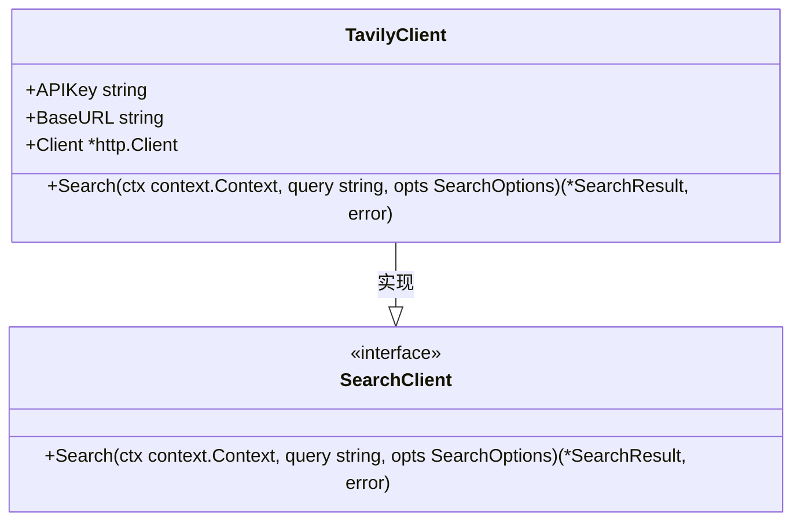
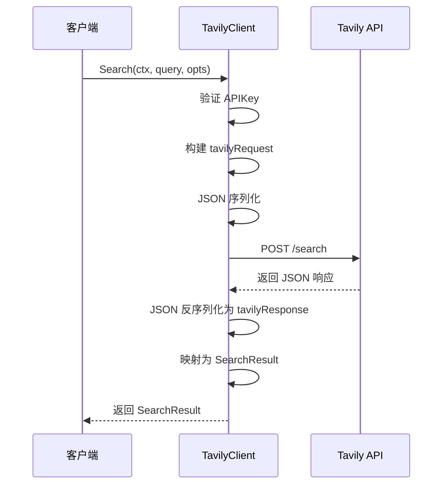
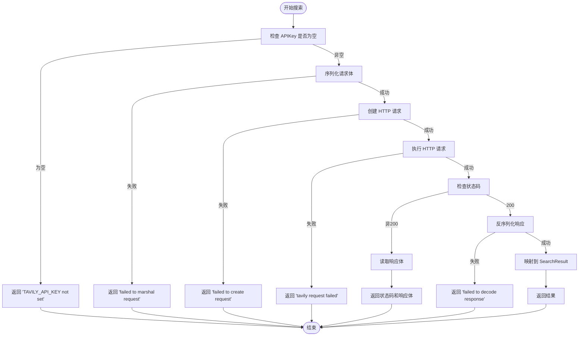
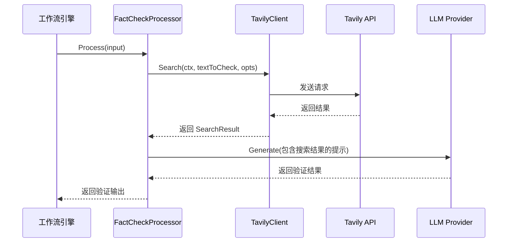

# Tavily 搜索集成

<cite>
**本文档引用的文件**   
- [tavily.go](file://internal/infrastructure/search/tavily.go)
- [tavily_test.go](file://internal/infrastructure/search/tavily_test.go)
- [fact_check.go](file://internal/core/workflow/nodes/fact_check.go)
- [fact_check_test.go](file://internal/core/workflow/nodes/fact_check_test.go)
- [SPEC-411-search-integration.md](file://docs/specs/backend/SPEC-411-search-integration.md)
- [10_search_tool.md](file://docs/tdd/02_core/10_search_tool.md)
- [main.go](file://cmd/council/main.go)
</cite>

## 目录
1. [TavilyClient 初始化机制](#tavilyclient-初始化机制)
2. [Search 方法与请求映射](#search-方法与请求映射)
3. [响应处理与结构体序列化](#响应处理与结构体序列化)
4. [错误处理机制](#错误处理机制)
5. [性能优化建议](#性能优化建议)
6. [实际调用示例](#实际调用示例)
7. [常见错误排查指南](#常见错误排查指南)

## TavilyClient 初始化机制

TavilyClient 的初始化通过 `NewTavilyClient()` 工厂函数完成，该函数负责设置 API 密钥、基础 URL 和 HTTP 客户端。API 密钥从环境变量 `TAVILY_API_KEY` 中读取，确保敏感信息不硬编码在代码中。BaseURL 固定为 `https://api.tavily.com`，指向 Tavily 服务的生产环境。HTTP 客户端配置了 10 秒的连接超时，以防止请求无限期挂起。



**图表来源**
- [tavily.go](file://internal/infrastructure/search/tavily.go#L42-L46)

**本节来源**
- [tavily.go](file://internal/infrastructure/search/tavily.go#L69-L78)

## Search 方法与请求映射

`Search` 方法将 `SearchOptions` 参数映射到 Tavily API 的请求体。查询字符串和选项被封装在 `tavilyRequest` 结构体中，该结构体通过 JSON 序列化发送。`SearchOptions` 中的 `MaxResults` 默认为 5，若未指定。`SearchDepth` 固定为 "advanced"，`IncludeAnswer` 始终为 `true`，确保返回直接答案。请求通过 `http.Client.Do` 发送，使用 `context.Context` 支持超时和取消。



**图表来源**
- [tavily.go](file://internal/infrastructure/search/tavily.go#L80-L143)

**本节来源**
- [tavily.go](file://internal/infrastructure/search/tavily.go#L80-L109)

## 响应处理与结构体序列化

Tavily API 的响应通过 `tavilyResponse` 结构体反序列化。该结构体包含 `Answer` 字段和一个 `Results` 数组，每个结果包含标题、URL、内容和分数。反序列化后，数据被映射到 `SearchResult` 结构体，该结构体是客户端使用的公共接口。此过程确保了内部实现与外部接口的解耦。

```mermaid
classDiagram
class tavilyRequest {
+APIKey string
+Query string
+SearchDepth string
+IncludeAnswer bool
+MaxResults int
+Domains []string
}
class tavilyResponse {
+Answer string
+Results []struct
}
class SearchResult {
+Query string
+Results []SearchItem
+Answer string
}
class SearchItem {
+Title string
+URL string
+Content string
+Score float64
}
tavilyRequest --> "JSON 序列化" --> HTTP请求
HTTP请求 --> TavilyAPI
TavilyAPI --> HTTP响应
HTTP响应 --> "JSON 反序列化" --> tavilyResponse
tavilyResponse --> SearchResult : 映射
SearchResult --> SearchItem : 包含
```

**图表来源**
- [tavily.go](file://internal/infrastructure/search/tavily.go#L48-L67)
- [tavily.go](file://internal/infrastructure/search/tavily.go#L26-L39)

**本节来源**
- [tavily.go](file://internal/infrastructure/search/tavily.go#L122-L142)

## 错误处理机制

错误处理在多个层面实现。首先，在 `Search` 方法开始时检查 `APIKey` 是否为空，若为空则返回 `"TAVILY_API_KEY not set"` 错误。其次，HTTP 请求失败（如网络问题）会返回 `"tavily request failed"` 错误。最后，非 200 状态码的响应会被读取并返回包含状态码和响应体的错误信息。这确保了所有潜在故障点都有明确的错误反馈。



**图表来源**
- [tavily.go](file://internal/infrastructure/search/tavily.go#L82-L125)

**本节来源**
- [tavily.go](file://internal/infrastructure/search/tavily.go#L82-L125)
- [tavily_test.go](file://internal/infrastructure/search/tavily_test.go#L55-L61)

## 性能优化建议

为优化性能，建议设置合理的连接超时和读取超时。当前实现已设置 10 秒的总超时。对于并发控制，可通过共享 `*http.Client` 实例来复用 TCP 连接，减少连接建立开销。此外，可考虑在应用层实现缓存，对相同查询的结果进行缓存，避免重复请求。在工作流中，`FactCheckProcessor` 使用 `SearchClient` 进行事实核查，其性能直接影响整体流程。

**本节来源**
- [tavily.go](file://internal/infrastructure/search/tavily.go#L74-L76)
- [fact_check.go](file://internal/core/workflow/nodes/fact_check.go#L14-L18)

## 实际调用示例

在 `FactCheckProcessor` 中，`TavilyClient` 被用于验证文本的准确性。处理器接收输入文本，调用 `Search` 方法获取网络搜索结果，然后将结果与原始文本一起发送给 LLM 进行验证。这展示了 TavilyClient 在实际业务逻辑中的集成方式。



**图表来源**
- [fact_check.go](file://internal/core/workflow/nodes/fact_check.go#L37-L63)

**本节来源**
- [fact_check.go](file://internal/core/workflow/nodes/fact_check.go#L20-L114)

## 常见错误排查指南

1.  **API 密钥缺失**：确保环境变量 `TAVILY_API_KEY` 已正确设置。可通过 `os.Getenv` 检查。
2.  **HTTP 请求失败**：检查网络连接和 Tavily API 的可用性。查看错误日志中的具体错误信息。
3.  **非 200 响应**：检查 API 响应体，可能包含详细的错误原因，如配额耗尽或无效查询。
4.  **反序列化失败**：确认 Tavily API 的响应格式是否符合预期，结构体字段的 JSON 标签是否正确。
5.  **性能问题**：检查超时设置是否过短，或考虑实现缓存机制。

**本节来源**
- [tavily.go](file://internal/infrastructure/search/tavily.go#L82-L125)
- [tavily_test.go](file://internal/infrastructure/search/tavily_test.go#L55-L61)