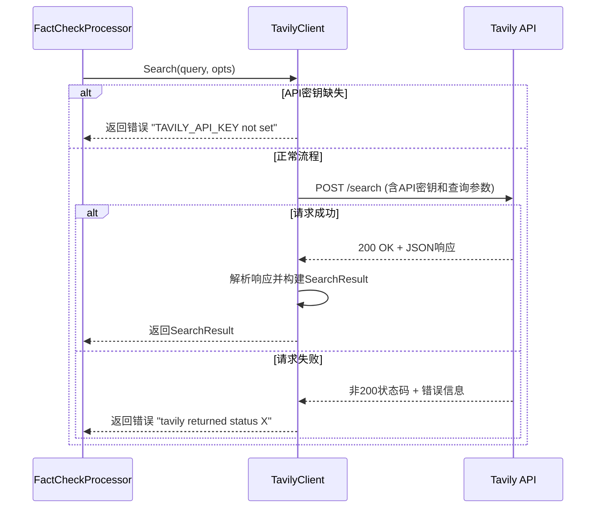
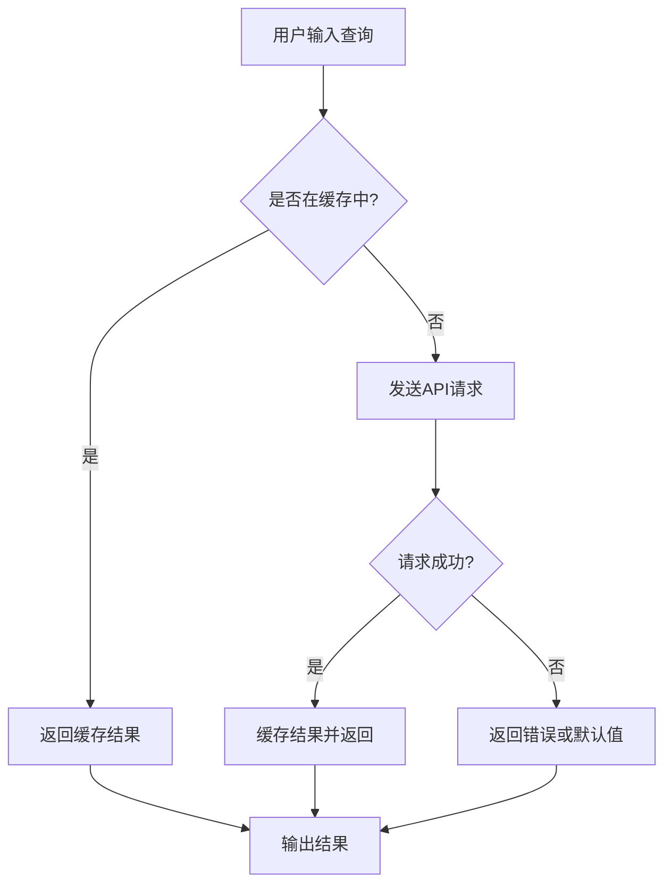

# 外部搜索集成

<cite>
**本文档中引用的文件**  
- [tavily.go](file://internal/infrastructure/search/tavily.go)
- [tavily_test.go](file://internal/infrastructure/search/tavily_test.go)
- [SPEC-411-search-integration.md](file://docs/specs/backend/SPEC-411-search-integration.md)
- [config.go](file://internal/pkg/config/config.go)
- [fact_check.go](file://internal/core/workflow/nodes/fact_check.go)
- [FactCheckNodeForm.tsx](file://frontend/src/features/editor/components/PropertyPanel/NodeForms/FactCheckNodeForm.tsx)
- [search_mock.go](file://internal/infrastructure/mocks/search_mock.go)
</cite>

## 目录
1. [引言](#引言)
2. [核心组件分析](#核心组件分析)
3. [Tavily搜索客户端实现细节](#tavily搜索客户端实现细节)
4. [SearchOptions参数配置机制](#searchoptions参数配置机制)
5. [搜索结果格式化与摘要生成](#搜索结果格式化与摘要生成)
6. [多源搜索支持架构设计](#多源搜索支持架构设计)
7. [错误处理策略](#错误处理策略)
8. [性能优化建议](#性能优化建议)
9. [API配额管理最佳实践](#api配额管理最佳实践)
10. [结论](#结论)

## 引言

事实核查节点是本系统中防止AI幻觉的关键组件，它通过集成外部搜索服务来验证AI生成内容的真实性。该机制主要依赖Tavily搜索客户端实现，并遵循SPEC-411规范进行多源搜索支持的设计。系统通过灵活的配置选项控制搜索行为，并在搜索服务不可用时提供健壮的错误处理和备用流程。

## 核心组件分析

事实核查功能的核心实现位于`fact_check.go`文件中，其主要职责是接收待验证的文本内容，调用外部搜索服务获取相关信息，并结合大语言模型（LLM）对声明的真实性进行判断。该处理器通过`SearchClient`接口与外部搜索服务解耦，实现了良好的可扩展性。

前端配置界面通过`FactCheckNodeForm.tsx`组件提供用户友好的搜索源选择和参数调整功能，允许用户在Tavily、Serper和本地知识库之间进行选择，并设置最大查询次数和置信度阈值等关键参数。

**Section sources**
- [fact_check.go](file://internal/core/workflow/nodes/fact_check.go#L1-L113)
- [FactCheckNodeForm.tsx](file://frontend/src/features/editor/components/PropertyPanel/NodeForms/FactCheckNodeForm.tsx#L1-L88)

## Tavily搜索客户端实现细节

Tavily搜索客户端的实现位于`internal/infrastructure/search/tavily.go`文件中，它实现了`SearchClient`接口，提供了与Tavily API交互的具体逻辑。

客户端通过`NewTavilyClient`工厂函数创建，自动从环境变量`TAVILY_API_KEY`中读取认证密钥，并配置了10秒的HTTP请求超时时间。搜索请求通过POST方法发送到`https://api.tavily.com/search`端点，请求体包含API密钥、查询文本、搜索深度（固定为"advanced"）、是否包含直接答案（true）以及最大结果数等参数。

客户端实现了完整的错误处理机制，包括检查API密钥是否存在、HTTP请求创建失败、网络连接问题以及非200状态码的响应。当收到错误响应时，会读取响应体内容以提供更详细的错误信息。



**Diagram sources**
- [tavily.go](file://internal/infrastructure/search/tavily.go#L79-L143)
- [tavily_test.go](file://internal/infrastructure/search/tavily_test.go#L11-L53)

**Section sources**
- [tavily.go](file://internal/infrastructure/search/tavily.go#L1-L153)

## SearchOptions参数配置机制

`SearchOptions`结构体定义了搜索请求的配置参数，包含三个主要字段：

- `MaxResults`：控制返回的搜索结果数量。在Tavily客户端实现中，如果此值为0，则默认设置为5。
- `SearchType`：指定搜索类型，可选值为"search"或"answer"。在当前实现中，始终设置为"answer"以获取直接答案。
- `Domains`：限制搜索结果的域名范围，允许只从特定网站获取信息。

这些参数在事实核查处理器中被具体化为：
```go
search.SearchOptions{
    MaxResults: 3,
    SearchType: "answer",
}
```
这表明系统默认进行深度搜索并获取最多3个结果，同时请求Tavily提供直接答案。

前端界面通过滑块控件允许用户在1-10范围内调整最大查询次数，提供了灵活的配置能力。

**Section sources**
- [tavily.go](file://internal/infrastructure/search/tavily.go#L20-L24)
- [SPEC-411-search-integration.md](file://docs/specs/backend/SPEC-411-search-integration.md#L21-L25)
- [FactCheckNodeForm.tsx](file://frontend/src/features/editor/components/PropertyPanel/NodeForms/FactCheckNodeForm.tsx#L54-L68)

## 搜索结果格式化与摘要生成

搜索结果的格式化和摘要生成是事实核查流程中的关键步骤。当从Tavily API获取到原始结果后，系统会将其转换为内部的`SearchResult`结构体，该结构体包含查询文本、结果列表和直接答案。

在`fact_check.go`中，搜索结果被格式化为包含直接答案和引用来源的摘要文本：
```go
var sb strings.Builder
if result.Answer != "" {
    sb.WriteString("Direct Answer: " + result.Answer + "\n")
}
for _, item := range result.Results {
    sb.WriteString(fmt.Sprintf("- %s: %s\n", item.Title, item.Content))
}
searchResults = sb.String()
```
这种格式化的摘要随后被注入到LLM的提示词中，用于判断原始声明的准确性。摘要文本以"Direct Answer"开头，随后是每个搜索结果的标题和内容，形成一个结构化的参考信息源。

**Section sources**
- [fact_check.go](file://internal/core/workflow/nodes/fact_check.go#L52-L60)
- [tavily.go](file://internal/infrastructure/search/tavily.go#L127-L141)

## 多源搜索支持架构设计

根据SPEC-411规范，系统设计了支持多源搜索的扩展架构。虽然当前实现主要集中在Tavily客户端，但通过`SearchClient`接口和`NewSearchClient`工厂函数，系统具备了集成其他搜索服务的能力。

架构设计要点包括：
1. **接口抽象**：`SearchClient`接口定义了统一的搜索方法，屏蔽了不同提供商的实现差异。
2. **工厂模式**：`NewSearchClient`函数根据配置的提供商名称返回相应的客户端实例。
3. **前端配置**：`FactCheckNodeForm`组件提供了Tavily、Serper和本地知识库（local_kb）的复选框，表明系统设计支持这三种搜索源。
4. **配置驱动**：通过环境变量和配置文件可以灵活切换搜索提供商。

尽管当前代码中Serper客户端的实现尚未完成，但SPEC文档中包含了其接口定义和工厂函数的预期实现，为未来的扩展奠定了基础。

```mermaid
classDiagram
class SearchClient {
<<interface>>
+Search(ctx, query, opts) *SearchResult, error
}
class TavilyClient {
-APIKey string
-BaseURL string
-Client *http.Client
+Search(ctx, query, opts) *SearchResult, error
}
class SerperClient {
-APIKey string
+Search(ctx, query, opts) *SearchResult, error
}
class LocalKnowledgeBase {
-Index vector.Index
+Search(ctx, query, opts) *SearchResult, error
}
SearchClient <|.. TavilyClient
SearchClient <|.. SerperClient
SearchClient <|.. LocalKnowledgeBase
class FactCheckProcessor {
-SearchClient SearchClient
-LLM LLMProvider
+Process(ctx, input, stream) map[string]interface{}, error
}
FactCheckProcessor --> SearchClient : "uses"
```

**Diagram sources**
- [SPEC-411-search-integration.md](file://docs/specs/backend/SPEC-411-search-integration.md#L17-L39)
- [tavily.go](file://internal/infrastructure/search/tavily.go#L15-L17)
- [FactCheckNodeForm.tsx](file://frontend/src/features/editor/components/PropertyPanel/NodeForms/FactCheckNodeForm.tsx#L24-L50)

**Section sources**
- [SPEC-411-search-integration.md](file://docs/specs/backend/SPEC-411-search-integration.md#L1-L165)
- [tavily.go](file://internal/infrastructure/search/tavily.go#L146-L153)

## 错误处理策略

系统实现了多层次的错误处理策略，确保在搜索服务不可用时仍能保持系统的稳定运行。

在Tavily客户端层面，错误处理包括：
- 检查API密钥是否设置
- 捕获HTTP请求创建和执行过程中的错误
- 验证HTTP响应状态码，对非200响应读取错误信息
- 解码JSON响应时的错误处理

在事实核查处理器层面，采用了"优雅降级"策略：
```go
if err != nil {
    stream <- workflow.StreamEvent{
        Type: "error",
        Data: map[string]interface{}{"error": "search failed: " + err.Error()},
    }
    searchResults = "[Search unavailable]"
} else {
    // 正常处理搜索结果
}
```
当搜索失败时，系统不会中断整个处理流程，而是记录错误事件，并将搜索结果设置为"[Search unavailable]"，然后继续使用LLM进行验证。这种设计确保了即使外部服务不可用，系统仍能产生输出。

**Section sources**
- [tavily.go](file://internal/infrastructure/search/tavily.go#L82-L125)
- [fact_check.go](file://internal/core/workflow/nodes/fact_check.go#L42-L50)
- [tavily_test.go](file://internal/infrastructure/search/tavily_test.go#L55-L61)

## 性能优化建议

基于当前架构，提出以下性能优化建议：

### 搜索结果缓存策略
实现基于Redis的搜索结果缓存，避免对相同查询的重复请求。可以使用查询字符串和搜索选项的哈希值作为缓存键，设置合理的过期时间（如1小时）。

### 并发查询限制
在事实核查处理器中，如果需要验证多个声明，应使用带缓冲区的goroutine池来限制并发搜索请求数量，防止对搜索API造成过大压力。

### 前端防抖机制
在用户输入查询时，前端应实现防抖（debounce）机制，避免在用户快速输入时频繁触发搜索请求。

### 批量处理优化
对于需要验证多个声明的场景，考虑实现批量搜索功能，将多个查询合并为单个请求，减少网络开销。



**Diagram sources**
- [config.go](file://internal/pkg/config/config.go#L17-L18)
- [tavily.go](file://internal/infrastructure/search/tavily.go#L74-L76)

## API配额管理最佳实践

为了有效管理API配额，建议采取以下最佳实践：

1. **环境隔离**：为开发、测试和生产环境使用不同的API密钥，便于配额监控和管理。
2. **配额监控**：实现定期检查API使用情况的监控任务，及时发现异常使用模式。
3. **降级策略**：当接近配额限制时，自动切换到备用搜索提供商或降低搜索频率。
4. **请求优化**：通过缓存和批量处理减少不必要的API调用。
5. **错误重试**：对于临时性错误（如429限流），实现指数退避重试机制。

在配置方面，应通过环境变量管理所有API密钥，如`TAVILY_API_KEY`、`SERPER_API_KEY`等，并在`config.go`中统一加载，确保密钥安全且易于管理。

**Section sources**
- [config.go](file://internal/pkg/config/config.go#L11-L16)
- [tavily.go](file://internal/infrastructure/search/tavily.go#L72-L73)

## 结论

事实核查节点与外部搜索服务的集成机制设计合理，通过清晰的接口抽象和工厂模式实现了良好的可扩展性。Tavily搜索客户端的实现完整且健壮，包含了必要的错误处理和超时控制。系统通过`SearchOptions`参数灵活控制搜索行为，并将结果格式化为结构化的摘要文本供LLM分析。

尽管当前实现主要集中在Tavily，但架构设计支持多源搜索，为未来集成Serper和本地知识库奠定了基础。建议实施缓存和并发控制等性能优化措施，并建立完善的API配额管理机制，以确保系统的稳定性和可持续性。