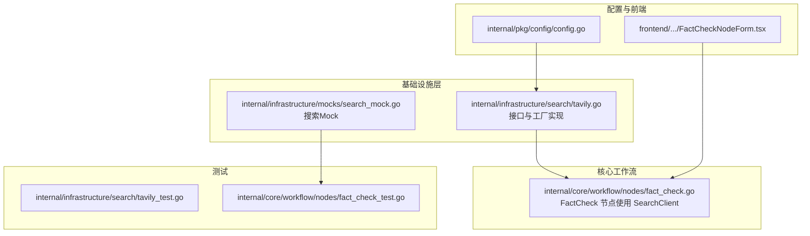
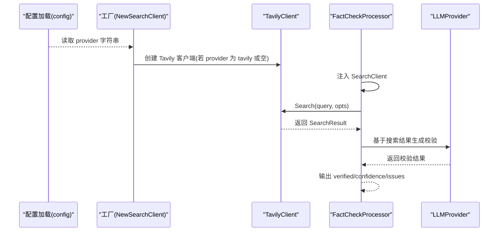
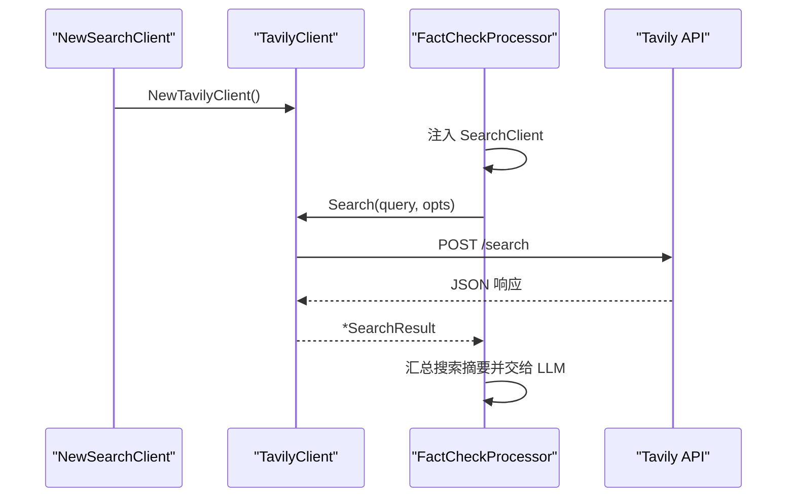
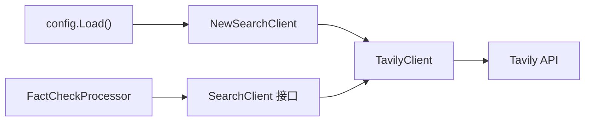

# 搜索客户端工厂模式

<cite>
**本文引用的文件**
- [internal/infrastructure/search/tavily.go](file://internal/infrastructure/search/tavily.go)
- [internal/infrastructure/search/tavily_test.go](file://internal/infrastructure/search/tavily_test.go)
- [internal/core/workflow/nodes/fact_check.go](file://internal/core/workflow/nodes/fact_check.go)
- [internal/core/workflow/nodes/fact_check_test.go](file://internal/core/workflow/nodes/fact_check_test.go)
- [internal/infrastructure/mocks/search_mock.go](file://internal/infrastructure/mocks/search_mock.go)
- [internal/pkg/config/config.go](file://internal/pkg/config/config.go)
- [frontend/src/features/editor/components/PropertyPanel/NodeForms/FactCheckNodeForm.tsx](file://frontend/src/features/editor/components/PropertyPanel/NodeForms/FactCheckNodeForm.tsx)
- [docs/specs/backend/SPEC-411-search-integration.md](file://docs/specs/backend/SPEC-411-search-integration.md)
- [docs/tdd/02_core/10_search_tool.md](file://docs/tdd/02_core/10_search_tool.md)
</cite>

## 目录
1. [引言](#引言)
2. [项目结构](#项目结构)
3. [核心组件](#核心组件)
4. [架构总览](#架构总览)
5. [详细组件分析](#详细组件分析)
6. [依赖关系分析](#依赖关系分析)
7. [性能考量](#性能考量)
8. [故障排查指南](#故障排查指南)
9. [结论](#结论)
10. [附录：扩展新提供商的步骤与注册流程](#附录扩展新提供商的步骤与注册流程)

## 引言
本文件围绕“搜索客户端工厂模式”进行系统性解析，重点说明：
- 工厂函数 NewSearchClient 如何依据 provider 类型（tavily/serper）动态实例化对应搜索客户端；
- 接口抽象 SearchClient 在解耦具体实现与上层业务逻辑中的作用；
- 结合 SPEC-411 规范，给出扩展新搜索提供商（如 local_kb）所需的代码改动与注册流程；
- 提供配置驱动的客户端选择机制示例与默认回退行为（tavily 为默认提供商）的实现原理；
- 错误处理路径与单元测试覆盖建议。

## 项目结构
本次分析聚焦于后端基础设施层的搜索模块、工作流节点对搜索能力的使用、以及前端节点表单中对搜索源的选择。关键文件分布如下：
- 基础设施搜索实现与工厂：internal/infrastructure/search/tavily.go
- 单元测试：internal/infrastructure/search/tavily_test.go
- 工作流节点使用搜索客户端：internal/core/workflow/nodes/fact_check.go
- 节点测试：internal/core/workflow/nodes/fact_check_test.go
- 搜索客户端 Mock：internal/infrastructure/mocks/search_mock.go
- 配置加载：internal/pkg/config/config.go
- 前端节点表单（含 serper/local_kb 选项）：frontend/src/.../FactCheckNodeForm.tsx
- 规范与 TDD 文档（接口定义、工厂示例等）：docs/specs/backend/SPEC-411-search-integration.md、docs/tdd/02_core/10_search_tool.md



图表来源
- [internal/infrastructure/search/tavily.go](file://internal/infrastructure/search/tavily.go#L1-L154)
- [internal/core/workflow/nodes/fact_check.go](file://internal/core/workflow/nodes/fact_check.go#L1-L114)
- [internal/infrastructure/mocks/search_mock.go](file://internal/infrastructure/mocks/search_mock.go#L1-L20)
- [internal/pkg/config/config.go](file://internal/pkg/config/config.go#L1-L133)
- [frontend/src/features/editor/components/PropertyPanel/NodeForms/FactCheckNodeForm.tsx](file://frontend/src/features/editor/components/PropertyPanel/NodeForms/FactCheckNodeForm.tsx#L1-L68)

章节来源
- [internal/infrastructure/search/tavily.go](file://internal/infrastructure/search/tavily.go#L1-L154)
- [internal/core/workflow/nodes/fact_check.go](file://internal/core/workflow/nodes/fact_check.go#L1-L114)
- [internal/pkg/config/config.go](file://internal/pkg/config/config.go#L1-L133)
- [frontend/src/features/editor/components/PropertyPanel/NodeForms/FactCheckNodeForm.tsx](file://frontend/src/features/editor/components/PropertyPanel/NodeForms/FactCheckNodeForm.tsx#L1-L68)

## 核心组件
- 接口抽象 SearchClient：统一不同搜索提供商的调用方式，屏蔽底层差异。
- 数据模型 SearchOptions/SearchResult/SearchItem：标准化请求参数与响应结构。
- TavilyClient：基于 Tavily API 的具体实现，负责构造请求、发送 HTTP 请求、解析响应。
- 工厂函数 NewSearchClient：根据 provider 参数返回对应客户端实例；当前支持 tavily 与空字符串（默认），未知 provider 返回错误。
- 使用方 FactCheckProcessor：在工作流中注入 SearchClient，执行搜索并汇总结果供后续 LLM 校验使用。

章节来源
- [internal/infrastructure/search/tavily.go](file://internal/infrastructure/search/tavily.go#L14-L153)
- [internal/core/workflow/nodes/fact_check.go](file://internal/core/workflow/nodes/fact_check.go#L14-L63)

## 架构总览
下图展示了“配置驱动的客户端选择 + 工厂 + 接口抽象”的整体架构，以及工作流节点如何消费搜索能力。



图表来源
- [internal/pkg/config/config.go](file://internal/pkg/config/config.go#L45-L132)
- [internal/infrastructure/search/tavily.go](file://internal/infrastructure/search/tavily.go#L145-L153)
- [internal/core/workflow/nodes/fact_check.go](file://internal/core/workflow/nodes/fact_check.go#L20-L113)

## 详细组件分析

### 工厂函数 NewSearchClient 设计与实现
- 设计目标
  - 将“选择具体提供商”的职责从上层业务逻辑中剥离，通过工厂集中管理。
  - 支持默认回退：provider 为空或为 tavily 时，创建 TavilyClient。
  - 对未知 provider 返回错误，避免静默失败。
- 关键实现点
  - 通过 provider 字符串分支决定返回实例类型。
  - 当前仅支持 tavily 与空字符串（默认），其他值报错。
  - 返回类型为接口 SearchClient，便于替换与扩展。
- 默认回退行为
  - 当 provider 为空字符串时，回退到 tavily 客户端，体现“tavily 为默认提供商”的策略。

章节来源
- [internal/infrastructure/search/tavily.go](file://internal/infrastructure/search/tavily.go#L145-L153)

### 接口抽象 SearchClient 的作用
- 解耦上层业务与底层实现
  - 上层（如 FactCheckProcessor）仅依赖接口，不关心具体是 Tavily、Serper 还是本地知识库。
- 统一调用约定
  - 所有实现均提供 Search(ctx, query, opts) -> *SearchResult, error。
- 易于扩展与替换
  - 新增提供商只需实现 SearchClient 接口，并在工厂中添加分支即可。

章节来源
- [internal/infrastructure/search/tavily.go](file://internal/infrastructure/search/tavily.go#L14-L16)
- [docs/specs/backend/SPEC-411-search-integration.md](file://docs/specs/backend/SPEC-411-search-integration.md#L14-L39)

### TavilyClient 实现细节
- 初始化
  - 从环境变量读取 API Key 与基础 URL。
  - 设置 HTTP 客户端超时时间。
- 查询流程
  - 校验 API Key 是否存在。
  - 构造请求体（包含查询词、搜索深度、最大结果数、域名过滤等）。
  - 发送 POST 请求至 /search。
  - 校验状态码与解析响应，映射为 SearchResult。
- 错误处理
  - 缺少 API Key、网络错误、非 200 状态、JSON 解码失败等场景均有明确错误返回。

章节来源
- [internal/infrastructure/search/tavily.go](file://internal/infrastructure/search/tavily.go#L69-L143)

### 工作流节点 FactCheckProcessor 中的搜索调用
- 注入 SearchClient
  - 通过字段注入，便于替换与测试。
- 调用 Search
  - 使用固定 MaxResults 与 SearchType。
  - 若 Search 失败，节点仍继续执行，但会通过流事件上报错误并以占位内容替代。
- 与 LLM 协同
  - 将搜索摘要拼接为提示词的一部分，交由 LLM 判定可信度与问题项。

章节来源
- [internal/core/workflow/nodes/fact_check.go](file://internal/core/workflow/nodes/fact_check.go#L14-L113)

### 前端节点表单与多源选择
- 表单支持勾选多个搜索源：tavily、serper、local_kb。
- 该设计为后续在工厂与节点侧扩展“多源聚合”提供界面基础。

章节来源
- [frontend/src/features/editor/components/PropertyPanel/NodeForms/FactCheckNodeForm.tsx](file://frontend/src/features/editor/components/PropertyPanel/NodeForms/FactCheckNodeForm.tsx#L1-L68)

### 类图：接口与实现关系
```mermaid
classDiagram
class SearchClient {
+Search(ctx, query, opts) *SearchResult, error
}
class TavilyClient {
+APIKey string
+BaseURL string
+Client *http.Client
+Search(ctx, query, opts) *SearchResult, error
}
class FactCheckProcessor {
+LLM LLMProvider
+SearchClient SearchClient
+VerifyThreshold float64
+Process(ctx, input, stream) map[string]interface{}, error
}
SearchClient <|.. TavilyClient : "实现"
FactCheckProcessor --> SearchClient : "依赖"
```

图表来源
- [internal/infrastructure/search/tavily.go](file://internal/infrastructure/search/tavily.go#L14-L153)
- [internal/core/workflow/nodes/fact_check.go](file://internal/core/workflow/nodes/fact_check.go#L14-L113)

### 序列图：工厂创建与节点调用


图表来源
- [internal/infrastructure/search/tavily.go](file://internal/infrastructure/search/tavily.go#L69-L143)
- [internal/core/workflow/nodes/fact_check.go](file://internal/core/workflow/nodes/fact_check.go#L20-L113)

## 依赖关系分析
- 组件耦合与内聚
  - SearchClient 作为接口，被 FactCheckProcessor 依赖，保持高内聚、低耦合。
  - 工厂集中管理实例化逻辑，避免上层分散判断。
- 外部依赖
  - TavilyClient 依赖 HTTP 客户端与环境变量（API Key）。
  - 配置加载模块提供 provider 字符串来源。
- 可能的循环依赖
  - 当前未见循环导入；SearchClient 位于 search 包，FactCheckProcessor 位于 nodes 包，二者通过接口解耦。



图表来源
- [internal/pkg/config/config.go](file://internal/pkg/config/config.go#L45-L132)
- [internal/infrastructure/search/tavily.go](file://internal/infrastructure/search/tavily.go#L145-L153)
- [internal/core/workflow/nodes/fact_check.go](file://internal/core/workflow/nodes/fact_check.go#L14-L113)

章节来源
- [internal/pkg/config/config.go](file://internal/pkg/config/config.go#L45-L132)
- [internal/infrastructure/search/tavily.go](file://internal/infrastructure/search/tavily.go#L145-L153)
- [internal/core/workflow/nodes/fact_check.go](file://internal/core/workflow/nodes/fact_check.go#L14-L113)

## 性能考量
- 超时控制
  - TavilyClient 内置 HTTP 客户端超时，避免阻塞。
- 结果数量与域过滤
  - 通过 SearchOptions 控制 MaxResults 与 Domains，减少无效数据传输。
- 错误快速失败
  - 缺少 API Key 立即返回错误，避免无意义的网络请求。
- 并发与重试
  - 当前实现未内置重试；如需增强稳定性，可在工厂或客户端层引入指数退避重试策略（需谨慎评估成本）。

[本节为通用指导，无需特定文件来源]

## 故障排查指南
- 常见错误路径
  - 缺失 API Key：TavilyClient.Search 在初始化阶段即返回错误。
  - 网络错误/非 200：HTTP 请求失败或状态码异常，返回带上下文的错误。
  - JSON 解码失败：响应格式不符合预期，返回解码错误。
  - 未知 provider：工厂返回错误，提示未知提供商。
- 工作流节点容错
  - Search 失败时，节点仍继续执行并通过流事件上报错误，同时以占位内容替代搜索结果，保证流程不中断。
- 单元测试覆盖建议
  - 工厂
    - 测试已覆盖：创建 tavily 客户端成功、未知 provider 报错。
  - TavilyClient
    - 测试已覆盖：正常搜索返回、缺少 API Key 场景。
    - 建议补充：HTTP 状态码异常、JSON 解码失败、网络超时等边界场景。
  - 节点
    - 测试已覆盖：Search 成功与失败两种路径下的输出。
    - 建议补充：SearchOptions 参数传递、SearchType 与 Domains 生效、多源聚合（后续扩展）。

章节来源
- [internal/infrastructure/search/tavily.go](file://internal/infrastructure/search/tavily.go#L80-L143)
- [internal/infrastructure/search/tavily_test.go](file://internal/infrastructure/search/tavily_test.go#L1-L73)
- [internal/core/workflow/nodes/fact_check.go](file://internal/core/workflow/nodes/fact_check.go#L35-L63)
- [internal/core/workflow/nodes/fact_check_test.go](file://internal/core/workflow/nodes/fact_check_test.go#L1-L61)

## 结论
- NewSearchClient 采用简单而稳健的工厂模式，将“选择提供商”的决策集中在一处，配合接口抽象实现了良好的可扩展性与可测试性。
- 默认回退行为（空 provider 回退到 tavily）体现了清晰的默认策略，便于快速上线。
- 通过 Mock 与单元测试，可以低成本地验证接口契约与错误路径。
- 面向扩展（如 serper/local_kb），只需新增实现与工厂分支，并在前端表单与节点侧完善多源聚合逻辑。

[本节为总结，无需特定文件来源]

## 附录：扩展新提供商的步骤与注册流程

### 1) 新增提供商实现
- 实现 SearchClient 接口
  - 参考现有 TavilyClient 的实现风格，完成初始化、请求构造、HTTP 调用与响应解析。
  - 注意错误处理与超时设置。
- 示例参考
  - 接口定义与数据模型：参见 [SPEC-411 规范](file://docs/specs/backend/SPEC-411-search-integration.md#L14-L39)
  - 工具类工厂示例（用于对比）：参见 [TDD 文档](file://docs/tdd/02_core/10_search_tool.md#L5-L76)

章节来源
- [docs/specs/backend/SPEC-411-search-integration.md](file://docs/specs/backend/SPEC-411-search-integration.md#L14-L39)
- [docs/tdd/02_core/10_search_tool.md](file://docs/tdd/02_core/10_search_tool.md#L5-L76)

### 2) 在工厂中注册新提供商
- 修改 NewSearchClient 分支
  - 在 switch 中增加新的 provider 分支，返回新实现的实例。
  - 保持默认回退行为（空字符串仍返回 tavily）。
- 示例参考
  - 当前工厂实现位置：[internal/infrastructure/search/tavily.go](file://internal/infrastructure/search/tavily.go#L145-L153)

章节来源
- [internal/infrastructure/search/tavily.go](file://internal/infrastructure/search/tavily.go#L145-L153)

### 3) 配置驱动的客户端选择机制
- 方案一：在配置加载时读取 provider 字段
  - 参考配置加载逻辑，将 provider 字符串传入工厂创建客户端。
  - 参考：[internal/pkg/config/config.go](file://internal/pkg/config/config.go#L45-L132)
- 方案二：在节点运行时按节点配置选择
  - 前端表单已支持多源选择（tavily/serper/local_kb），节点侧可据此构建 SearchOptions 或在工厂处按源选择实现。
  - 参考：[frontend/.../FactCheckNodeForm.tsx](file://frontend/src/features/editor/components/PropertyPanel/NodeForms/FactCheckNodeForm.tsx#L1-L68)

章节来源
- [internal/pkg/config/config.go](file://internal/pkg/config/config.go#L45-L132)
- [frontend/src/features/editor/components/PropertyPanel/NodeForms/FactCheckNodeForm.tsx](file://frontend/src/features/editor/components/PropertyPanel/NodeForms/FactCheckNodeForm.tsx#L1-L68)

### 4) 默认回退行为（tavily 为默认提供商）
- 工厂对空字符串的处理即为默认回退。
- 建议在配置层提供默认值，确保未显式指定时仍走 tavily。

章节来源
- [internal/infrastructure/search/tavily.go](file://internal/infrastructure/search/tavily.go#L145-L153)

### 5) 多源聚合与节点适配
- 前端已支持多源勾选，节点侧可扩展为：
  - 依次调用多个 SearchClient，合并结果；
  - 或根据节点配置选择特定源；
  - 保持 SearchOptions 与 SearchType 的一致性。
- 参考节点使用 SearchClient 的方式：[internal/core/workflow/nodes/fact_check.go](file://internal/core/workflow/nodes/fact_check.go#L20-L113)

章节来源
- [internal/core/workflow/nodes/fact_check.go](file://internal/core/workflow/nodes/fact_check.go#L20-L113)
- [frontend/src/features/editor/components/PropertyPanel/NodeForms/FactCheckNodeForm.tsx](file://frontend/src/features/editor/components/PropertyPanel/NodeForms/FactCheckNodeForm.tsx#L1-L68)

### 6) 单元测试覆盖建议（扩展新提供商）
- 工厂
  - 新增分支：创建新提供商客户端成功、未知 provider 报错。
- 客户端
  - 正常路径：请求成功、响应解析正确。
  - 边界路径：缺少密钥、HTTP 错误、JSON 解码失败、超时等。
- 节点
  - 多源聚合：分别调用不同源，合并结果。
  - 容错：任一源失败不影响其他源，最终汇总。

章节来源
- [internal/infrastructure/search/tavily_test.go](file://internal/infrastructure/search/tavily_test.go#L1-L73)
- [internal/core/workflow/nodes/fact_check_test.go](file://internal/core/workflow/nodes/fact_check_test.go#L1-L61)