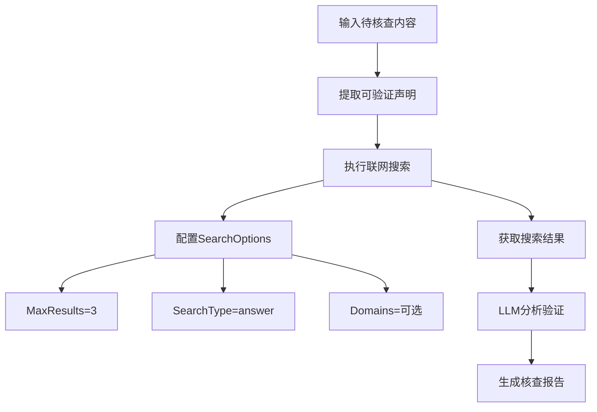

# 搜索选项配置

<cite>
**本文档引用文件**   
- [tavily.go](file://internal/infrastructure/search/tavily.go)
- [SPEC-411-search-integration.md](file://docs/specs/backend/SPEC-411-search-integration.md)
- [tavily_test.go](file://internal/infrastructure/search/tavily_test.go)
- [FactCheckNodeForm.tsx](file://frontend/src/features/editor/components/PropertyPanel/NodeForms/FactCheckNodeForm.tsx)
- [fact_check.go](file://internal/core/workflow/nodes/fact_check.go)
- [config.go](file://internal/pkg/config/config.go)
- [SPEC-203-factcheck-humanreview-nodes.md](file://docs/specs/sprint3/SPEC-203-factcheck-humanreview-nodes.md)
- [12_fact_check.md](file://docs/tdd/02_core/12_fact_check.md)
</cite>

## 目录
1. [SearchOptions 结构体详解](#searchoptions-结构体详解)
2. [字段配置意义与使用场景](#字段配置意义与使用场景)
3. [fact-check 节点中的配置应用](#fact-check-节点中的配置应用)
4. [推荐配置组合](#推荐配置组合)
5. [配置验证与默认值](#配置验证与默认值)
6. [错误处理与调试建议](#错误处理与调试建议)

## SearchOptions 结构体详解

`SearchOptions` 结构体用于配置 Tavily API 搜索请求的参数，定义了搜索行为的关键控制选项。该结构体在 `internal/infrastructure/search/tavily.go` 文件中定义，是实现联网搜索功能的核心配置对象。

```go
type SearchOptions struct {
    MaxResults int
    SearchType string // "search" | "answer"
    Domains    []string
}
```

该结构体通过 `SearchClient` 接口的 `Search` 方法传递给 Tavily 客户端，直接影响搜索结果的质量、数量和范围。其设计遵循了灵活配置与默认值填充的原则，确保在不同业务场景下都能提供稳定可靠的搜索服务。

**Section sources**
- [tavily.go](file://internal/infrastructure/search/tavily.go#L19-L24)

## 字段配置意义与使用场景

### MaxResults 字段

`MaxResults` 字段控制搜索结果返回的最大条目数。该参数直接影响搜索结果的丰富度和系统性能。

当 `MaxResults` 值较大时，系统会返回更多搜索结果，提供更全面的信息覆盖，但同时会增加 API 调用成本、网络传输时间和后续处理的计算开销。反之，较小的值能提高响应速度和降低资源消耗，但可能遗漏重要信息。

在实际应用中，该字段的配置需要根据具体场景权衡。例如，在事实核查场景中，通常需要获取足够多的信源进行交叉验证，建议设置为 3-5 条；而在快速摘要场景中，可能只需要 1-2 条最相关的结果。

**Section sources**
- [tavily.go](file://internal/infrastructure/search/tavily.go#L21)
- [SPEC-411-search-integration.md](file://docs/specs/backend/SPEC-411-search-integration.md#L22)

### SearchType 字段

`SearchType` 字段指定搜索类型，支持 "search" 和 "answer" 两种模式。该参数决定了 Tavily API 的响应格式和内容深度。

- **"search" 模式**：返回传统的搜索结果列表，包含多个网页的标题、URL、内容摘要和相关性评分。
- **"answer" 模式**：除了搜索结果外，还会生成一个直接的答案摘要，对查询问题进行概括性回答。

在 fact-check 节点中，通常使用 "answer" 模式，因为直接答案可以帮助快速判断声明的准确性，而详细的搜索结果则提供了验证依据。这种组合模式既能提高效率，又能保证核查的严谨性。

**Section sources**
- [tavily.go](file://internal/infrastructure/search/tavily.go#L22)
- [SPEC-411-search-integration.md](file://docs/specs/backend/SPEC-411-search-integration.md#L23)

### Domains 字段

`Domains` 字段用于限制搜索的域名范围，可以指定一个或多个可信域名。该参数在需要特定信源验证的场景中非常有用。

通过配置可信域名列表，系统可以优先从权威网站获取信息，提高搜索结果的可靠性和相关性。例如，在金融领域分析中，可以将域名限制在央行、证监会等官方网站；在学术研究中，可以限定为知名学术期刊和数据库。

该字段的使用体现了搜索精度与广度的平衡策略，既能避免噪声信息干扰，又能确保信息来源的权威性。

**Section sources**
- [tavily.go](file://internal/infrastructure/search/tavily.go#L23)
- [SPEC-411-search-integration.md](file://docs/specs/backend/SPEC-411-search-integration.md#L24)

## fact-check 节点中的配置应用

在 fact-check 节点中，`SearchOptions` 的配置直接关系到事实核查的准确性和效率。根据 `internal/core/workflow/nodes/fact_check.go` 文件中的实现，系统通过混合搜索验证策略来提高核查质量。



**Diagram sources**
- [fact_check.go](file://internal/core/workflow/nodes/fact_check.go#L38-L41)
- [12_fact_check.md](file://docs/tdd/02_core/12_fact_check.md#L36)

如代码所示，系统在执行搜索时会配置 `MaxResults` 为 3，`SearchType` 为 "answer"，确保既能获取足够的信源进行交叉验证，又能获得直接的答案摘要辅助判断。这种配置策略有效平衡了搜索精度与性能，符合事实核查节点的核心需求。

前端界面 `FactCheckNodeForm.tsx` 也提供了相应的配置选项，允许用户通过滑块调整最大搜索次数，体现了配置的灵活性和用户可控性。

**Section sources**
- [fact_check.go](file://internal/core/workflow/nodes/fact_check.go#L38-L41)
- [FactCheckNodeForm.tsx](file://frontend/src/features/editor/components/PropertyPanel/NodeForms/FactCheckNodeForm.tsx#L54-L68)

## 推荐配置组合

根据不同的业务场景，推荐以下配置组合：

### 事实核查场景
```json
{
  "MaxResults": 3,
  "SearchType": "answer",
  "Domains": []
}
```
此配置适用于 fact-check 节点，通过多源交叉验证确保准确性，同时利用直接答案提高效率。

### 精准信息检索场景
```json
{
  "MaxResults": 5,
  "SearchType": "search",
  "Domains": ["example.com", "trusted-source.org"]
}
```
当需要从特定可信源获取详细信息时使用，限制域名范围可提高结果的相关性和可靠性。

### 快速摘要场景
```json
{
  "MaxResults": 1,
  "SearchType": "answer",
  "Domains": []
}
```
适用于需要快速获取问题答案的场景，最小化延迟和成本。

**Section sources**
- [SPEC-203-factcheck-humanreview-nodes.md](file://docs/specs/sprint3/SPEC-203-factcheck-humanreview-nodes.md#L132)
- [fact_check.go](file://internal/core/workflow/nodes/fact_check.go#L38-L41)

## 配置验证与默认值

系统实现了完善的配置验证和默认值填充机制。在 `tavily.go` 文件中，`Search` 方法会对 `SearchOptions` 进行验证和处理：

```go
maxResults := opts.MaxResults
if maxResults == 0 {
    maxResults = 5
}
```

当 `MaxResults` 未设置或为 0 时，系统会自动填充默认值 5。这一机制确保了即使在配置缺失的情况下，搜索功能仍能正常工作。

同时，系统通过环境变量 `TAVILY_API_KEY` 验证 API 密钥的有效性，若未设置则返回明确的错误信息。这种防御性编程实践提高了系统的健壮性和用户体验。

配置的默认值设计遵循了"合理默认"原则，既保证了基本功能的可用性，又为高级用户提供了充分的自定义空间。

**Section sources**
- [tavily.go](file://internal/infrastructure/search/tavily.go#L86-L89)
- [config.go](file://internal/pkg/config/config.go#L111)

## 错误处理与调试建议

系统实现了多层次的错误处理机制。在 `tavily_test.go` 中，包含了对各种异常情况的测试用例，如 API 密钥缺失、网络请求失败等。

当搜索失败时，系统不会中断整个工作流，而是记录错误信息并继续执行后续步骤。这种容错设计确保了系统的稳定性，避免因单一组件故障导致整体服务不可用。

调试建议：
1. 检查 `TAVILY_API_KEY` 环境变量是否正确设置
2. 验证网络连接是否正常
3. 查看 API 调用频率是否超出限制
4. 检查搜索查询是否过于复杂或模糊

通过日志记录和流式事件（StreamEvent）机制，系统提供了详细的执行轨迹，便于问题定位和性能分析。

**Section sources**
- [tavily.go](file://internal/infrastructure/search/tavily.go#L82-L84)
- [tavily_test.go](file://internal/infrastructure/search/tavily_test.go#L55-L61)
- [fact_check.go](file://internal/core/workflow/nodes/fact_check.go#L43-L47)