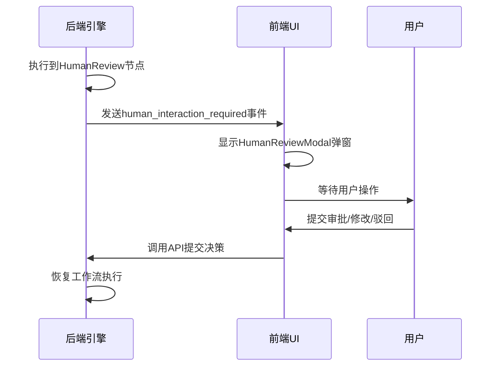
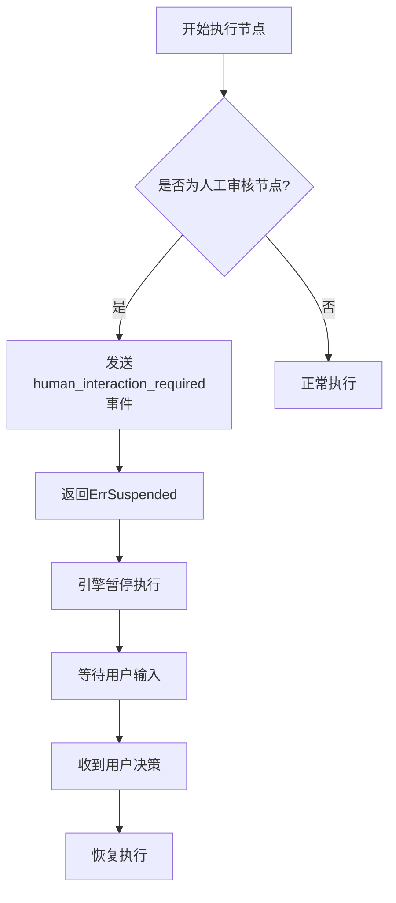
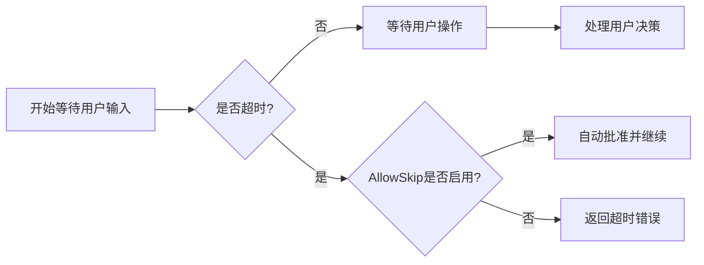
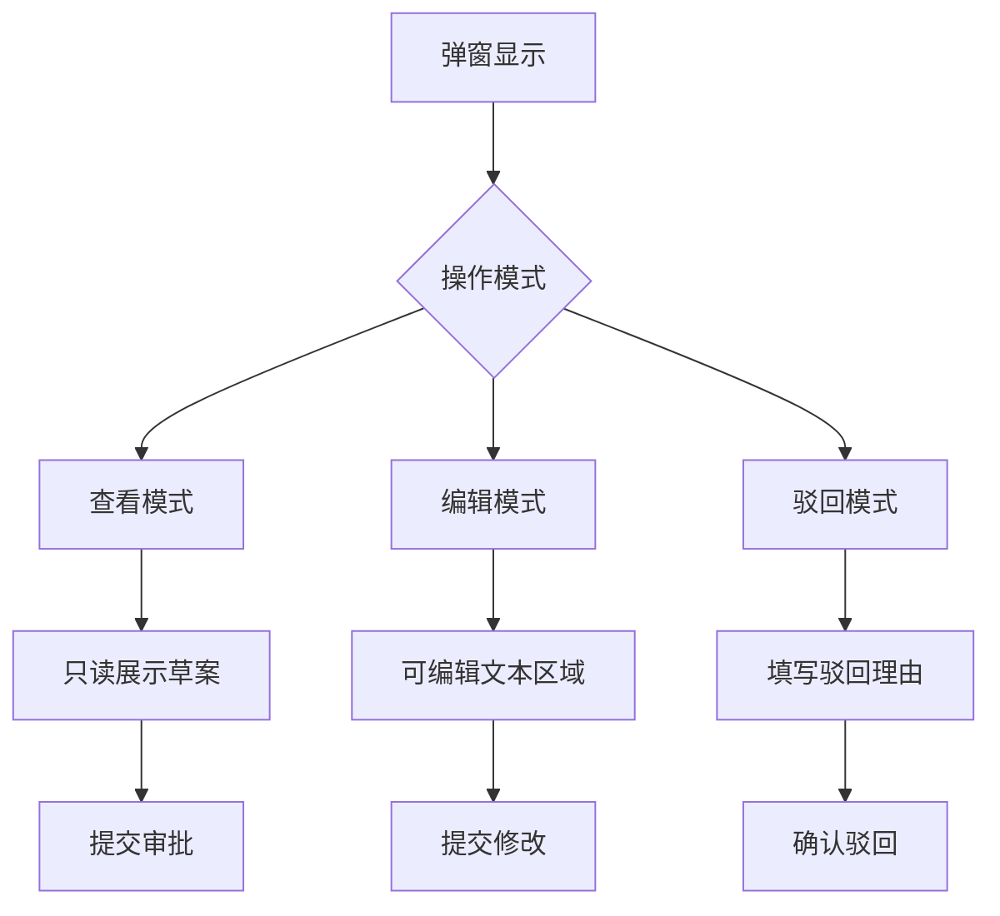
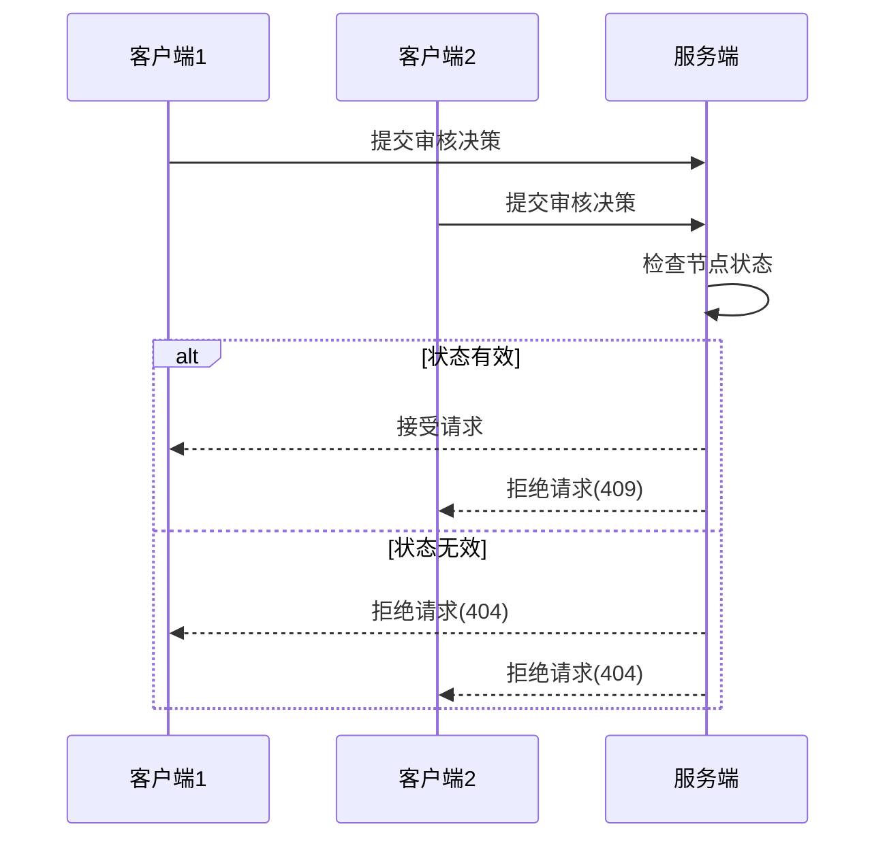

# 人工审核节点

<cite>
**本文档引用文件**   
- [human_review.go](file://internal/core/workflow/nodes/human_review.go)
- [HumanReviewModal.tsx](file://frontend/src/features/execution/components/HumanReviewModal.tsx)
- [useWorkflowRunStore.ts](file://frontend/src/stores/useWorkflowRunStore.ts)
- [session.go](file://internal/core/workflow/session.go)
- [engine.go](file://internal/core/workflow/engine.go)
- [SPEC-405-human-review-processor.md](file://docs/specs/backend/SPEC-405-human-review-processor.md)
- [SPEC-301-human-review-modal.md](file://docs/specs/sprint4/SPEC-301-human-review-modal.md)
- [human_review.md](file://docs/api/human_review.md)
- [HumanReviewNodeForm.tsx](file://frontend/src/features/editor/components/PropertyPanel/NodeForms/HumanReviewNodeForm.tsx)
- [types.go](file://internal/core/workflow/types.go)
- [workflow-run.ts](file://frontend/src/types/workflow-run.ts)
</cite>

## 目录
1. [引言](#引言)
2. [人机协同机制](#人机协同机制)
3. [强制干预设计](#强制干预设计)
4. [会话锁定与操作审计](#会话锁定与操作审计)
5. [超时自动降级逻辑](#超时自动降级逻辑)
6. [前端组件功能](#前端组件功能)
7. [高并发状态同步](#高并发状态同步)
8. [用户体验优化建议](#用户体验优化建议)
9. [结论](#结论)

## 引言

人工审核节点（Human Review Node）是工作流系统中的关键控制点，用于在自动化流程中引入人工决策。根据SPEC-405规范，该节点通过暂停自动化流程、弹出HumanReviewModal对话框，将决策草案交由用户确认或修改，并将反馈结果重新注入工作流继续执行。本文件全面解析其人机协同机制与强制干预设计。

**Section sources**
- [SPEC-405-human-review-processor.md](file://docs/specs/backend/SPEC-405-human-review-processor.md)
- [SPEC-301-human-review-modal.md](file://docs/specs/sprint4/SPEC-301-human-review-modal.md)

## 人机协同机制

人工审核节点的核心机制在于暂停自动化流程并等待用户输入。当工作流执行到`NodeTypeHumanReview`类型的节点时，`HumanReviewProcessor`会触发暂停逻辑。

后端通过`StreamEvent`向客户端发送`human_interaction_required`事件，通知前端需要人工干预。前端的WebSocket监听器捕获该事件后，调用`useWorkflowRunStore.setHumanReview()`更新状态，从而触发`HumanReviewModal`弹窗显示。



**Diagram sources**
- [human_review.go](file://internal/core/workflow/nodes/human_review.go#L15-L45)
- [HumanReviewModal.tsx](file://frontend/src/features/execution/components/HumanReviewModal.tsx#L6-L90)
- [useWebSocketRouter.ts](file://frontend/src/hooks/useWebSocketRouter.ts#L80-L88)

**Section sources**
- [human_review.go](file://internal/core/workflow/nodes/human_review.go#L15-L45)
- [HumanReviewModal.tsx](file://frontend/src/features/execution/components/HumanReviewModal.tsx#L6-L90)

## 强制干预设计

人工审核节点通过返回`workflow.ErrSuspended`错误来强制中断自动化流程。`HumanReviewProcessor.Process`方法在发出交互请求后立即返回此特殊错误，使工作流引擎进入暂停状态。

工作流引擎在`executeNode`方法中检测到`ErrSuspended`时，会将节点状态更新为`StatusSuspended`并停止后续执行。此时，整个工作流处于等待状态，直到收到用户的反馈。



**Diagram sources**
- [human_review.go](file://internal/core/workflow/nodes/human_review.go#L44-L45)
- [engine.go](file://internal/core/workflow/engine.go#L103-L105)

**Section sources**
- [human_review.go](file://internal/core/workflow/nodes/human_review.go#L44-L45)
- [engine.go](file://internal/core/workflow/engine.go#L103-L105)

## 会话锁定与操作审计

系统通过会话（Session）机制实现执行控制。`Session`结构体包含`resumeCh`通道用于控制暂停与恢复。当调用`Pause()`方法时，创建新的阻塞通道；调用`Resume()`时，关闭该通道以解除阻塞。

信号通道（SignalChannels）用于节点级别的通信。`GetSignalChannel`为每个节点ID维护一个缓冲通道，用于接收用户决策信号。`SendSignal`方法将决策结果发送到对应通道，实现精确的节点控制。

所有状态变更均通过`WorkflowRunStore`进行集中管理，确保状态一致性。`submitHumanReview`方法负责提交用户决策并清除弹窗状态，同时记录操作日志。

```mermaid
classDiagram
class Session {
+ID string
+Status SessionStatus
+resumeCh chan struct{}
+SignalChannels map[string]chan interface{}
+Pause()
+Resume()
+WaitIfPaused()
+GetSignalChannel()
+SendSignal()
}
class HumanReviewProcessor {
+TimeoutMinutes int
+AllowSkip bool
+Process()
}
class WorkflowRunStore {
+humanReview HumanReviewRequest
+setHumanReview()
+submitHumanReview()
}
Session --> HumanReviewProcessor : "控制"
Session --> WorkflowRunStore : "状态同步"
```

**Diagram sources**
- [session.go](file://internal/core/workflow/session.go#L24-L165)
- [useWorkflowRunStore.ts](file://frontend/src/stores/useWorkflowRunStore.ts#L36-L75)

**Section sources**
- [session.go](file://internal/core/workflow/session.go#L24-L165)
- [useWorkflowRunStore.ts](file://frontend/src/stores/useWorkflowRunStore.ts#L36-L75)

## 超时自动降级逻辑

人工审核节点支持超时自动降级机制。在`HumanReviewProcessor`中配置`TimeoutMinutes`参数，定义最大等待时间。

当等待时间超过设定阈值时，系统根据`AllowSkip`标志决定处理策略：
- 若`AllowSkip`为true，则自动批准并继续执行
- 若`AllowSkip`为false，则返回超时错误，终止流程

前端通过`TimeoutIndicator`组件显示倒计时，并在剩余时间少于5分钟时触发脉冲动画提醒，确保用户及时响应。



**Diagram sources**
- [human_review.go](file://internal/core/workflow/nodes/human_review.go#L44-L45)
- [SPEC-405-human-review-processor.md](file://docs/specs/backend/SPEC-405-human-review-processor.md#L52-L55)

**Section sources**
- [human_review.go](file://internal/core/workflow/nodes/human_review.go#L44-L45)
- [SPEC-405-human-review-processor.md](file://docs/specs/backend/SPEC-405-human-review-processor.md#L52-L55)

## 前端组件功能

`HumanReviewModal`组件提供完整的用户交互界面，支持多格式内容渲染和批注工具。

### 多格式内容渲染
- 支持Markdown格式的决策草案渲染
- 支持表格数据展示
- 使用`ReactMarkdown`组件实现富文本解析

### 批注工具支持
- 提供三种操作模式：查看、编辑、驳回
- 编辑模式下支持全文修改
- 驳回模式下需填写理由

### 交互设计
- 模态框包含决策原因和超时倒计时
- 提供"批准"、"驳回"、"修改"三种操作按钮
- 支持响应式布局，适配不同屏幕尺寸



**Diagram sources**
- [HumanReviewModal.tsx](file://frontend/src/features/execution/components/HumanReviewModal.tsx#L27-L88)
- [SPEC-301-human-review-modal.md](file://docs/specs/sprint4/SPEC-301-human-review-modal.md#L50-L68)

**Section sources**
- [HumanReviewModal.tsx](file://frontend/src/features/execution/components/HumanReviewModal.tsx#L27-L88)
- [SPEC-301-human-review-modal.md](file://docs/specs/sprint4/SPEC-301-human-review-modal.md#L50-L68)

## 高并发状态同步

在高并发场景下，系统通过以下机制确保状态同步：

1. **WebSocket实时通信**：使用WebSocket实现服务端到客户端的实时状态推送，避免轮询延迟。
2. **状态集中管理**：所有工作流状态由`WorkflowRunStore`统一管理，保证单一数据源。
3. **乐观更新策略**：用户操作后立即更新本地状态，提升响应速度，后台异步同步。
4. **请求去重机制**：对重复提交进行拦截，防止多次执行。

后端通过`activeEngines`映射维护所有活跃会话，结合`SessionID`和`NodeID`精确定位目标工作流实例，确保指令正确路由。



**Diagram sources**
- [useWorkflowRunStore.ts](file://frontend/src/stores/useWorkflowRunStore.ts#L233-L257)
- [workflow.go](file://internal/api/handler/workflow.go#L239-L244)

**Section sources**
- [useWorkflowRunStore.ts](file://frontend/src/stores/useWorkflowRunStore.ts#L233-L257)
- [workflow.go](file://internal/api/handler/workflow.go#L239-L244)

## 用户体验优化建议

为提升人工审核节点的用户体验，建议采取以下优化措施：

1. **预加载机制**：在接近人工审核节点时预加载弹窗资源，减少等待时间。
2. **多端同步**：支持移动端适配，确保跨设备体验一致。
3. **快捷键支持**：添加键盘快捷键（如Ctrl+Enter提交），提高操作效率。
4. **历史记录**：保存用户决策历史，提供参考依据。
5. **智能提醒**：基于用户习惯设置个性化提醒策略。
6. **批量处理**：对于多个待审事项，提供批量审批功能。
7. **上下文保留**：在编辑模式下保留原始格式和结构，降低修改成本。

此外，可考虑增加"暂存"功能，允许用户暂时保存修改内容，避免意外关闭导致内容丢失。

**Section sources**
- [SPEC-301-human-review-modal.md](file://docs/specs/sprint4/SPEC-301-human-review-modal.md)
- [HumanReviewModal.tsx](file://frontend/src/features/execution/components/HumanReviewModal.tsx)

## 结论

人工审核节点通过完善的暂停-等待-恢复机制，实现了自动化流程与人工决策的无缝衔接。其设计遵循SPEC-405规范，具备会话锁定、操作审计、超时降级等核心能力。前端组件支持多格式内容渲染和灵活的批注工具，确保用户能够高效完成审核任务。在高并发场景下，系统通过WebSocket实时通信和状态集中管理保障了状态一致性。未来可通过预加载、快捷键等优化进一步提升用户体验。