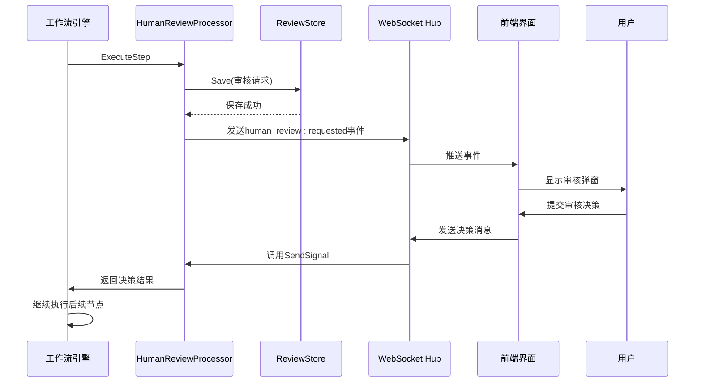

# 人工审核节点实现机制

<cite>
**本文档引用文件**  
- [human_review.go](file://internal/core/workflow/nodes/human_review.go)
- [human_review.md](file://docs/api/human_review.md)
- [SPEC-405-human-review-processor.md](file://docs/specs/backend/SPEC-405-human-review-processor.md)
- [HumanReviewModal.tsx](file://frontend/src/features/execution/components/HumanReviewModal.tsx)
- [session.go](file://internal/core/workflow/session.go)
- [engine.go](file://internal/core/workflow/engine.go)
- [types.go](file://internal/core/workflow/types.go)
</cite>

## 目录
1. [引言](#引言)
2. [核心结构体与字段解析](#核心结构体与字段解析)
3. [状态一致性保障机制](#状态一致性保障机制)
4. [Process方法执行流程](#process方法执行流程)
5. [超时处理与允许跳过逻辑](#超时处理与允许跳过逻辑)
6. [高并发状态竞争解决方案](#高并发状态竞争解决方案)
7. [系统行为调用链路](#系统行为调用链路)
8. [前端交互实现](#前端交互实现)

## 引言
人工审核节点是工作流引擎中的关键控制点，用于在AI决策过程中引入人类干预。该节点通过暂停工作流执行、触发前端弹窗、等待用户决策等方式，确保关键决策的最终控制权掌握在人类手中。本文档深入解析`HumanReviewProcessor`结构体的核心实现机制，重点阐述其在分布式环境下的状态一致性保障、超时处理逻辑以及高并发场景下的状态竞争解决方案。

## 核心结构体与字段解析
`HumanReviewProcessor`结构体是人工审核节点的核心实现，其字段设计直接决定了节点的行为模式和状态管理能力。

```go
type HumanReviewProcessor struct {
    SessionID     string
    NodeID        string
    ReviewStore   ReviewStore
    Timeout       time.Duration
    AllowSkip     bool
}
```

### SessionID与NodeID
`SessionID`和`NodeID`是分布式环境下实现状态一致性的基础。`SessionID`标识了当前工作流会话的全局唯一性，而`NodeID`则精确指向了工作流图中的特定审核节点。这两个字段的组合确保了在多会话、多节点并发执行的复杂场景下，系统能够准确识别和处理特定的审核请求。

### ReviewStore
`ReviewStore`接口负责审核请求的持久化存储，是实现跨服务、跨实例状态共享的关键组件。通过将审核请求存储在共享存储中，系统实现了以下核心能力：
- **状态持久化**：确保审核请求在服务重启后依然存在
- **跨实例共享**：支持分布式部署下的状态一致性
- **历史追溯**：提供审核请求的完整生命周期记录

### Timeout与AllowSkip
`Timeout`字段定义了审核请求的有效期，是防止工作流无限期阻塞的重要机制。`AllowSkip`配置项则提供了灵活性，允许在超时后自动通过或强制失败，满足不同业务场景的需求。

**Section sources**
- [SPEC-405-human-review-processor.md](file://docs/specs/backend/SPEC-405-human-review-processor.md#L7-L17)

## 状态一致性保障机制
在分布式环境下，人工审核节点的状态一致性主要通过以下机制实现：

### 信号通道机制
系统采用`Session`对象中的信号通道（Signal Channel）来实现节点间的同步通信。每个审核节点在执行时会创建一个唯一的信号通道，用于接收用户的决策信号。

```go
func (s *Session) GetSignalChannel(nodeID string) chan interface{} {
    s.mu.Lock()
    defer s.mu.Unlock()
    if s.SignalChannels == nil {
        s.SignalChannels = make(map[string]chan interface{})
    }
    if _, ok := s.SignalChannels[nodeID]; !ok {
        s.SignalChannels[nodeID] = make(chan interface{}, 1)
    }
    return s.SignalChannels[nodeID]
}
```

### 会话状态管理
`Session`对象维护了工作流的完整状态，包括当前执行节点、输入输出数据、信号通道等。通过会话级别的状态管理，系统确保了即使在服务实例重启后，也能恢复到正确的执行状态。

### 分布式锁机制
在高并发场景下，系统通过分布式锁机制防止多个用户同时处理同一个审核请求。当用户提交审核决策时，系统会首先获取对应审核请求的分布式锁，确保操作的原子性。

**Section sources**
- [session.go](file://internal/core/workflow/session.go#L110-L121)
- [engine.go](file://internal/core/workflow/engine.go#L11-L23)

## Process方法执行流程
`Process`方法是人工审核节点的核心逻辑入口，其执行流程严格遵循SPEC-405规范。

### 流程概述
1. 生成决策草案
2. 创建裁决请求
3. 通知前端
4. 等待决策（带超时）
5. 处理决策结果

### StreamEvent触发机制
`Process`方法通过`StreamEvent`事件机制与前端进行实时通信。当工作流到达人工审核节点时，系统会立即发送`human_review:requested`事件，触发前端弹窗。

```go
stream <- StreamEvent{
    Type: "human_review:requested",
    Data: review,
}
```

### 工作流暂停实现
系统通过返回`workflow.ErrSuspended`错误来实现工作流的暂停。工作流引擎在接收到此错误后，会将当前节点状态标记为`suspended`，并停止后续节点的执行。

```go
return nil, workflow.ErrSuspended
```

**Section sources**
- [human_review.go](file://internal/core/workflow/nodes/human_review.go#L14-L45)
- [types.go](file://internal/core/workflow/types.go#L20-L23)

## 超时处理与允许跳过逻辑
超时处理机制是人工审核节点的重要安全特性，防止工作流因无人处理而无限期阻塞。

### 超时处理流程
```go
select {
case decision := <-signalCh:
    return h.handleDecision(decision, draft)
case <-time.After(h.Timeout):
    if h.AllowSkip {
        return map[string]interface{}{"auto_approved": true, "content": draft}, nil
    }
    return nil, fmt.Errorf("human review timeout")
case <-ctx.Done():
    return nil, ctx.Err()
}
```

### AllowSkip配置项交互
`AllowSkip`配置项与超时处理逻辑的交互行为如下：
- 当`AllowSkip`为`true`时，超时后自动通过审核，工作流继续执行
- 当`AllowSkip`为`false`时，超时后工作流失败，需要人工干预恢复

这种设计提供了灵活的业务配置能力，既满足了紧急情况下的自动通过需求，又保证了关键决策的严格控制。

**Section sources**
- [SPEC-405-human-review-processor.md](file://docs/specs/backend/SPEC-405-human-review-processor.md#L45-L58)

## 高并发状态竞争解决方案
在高并发场景下，系统通过多层次的机制避免状态竞争问题。

### 信号通道的并发安全
`Session`对象中的信号通道通过互斥锁（Mutex）实现并发安全，确保多个goroutine同时访问时的数据一致性。

```go
func (s *Session) SendSignal(nodeID string, payload interface{}) error {
    s.mu.Lock()
    defer s.mu.Unlock()
    // ...
}
```

### 审核请求的唯一性
每个审核请求都有全局唯一的ID，通过`uuid.New().String()`生成。这确保了即使在高并发场景下，也不会出现请求ID冲突的问题。

### 原子性操作
系统在处理审核决策时，采用原子性操作确保数据一致性。当用户提交决策时，系统会：
1. 验证审核请求状态
2. 更新审核请求状态
3. 发送决策信号
4. 清理信号通道

这四个步骤作为一个原子操作执行，防止中间状态被其他请求干扰。

**Section sources**
- [session.go](file://internal/core/workflow/session.go#L123-L142)
- [SPEC-405-human-review-processor.md](file://docs/specs/backend/SPEC-405-human-review-processor.md#L29-L37)

## 系统行为调用链路
从代码层面到系统行为的完整调用链路如下：

### 后端调用链路
```
Workflow Engine → HumanReviewProcessor.Process → 
ReviewStore.Save → StreamEvent → 
WebSocket Hub → Frontend
```

### 前端响应链路
```
WebSocket Event → HumanReviewModal → 
User Interaction → API Request → 
Workflow Handler → Session.SendSignal → 
Workflow Engine Resume
```

### 完整时序图


**Diagram sources**
- [human_review.go](file://internal/core/workflow/nodes/human_review.go)
- [HumanReviewModal.tsx](file://frontend/src/features/execution/components/HumanReviewModal.tsx)

**Section sources**
- [engine.go](file://internal/core/workflow/engine.go#L40-L50)
- [human_review.go](file://internal/core/workflow/nodes/human_review.go#L14-L45)

## 前端交互实现
前端通过`HumanReviewModal`组件实现与人工审核节点的交互。

### 组件功能
- 显示审核请求的详细信息
- 提供批准、修改、驳回等操作按钮
- 显示超时倒计时
- 处理用户输入和反馈

### 状态同步
前端通过WebSocket与后端保持实时状态同步：
- 接收`human_review:requested`事件显示弹窗
- 发送用户决策到后端
- 接收`human_review:expired`事件更新界面状态

**Section sources**
- [HumanReviewModal.tsx](file://frontend/src/features/execution/components/HumanReviewModal.tsx)
- [human_review.md](file://docs/api/human_review.md#L72-L135)