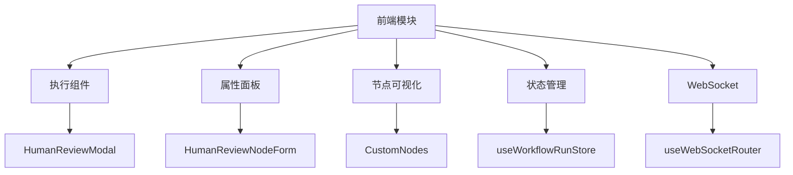
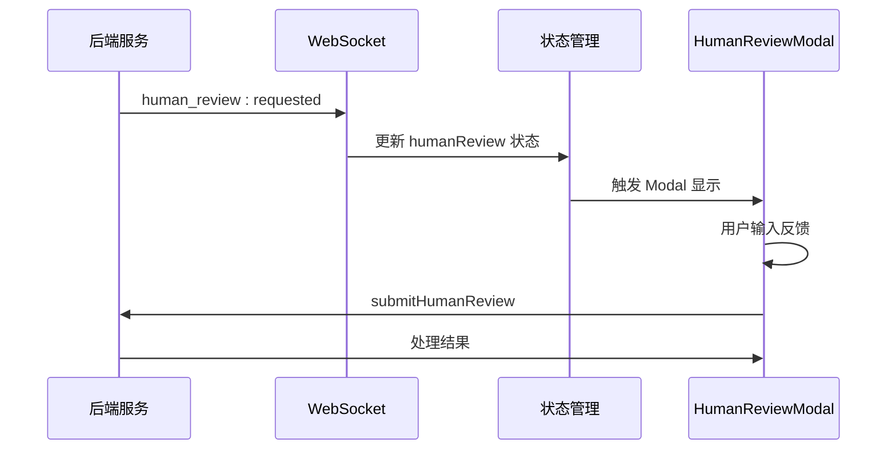
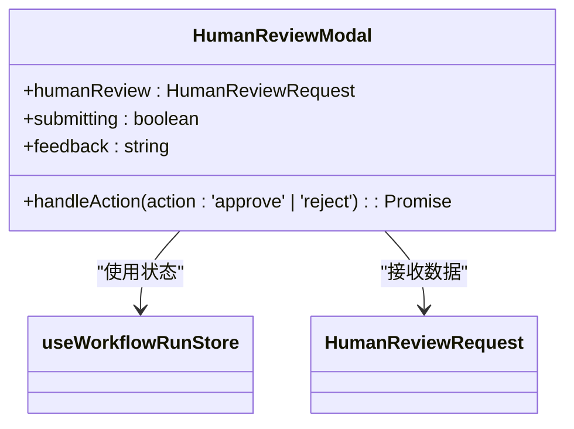
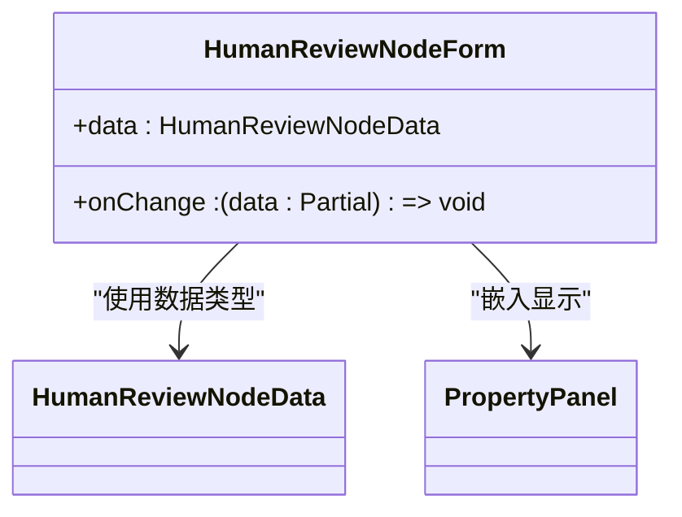
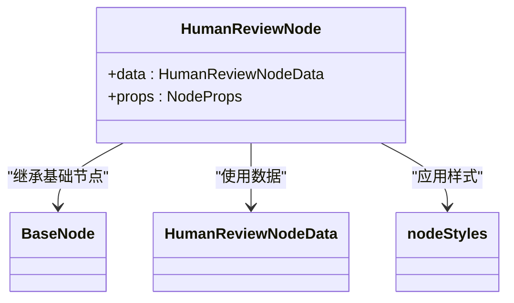
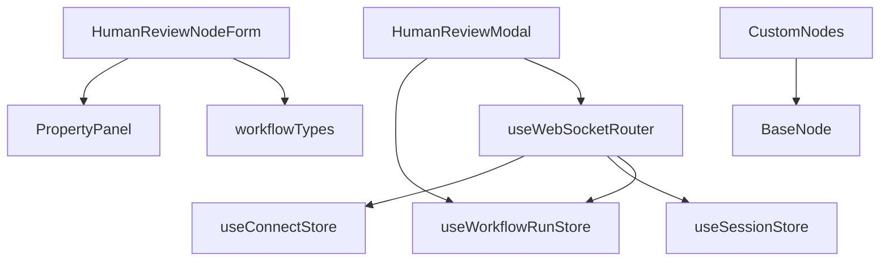

# 前端交互组件设计

<cite>
**本文档引用文件**  
- [HumanReviewModal.tsx](file://frontend/src/features/execution/components/HumanReviewModal.tsx)
- [HumanReviewNodeForm.tsx](file://frontend/src/features/editor/components/PropertyPanel/NodeForms/HumanReviewNodeForm.tsx)
- [CustomNodes.tsx](file://frontend/src/components/workflow/nodes/CustomNodes.tsx)
- [PropertyPanel.tsx](file://frontend/src/features/editor/components/PropertyPanel/PropertyPanel.tsx)
- [workflow.ts](file://frontend/src/types/workflow.ts)
- [useWorkflowRunStore.ts](file://frontend/src/stores/useWorkflowRunStore.ts)
- [useWebSocketRouter.ts](file://frontend/src/hooks/useWebSocketRouter.ts)
- [websocket.ts](file://frontend/src/types/websocket.ts)
- [workflow-run.ts](file://frontend/src/types/workflow-run.ts)
- [MeetingRoom.tsx](file://frontend/src/features/meeting/MeetingRoom.tsx)
- [SPEC-301-human-review-modal.md](file://docs/specs/sprint4/SPEC-301-human-review-modal.md)
- [human_review.md](file://docs/api/human_review.md)
</cite>

## 目录
1. [简介](#简介)
2. [项目结构](#项目结构)
3. [核心组件](#核心组件)
4. [架构概览](#架构概览)
5. [详细组件分析](#详细组件分析)
6. [依赖分析](#依赖分析)
7. [性能考虑](#性能考虑)
8. [故障排除指南](#故障排除指南)
9. [结论](#结论)

## 简介
HumanReviewModal 组件是系统中关键的人机交互界面，用于在工作流执行过程中暂停并等待人工审核。该组件支持多格式内容渲染、批注工具集成、响应式布局和无障碍访问。配合 PropertyPanel 中的 HumanReviewNodeForm 配置节点参数，并通过 WebSocket 实现实时状态同步。

## 项目结构
HumanReview 相关组件分布在前端代码库的多个模块中，主要涉及执行组件、属性面板和节点可视化逻辑。

**Diagram sources**
- [HumanReviewModal.tsx](file://frontend/src/features/execution/components/HumanReviewModal.tsx)
- [HumanReviewNodeForm.tsx](file://frontend/src/features/editor/components/PropertyPanel/NodeForms/HumanReviewNodeForm.tsx)
- [CustomNodes.tsx](file://frontend/src/components/workflow/nodes/CustomNodes.tsx)

**Section sources**
- [HumanReviewModal.tsx](file://frontend/src/features/execution/components/HumanReviewModal.tsx)
- [HumanReviewNodeForm.tsx](file://frontend/src/features/editor/components/PropertyPanel/NodeForms/HumanReviewNodeForm.tsx)
- [CustomNodes.tsx](file://frontend/src/components/workflow/nodes/CustomNodes.tsx)

## 核心组件
HumanReviewModal 组件实现了人机审核的核心交互功能，包括审核请求展示、反馈输入和操作提交。HumanReviewNodeForm 提供了节点配置界面，允许设置超时时间、审批类型等参数。

**Section sources**
- [HumanReviewModal.tsx](file://frontend/src/features/execution/components/HumanReviewModal.tsx#L1-L91)
- [HumanReviewNodeForm.tsx](file://frontend/src/features/editor/components/PropertyPanel/NodeForms/HumanReviewNodeForm.tsx#L1-L65)

## 架构概览
系统采用分层架构，前端组件通过状态管理与 WebSocket 事件监听实现与后端的实时通信。

**Diagram sources**
- [useWebSocketRouter.ts](file://frontend/src/hooks/useWebSocketRouter.ts#L80-L89)
- [useWorkflowRunStore.ts](file://frontend/src/stores/useWorkflowRunStore.ts#L233-L257)
- [HumanReviewModal.tsx](file://frontend/src/features/execution/components/HumanReviewModal.tsx#L14-L25)

## 详细组件分析

### HumanReviewModal 分析
HumanReviewModal 组件实现了人机审核的交互界面，包含多格式内容渲染和批注功能。

**Diagram sources**
- [HumanReviewModal.tsx](file://frontend/src/features/execution/components/HumanReviewModal.tsx#L6-L90)
- [useWorkflowRunStore.ts](file://frontend/src/stores/useWorkflowRunStore.ts#L36-L90)
- [workflow-run.ts](file://frontend/src/types/workflow-run.ts#L35-L40)

### HumanReviewNodeForm 分析
HumanReviewNodeForm 组件提供了节点参数配置界面，支持审批类型选择、超时设置和跳过选项。

**Diagram sources**
- [HumanReviewNodeForm.tsx](file://frontend/src/features/editor/components/PropertyPanel/NodeForms/HumanReviewNodeForm.tsx#L10-L64)
- [workflow.ts](file://frontend/src/types/workflow.ts#L33-L37)
- [PropertyPanel.tsx](file://frontend/src/features/editor/components/PropertyPanel/PropertyPanel.tsx#L32-L34)

### CustomNodes 可视化分析
CustomNodes.tsx 文件定义了 HumanReviewNode 的可视化表现逻辑，包括紫色主题标识和状态显示。

**Diagram sources**
- [CustomNodes.tsx](file://frontend/src/components/workflow/nodes/CustomNodes.tsx#L96-L110)
- [BaseNode.tsx](file://frontend/src/components/workflow/nodes/BaseNode.tsx)
- [workflow.ts](file://frontend/src/types/workflow.ts#L33-L37)

## 依赖分析
HumanReview 组件与其他系统模块存在紧密的依赖关系。

**Diagram sources**
- [go.mod](file://go.mod)
- [package.json](file://frontend/package.json)

**Section sources**
- [HumanReviewModal.tsx](file://frontend/src/features/execution/components/HumanReviewModal.tsx)
- [useWebSocketRouter.ts](file://frontend/src/hooks/useWebSocketRouter.ts)
- [PropertyPanel.tsx](file://frontend/src/features/editor/components/PropertyPanel/PropertyPanel.tsx)

## 性能考虑
- HumanReviewModal 采用条件渲染，仅在 humanReview 存在时显示
- 使用 Zustand 状态管理，避免不必要的重新渲染
- WebSocket 事件按类型路由，减少处理开销
- 组件拆分合理，符合单一职责原则

## 故障排除指南
常见问题及解决方案：

| 问题现象 | 可能原因 | 解决方案 |
|--------|--------|--------|
| 弹窗不显示 | WebSocket 事件未触发 | 检查后端 human_review:requested 事件发送 |
| 提交无响应 | API 调用失败 | 检查 /api/v1/sessions/:sessionId/review 接口 |
| 状态不同步 | WebSocket 连接断开 | 检查连接状态和重连机制 |
| 配置不生效 | 参数未正确传递 | 检查 HumanReviewNodeData 类型定义 |

**Section sources**
- [HumanReviewModal.tsx](file://frontend/src/features/execution/components/HumanReviewModal.tsx#L17-L23)
- [useWebSocketRouter.ts](file://frontend/src/hooks/useWebSocketRouter.ts#L80-L89)
- [human_review.md](file://docs/api/human_review.md#L72-L146)

## 结论
HumanReview 组件体系实现了完整的人机交互流程，从前端配置、可视化到实时通信都具备良好的设计。通过状态管理和 WebSocket 集成，确保了审核请求的实时性和可靠性。建议后续增强多格式内容渲染能力和无障碍访问支持。