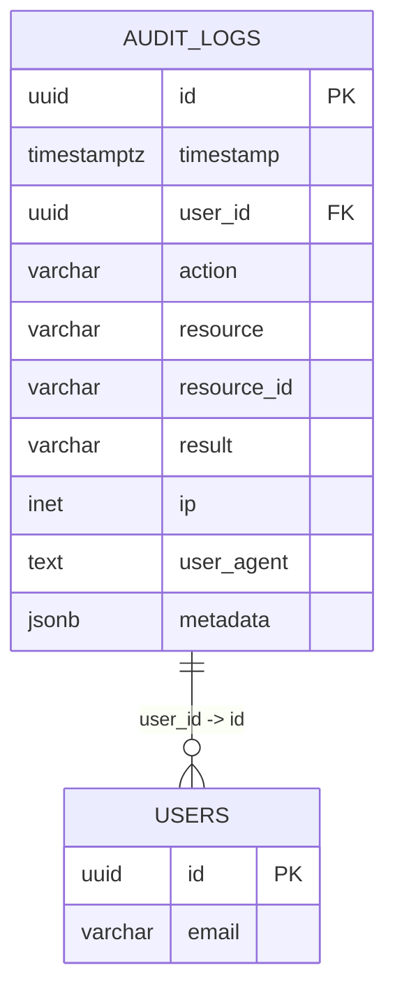
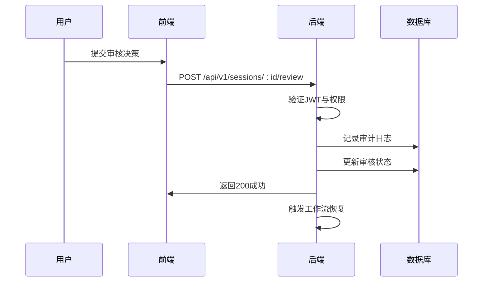

# 安全控制与审计追踪

<cite>
**本文档引用的文件**  
- [human_review.go](file://internal/core/workflow/nodes/human_review.go)
- [SPEC-405-human-review-processor.md](file://docs/specs/backend/SPEC-405-human-review-processor.md)
- [human_review.md](file://docs/api/human_review.md)
- [SPEC-504-security-hardening.md](file://docs/specs/sprint5/SPEC-504-security-hardening.md)
- [002_add_quarantine_logs.up.sql](file://internal/infrastructure/db/migrations/002_add_quarantine_logs.up.sql)
- [sprint6_audit_report_v6_ultimate.md](file://docs/reports/audits/sprint6_audit_report_v6_ultimate.md)
- [versioning.go](file://internal/core/middleware/versioning.go)
</cite>

## 目录
1. [人工审核节点安全控制](#人工审核节点安全控制)
2. [审计日志机制](#审计日志机制)
3. [隔离日志表设计](#隔离日志表设计)
4. [架构安全建议](#架构安全建议)

## 人工审核节点安全控制

人工审核节点（Human Review Node）是工作流中的关键安全控制点，确保在关键决策前进行人工干预。系统通过多层安全机制保障审核过程的完整性与安全性。

### 用户身份验证与操作权限校验

系统采用基于角色的访问控制（RBAC）模型，确保只有授权用户才能执行审核操作。根据 `SPEC-504-security-hardening.md` 中的定义，系统定义了 `viewer`、`editor`、`admin` 和 `owner` 四种角色，每种角色具有不同的权限集。例如，`editor` 角色可执行工作流，而 `admin` 角色可管理代理和系统配置。

当用户尝试提交审核决策时，API 端点 `POST /api/v1/sessions/:sessionId/review` 会通过 `RequirePermission` 中间件验证用户权限。该中间件检查当前用户是否具有 `workflow:execute` 权限，若无权限则返回 403 状态码。

### 输入内容过滤与防重放攻击

前端组件 `HumanReviewModal` 在用户提交决策前对输入内容进行验证。例如，当用户选择“修改”操作时，系统会捕获编辑后的 `modified_content` 字段；当选择“驳回”时，必须填写 `rejection_reason`。这些字段在提交前由前端表单验证逻辑确保非空。

为防止重放攻击，系统为每个审核请求生成唯一的 `review_id`，并在数据库中维护其状态。一旦决策被提交，该请求的状态将被标记为“已提交”，后续重复提交将返回 409 冲突状态码，有效防止重复操作。

**Section sources**
- [SPEC-504-security-hardening.md](file://docs/specs/sprint5/SPEC-504-security-hardening.md#L20-L58)
- [human_review.md](file://docs/api/human_review.md#L141-L192)

## 审计日志机制

系统通过安全审计日志（Audit Log）记录所有关键操作，确保操作的可追溯性与问责性。

### 审计日志结构

审计日志记录以下关键信息：
- **操作者ID**（UserID）：执行操作的用户唯一标识
- **时间戳**（Timestamp）：操作发生的时间
- **操作类型**（Action）：如 `workflow:delete`、`human_review:submit` 等
- **资源类型**（Resource）：被操作的资源类型，如 `workflow`、`session`
- **资源ID**（ResourceID）：被操作资源的唯一标识
- **结果**（Result）：操作结果，如 `success`、`failure`、`denied`
- **IP地址与用户代理**：客户端网络信息



**Diagram sources**
- [SPEC-504-security-hardening.md](file://docs/specs/sprint5/SPEC-504-security-hardening.md#L241-L258)

### 审计日志记录流程

当用户提交审核决策时，系统调用 `LogAudit` 函数记录审计事件。该函数从 Gin 上下文中提取用户ID、IP地址和用户代理信息，并将操作类型设为 `human_review:submit`，资源类型为 `session`，资源ID为会话ID，结果为 `success` 或 `failure`。

```go
LogAudit(c, "human_review:submit", "session", sessionID, "success")
```

此日志被写入 `audit_logs` 数据库表或发送至集中式日志服务，供后续分析与合规审查。

**Section sources**
- [SPEC-504-security-hardening.md](file://docs/specs/sprint5/SPEC-504-security-hardening.md#L192-L221)

## 隔离日志表设计

`quarantine_logs` 表用于存储在执行过程中被隔离或暂存的敏感内容，防止恶意数据直接进入主流程。

### 表结构与设计目的

该表包含以下字段：
- **id**：主键，UUID 类型
- **session_id**：关联的会话ID，用于追踪上下文
- **content**：被隔离的文本内容
- **raw_metadata**：原始元数据，JSONB 格式，用于存储附加信息
- **created_at**：创建时间戳

```sql
CREATE TABLE IF NOT EXISTS quarantine_logs (
    id UUID PRIMARY KEY DEFAULT gen_random_uuid(),
    session_id UUID,
    content TEXT,
    raw_metadata JSONB,
    created_at TIMESTAMPTZ DEFAULT NOW()
);
```

该表的设计目的是在内容审核前提供一个安全的暂存区，确保即使系统被攻击，敏感内容也不会直接暴露。

### 数据保留策略

系统未明确指定 `quarantine_logs` 的数据保留期限，但通过索引 `idx_quarantine_logs_session` 按 `session_id` 进行分区，便于按会话批量清理。建议结合业务需求设置 TTL（Time-To-Live）策略，例如自动删除 30 天前的记录，以控制存储成本并符合数据最小化原则。

**Section sources**
- [002_add_quarantine_logs.up.sql](file://internal/infrastructure/db/migrations/002_add_quarantine_logs.up.sql#L1-L10)

## 架构安全建议

根据 `sprint6_audit_report_v6_ultimate.md` 中的架构审计报告，系统在安全设计上存在改进空间。

### 防范恶意跳过或伪造审批信号

当前系统通过 `HumanReviewProcessor` 的 `Process` 方法返回 `workflow.ErrSuspended` 错误来暂停工作流执行，确保必须有人工干预。然而，审计报告指出，若攻击者能直接调用 `session.SendSignal`，可能伪造审批信号。

为防范此类风险，建议：
1. **强化信号通道安全**：对 `Signal` API 端点增加 JWT 验证，确保信号来源合法。
2. **引入操作确认机制**：在关键决策前要求二次确认（如短信验证码）。
3. **实施版本控制与回滚**：如 `versioning.go` 所示，系统已在人工审核前自动创建备份，支持在决策错误时回滚至先前状态，增强容错能力。



**Diagram sources**
- [human_review.md](file://docs/api/human_review.md#L141-L192)
- [versioning.go](file://internal/core/middleware/versioning.go#L15-L56)

**Section sources**
- [sprint6_audit_report_v6_ultimate.md](file://docs/reports/audits/sprint6_audit_report_v6_ultimate.md#L61-L83)
- [versioning.go](file://internal/core/middleware/versioning.go#L15-L56)