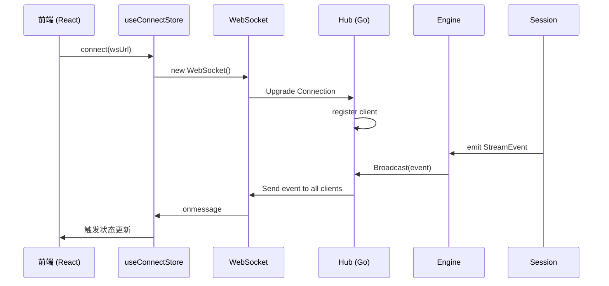
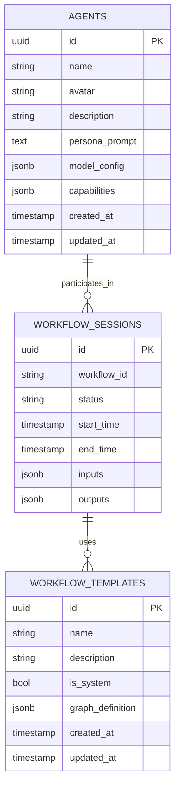
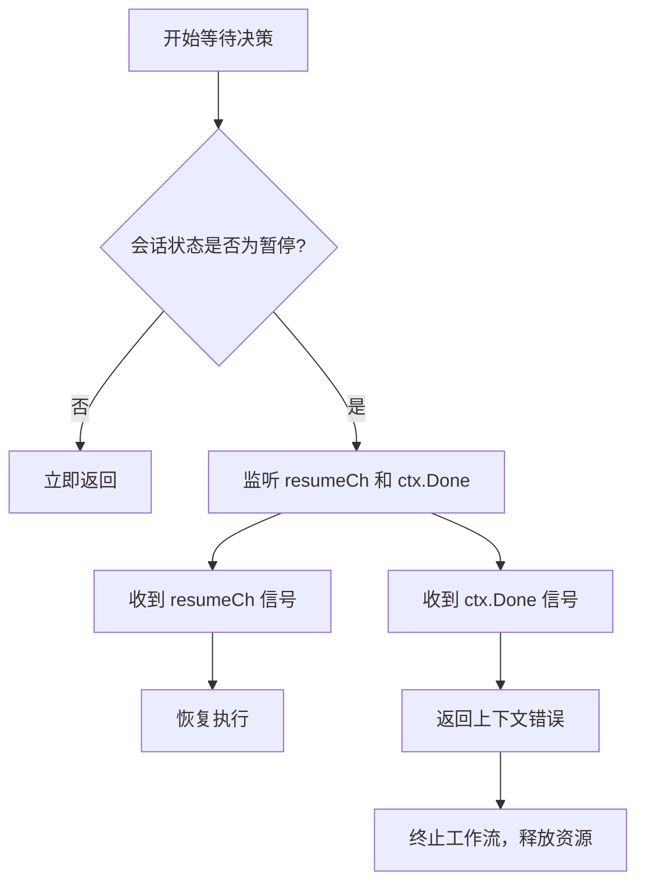

# 状态管理与会话控制

<cite>
**本文档引用文件**   
- [human_review.go](file://internal/core/workflow/nodes/human_review.go)
- [session.go](file://internal/core/workflow/session.go)
- [hub.go](file://internal/api/ws/hub.go)
- [workflow.go](file://internal/api/handler/workflow.go)
- [useSessionStore.ts](file://frontend/src/stores/useSessionStore.ts)
- [useWebSocketRouter.ts](file://frontend/src/hooks/useWebSocketRouter.ts)
- [SPEC-005-websocket-optimization.md](file://docs/specs/sprint1/SPEC-005-websocket-optimization.md)
- [SPEC-703-session-ws-connect-fix.md](file://docs/specs/sprint7/SPEC-703-session-ws-connect-fix.md)
</cite>

## 目录
1. [引言](#引言)
2. [人工审核节点状态管理策略](#人工审核节点状态管理策略)
3. [会话锁定与暂停机制](#会话锁定与暂停机制)
4. [WebSocket实时状态推送](#websocket实时状态推送)
5. [数据库持久化存储](#数据库持久化存储)
6. [Session结构体与信号通道](#session结构体与信号通道)
7. [waitForDecision方法的上下文取消与超时控制](#waitfordecision方法的上下文取消与超时控制)
8. [API层Hub服务协同机制](#api层hub服务协同机制)
9. [结论](#结论)

## 引言

本系统通过人工审核节点（HumanReviewRequest）实现工作流中的关键决策点控制。该机制结合了会话锁定、WebSocket实时通信和数据库持久化，确保审核请求在多客户端环境下的状态一致性与安全性。核心组件包括Session结构体维护的信号通道（signalCh）、API层的Hub服务，以及基于上下文取消（ctx.Done）和超时控制的资源管理策略。本文将系统阐述这些机制的设计与实现。

## 人工审核节点状态管理策略

人工审核节点在工作流中通过`HumanReviewProcessor`实现状态挂起与恢复。当工作流执行到该节点时，处理器会返回`workflow.ErrSuspended`错误，通知引擎暂停执行，并通过事件流发送`human_interaction_required`事件，触发前端弹出审核模态框。此机制防止了流程的自动推进，确保人工干预的必要性。

审核请求的状态通过`Session`对象进行管理，其状态机包含`pending`、`running`、`paused`、`completed`等状态。`HumanReviewRequest`作为持久化实体，存储于PostgreSQL数据库中，包含审核内容、决策选项、超时时间及最终决策结果。

**Section sources**
- [human_review.go](file://internal/core/workflow/nodes/human_review.go#L1-L47)
- [session.go](file://internal/core/workflow/session.go#L12-L21)

## 会话锁定与暂停机制

系统通过`Session`结构体的`Pause()`和`Resume()`方法实现会话的锁定与解锁，防止重复提交和并发冲突。

```mermaid
classDiagram
class Session {
+ID string
+Status SessionStatus
+StartTime time.Time
+EndTime time.Time
+ctx context.Context
+cancel context.CancelFunc
+resumeCh chan struct{}
+SignalChannels map[string]chan interface{}
+mu sync.RWMutex
+Pause() void
+Resume() void
+WaitIfPaused(ctx context.Context) error
}
class SessionStatus {
<<enumeration>>
SessionPending
SessionRunning
SessionPaused
SessionCompleted
SessionFailed
SessionCancelled
}
Session --> SessionStatus : "has"
```

**Diagram sources**
- [session.go](file://internal/core/workflow/session.go#L24-L40)

当调用`Pause()`方法时，会创建一个新的`resumeCh`阻塞通道，并将状态置为`SessionPaused`。`WaitIfPaused()`方法利用该通道实现协程阻塞，直到`Resume()`被调用并关闭通道，从而恢复执行。此机制确保了在审核期间，工作流的其他部分不会继续执行。

**Section sources**
- [session.go](file://internal/core/workflow/session.go#L74-L108)

## WebSocket实时状态推送

系统采用WebSocket协议实现服务器与多个客户端之间的实时状态同步。后端通过`Hub`服务管理所有活跃的客户端连接，并广播状态变更事件。



**Diagram sources**
- [hub.go](file://internal/api/ws/hub.go#L21-L73)
- [useConnectStore.ts](file://frontend/src/stores/useConnectStore.ts#L1-L127)

`Hub`结构体维护一个客户端集合（`clients`）和一个广播通道（`broadcast`）。当工作流引擎产生状态事件时，事件被发送到`broadcast`通道，`Hub.Run()`循环会将其推送给所有注册的客户端。前端通过`useWebSocketRouter` Hook订阅这些事件，并路由到相应的状态存储（如`useSessionStore`）进行处理。

**Section sources**
- [hub.go](file://internal/api/ws/hub.go#L1-L125)
- [useWebSocketRouter.ts](file://frontend/src/hooks/useWebSocketRouter.ts#L1-L35)

## 数据库持久化存储

审核请求（HumanReviewRequest）及相关的工作流数据通过PostgreSQL数据库进行持久化存储。系统采用方案A（依赖Docker）部署Postgres实例，确保数据的本地优先和私有化。

数据库表结构设计遵循TDD文档，核心表包括`workflow_sessions`、`workflow_templates`和`agents`。`HumanReviewRequest`的持久化通过`persistence`包中的`TemplateRepository`和`AgentRepository`实现，使用`pgx/v5`驱动执行SQL操作。



**Diagram sources**
- [template_repository.go](file://internal/infrastructure/persistence/template_repository.go#L1-L51)
- [agent_repository.go](file://internal/infrastructure/persistence/agent_repository.go#L1-L60)
- [04_storage.md](file://docs/tdd/04_storage.md#L1-L139)

## Session结构体与信号通道

`Session`结构体是工作流执行的核心上下文，它通过`SignalChannels`字段维护一个映射，为每个节点提供独立的信号通道（`chan interface{}`），实现协程间的通信。

```go
type Session struct {
    // ... 其他字段
    SignalChannels map[string]chan interface{}
    mu             sync.RWMutex
}
```

`GetSignalChannel(nodeID)`方法确保为指定节点ID创建并返回一个带缓冲的通道。`SendSignal(nodeID, payload)`方法则向该通道发送信号。这种设计允许API层（如`Review`处理器）向特定节点发送决策信号，而工作流引擎可以在`waitForDecision`中等待该信号，从而实现跨客户端的协同。

**Section sources**
- [session.go](file://internal/core/workflow/session.go#L38-L142)

## waitForDecision方法的上下文取消与超时控制

`waitForDecision`方法（在`HumanReviewProcessor`中隐式实现）的优先级关系是：**上下文取消（ctx.Done）优先于超时控制**。

当`WaitIfPaused`方法被调用时，它会同时监听`resumeCh`（用于恢复）和`ctx.Done()`（用于取消）。`select`语句的优先级是随机的，但一旦`ctx.Done()`被触发（例如，请求超时或客户端断开），`WaitIfPaused`会立即返回`ctx.Err()`，导致工作流执行被终止，从而确保资源的安全释放。超时控制通常由调用方（如HTTP处理器）通过`context.WithTimeout`来设置。



**Diagram sources**
- [session.go](file://internal/core/workflow/session.go#L92-L108)

## API层Hub服务协同机制

API层的`WorkflowHandler`与`Hub`服务紧密协同，完成跨客户端的状态同步。当接收到`Review`请求时，处理器通过`getEngine(sessionID)`找到对应的工作流引擎，然后调用`session.SendSignal()`向特定节点发送决策信号。

与此同时，工作流引擎内部的`StreamChannel`会将所有状态事件（如`node_state_change`、`token_stream`）推送给`Hub`，由`Hub`广播给所有连接的客户端。这种“事件驱动”的架构确保了所有客户端的UI状态能够实时、一致地更新。

**Section sources**
- [workflow.go](file://internal/api/handler/workflow.go#L168-L215)
- [hub.go](file://internal/api/ws/hub.go#L70-L73)

## 结论

本系统通过`Session`的暂停/恢复机制实现了人工审核节点的会话锁定，有效防止了重复提交。基于`Hub`服务的WebSocket通信确保了状态变更的实时推送和跨客户端同步。`SignalChannels`的设计为节点间通信提供了灵活的协程通信机制。最后，通过将上下文取消置于超时控制之上，系统能够优先响应外部中断，确保资源得到安全释放。这一系列策略共同构建了一个健壮、可靠的工作流状态管理系统。